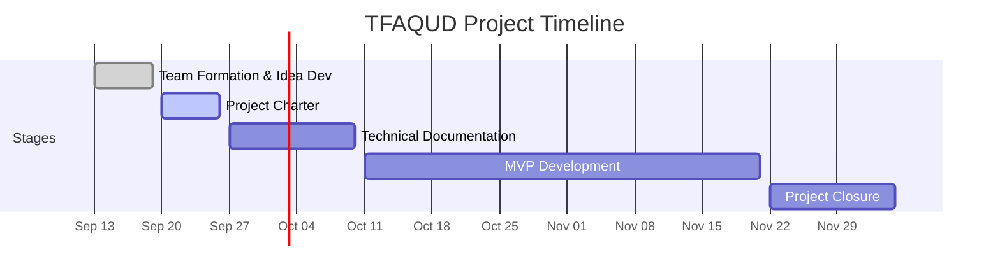

# Stage 2: Project Charter

**Project Name:** TFAQUD | تفقُّد

**Project Overview:** TFAQUD is a mobile application designed to organize healthcare for a single patient. It brings medication management, medical appointments, therapy sessions, and health measurements into one place, while supporting reminders, care documentation, and coordination among multiple caregivers.

---

## 1. Project Objectives

### 1.1 Project Purpose
 
To develop a mobile application for iOS that simplifies the organization and monitoring of healthcare for a single patient, whether the patient manages their own care or receives support from family caregivers.

### 1.2 SMART Objectives
- Provide a simple and centralized place to manage medications, appointments, and health measurements.
- Help reduce missed medications and appointments through reminders and follow-up tracking.
- Enable multiple caregivers to coordinate and divide care responsibilities with clear permissions for each member.

---

## 2. Stakeholders and Team Roles

### 2.1 Stakeholders

| Classification | Stakeholder | Relationship to the Project |
|---|---|---|
| Internal | Project Team: Alanoud Aloraydi, Lama Alzahrani, and Leen Algraawi | Plan and develop TFAQUD, prepare project deliverables, and make project decisions collaboratively. |
| Internal | Holberton Monitors | Follow the team's progress and review project deliverables as part of Holberton's academic assessment process. |
| External | Patients | Intended users who either manage their own care independently or receive assistance from caregivers. |
| External | Caregivers | Intended users who organize and coordinate care for a single patient. The primary target audience includes groups of two or more caregivers sharing caregiving responsibilities. |

### 2.2 Team Roles and Responsibilities

| Role | Assigned Member(s) | Responsibilities |
|---|---|---|
| Team Lead | Alanoud Aloraydi | Coordinate task assignments, facilitate technical discussions, and ensure the integration of the team's work. |
| Project Manager | Lama Alzahrani | Organize meetings, track project progress and deadlines, and identify obstacles that may affect delivery. |
| Developer | All Team Members | Collaborate on application development and participate in project documentation and work reviews. |

---

## 3. Project Scope

### 3.1 In Scope

A mobile application for iOS with Arabic language support, designed to manage the care of a single patient. The application includes medication management, medical appointments, health measurements, reminders, and caregiver coordination with defined permissions.

### 3.2 Out of Scope

The application does not support integration with hospital systems or electronic medical records, automated medical diagnosis or clinical data interpretation, or automatic data import from medical devices. It also does not support web or desktop platforms.

---

## 4. Risks and Mitigation Strategies

The team identified potential risks that could affect the reliability, usability, and timely delivery of TFAQUD. The following mitigation strategies are proposed to reduce their likelihood or impact.

| Risk | Mitigation Strategy |
|---|---|
| **Incorrect Medication Information:** Inaccurate medication details entered by users may result in reminders or schedules that do not match the original instructions. | Use clearly defined input fields, require users to review medication details before saving, and validate required information. |
| **Inconsistent Treatment Updates:** Changes to a medication's dosage or status may not be reflected consistently across schedules, reminders, and medication history. | Define how treatment changes affect related records, preserve medication history, and test medication update and discontinuation scenarios. |
| **Conflicting Caregiver Updates:** Simultaneous actions by multiple caregivers may overwrite information or create duplicate records. | Implement appropriate server-side conflict handling, prevent duplicate operations, and test concurrent updates. |
| **Inaccurate Dose Status:** The application may incorrectly treat a reminder as confirmation that medication was taken, leading to misleading follow-up records. | Distinguish reminder delivery from user-confirmed dose status and generate summaries only from recorded information. |
| **Unclear Care Task Handoffs:** Reassigning a task without clearly identifying its current status and responsible caregiver may leave the task unattended. | Define task assignment and reassignment rules, make responsibility visible, and test scenarios involving declined or incomplete tasks. |
| **Unreliable Reminders:** Device restrictions, notification permissions, or technical failures may prevent users from receiving medication or appointment reminders. | Handle notification permissions, test reminder behavior under relevant device conditions, and keep schedules accessible within the application. |
| **Unauthorized Access to Health Information:** Errors in account authorization or caregiver access controls may expose patient information to unauthorized users. | Enforce authorization on the backend, restrict access according to assigned permissions, and test unauthorized access and permission changes. |
| **Misleading Health Measurement Displays:** Incorrect units, timestamps, or handling of missing values may produce inaccurate measurement records or charts. | Validate measurement inputs, use consistent units and timestamps, and test charts against known sample data. |
| **Poor Usability for Target Users:** Patients using Light Mode or caregivers managing multiple responsibilities may struggle to complete essential tasks. | Test key user workflows for both application modes, review interface clarity, and refine the design based on usability findings. |
| **Loss or Corruption of Care Records:** Failed saving or recovery operations may cause missing or inconsistent medication and measurement records. | Validate successful data operations, maintain data consistency, and test backup and recovery procedures using sample data. |
| **Integration Failures Between Components:** Inconsistent data handling between the mobile application, REST API, and database may disrupt connected features. | Define API contracts, integrate components incrementally, and test complete workflows across the application and backend. |
| **MVP Scope Expansion:** Adding or substantially changing features during development may delay essential functionality and jeopardize delivery. | Establish the agreed MVP scope, assess proposed changes against available time, and prioritize completion of core features before considering additions. |

---

## 5. High-Level Project Plan

