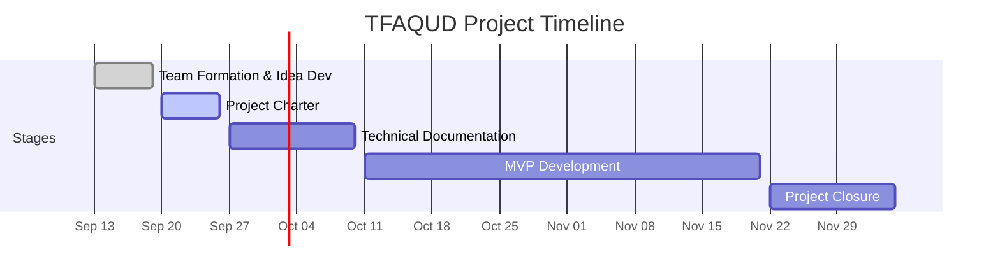

# Stage 2: Project Charter

**Project Name:** TFAQUD | تفقُّد

**Project Overview:** TFAQUD is a mobile application designed to organize healthcare for a single patient. It brings medication management, medical appointments, therapy sessions, and health measurements into one place, while supporting reminders, care documentation, and coordination among multiple caregivers.

---

## 1. Project Objectives

### 1.1 Project Purpose
 
To develop a mobile application for iOS that simplifies the organization and monitoring of healthcare for a single patient, whether the patient manages their own care or receives support from family caregivers.

### 1.2 SMART Objectives
- Provide a simple and centralized place to manage medications, appointments, and health measurements.
- Help reduce missed medications and appointments through reminders and follow-up tracking.
- Enable multiple caregivers to coordinate and divide care responsibilities with clear permissions for each member.

---

## 2. Stakeholders and Team Roles

### 2.1 Stakeholders

| Classification | Stakeholder | Relationship to the Project |
|---|---|---|
| Internal | Project Team: Alanoud Aloraydi, Lama Alzahrani, and Leen Algraawi | Responsible for planning, developing, and delivering TFAQUD. Team members collaborate on project activities and make decisions by consensus. |
| External | Holberton Monitors | Monitor the team's progress and evaluate the deliverables of each project stage. |
| External | Patients | Intended users who either manage their own care independently or require assistance from caregivers. |
| External | Caregivers | Intended users, including family members and other caregivers, who organize and coordinate care for a single patient. The primary target audience includes groups of two or more caregivers sharing caregiving responsibilities. |

### 2.2 Team Roles and Responsibilities

| Role | Assigned Member(s) | Responsibilities |
|---|---|---|
| Team Lead | Alanoud Aloraydi | Coordinate task assignments, facilitate technical discussions, and oversee the integration of the team's work. |
| Project Manager | Lama Alzahrani | Organize project meetings, track progress and deadlines, and identify obstacles that may affect the project. |
| Developer | All Team Members | Collaborate on application development, documentation, work reviews, and project decision-making. |

## 3. Project Scope

### 3.1 In Scope

A mobile application for iOS with Arabic language support, designed to manage the care of a single patient. The application includes medication management, medical appointments, health measurements, reminders, and caregiver coordination with defined permissions.

### 3.2 Out of Scope

The application does not support integration with hospital systems or electronic medical records, automated medical diagnosis or clinical data interpretation, or automatic data import from medical devices. It also does not support web or desktop platforms.

---

## 4. Risks and Mitigation Strategies

### Risk 1: [Risk Title]

**Description:** [What might happen and how it could affect the project.]

**Mitigation:** [Specific actions to reduce the likelihood or impact of the risk.]

### Risk 2: [Risk Title]

**Description:** [What might happen and how it could affect the project.]

**Mitigation:** [Specific actions to reduce the likelihood or impact of the risk.]

### Risk 3: [Risk Title]

**Description:** [What might happen and how it could affect the project.]

**Mitigation:** [Specific actions to reduce the likelihood or impact of the risk.]

---

## 5. High-Level Project Plan

