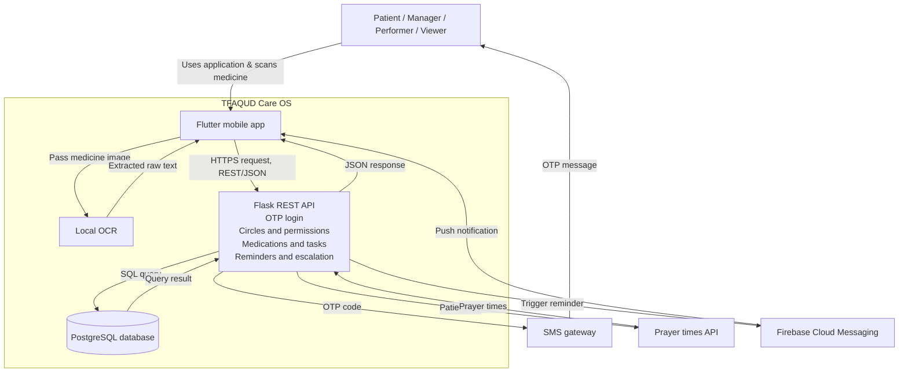
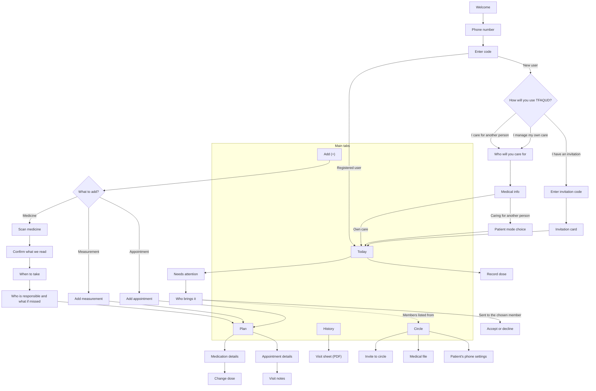
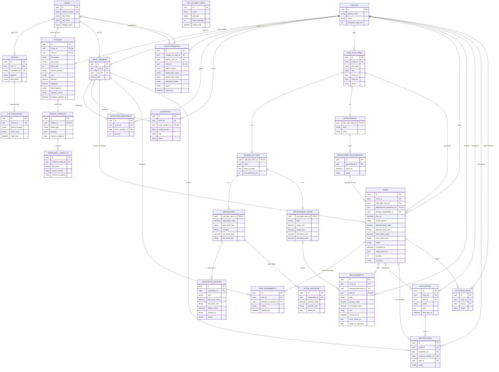
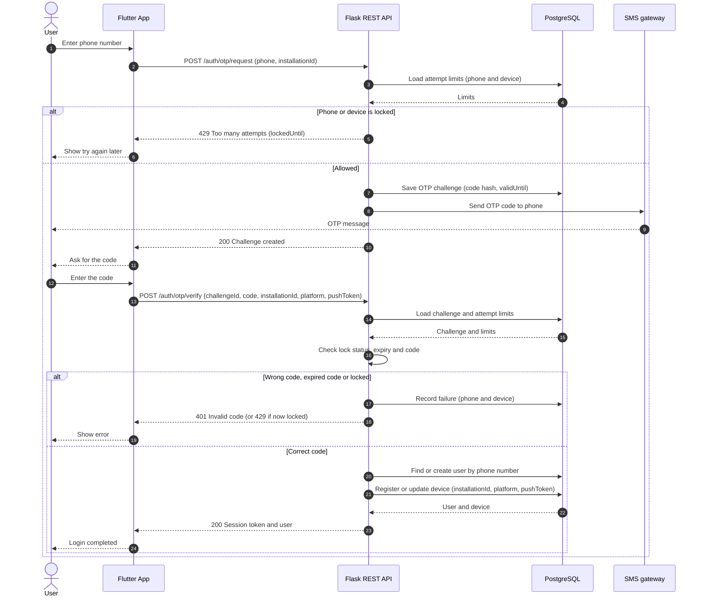
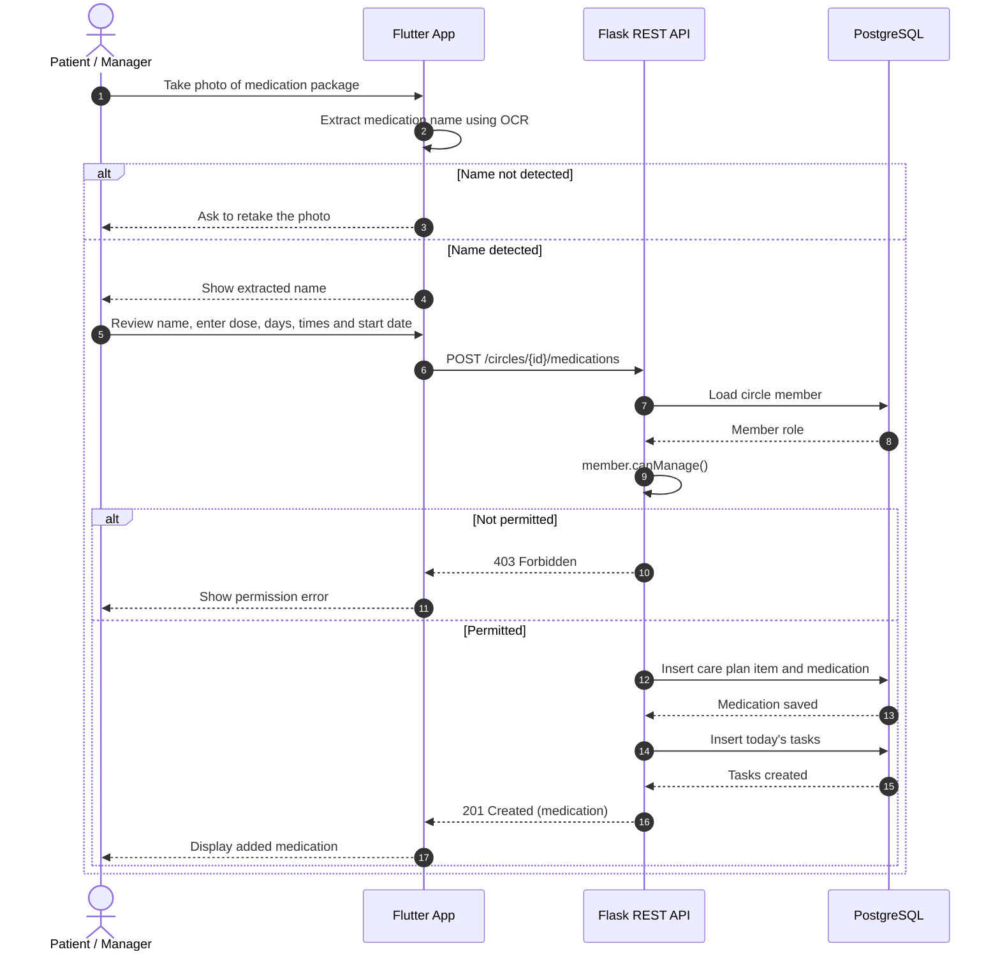

# Stage 3: Technical Documentation

## Table of Contents

1. [User Stories and Mockups](#1-user-stories-and-mockups)
2. [System Architecture](#2-system-architecture)
3. [Components, Classes, and Database Design](#3-components-classes-and-database-design)
4. [High-Level Sequence Diagrams](#4-high-level-sequence-diagrams)
5. [API Specifications](#5-api-specifications)
6. [SCM and QA Plans](#6-scm-and-qa-plans)
7. [Technical Justifications](#7-technical-justifications)

## 1. User Stories and Mockups

### 1.1 Prioritized User Stories

The TFAQUD MVP serves five user types. A **self-managing patient** manages their own care and has manager permissions in their care circle. A **simplified-mode patient** follows care tasks through a simplified interface. A **care manager** manages another patient’s care circle and care plan. A **care assistant** carries out tasks assigned to them. A **viewer** can view care information but cannot modify it.

The stories are prioritized using MoSCoW: **Must Have** items are essential to the MVP’s core care workflow; **Should Have** items are important but not essential to that workflow; and **Could Have** items are desirable additions that may be implemented if time allows.

#### Must Have

| ID | User Story |
|---|---|
| US-01 | As a **self-managing patient**, I want to create a care circle for myself, so that I can manage my care and invite others to participate. |
| US-02 | As a **care manager**, I want to create a care circle for a patient and select the patient’s app mode, so that I can set up the circle to suit the patient’s needs. |
| US-03 | As a **patient with a phone**, I want to approve or decline a request to create a care circle for me, so that I can control whether my care information is shared. |
| US-04 | As a **care manager or self-managing patient**, I want to invite people to a care circle and assign each person a role, so that they can participate with clearly defined responsibilities and permissions. |
| US-05 | As an **invitee**, I want to review the role offered to me and accept or decline the invitation, so that I can decide whether to join the care circle. |
| US-06 | As a **care manager or self-managing patient**, I want to add medications and specify their doses, duration, and schedules, so that medication tasks can be organized in the care plan. |
| US-07 | As a **care manager or self-managing patient**, I want to add required measurements and specify their types, schedules, and target ranges, so that readings can be tracked as part of the care plan. |
| US-08 | As a **care manager or self-managing patient**, I want to add a patient’s appointments and their details, so that visits and related tasks can be organized. |
| US-09 | As a **care manager or self-managing patient**, I want to assign a person responsible for each care task, so that responsibility for completing the task is clear. |
| US-10 | As a **care assistant**, I want to review tasks assigned to me and accept or decline them, so that I can indicate which tasks I can undertake. |
| US-11 | As an **authorized care-circle member**, I want to view care tasks and record completed tasks, so that the patient’s care record reflects what was actually done. |
| US-12 | As a **patient using Simplified Mode**, I want to view my daily tasks and record my responses to medication and measurement tasks, so that I can participate in my care easily. |
| US-13 | As a **person responsible for a care task**, I want to receive a reminder when the task is due, so that I can remember to complete it. |
| US-14 | As a **care manager or self-managing patient**, I want to follow up on missed tasks and escalate notifications according to the configured recipient order, so that uncompleted tasks receive appropriate follow-up. |
| US-15 | As a **viewer**, I want to view the care plan, completed tasks, and recorded measurements, so that I can follow the patient’s care. |

#### Should Have

| ID | User Story |
|---|---|
| US-16 | As a **care manager or self-managing patient**, I want to track medication supplies and estimate when they will run out, so that I can arrange a refill before the supply is depleted. |
| US-17 | As a **care manager or self-managing patient**, I want to change a medication dose or discontinue a medication while retaining its previous dose and the date and reason for the change, so that the medication history remains accurate. |
| US-18 | As a **care manager**, I want to add and update the patient’s medical-profile information and emergency contacts, so that current information is available to care-circle members. |
| US-19 | As a **patient**, I want to view my emergency card, including my medical information, current medications, and emergency contacts, so that I can access essential information when needed. |
| US-20 | As a **care manager or self-managing patient**, I want to export the patient’s complete care record, including current and previous medications and all recorded measurements without a date-range limit, so that I can keep and share a complete copy when needed. |

#### Could Have

| ID | User Story |
|---|---|
| US-21 | As the **care assistant accompanying a patient to an appointment**, I want to record visit notes and attach an image of the medical report, so that visit information is retained in the care record. |
| US-22 | As a **patient using Simplified Mode**, I want to record a measurement outside its scheduled time, so that I can add a reading taken when needed. |
| US-23 | As a **care-circle member with assigned tasks**, I want to temporarily hand over my tasks to another member when I am unavailable, so that care follow-up can continue during my absence. |
| US-24 | As a **user**, I want to access help and support, so that I can seek assistance when I encounter a problem using the application. |

### 1.2 Main Screen Mockups

[View the main screen mockups in Figma](https://www.figma.com/design/Ojd0XVQSuC39YoJoiRyhou/Tafaqud-Care-OS?node-id=0-1&t=EkiVLBVRuXTGD5P6-1)

## 2. System Architecture

## 3. Components, Classes, and Database Design

### 3.1 Front-End Components and Interactions
The front end is a Flutter mobile app. All data goes through the Flask REST API, and the actions shown on each screen depend on the member's role in the selected circle (`Manager`, `Performer`, `Viewer` or `Patient`).

### Main Components
 
| Component | Responsibility | Interacts with |
|---|---|---|
| Welcome and login | Collects the phone number and the OTP code, shows the countdown, resend, edit number and wrong-code message | Flask REST API (OTP login), which sends the code through the SMS gateway |
| Circle setup | Creates a circle for a patient, or joins an existing circle with an invitation code | Flask REST API (circles and permissions) |
| Simplified mode (Patient) | Shows the patient's next medicine by prayer time, lets the patient confirm or skip a dose, enter a measurement or ask for help, and shows the visit sheet to the doctor at the appointment | Flask REST API (medications and tasks), reminder notifications |
| Help and emergency | Calls a circle member or emergency, and shows the medical card | Flask REST API (medical file and circle members) |
| Today (Detailed mode) | Shows the day's tasks per patient, records a dose and lists what needs attention | Flask REST API (tasks, reminders and escalation) |
| Task assignment | Offers a task to a circle member, who accepts or declines | Flask REST API (tasks), push notifications to the member |
| Plan | Shows the care plan and lets the Manager change or stop a medicine | Flask REST API (medications and care plan) |
| Add (+) | Adds a medicine, a measurement or an appointment to the plan | Local OCR (reads the medicine photo), Flask REST API |
| History | Shows the care history (activities, measurements, adherence, previous medicines) and shares the one-page visit sheet (PDF) | Flask REST API |
| Circle | Manages members and roles, invitations and the medical file | Flask REST API (circles and permissions) |
| Account | Shows the user's circles, notification settings, language and logout | Flask REST API |
| Device layer | Asks for system permissions, shows reminders and shares files | Firebase Cloud Messaging (push notifications) |

### Interaction Flowchart
 

 
### 3.2 Back-End Classes

| Key Class | Responsibility | methods |
|---|---|---|
| `User` | A person with an account, identified by phone number | `deleteAccount()` |
| `OtpChallenge` | A login code sent to a phone number | `verify(code)` |
| `OtpAttemptLimit` | Counts failed code attempts per phone or per device and locks them | `recordFailure()`, `isLocked(at)` |
| `Circle` | The root of the model: one circle cares for one patient | `hasManager()`, `delete(by)`, `removeMember(member, replacement)`, `exportCareRecord()`, `nextEscalationRecipient(after)` |
| `CircleMember` | A user's membership in a circle, with the role in that circle | `canManage()`, `canRecord(task)`, `isThePatient()` |
| `CircleRequest` | A request to create a circle for a patient, approved or declined by the patient | `approve(by)`, `decline(by)` |
| `Invitation` | An invitation to join a circle with a role | `accept(by)` |
| `Patient` | The person the circle cares for | `fullName()` |
| `MedicalProfile` | The patient's medical file |  |
| `EmergencyContact` | A contact person in the medical file |  |
| `CarePlanItem` (abstract) | An item in the circle's plan | `isActive(on)` |
| `ScheduledItem` (abstract) | A plan item that repeats on days and times | `occurrencesOn(day, location)` |
| `Medication` | A medicine in the plan with its dose and stock | `effectiveDose(at)`, `changeDose(by, dose, from)`, `addStock(by, quantity)`, `remainingStock()`, `estimatedRunOutAt(at)`, `coversTreatment(at)` |
| `MedicationChange` | A record of a dose change or a stop |  |
| `StockAddition` | A record of stock added to a medicine |  |
| `MeasurementPlan` | A scheduled measurement (blood glucose or blood pressure) with its target range | `isOutsideRange(reading)` |
| `Appointment` | A medical appointment |  |
| `AppointmentOccurrence` | One date of an appointment |  |
| `Task` | One thing to do at a time, generated from a plan item | `record(by, dose, at, actionId, expectedVersion)` |
| `TaskAssignment` | An offer of a task to a member, who accepts or declines | `accept()`, `decline()` |
| `Measurement` | A recorded reading |  |
| `Escalation` | Moves to the next recipient when a task is missed | `notifyNext()`, `respond(by)` |
| `Notification` | A message sent to a member | `respond()` |
| `AttentionItem` | An item that needs a member's attention | `resolve(by)` |
| `PatientLocation` (dataType) | The patient's location |  |
| `MedicationQuantity` (dataType) | An amount of a medicine with its unit |  |
| `TargetRange` (dataType) | The target range of a measurement |  |
| `EmergencyCard` (dataType) | Built from the current records, not stored |  |

```mermaid
classDiagram
    direction TB

    class User {
        -id : UUID4
        -phoneNumber : String
        -firstName : String
        -lastName : String
        -displayName : String
        +deleteAccount() void
    }

    class Device {
        -id : UUID4
        -installationId : String
        -platform : Platform
        -pushToken : String[0..1]
    }

    class OtpChallenge {
        -id : UUID4
        -phoneNumber : String
        -codeHash : String
        -validUntil : DateTime
        +verify(code : String) Boolean
    }

    class OtpAttemptLimit {
        -scope : AttemptScope
        -key : String
        -failedAttempts : Integer
        -lockedUntil : DateTime[0..1]
        +recordFailure() void
        +isLocked(at : DateTime) Boolean
    }

    class Patient {
        -id : UUID4
        -firstName : String
        -lastName : String
        -birthYear : Integer[0..1]
        -phoneNumber : String[0..1]
        -location : PatientLocation[0..1]
        +fullName() String
    }

    class PatientLocation {
        <<dataType>>
        -city : String
        -latitude : Decimal[0..1]
        -longitude : Decimal[0..1]
        -timeZoneId : String
        -source : LocationSource
        -updatedAt : DateTime
    }

    class Circle {
        -id : UUID4
        -patientMode : AppMode[0..1]
        -status : CircleStatus
        -escalationRecipients : List~CircleMember~
        -escalationStepMin : Integer = 20
        +hasManager() Boolean
        +delete(by : CircleMember) void
        +removeMember(member : CircleMember, replacement : CircleMember[0..1]) void
        +exportCareRecord() File
        +nextEscalationRecipient(after : CircleMember) CircleMember[0..1]
    }


    class CircleMember {
        -id : UUID4
        -role : Role
        +canManage() Boolean
        +canRecord(task : Task) Boolean
        +isThePatient() Boolean
    }

    class CircleRequest {
        -id : UUID4
        -patientPhone : String
        -patientFirstName : String
        -patientLastName : String
        -requestedMode : AppMode
        -status : RequestStatus
        -expiresAt : DateTime
        +approve(by : User) void
        +decline(by : User) void
    }

    class Invitation {
        -id : UUID4
        -invitedPhone : String
        -role : InvitableRole
        -status : InvitationStatus
        +accept(by : User) void
    }

    class MedicalProfile {
        -bloodType : String[0..1]
        -allergies : String[0..*]
        -chronicConditions : String[0..*]
    }

    class EmergencyContact {
        -id : UUID4
        -fullName : String
        -phoneNumber : String
        -relationToPatient : String
    }

    class EmergencyCard {
        <<dataType>>
        -patientFullName : String
        -bloodType : String[0..1]
        -allergies : String[0..*]
        -chronicConditions : String[0..*]
        -contacts : List~EmergencyContact~
        -currentMedicationAndDose : List~String~
    }

    class CarePlanItem {
        <<abstract>>
        -id : UUID4
        -title : String
        -startsOn : Date
        -endsOn : Date[0..1]
        -status : ItemStatus
        +isActive(on : Date) Boolean
    }

    class ScheduledItem {
        <<abstract>>
        -times : List~Time~
        -daysOfWeek : List~DayOfWeek~
        -maxLatenessMin : Integer
        +occurrencesOn(day : Date, location : PatientLocation) List~DateTime~
    }

    class Medication {
        -baseDose : MedicationQuantity
        -strength : String[0..1]
        -lowStockAt : MedicationQuantity[0..1]
        +effectiveDose(at : DateTime) MedicationQuantity[0..1]
        +changeDose(by : CircleMember, dose : MedicationQuantity, from : DateTime) MedicationChange
        +addStock(by : CircleMember, quantity : MedicationQuantity) StockAddition
        +remainingStock() MedicationQuantity[0..1]
        +estimatedRunOutAt(at : DateTime) DateTime[0..1]
        +coversTreatment(at : DateTime) Boolean[0..1]
    }

    class MedicationQuantity {
        <<dataType>>
        -value : Decimal
        -unit : String
    }

    class MedicationChange {
        -id : UUID4
        -kind : ChangeKind
        -newDose : MedicationQuantity[0..1]
        -effectiveFrom : DateTime
        -orderedBy : String
        -reason : String[0..1]
    }

    class StockAddition {
        -id : UUID4
        -quantity : MedicationQuantity
        -addedOn : Date
    }

    class MeasurementPlan {
        -type : MeasurementType
        -range : TargetRange[0..1]
        +isOutsideRange(reading : Measurement) Boolean
    }

    class Appointment {
        -kind : AppointmentKind
        -place : String[0..1]
    }

    class AppointmentOccurrence {
        -id : UUID4
        -startsAt : DateTime
        -status : AppointmentStatus
    }

    class Task {
        -id : UUID4
        -dueAt : DateTime
        -prayerPeriod : Prayer[0..1]
        -plannedDose : MedicationQuantity[0..1]
        -doseTaken : MedicationQuantity[0..1]
        -status : TaskStatus
        -recordedAt : DateTime[0..1]
        -clientActionId : UUID4[0..1]
        -version : Integer
        -outcome : TaskOutcome[0..1]
        +record(by : CircleMember, dose : MedicationQuantity[0..1], at : DateTime, actionId : UUID4, expectedVersion : Integer) void
    }

    class TaskAssignment {
        -id : UUID4
        -status : AssignmentStatus
        -respondBy : DateTime
        +accept() void
        +decline() void
    }

    class Measurement {
        -id : UUID4
        -type : MeasurementType
        -primaryValue : Decimal
        -secondaryValue : Decimal[0..1]
        -unit : String
        -measuredAt : DateTime
        -clientActionId : UUID4[0..1]
        -rangeAtRecording : TargetRange[0..1]
    }

    class Escalation {
        -id : UUID4
        -status : EscalationStatus
        -step : Integer
        -nextStepAt : DateTime[0..1]
        +notifyNext() void
        +respond(by : CircleMember) void
    }

    class Notification {
        -id : UUID4
        -status : NotificationStatus
        +respond() void
    }

    class AttentionItem {
        -id : UUID4
        -status : AttentionStatus
        +resolve(by : CircleMember) void
    }

    class Platform {
        <<enumeration>>
        ANDROID
        IOS
    }

    class AttemptScope {
        <<enumeration>>
        PHONE
        DEVICE
    }

    class LocationSource {
        <<enumeration>>
        DEVICE
        MANUAL
    }

    class Role {
        <<enumeration>>
        MANAGER
        PERFORMER
        VIEWER
        PATIENT
    }

    class InvitableRole {
        <<enumeration>>
        MANAGER
        PERFORMER
        VIEWER
    }

    class AppMode {
        <<enumeration>>
        SIMPLIFIED
        DETAILED
    }

    class CircleStatus {
        <<enumeration>>
        ACTIVE
    }

    class RequestStatus {
        <<enumeration>>
        PENDING
        APPROVED
        DECLINED
        CANCELLED
        EXPIRED
    }

    class InvitationStatus {
        <<enumeration>>
        PENDING
        ACCEPTED
        CANCELLED
        EXPIRED
    }

    class ItemStatus {
        <<enumeration>>
        ACTIVE
        STOPPED
        COMPLETED
    }

    class DayOfWeek {
        <<enumeration>>
        MONDAY
        TUESDAY
        WEDNESDAY
        THURSDAY
        FRIDAY
        SATURDAY
        SUNDAY
    }

    class ChangeKind {
        <<enumeration>>
        DOSE_CHANGED
        STOPPED
    }

    class MeasurementType {
        <<enumeration>>
        BLOOD_GLUCOSE
        BLOOD_PRESSURE
    }

    class AppointmentKind {
        <<enumeration>>
        CONSULTATION
        LAB_TEST
        IMAGING
        THERAPY_SESSION
        OTHER
    }

    class AppointmentStatus {
        <<enumeration>>
        SCHEDULED
        COMPLETED
        MISSED
        CANCELLED
    }

    class Prayer {
        <<enumeration>>
        FAJR
        DHUHR
        ASR
        MAGHRIB
        ISHA
    }

    class TaskStatus {
        <<enumeration>>
        PENDING
        COMPLETED
        MISSED
        CANCELLED
    }

    class TaskOutcome {
        <<enumeration>>
        ON_TIME
        LATE
    }

    class AssignmentStatus {
        <<enumeration>>
        PENDING
        ACCEPTED
        DECLINED
        EXPIRED
        CANCELLED
    }

    class EscalationStatus {
        <<enumeration>>
        ACTIVE
        RESPONDED
        EXHAUSTED
        CANCELLED
    }

    class NotificationStatus {
        <<enumeration>>
        PENDING
        SENT
        FAILED
        RESPONDED
    }

    class AttentionStatus {
        <<enumeration>>
        OPEN
        RESOLVED
    }
    class TargetRange {
    <<dataType>>
    -minimum : Decimal[0..1]
    -maximum : Decimal[0..1]
    -secondaryMinimum : Decimal[0..1]
    -secondaryMaximum : Decimal[0..1]
    }

    User "0..1" --> "0..*" Device : current installations
    OtpChallenge "0..*" --> "1" Device : requested from
    OtpChallenge ..> OtpAttemptLimit : checks device and phone limits

    Circle "1" *-- "1" Patient : cares for
    Patient "0..1" --> "0..1" User : patient account
    User "1" --> "0..*" CircleMember : joins as
    Circle "1" *-- "1..*" CircleMember : members
    CircleRequest "0..*" --> "1" User : created by
    CircleRequest "0..*" --> "0..1" User : patient approval
    CircleRequest "0..1" --> "0..1" Circle : creates if approved
    Circle "1" *-- "0..*" Invitation : invitations
    Invitation "0..1" --> "0..1" CircleMember : becomes

    Patient "1" *-- "1" MedicalProfile : medical file
    MedicalProfile "1" *-- "0..*" EmergencyContact : contacts
    Circle ..> EmergencyCard : builds from current records

    Circle "1" *-- "0..*" CarePlanItem : plan
    CarePlanItem <|-- ScheduledItem
    ScheduledItem <|-- Medication
    ScheduledItem <|-- MeasurementPlan
    CarePlanItem <|-- Appointment
    Appointment "1" *-- "0..*" AppointmentOccurrence : dates
    Medication "1" *-- "0..*" MedicationChange : dose history
    Medication "1" *-- "0..*" StockAddition : stock added

    Circle "1" *-- "0..*" Task : tasks
    CarePlanItem "0..1" --> "0..*" Task : generates
    AppointmentOccurrence "0..1" --> "0..1" Task : appointment task
    Task "0..*" --> "1" CircleMember : primary responsible
    Task "1" *-- "0..*" TaskAssignment : assignment history
    TaskAssignment "0..*" --> "0..1" CircleMember : offered to
    Circle "1" *-- "0..*" Measurement : readings
    Measurement "0..*" --> "0..1" MeasurementPlan : follows
    Measurement "0..1" --> "0..1" Task : fulfils

    Circle "1" *-- "0..*" Escalation : escalations
    Escalation "0..*" --> "0..1" Task : missed task
    Circle "1" *-- "0..*" Notification : notifications
    Escalation "0..1" --> "0..*" Notification : sends
    Notification "0..*" --> "1" CircleMember : recipient
    Notification "0..*" --> "0..1" Task : task reminder
    Circle "1" *-- "0..*" AttentionItem : needs attention
    AttentionItem "0..*" --> "0..1" Task : about
 
   
```

### 3.3 Entity Relationship Diagram

## 4. High-Level Sequence Diagrams

### 4.1 User Login

The user signs in with a one-time code sent by SMS. The API checks the attempt limits for the phone and the device, sends the code, verifies it, then registers the device and returns a session token.

### 4.2 Add Medication

The patient or manager photographs the medication package and the app reads the name on the device (OCR). After the user completes the details, the API checks that the circle member is allowed to manage the care plan, then saves the medication and today's tasks in one transaction.

## 5. API Specifications

### 5.1 External APIs

| External API | Purpose | Reason for the choice |
| --- | --- | --- |
| SMS provider (Unifonic; alternative: Twilio) | Sends the sign-in code (`OtpChallenge`). | Sign-in uses the phone number. Supports a registered sender name for Saudi numbers. |
| Firebase Cloud Messaging, HTTP v1 (iPhone through APNs) | Sends push notifications (`Notification`) to the `pushToken` of a `Device`. | One request reaches Android and iPhone. Free of charge. Supports high-priority delivery. |
| Aladhan prayer-times API | Converts a prayer period (`Task.prayerPeriod`) into a clock time at the `PatientLocation`. | Free. Supports the Umm Al-Qura method used in Saudi Arabia. |
| WhatsApp link (`https://wa.me/<number>?text=<message>`) | Sends the message of an `Invitation` to its `invitedPhone`. | Free. Needs no business account or message template. The message comes from the inviter's own number. |

### 5.2 Internal API Endpoints

| Convention | Rule |
| --- | --- |
| Base path | `/v1` |
| Format | JSON (UTF-8) with snake_case names taken from the class diagram. Identifiers are UUIDs, times are ISO 8601, dates are `YYYY-MM-DD`, clock times are `HH:MM`. Visit images use `multipart/form-data`. |
| Authentication | `Authorization: Bearer <access token>` on every endpoint except `GET /health`, `POST /auth/code/request`, and `POST /auth/code/verify`. |
| Repeated actions | Recording a task or a measurement carries a `client_action_id`. Changing a task carries the `version` last seen. |
| Error format | `{"error": {"code": "...", "message": "...", "details": {}}}` |
| `?` after a field | Optional field. |
| `query:` | Input given as query parameters. |
| quantity | `{value, unit}` |
| `user` | `{id, phone_number, first_name, last_name, display_name}` |
| `task` | `{id, plan_item: {id, title, type}, due_at, prayer_period?, planned_dose?, dose_taken?, status, outcome?, reason?, recorded_at?, recorded_by?, responsible_member_id?, version}` |
| `measurement` | Output of `POST /circles/{circle_id}/measurements`. |
| `handover` | Output of `POST /circles/{circle_id}/handovers`. |

**System**

| URL path | HTTP method | Input | Output |
| --- | --- | --- | --- |
| `/health` | `GET` | none | `200 {status}` |

**Authentication and account**

| URL path | HTTP method | Input | Output |
| --- | --- | --- | --- |
| `/auth/code/request` | `POST` | `{phone, installation_id, platform}` | `200 {challenge_id, valid_until}` |
| `/auth/code/verify` | `POST` | `{challenge_id, code}` | `200 {access_token, refresh_token, expires_in, user}` |
| `/auth/refresh` | `POST` | none (the refresh token is sent in the `Authorization` header) | `200 {access_token, refresh_token, expires_in}` |
| `/me` | `GET` | none | `200 {user, circles: [{circle_id, member_id, role, patient_name}]}` |
| `/me` | `PUT` | `{first_name, last_name, display_name}` | `200 {user}` |
| `/devices/{installation_id}` | `PUT` | `{platform, push_token?}` | `200 {installation_id, platform, push_token?}` |
| `/me` | `DELETE` | none | `204` |

**Care circles (US-01, US-02, US-03)**

A patient with a phone is added through a request. A circle for oneself, or for a patient without a phone, is created directly.

| URL path | HTTP method | Input | Output |
| --- | --- | --- | --- |
| `/circles` | `POST` | `{patient_is_me, patient: {first_name, last_name, birth_year?}, patient_mode?}` | `201 {circle_id, member_id, role, patient_mode?, status}` |
| `/circle-requests` | `POST` | `{patient_phone, patient_first_name, patient_last_name, requested_mode}` | `201 {id, status, expires_at}` |
| `/circle-requests/pending` | `GET` | none | `200 {items: [{id, created_by, patient_first_name, patient_last_name, requested_mode, expires_at}]}` |
| `/circle-requests/{id}/approve` | `POST` | none | `200 {circle_id, member_id, role}` |
| `/circle-requests/{id}/decline` | `POST` | none | `200 {id, status}` |
| `/circles/{circle_id}` | `GET` | none | `200 {id, patient_mode?, status, created_by, patient: {id, first_name, last_name, birth_year?, phone_number?, location?}, my_member: {member_id, role, is_the_patient}}` |
| `/circles/{circle_id}/patient-location` | `PUT` | `{city, latitude?, longitude?, time_zone_id, source}` | `200 {city, latitude?, longitude?, time_zone_id, source, updated_at}` |
| `/circles/{circle_id}` | `DELETE` | none | `204` |

**Members and invitations (US-04, US-05, US-14)**

| URL path | HTTP method | Input | Output |
| --- | --- | --- | --- |
| `/circles/{circle_id}/invitations` | `POST` | `{invited_phone, role}` | `201 {id, status, expires_at, whatsapp_link}` |
| `/invitations/pending` | `GET` | none | `200 {items: [{id, circle_id, patient_name, role, expires_at}]}` |
| `/invitations/{id}/accept` | `POST` | none | `200 {circle_id, member_id, role}` |
| `/invitations/{id}/decline` | `POST` | none | `200 {id, status}` |
| `/circles/{circle_id}/members` | `GET` | none | `200 {items: [{member_id, user_id, display_name, role, is_the_patient}]}` |
| `/circles/{circle_id}/members/{member_id}` | `DELETE` | query: `replacement_member_id?` | `200 {removed_member_id}` |
| `/circles/{circle_id}/escalation-recipients` | `PUT` | `{member_ids: [...]}` in the order of escalation | `200 {escalation_recipients: [...], escalation_step_min}` |

**Medical profile and emergency card (US-18, US-19)**

| URL path | HTTP method | Input | Output |
| --- | --- | --- | --- |
| `/circles/{circle_id}/medical-profile` | `GET` | none | `200 {blood_type?, allergies, chronic_conditions, emergency_contacts: [{id, full_name, phone_number, relation_to_patient}]}` |
| `/circles/{circle_id}/medical-profile` | `PUT` | `{blood_type?, allergies, chronic_conditions}` | `200 {blood_type?, allergies, chronic_conditions}` |
| `/circles/{circle_id}/emergency-contacts` | `POST` | `{full_name, phone_number, relation_to_patient}` | `201 {id, full_name, phone_number, relation_to_patient}` |
| `/emergency-contacts/{id}` | `PUT` | `{full_name, phone_number, relation_to_patient}` | `200 {id, full_name, phone_number, relation_to_patient}` |
| `/circles/{circle_id}/emergency-card` | `GET` | none | `200 {patient_full_name, blood_type?, allergies, chronic_conditions, contacts, current_medication_and_dose}` |

**Care plan (US-06, US-07, US-08, US-09)**

| URL path | HTTP method | Input | Output |
| --- | --- | --- | --- |
| `/circles/{circle_id}/plan` | `GET` | query: `status?` (`ACTIVE` by default, `STOPPED`, or `ALL`) | `200 {medications, measurement_plans, appointments}`, each a list of items with `id`, `title`, `status`, `starts_on`, `ends_on?` |
| `/circles/{circle_id}/medications` | `POST` | `{title, strength?, base_dose: {value, unit}, low_stock_at?: {value, unit}, starts_on, ends_on?, times, days_of_week, max_lateness_min, responsible_member_id?}` | `201 {id, title, status}` |
| `/circles/{circle_id}/measurement-plans` | `POST` | `{title, type, range?: {primary_lower, primary_upper, secondary_lower?, secondary_upper?, unit}, starts_on, ends_on?, times, days_of_week, max_lateness_min, responsible_member_id?}` | `201 {id, title, status}` |
| `/circles/{circle_id}/appointments` | `POST` | `{title, kind, place?, starts_on, ends_on?, occurrences: [{starts_at}], responsible_member_id?}` | `201 {id, title, status, occurrences: [{id, starts_at, status}]}` |
| `/plan-items/{id}/responsible` | `PUT` | `{member_id}` | `200 {id, responsible_member_id}` |

**Medication supply and changes (US-16, US-17)**

| URL path | HTTP method | Input | Output |
| --- | --- | --- | --- |
| `/medications/{id}` | `GET` | query: `at?` | `200 {id, title, strength?, base_dose, effective_dose?, low_stock_at?, remaining_stock?, estimated_run_out_at?, covers_treatment?, status, starts_on, ends_on?, times, days_of_week, max_lateness_min, responsible_member_id?, changes: [{id, kind, new_dose?, effective_from, ordered_by, reason?, made_by}], stock_additions: [{id, quantity, added_on, added_by}]}` |
| `/medications/{id}/dose-changes` | `POST` | `{dose: {value, unit}, ordered_by, reason?, effective_from}` | `201 {id, kind, new_dose, effective_from, ordered_by, reason?, made_by}` |
| `/medications/{id}/stop` | `POST` | `{ordered_by, reason?, effective_from}` | `201 {id, kind, effective_from, ordered_by, reason?, made_by}` |
| `/medications/{id}/stock` | `POST` | `{quantity: {value, unit}, added_on}` | `201 {id, quantity, added_on, added_by}` |

**Tasks and measurements (US-09 to US-12, US-15, US-21, US-22)**

| URL path | HTTP method | Input | Output |
| --- | --- | --- | --- |
| `/circles/{circle_id}/tasks` | `GET` | query: `date?`, `status?`, `responsible_member_id?` | `200 {items: [task]}` |
| `/tasks/{id}` | `GET` | none | `200 {task, assignments: [{id, offered_to, status, respond_by}]}` |
| `/tasks/{id}/assignments` | `POST` | `{member_id}` | `201 {id, offered_to, status, respond_by}` |
| `/me/assignments` | `GET` | query: `status?` | `200 {items: [{id, task, status, respond_by}]}` |
| `/assignments/{id}/accept` | `POST` | none | `200 {id, status, task_id, responsible_member_id}` |
| `/assignments/{id}/decline` | `POST` | none | `200 {id, status}` |
| `/tasks/{id}/record` | `POST` | `{dose?: {value, unit}, at, client_action_id, version}` | `200 {task}` |
| `/tasks/{id}/not-done` | `POST` | `{reason?, at, client_action_id, version}` | `200 {task}` |
| `/circles/{circle_id}/measurements` | `POST` | `{type, primary_value, secondary_value?, unit, measured_at, plan_id?, task_id?, client_action_id}` | `201 {id, type, primary_value, secondary_value?, unit, measured_at, range_at_recording?, recorded_by, plan_id?, task_id?}` |
| `/circles/{circle_id}/measurements` | `GET` | query: `plan_id?`, `from?`, `to?` | `200 {items: [measurement]}` |
| `/appointment-occurrences/{id}/visit` | `POST` | `multipart/form-data`: `notes?`, `images?` (one or more files) | `200 {id, visit_notes?, report_image_urls, visit_recorded_by}` |

**Temporary handover (US-23)**

| URL path | HTTP method | Input | Output |
| --- | --- | --- | --- |
| `/circles/{circle_id}/handovers` | `POST` | `{handed_to_member_id, period_from, period_to}` | `201 {id, status, handed_over_by, handed_to, period_from, period_to}` |
| `/circles/{circle_id}/handovers` | `GET` | query: `status?` | `200 {items: [handover]}` |
| `/handovers/{id}/end` | `POST` | none | `200 {id, status}` |

**Notifications, escalation, and attention items (US-13, US-14, US-16)**

| URL path | HTTP method | Input | Output |
| --- | --- | --- | --- |
| `/notifications/{id}/respond` | `POST` | none | `200 {id, status}` |
| `/circles/{circle_id}/escalations` | `GET` | query: `status?` | `200 {items: [{id, status, step, next_step_at?, task_id?, responded_by?}]}` |
| `/escalations/{id}/respond` | `POST` | none | `200 {id, status, responded_by}` |
| `/circles/{circle_id}/attention-items` | `GET` | query: `status?`, `kind?` | `200 {items: [{id, kind, status, raised_at, task_id?, medication_id?, resolved_by?}]}` |
| `/attention-items/{id}/resolve` | `POST` | none | `200 {id, status, resolved_by}` |

**Care record (US-20)**

| URL path | HTTP method | Input | Output |
| --- | --- | --- | --- |
| `/circles/{circle_id}/care-record` | `GET` | none | `200`, a PDF file (`application/pdf`) with the current and previous medications and all recorded measurements |

**Errors**

| HTTP status | Code | Meaning |
| --- | --- | --- |
| `400` | `VALIDATION_FAILED`, `WRONG_CODE` | Invalid field, or wrong sign-in code. |
| `401` | `UNAUTHENTICATED` | Token missing, invalid, or expired. |
| `403` | `FORBIDDEN_ROLE` | The role of the caller does not allow the action. |
| `404` | `NOT_FOUND` | The resource does not exist, or the caller is not a member of the circle. |
| `409` | `ALREADY_RECORDED`, `VERSION_CONFLICT`, `STATE_CONFLICT` | Another member recorded the task first; the task changed since it was loaded; or the resource no longer allows the action. |
| `410` | `EXPIRED` | The code, request, invitation, or assignment has expired. |
| `423` | `SIGNIN_LOCKED` | Sign-in is locked after too many wrong codes (`details.locked_until`). |
| `429` | `TOO_MANY_REQUESTS` | A code was requested again too soon. |
| `503` | `SMS_UNAVAILABLE` | The SMS provider did not accept the message. |

## 6. SCM and QA Plans

### 6.1 Source Control Management

**Version control tool.** Git, hosted on GitHub.

**Branching strategy.**

| Branch | Purpose | Rules |
| --- | --- | --- |
| `main` | Production code. Each release has a version tag. | Protected. Receives merges from `development` when a milestone is complete. |
| `development` | Integrated features. Deployed to staging. | Protected. Receives merges from feature branches through pull requests. |
| `feature/<issue>-<name>` | One task. | Created from `development`. Deleted after the merge. |

**Commit practices.** Commits are small and regular, with one change each. The message starts with a type (`feat`, `fix`, `docs`, `test`, `refactor`, or `chore`) and refers to the issue.

**Pull request process.** Every change reaches `development` through a pull request. Direct pushes to `main` and `development` are not allowed. The pull request states what changed, which user story it implements, and how it was tested.

**Code review and merge process.** A pull request is merged after the approval of one team member who did not write the change and after the automatic checks pass. The reviewer checks that every new endpoint verifies the caller's role and has a test for the refusal.

### 6.2 Quality Assurance

| Type of test | What it covers | Tool |
| --- | --- | --- |
| Unit (back-end) | Methods of the classes of the class diagram, such as `Task.record` and `Circle.nextEscalationRecipient`. | `pytest` |
| Integration (back-end) | Every endpoint of Section 5.2 against PostgreSQL: valid request, invalid input, `401`, `403`, `404`, `409`. | `pytest`, Flask test client |
| API | Main endpoints on staging: status codes and JSON fields. | Postman, Newman |
| Unit and widget (application) | Controllers, repositories, and right-to-left Arabic screens. | `flutter_test` |
| End-to-end | Main flows of the Must Have stories: create a care circle, invite a member, accept an invitation, add a medication, record a task. | `integration_test` on an emulator |

**Manual testing of critical user flows.** The same flows, and notification delivery, are tested on a real Android phone and a real iPhone using a test sheet.

### 6.3 Deployment Pipeline

GitHub Actions with one Docker image for both environments.

| Environment | Trigger | Steps |
| --- | --- | --- |
| Pull request | Opened or updated. | Run the unit, integration, and application tests. Build the image. |
| Staging | Merge into `development`. | Deploy, migrate the database, check `GET /health`, run the Newman tests, run the manual tests. |
| Production | Version tag on `main`, after manual approval. | Back up the database, deploy, migrate, check `GET /health`. If the check fails, restore the previous image. |

## 7. Technical Justifications

[Explain the reasons for the selected technologies and designs.
Connect each decision to functional requirements,
non-functional requirements, constraints,
or expert recommendations.
Include source links where a justification relies on a reference.]
