# Stage 3: Technical Documentation

**Project:** TFAQUD | تفقُّد
**Part:** Technical documentation of the MVP: user stories and mockups, architecture, components, classes and database, sequence diagrams, APIs, source control and quality assurance, and technical justifications
**Version:** 4, updated October 2026 to match the final UML class model (53 boxes) and the decisions of 7 October 2026. Version 3 had 36 classes.

This document is the blueprint for building the MVP of TFAQUD. It follows the Project Charter (Version 4), the final app idea, and the final UML class model (53 boxes: 50 classes and 3 enumerations). It is organized in the seven items that Stage 3 asks for, in the same order, followed by two appendices. Items are tagged **Must**, **Should**, or **Could** to match the priorities in the Charter (Section 3.1).

**Where each required item is**

| Stage 3 requires | Section |
| --- | --- |
| 1. User stories and mockups | 1. User Stories and Mockups |
| 2. System architecture (high-level diagram) | 2. System Architecture |
| 3. Components, classes, and database design (class descriptions, ER diagram, database schema, front-end components) | 3. Components, Classes, and Database Design: 3.1 Back-end, 3.2 Database, 3.3 Front-end |
| 4. Sequence diagrams | 4. Sequence Diagrams |
| 5. API specifications (external APIs and internal endpoints) | 5. API Specifications |
| 6. SCM and QA plans | 6. SCM and QA Plans |
| 7. Technical justifications | 7. Technical Justifications |
| Appendices (links back to the Charter, and open points) | 8. Traceability: Charter to Components, and 9. Assumptions and Open Decisions |

> **What changed in Version 4**
>
> - The domain model is the final 53-box UML (50 classes and 3 enumerations), in six packages: Account 4, Circles 20, Care plan 12, Tasks 5, Alerts 4, and Records 8. Version 3 had 36 classes.
> - The stored `Role` has four values: Manager, Performer, Viewer, and Patient (Simplified). The user still sees five roles, because the Self-manager (القادر) is a Manager whose member is the patient (`isThePatient()`).
> - Back again, as information only: the **emergency card** (built live and opened only on the patient's own phone, from a button in his settings), the **emergency contacts** (typed, with no accounts), and a **location** that is used only for the prayer times (GPS on the patient's own phone, or entered by hand when he has no phone). Still left out: the 997 call, sharing a location with the family, and a call or a voice message from the help button.
> - There is no errand. "Who brings it?" gives the same card to another member, and an assignment can be finished ("Sara brought it") without changing the card or counting as a dose.
> - Also new: the device lock is decided and is counted twice (on the device and on the phone number); an appointment is a series with one `AppointmentOccurrence` for each date; the pills left are worked out from `StockAddition` records, with a recount; a manager can export the care record; and a reading keeps the range it was judged by.
> - The database grows from 36 to 41 tables. The permission table has 16 rows (80 test cases). There are 39 business rules (BR1 to BR39), 62 user stories, and 103 endpoints.
> - Every part was updated to match: the roles, the screens, the class definitions and pictures, the database, the sequence diagrams (one new, 4.7), the API, the traceability table, and the open decisions.
>
> **What changed in Version 3**
>
> - The document got the seven items of the Stage 3 requirements, in order. New sections were the user stories with mockups (Section 1), the architecture with its data flows (Section 2), the API specification with every endpoint (Section 5), the SCM and QA plans (Section 6), and the technical justifications (Section 7).
> - The **care circle** became the root of the domain model: one patient per circle. Version 2 had the patient at the root. Five roles replaced the three of Version 2, and Light Mode became **Simplified Mode**, fixed when the circle is created.
> - Joining became an invitation to a phone number, with no codes, and creating a circle for someone else became a request that the patient approves.
> - New back-end parts: missed-dose escalation with an order set by the manager, "needs your attention" items, and a 30-minute answer window for assignments.

## Contents

- [1. User Stories and Mockups](#1-user-stories-and-mockups)
  - [1.1 Who the users are](#11-who-the-users-are)
  - [1.2 How the stories are ranked](#12-how-the-stories-are-ranked)
  - [1.3 User stories](#13-user-stories)
  - [1.4 Acceptance criteria of the Must stories](#14-acceptance-criteria-of-the-must-stories)
  - [1.5 Mockups](#15-mockups)
  - [1.6 Screens still to be designed](#16-screens-still-to-be-designed)
  - [1.7 What is left out (Won't have)](#17-what-is-left-out-wont-have)
- [2. System Architecture](#2-system-architecture)
  - [2.1 Architecture diagram](#21-architecture-diagram)
  - [2.2 How data flows](#22-how-data-flows)
  - [2.3 Components and technology](#23-components-and-technology)
  - [2.4 The app in brief](#24-the-app-in-brief)
- [3. Components, Classes, and Database Design](#3-components-classes-and-database-design)
  - [3.1 Back-end: classes, services, and rules](#31-back-end-classes-services-and-rules)
    - [3.1.1 Layers](#311-layers)
    - [3.1.2 Domain model: the six packages](#312-domain-model-the-six-packages)
    - [3.1.3 Definitions of the key domain classes](#313-definitions-of-the-key-domain-classes)
    - [3.1.4 Service classes](#314-service-classes)
    - [3.1.5 Business rules enforced by the services](#315-business-rules-enforced-by-the-services)
    - [3.1.6 Roles and permissions](#316-roles-and-permissions)
    - [3.1.7 States](#317-states)
    - [3.1.8 Route groups](#318-route-groups)
    - [3.1.9 Complete UML class diagram (domain model)](#319-complete-uml-class-diagram-domain-model)
    - [3.1.10 Layered UML diagram (controllers, services, entities)](#3110-layered-uml-diagram-controllers-services-entities)
  - [3.2 Database: ER diagram and schema (PostgreSQL)](#32-database-er-diagram-and-schema-postgresql)
    - [3.2.1 Overview of the tables and relationships](#321-overview-of-the-tables-and-relationships)
    - [3.2.2 Detailed schema by area](#322-detailed-schema-by-area)
    - [3.2.3 Constraints, enumerations, and indexes](#323-constraints-enumerations-and-indexes)
    - [3.2.4 Priority of the tables](#324-priority-of-the-tables)
    - [3.2.5 From classes to tables](#325-from-classes-to-tables)
  - [3.3 Front-end: components and interactions (Flutter)](#33-front-end-components-and-interactions-flutter)
    - [3.3.1 Structure of the app](#331-structure-of-the-app)
    - [3.3.2 Navigation map](#332-navigation-map)
    - [3.3.3 Component hierarchy](#333-component-hierarchy)
    - [3.3.4 Main UI components and what they do](#334-main-ui-components-and-what-they-do)
    - [3.3.5 Interactions](#335-interactions)
    - [3.3.6 Offline behavior](#336-offline-behavior)
    - [3.3.7 UML class diagram of the front-end (Flutter)](#337-uml-class-diagram-of-the-front-end-flutter)
- [4. Sequence Diagrams](#4-sequence-diagrams)
  - [4.1 The use cases](#41-the-use-cases)
  - [4.2 Signing in with the SMS code](#42-signing-in-with-the-sms-code)
  - [4.3 Recording a dose: online, in conflict, and offline](#43-recording-a-dose-online-in-conflict-and-offline)
  - [4.4 A missed dose and its escalation](#44-a-missed-dose-and-its-escalation)
  - [4.5 Giving a task to someone: accept, decline, or no answer](#45-giving-a-task-to-someone-accept-decline-or-no-answer)
  - [4.6 Creating a circle for a patient who has a phone](#46-creating-a-circle-for-a-patient-who-has-a-phone)
  - [4.7 The patient's location: GPS or by hand](#47-the-patients-location-gps-or-by-hand)
- [5. API Specifications](#5-api-specifications)
  - [5.1 External APIs](#51-external-apis)
  - [5.2 Conventions for all internal endpoints](#52-conventions-for-all-internal-endpoints)
  - [5.3 Internal endpoints](#53-internal-endpoints)
  - [5.4 Examples](#54-examples)
  - [5.5 Status codes and errors](#55-status-codes-and-errors)
- [6. SCM and QA Plans](#6-scm-and-qa-plans)
  - [6.1 Source control (SCM)](#61-source-control-scm)
  - [6.2 Quality assurance (QA)](#62-quality-assurance-qa)
  - [6.3 Continuous integration and deployment pipeline](#63-continuous-integration-and-deployment-pipeline)
  - [6.4 Risks of this plan](#64-risks-of-this-plan)
- [7. Technical Justifications](#7-technical-justifications)
  - [7.1 Technology choices](#71-technology-choices)
  - [7.2 Design decisions](#72-design-decisions)
  - [7.3 Process decisions (SCM and QA)](#73-process-decisions-scm-and-qa)
  - [7.4 Fit with the team and the time](#74-fit-with-the-team-and-the-time)
  - [7.5 What the choices cost, and what is still open](#75-what-the-choices-cost-and-what-is-still-open)
- [8. Traceability: Charter to Components](#8-traceability-charter-to-components)
  - [8.1 Objectives](#81-objectives)
  - [8.2 Features](#82-features)
  - [8.3 Risks](#83-risks)
  - [8.4 User stories](#84-user-stories)
- [9. Assumptions and Open Decisions](#9-assumptions-and-open-decisions)

## 1. User Stories and Mockups

This section says what the app must do from the point of view of the people who use it, and shows the screens. Every later section (architecture, classes, database, APIs, tests) is built to serve these stories. The stories use the format "As a [user type], I want to [action], so that [goal]" and are ranked with MoSCoW (Must, Should, Could, Won't have), using the same priorities as the Project Charter (Section 3.1).

### 1.1 Who the users are

TFAQUD has five roles for the user. A person can have a different role in each circle, because the role is stored on the membership and not on the person (Section 3.1.2).

| Role | Arabic | Who they are | How they use the app |
| --- | --- | --- | --- |
| Self-manager | القادر | A patient who manages his own care (a Manager whose member is the patient) | Detailed Mode, with the rights of a Manager over his own circle, and every text in the first person |
| Patient | المريض | A patient who follows the plan on his own phone, or has no phone | Simplified Mode: one page, large buttons, and a small settings page that holds only his emergency card. A patient with no phone has no account |
| Manager | المدير | A family member who runs the plan: medicines, appointments, members, alerts | Detailed Mode, with the "+" button |
| Performer | المنفّذ | A family member or helper who carries out tasks given to them | Detailed Mode, can see the plan, changes only through tasks given to them |
| Viewer | المطّلع | A relative who only wants to know how the patient is | Detailed Mode, read only |

**Five roles for the user, four values in the code.** The stored `Role` has four values: `MANAGER`, `PERFORMER`, `VIEWER`, and `PATIENT_SIMPLIFIED`. The Self-manager is not a fifth value. He is a `MANAGER` whose member is the patient (`CircleMember.isThePatient()`, which compares the member's user with the patient's user). That one fact gives him the first-person texts, the rule that nobody can remove or demote him, and the first place in his own escalation (BR7, BR13). In a Detailed circle the patient is an ordinary member with the role the manager chose for him (`MANAGER`, `PERFORMER`, or `VIEWER`) and sees the interface of that role.

### 1.2 How the stories are ranked

| Priority | Meaning in this project |
| --- | --- |
| **Must** | Without it the main flow does not work: a circle, a plan, today's tasks, reminders, and the escalation of a missed dose. It is built first and tested on a real iPhone and a real Android phone. |
| **Should** | Important and planned, but the main flow still works without it. It is built after the Musts are finished. |
| **Could** | Nice to have. It is built only if time remains. |
| **Won't have** | Left out of this version on purpose (Section 1.7). |

### 1.3 User stories

The last column shows the mockups of Section 1.5 that show the story. "None yet" means the screen is not drawn yet (Section 1.6). The word "Manager" in a story includes the Self-manager, who is a Manager whose member is the patient.

**A. Signing in and joining**

| ID | Story | Priority | Mockups |
| --- | --- | --- | --- |
| US-01 | As a new user, I want to sign in with my phone number and a four-digit code, so that I do not have to remember a password. | Must | M-01, M-02 |
| US-02 | As a user, I want sign-in to be locked for 24 hours after three wrong codes, counted on the device and on the phone number, so that nobody can guess the code, even from another phone or a new install, and open the patient's information. | Must | M-03 |
| US-03 | As an invited person, I want to see my pending invitations when I sign in and to accept or decline each one, so that I join only the circles I agree to. | Must | M-08 |
| US-04 | As a member of more than one circle, I want to switch between circles and see my role in each, so that I can care for my father and my mother in the same app. | Must | M-19, M-34 |

**B. Creating a circle**

| ID | Story | Priority | Mockups |
| --- | --- | --- | --- |
| US-05 | As a person who manages his own medicines, I want to create a circle for myself, so that my family can follow my plan. | Must | M-04 |
| US-06 | As a family member, I want to create a circle for a relative who has a phone and wait for his approval, so that nobody is added without his knowledge. | Must | M-05, M-07 |
| US-07 | As a family member, I want to create a circle for a relative with no phone by declaring that I manage his care with his knowledge, so that a patient who cannot use a phone is still covered. | Must | M-06 |
| US-08 | As a Manager creating a circle, I want to choose its mode (Simplified or Detailed) once, and in a Detailed circle the patient's role (Manager, Performer, or Viewer), so that the app fits the patient. | Must | M-06 |
| US-09 | As a patient, I want to see what my family will see and to approve or decline the request within 24 hours, so that I decide who follows my care. | Must | M-07 |
| US-56 | As a patient with a phone, I want the app to find my location by GPS on my own phone, and as the person who creates a circle for a patient with no phone, I want to pick his city by hand, so that the prayer times, and so every "after Fajr" dose, are right for where he lives. | Must | M-05; the permission step: none yet |

**C. The circle and its members**

| ID | Story | Priority | Mockups |
| --- | --- | --- | --- |
| US-10 | As a Manager, I want to invite a person by name, phone number, and role (Manager, Performer, or Viewer) and send the invitation by WhatsApp, so that I can build the circle without codes. | Must | M-09 |
| US-11 | As a Manager, I want to cancel an invitation nobody has accepted (it also expires after 7 days), so that an old invitation or a wrong number cannot join. | Must | M-34 |
| US-12 | As a Manager, I want to change a member's role or remove a member, so that the circle matches the people who really help. | Must | M-34 |
| US-13 | As a member, I want to leave a circle, and as the last Manager I want a warning that the circle will be archived, so that the patient is not left without care by mistake. | Must | M-36 |
| US-14 | As a Manager, I want to arrange the order in which members are told when a dose is missed, so that the right person is told first. | Must | None yet |
| US-15 | As a Manager, I want to archive and reopen a circle, so that a closed case does not stay in my list. | Should | None yet |
| US-16 | As a Manager of a Simplified circle, I want to set the font size, read-aloud, and the "after the prayer" minutes on the patient's phone, send a test alert, and stop the app there, so that the patient's phone works for him. | Should | M-35 |

**D. The care plan**

| ID | Story | Priority | Mockups |
| --- | --- | --- | --- |
| US-17 | As a Manager, I want to add a medicine in steps (photo or typing, review, timing, who performs it), so that its reminders are made for the right person at the right time. | Must | M-28, M-29 |
| US-18 | As a Manager, I want to set the maximum lateness of a medicine and of a measurement, so that the app knows when a dose counts as missed. | Must | M-29 |
| US-19 | As a Manager, I want to change a dose or stop a medicine and keep the old one in a "previous medicines" list, so that the history stays true. | Must | M-30 |
| US-20 | As a Manager, I want to add a sugar or blood-pressure plan with the range my doctor gave, so that a reading outside the range is noticed. | Must | M-27 |
| US-21 | As a Manager, I want to add an appointment and name who goes with the patient, or ask the circle, so that the patient does not go alone. | Must | M-26 |
| US-22 | As a Performer, I want to see the whole plan, so that I know what I am helping with. | Must | M-25 |
| US-23 | As a Manager, I want the app to work out the pills left from the boxes I add and the doses recorded, and to warn me when the supply is low, so that the medicine never runs out. | Should | M-41 |
| US-24 | As a Manager, I want to keep the patient's medical file (blood type, allergies, chronic diseases, and doctors as names), so that the family has one place for it. | Should | None yet |
| US-25 | As a Manager, I want to fill in a medicine's details from a photo of its box, so that typing is shorter. | Could | M-28 |
| US-57 | As a Manager, I want to keep the patient's emergency contacts (a name, a relation, and a phone number each) in his medical file, so that the family has them in one place. | Should | None yet |
| US-58 | As a patient in Simplified Mode, or a Self-manager, I want a button in my settings that opens my emergency card (blood type, allergies, chronic conditions, the medicines I take now, and my emergency contacts), so that a person who helps me can read it at once. The card places no call and sends nothing. | Should | None yet |
| US-59 | As a Manager, I want to recount the pills in a box when my count and the app's count differ, so that the supply estimate stays true. | Should | M-41; the recount sheet: none yet |
| US-60 | As a Manager, I want a repeating appointment to have one date for each visit, with the companion, the status, and the visit kept for that date, so that next week's visit is not mixed with this week's. | Should | M-26 |

**E. Today and tasks**

| ID | Story | Priority | Mockups |
| --- | --- | --- | --- |
| US-26 | As a member, I want to see today's tasks grouped by prayer time, with a clear status on each, so that I know what comes next. | Must | M-19 |
| US-27 | As a Manager, I want a "needs your attention" list for what nobody has finished (a task that could not be done, a declined task, an appointment with no companion), so that nothing is lost. | Must | M-20 |
| US-28 | As a Performer, I want to record a dose or a measurement as done, so that the family knows it was done. | Must | M-19 |
| US-29 | As a Manager, I want to log a dose for the patient (I gave it, he told me, he did not take it), so that the record is true even when he has no phone. | Must | M-21 |
| US-30 | As a member, I want to be told who has already recorded a task and when, so that nobody records it twice. | Must | M-40 |
| US-31 | As a Performer or Manager, I want to postpone a task to a later time today, or say that I could not do it and why, so that the record is honest. | Must | None yet |
| US-32 | As a Manager, I want to give a task to a member, and as that member I want to accept or decline it within 30 minutes, so that every task has a person who said yes. | Must | M-22, M-23, M-24 |
| US-33 | As a Manager who is busy, I want to hand my tasks to other members for a period, so that the patient is covered while I am away. | Should | M-37 |
| US-34 | As the companion at a visit, I want to write down what the doctor said (notes, voice, photos) and change a medicine for that visit, so that the plan is updated at once. | Should | M-38 |
| US-35 | As a member with a weak connection, I want to record a dose or a reading without internet and have it sent later with its real time, so that nothing is lost. | Should | None yet |
| US-61 | As a member who was given a task, I want to mark my part as finished ("Sara brought it, 6:10"), so that the manager knows the pills arrived. The dose itself is recorded separately. | Should | M-22, M-23 |

**F. Reminders and alerts**

| ID | Story | Priority | Mockups |
| --- | --- | --- | --- |
| US-36 | As a patient, I want a reminder at dose time that works without internet and repeats every 10 minutes until the time limit, so that I do not forget. | Must | M-10, M-12 |
| US-37 | As a Manager, I want to be alerted when a dose is missed and, if I do not answer, to have the next person told after 20 minutes, so that a missed dose does not go unnoticed. | Must | None yet |
| US-38 | As a member, I want a notification for the main events (a task given to me, a declined task, a dose changed, a person joined), so that I stay informed. | Must | M-23 |
| US-39 | As a user, I want the app to ask clearly for permission to send notifications (and for exact alarms on Android), so that reminders are not blocked by mistake. | Must | M-10 |
| US-40 | As a Manager, I want to be alerted when a reading is outside the range the doctor gave, so that I can decide what to do. | Should | M-20 |
| US-41 | As a user, I want a quiet time at night and one summary after Isha, so that the app does not disturb me for things that can wait. | Should | None yet |
| US-42 | As a member, I want action buttons on the lock-screen notification, so that I can answer without opening the app. | Could | None yet |

**G. Simplified Mode (the patient)**

| ID | Story | Priority | Mockups |
| --- | --- | --- | --- |
| US-43 | As a patient, I want one page that shows only the next medicine and a big button "I took it", so that I can act with one tap. | Should | M-12 |
| US-44 | As a patient, I want to ask for a reminder in 10 minutes, so that I can take the medicine a little later. | Should | M-14 |
| US-45 | As a patient, I want to say that I will not take a medicine and choose why (including a voice message), and to say how I feel, so that my family knows. | Should | M-13, M-15 |
| US-46 | As a patient, I want to enter my sugar or pressure with a large number pad, so that my family sees the reading. | Should | M-16, M-17 |
| US-47 | As a patient, I want to hear the card read aloud, so that I can use the app even if I do not read well. | Should | M-11 |
| US-48 | As a patient, I want a help button that tells my managers that I need help, so that someone comes. The button does not call anyone. | Should | M-12 |
| US-49 | As a patient, I want to be told clearly when everything is done for today, so that I can rest. | Should | M-18 |

**H. Records and reports**

| ID | Story | Priority | Mockups |
| --- | --- | --- | --- |
| US-50 | As a member, I want an activity log of what was done, by whom, and when, so that the family can see what really happened. | Must | M-33 |
| US-51 | As a Manager, I want an adherence calendar and a care report, so that I can see how the month went. | Should | M-32 |
| US-52 | As a Manager, I want measurement charts, so that I can see the readings over time. | Should | M-31 |
| US-53 | As a Manager, I want to keep the family's questions for the doctor, so that nobody forgets them at the visit. | Should | M-39 |
| US-54 | As the companion, I want a one-page visit sheet to show on screen or share as a PDF, so that the doctor sees what he needs quickly. | Could | M-39 |
| US-55 | As a user, I want to download my data and to delete my account after I leave every circle, so that I control my information. | Should | None yet |
| US-62 | As a Manager, I want to export the whole care record as a PDF, so that I can keep it or give it to a clinic. | Could | None yet |

Count: 62 stories. Priorities: 33 Must, 25 Should, 4 Could. The Must stories cover the Must features of the Charter (Section 3.1); the Should and Could stories cover the other two rows. US-56 to US-62 are new in Version 4. They are placed in the group they belong to, and the numbers of the other stories did not change.

### 1.4 Acceptance criteria of the Must stories

A story is done when its criteria pass (Section 6.2.5). The QA plan turns each line into a test (Section 6.2.2).

| ID | Done when |
| --- | --- |
| US-01 | A phone number gets a four-digit code by SMS, the right code signs the user in, and the code stops working after 5 minutes. |
| US-02 | After the third wrong code, sign-in is refused for 24 hours. The wrong codes are counted twice: on the device (its installation id) and on the phone number, so a new install or another phone does not clear the lock. Asking for a new code does not give three more tries. A right code before that clears both counts. |
| US-03 | After sign-in the pending invitations come first. Accepting makes the person a member with the role in the invitation. |
| US-04 | The user can open any circle that he belongs to. The open circle shows his role, and the buttons and the server follow that role. |
| US-05 | A circle for oneself is created with the user as a Manager whose member is the patient (the Self-manager) and the mode Detailed. His location is asked for by GPS (US-56). |
| US-06 | The request waits up to 24 hours. Approval creates the circle and the consent. A decline or an expiry tells the creator. |
| US-07 | The creator's declaration is stored with its date (`CareAcknowledgment`). The patient has no account, and his reminders go to the managers. The circle has no mode, because there is no patient app to put in one. |
| US-08 | The mode (Simplified or Detailed) is saved once and there is no way to change it. In a Detailed circle the patient's role (Manager, Performer, or Viewer) is saved with the request. |
| US-09 | The request screen lists what the family will see (medicines, measurements, appointments) and who asked. |
| US-10 | An invitation holds a name, a phone number, and a role. A WhatsApp message opens with the app link. A person already in the circle cannot be invited again. |
| US-11 | A pending invitation can be cancelled. After 7 days it expires by itself. |
| US-12 | A Manager can change another member's role but not his own. A Manager who is the patient (the Self-manager) cannot be removed or demoted by anyone else. |
| US-13 | The last Manager sees a warning, and the circle is archived when he leaves. |
| US-14 | The Manager can put members in an order. Only Managers and Performers can be in it. The Self-manager is a Manager, and is told first in his own order. |
| US-17 | A medicine is saved with its name, dose, timing (a prayer period or a fixed time), and performer. The tasks for the coming days are made without duplicates. |
| US-18 | A task becomes missed only after its maximum lateness, and only the system does it. |
| US-19 | A dose change affects future tasks only. The old dose appears in the "previous medicines" list. |
| US-20 | The range may be empty. A reading is saved with its original time, and one outside the range is marked. |
| US-21 | An appointment shows who goes with the patient on each date. With nobody named for a date, an item "no companion" appears the day before that date. |
| US-22 | A Performer sees the whole plan and cannot edit it. |
| US-26 | Tasks are grouped from Fajr to Isha, and each one shows one of the eight statuses. |
| US-27 | An item stays in the list until someone completes or reassigns it. The most important item is first. |
| US-28 | A "done" record saves who recorded it and when. A second record is refused. |
| US-29 | A record made for the patient shows how the family knows (I gave it, he told me, he did not take it) and is marked "for the patient" in the log. |
| US-30 | The refusal message names who recorded the task and when. |
| US-31 | A postponed task moves to a later time on the same day. "Could not" needs a reason and puts the task in "needs your attention". |
| US-32 | The receiver has 30 minutes. A decline needs a reason. With no answer the task goes back to the sender and an item is raised. |
| US-36 | Reminders fire in airplane mode and repeat every 10 minutes until the maximum lateness. |
| US-37 | After the maximum lateness a very-high alert goes to the Manager, then to the next person every 20 minutes, until someone answers or nobody is left. |
| US-38 | Each event in the table "Who is told what" (Section 3.1.4) sends one notification to the people named there. |
| US-39 | If notifications are off, the app says so and shows how to turn them on. |
| US-50 | Every action adds one line to the log with the person, the time, and a "for the patient" mark. |
| US-56 | A patient with a phone is asked for the location permission on his own phone. The coordinates and the city name are saved with the source GPS. For a patient with no phone, or one who refuses, the city is picked from a list (each city has coordinates) and the source is MANUAL. The location is used only to get the prayer times: it is never shown to the family, never tracked, and never sent anywhere else. A manager sees only the city he picked by hand, so that he can change it. |

### 1.5 Mockups

The mockups are in the team's Figma file, in Arabic (right to left):

**Figma file: PASTE THE FIGMA LINK HERE**

The Figma file has about 100 screens from the first design. The 41 screens below (M-01 to M-41) are the ones that match the final app idea, and together they show every main flow. The screens that the new stories need are listed in Section 1.6. The first table groups them by flow. The second table gives each screen its number and name, the stories it shows, and what the final idea changes in it, so a screen can be found in the Figma file by its name and fixed where the last column says so. The names in the screens are examples (Abu Mohammed and his family).

| Flow | Screens |
| --- | --- |
| Signing in | M-01 to M-03 |
| Creating a circle | M-04 to M-06 |
| Approving and joining | M-07 to M-09 |
| The patient's phone: first start | M-10 to M-12 |
| Simplified Mode: a medicine | M-13 to M-15 |
| Simplified Mode: a measurement and the end of the day | M-16 to M-18 |
| Detailed Mode: Today | M-19 to M-21 |
| Giving a task to someone | M-22 to M-24 |
| The care plan | M-25 to M-27 |
| Adding and changing | M-28 to M-30 |
| The log and reports | M-31 to M-33 |
| The circle | M-34 to M-36 |
| Handover and visits | M-37 to M-39 |
| Records and supply | M-40 and M-41 |

| ID | Screen | Stories | What the final idea changes in this screen |
| --- | --- | --- | --- |
| M-01 | Phone number | US-01 | Nothing |
| M-02 | Four-digit code, with a resend timer | US-01 | The code lasts 5 minutes |
| M-03 | Wrong code, tries left | US-02 | After the third wrong code, sign-in is locked for 24 hours, on the device and on the phone number |
| M-04 | How will you use the app | US-05, US-06 | The third choice "I have an invitation" no longer takes a code: pending invitations show by themselves after sign-in (US-03) |
| M-05 | Who is the patient (first name, last name, relation, birth year, city) | US-06, US-56 | The name is split into a first and a last name. The city is picked from a list of Saudi cities (a manual location). It is used only for the prayer times, until the patient's own phone gives a GPS location |
| M-06 | How will the patient use the app | US-07, US-08 | Nothing. The three choices are Simplified on his phone, Detailed managed by me, and no phone. The mode is saved once |
| M-07 | The patient approves | US-06, US-09 | Should also show the role the manager chose for him |
| M-08 | An invitation to join, with the role | US-03 | Nothing |
| M-09 | Invite a member by name, phone number, and role | US-10 | Remove "or copy the code": there are no codes |
| M-10 | Why notifications are needed | US-36, US-39 | Nothing |
| M-11 | How we remind you, and the text size | US-47 | Nothing |
| M-12 | The dose card: I took it, in 10 minutes, I won't take it, help | US-36, US-43, US-48 | The help button only notifies the managers |
| M-13 | Reasons for not taking a medicine | US-45 | Nothing. "Another reason, a voice message" stays |
| M-14 | Reminder in 10 minutes | US-44 | Nothing |
| M-15 | How do you feel | US-45 | Nothing |
| M-16 | Sugar number pad | US-46 | Nothing |
| M-17 | Reading result, with the range the doctor set | US-46 | Nothing |
| M-18 | Done for today | US-49 | Nothing |
| M-19 | Today: prayer strip, tasks, statuses | US-26, US-28 | The "All" circle chip is not in the first version, because the app shows one circle at a time |
| M-20 | Needs your attention | US-27, US-40 | Nothing |
| M-21 | Log a dose for the patient | US-29 | Nothing |
| M-22 | Who brings the medicine | US-32, US-61 | There is no separate errand: the same card goes to the other member. The receiver gets a "finished" button after accepting |
| M-23 | A task is given to you: accept or apologise | US-32, US-38, US-61 | The receiver has 30 minutes to answer, and can mark it finished afterwards |
| M-24 | Declined: choose someone else | US-32 | Nothing |
| M-25 | Plan: medicines | US-22, US-23 | Nothing |
| M-26 | Plan: appointments, with the companion | US-21, US-60 | A repeating appointment shows one line for each date, and the companion is set for one date |
| M-27 | Plan: measurements and ranges | US-20 | The range may be empty. The app never suggests one |
| M-28 | The plus button: medicine, measurement, appointment, scan | US-17, US-25 | Only the Self-manager and the Manager see it |
| M-29 | Who performs it, and what if it is missed | US-17, US-18 | A medicine does not need a priority, because every missed medicine gets the full escalation. Add the maximum lateness |
| M-30 | Change a dose | US-19 | Nothing |
| M-31 | Measurement chart | US-52 | Nothing |
| M-32 | Adherence calendar | US-51 | Nothing |
| M-33 | Activity log | US-50 | Nothing |
| M-34 | The circle: members, roles, "I'm busy" | US-04, US-11, US-12 | Pending invitations should show here with a cancel button |
| M-35 | The patient's phone settings | US-16 | Remove "turn him to Detailed Mode": the mode cannot change. The "after the prayer" minutes are saved on the patient, so a Detailed circle has them too. The emergency card button is not here: it is on the patient's own settings page |
| M-36 | Leave the circle | US-13 | The text says the last Manager cannot leave. The final rule is a warning, then the circle is archived |
| M-37 | Handover: I am busy | US-33 | Nothing |
| M-38 | What the doctor said | US-34 | Nothing |
| M-39 | The visit sheet | US-53, US-54 | The emergency contacts shown on the sheet are removed. The sheet is for the doctor and the card is for a helper (my reading, Section 9, item 36) |
| M-40 | Someone already recorded it | US-30 | Nothing. The first valid record wins |
| M-41 | A medicine with its supply | US-23, US-59 | The pills left are worked out and not typed. Add a "recount" button |

Screens of the old design that are not used: the emergency call (997), the code entry for an invitation, and the "call" buttons inside the help flow. The old emergency card and its contacts come back in a smaller form: information only, opened from the patient's own settings (US-57, US-58, Section 1.6). The app still has no emergency call, no location sharing, and no call from the help button.

### 1.6 Screens still to be designed

These stories have no mockup yet. They will be drawn in Figma before Stage 4 work on them starts.

| Screen | Stories |
| --- | --- |
| Arrange the escalation order | US-14 |
| Archive and reopen a circle | US-15 |
| The patient's medical file, with the emergency contacts and their editor | US-24, US-57 |
| Postpone, and "could not" with a reason, on a task | US-31 |
| Offline: the "waiting to send" mark and the result of the sync | US-35 |
| The missed-dose alert and the answer buttons | US-37 |
| Quiet time settings | US-41 |
| Download my data and delete my account | US-55 |
| The emergency card, and the button that opens it in the patient's settings | US-58 |
| The small settings page of the Simplified patient (it holds only the emergency card) | US-58 |
| The location permission step on the patient's first start, and the city picker for the creator | US-56 |
| The recount sheet on a medicine | US-59 |
| Appointment dates: one line for each date of a repeating appointment | US-60 |
| The "finished" button on an accepted task | US-61 |
| Export the care record: the button and its place in the Circle tab | US-62 |

### 1.7 What is left out (Won't have)

These are left out of this version on purpose. Most come from the Out of Scope list of the Charter (Section 3.2). Nothing in the later sections is designed for them.

| Left out | Why |
| --- | --- |
| Emergency services: the emergency call (997), sharing the patient's location with the family, and a call or a voice message from the help button | The app is a care record and not an emergency service. The help button only sends a high-priority notification to the managers. The emergency card and the emergency contacts are information (US-57, US-58): they call no one, send nothing, and share no location. |
| Medical advice: diagnosis, treatment suggestions, a suggested dose, or a suggested range | The family types what the doctor set. The app records and reminds (BR19). |
| Doctor accounts and doctor records, and calling inside the app | The doctor is only a name. The "call" button only opens the phone's dialer (BR27, BR28). |
| Connection to hospital systems or medical records, and automatic import from medical devices | Not possible in six weeks, and not needed for the main flow. |
| A web or desktop version, and any language other than Arabic | The MVP is one Arabic app for iOS and Android. |
| Changing the mode of a circle after it is created | A wrong choice is fixed by creating a new circle (BR2). |
| Joining a circle with an invitation code | Joining is by invitation to a phone number only (BR6). |
| Deleting a medicine, a task, or a record | History is kept. A medicine is stopped, not deleted (BR14). |
| Measurement types other than sugar and blood pressure | Weight, temperature, and oxygen come after the MVP. |
| Advanced alerts: system alarms, full-screen alerts, and iPhone critical alerts that sound on a silenced phone | The MVP uses a time-sensitive notification on iPhone and a high-importance channel on Android. |

## 2. System Architecture

TFAQUD has three parts that the team builds (the Flutter app, the Flask API with its scheduler, and the PostgreSQL database) and four outside services that it uses (a push service, an SMS provider, a prayer-times service, and WhatsApp). This section shows how they connect and how data moves between them.

### 2.1 Architecture diagram

The numbers on the arrows are explained in the table of Section 2.2. The yellow notes are annotations: what works without internet, what the scheduler guarantees, and what the lock screen never shows. Solid arrows are requests or data, and the dashed arrow is a link that the phone opens.


### 2.2 How data flows

| # | From to | What moves | How | When |
| --- | --- | --- | --- | --- |
| 1 | Screens to state controllers | What the user taps or types | Dart calls inside the app | Every action |
| 2 | State controllers to repositories | A request to read or change data | Dart calls | Every action |
| 3 | Repositories to the local database | The cached plan and today's tasks, the prayer times, the offline queue, the planned reminders | SQLite (Drift) | On every read and write, so the app shows data without internet |
| 4 | Repositories to the API, and back | Requests and answers about circles, plans, tasks, and records; the sign-in token | HTTPS, JSON, `Authorization: Bearer` (Section 5) | When the phone is online. Offline actions wait in the queue and are sent later with their original time and a `client_action_id` |
| 5 | State controllers to local notifications | The reminders of today and the coming days | The phone's notification system (Section 5.1) | When the plan or the cache changes. They fire at dose time with no internet and repeat every 10 minutes until the maximum lateness |
| 6 | API to PostgreSQL | Reads and writes of the 41 tables. One database transaction for each action | SQL through SQLAlchemy | Every request |
| 7 | Scheduler to PostgreSQL | The timed jobs of Section 3.1.4: mark missed, escalation steps, expiries, appointment checks | SQL through the same services | Every minute, five minutes, hour, or night, depending on the job |
| 8 | API and scheduler to the push service | Push messages for events that involve other people: a missed dose and its escalation, the help button, an assigned task, a low supply | FCM HTTP v1 (Section 5.1) | When the event happens. The lock-screen text never has a medicine name or a reading |
| 9 | Push service to the phone | The same messages | FCM for Android and APNs for iPhone | Within seconds, if the phone is online |
| 10 | API to the SMS provider | The four-digit sign-in code | HTTPS call to the provider | When a user asks for a code. The code lasts 5 minutes |
| 11 | API to the prayer-times service | The coordinates of the patient's location and the date; the five prayer times come back | HTTPS GET | Once for each place (the coordinates rounded to two decimals) and day. The answer is cached, and there is an offline calculation if the service is down |
| 12 | Phone to WhatsApp | The invitation message with the app link | A `wa.me` link opened on the manager's phone | When a manager invites a person. Nothing goes through our server |

Two paths for the same alert. A reminder at the scheduled time is a **local notification** made by the phone from its cached plan (arrow 5), so it works without internet. Everything that involves another person is a **push notification** sent by the server (arrows 8 and 9), because only the server knows that a dose was missed and who is next in the escalation order. A reminder is never a confirmation: only a record changes a task (BR9).

### 2.3 Components and technology

The technology is proposed. The reasons for each choice are in Section 7.

| Component | Technology | What it does |
| --- | --- | --- |
| Mobile app | Flutter (Dart), one codebase for iOS and Android; Riverpod for state; SQLite through Drift for the offline cache and queue; local notifications | Shows the screens in Arabic (right to left), keeps data on the phone, plans the reminders, and talks to the API |
| API | Python Flask REST API (JSON), SQLAlchemy models, JWT sign-in | Receives requests, checks the role, applies the business rules, and answers (Section 3.1, Section 5) |
| Scheduler | A separate container that runs the timed jobs, one copy only | Marks missed tasks, runs the escalation steps, expires requests and invitations, and sends reminders about appointments |
| Database | PostgreSQL (relational) | Stores the 41 tables with their keys and constraints (Section 3.2) |
| Delivery | Docker and Docker Compose for the API, the scheduler, and the database; GitHub Actions for checks and deploys (Section 6) | The same setup runs on a laptop, on staging, and on production |
| Push | Firebase Cloud Messaging (FCM), which reaches iPhones through the Apple Push Notification service (APNs) | Delivers push messages |
| SMS | An SMS provider (proposal: Unifonic or Twilio) | Sends the sign-in code |
| Prayer times | A prayer-times service (proposal: Aladhan) with an offline calculation as a fallback | Turns "after Asr" into a clock time |
| Invitations | A WhatsApp link opened from the manager's phone | Sends the invitation message |

### 2.4 The app in brief

| Idea | What it means for the design |
| --- | --- |
| Care circle | One patient, one plan, and the people around the patient. Every record belongs to one `Circle`. A person can belong to several circles. |
| Five roles | Self-manager (القادر), Patient (المريض), Manager (المدير), Performer (المنفّذ), and Viewer (المطّلع). The role is stored on the membership (`CircleMember.role`), not on the person. The stored `Role` has four values; the Self-manager is a Manager whose member is the patient. |
| Two modes | **Simplified Mode** is one page for a Patient. **Detailed Mode** is the full app with a bottom bar of four tabs (Today, Plan, Log, Circle) and a "+" button that only the Self-manager and the Manager see. It is used by the other four roles. The mode belongs to the circle and cannot be changed. |
| Care plan and tasks | A medicine, a measurement plan, and an appointment are plan items. They generate the day's tasks. Every task has a responsible person and a status. |
| Alerts | The patient is told first (the member named to perform the task is told instead, and the managers when the patient has no phone). If a dose is missed, the alert goes to the manager and then to the other members in the order the manager arranged. |
| Records, not advice | The app records what was done. It never diagnoses, suggests a dose, or proposes a range. The doctor is only a typed name. The emergency card and the emergency contacts are information: the app never calls, never alerts anyone, and never shares a location from them. |
| One location, one purpose | Each patient has one location (GPS on his own phone, or a city picked by hand). It is used only to get the prayer times. It is never shown, tracked, or sent. A manager sees only the city he picked by hand, so that he can change it. |

## 3. Components, Classes, and Database Design

This section describes the parts of the system that the team builds: the classes of the back-end, the database, and the components of the Flutter app. It is in three parts, one for each side of the system, and it follows the final UML class model (53 boxes in six packages).

| Stage 3 asks for | Where it is |
| --- | --- |
| Back-end classes with their attributes and methods | 3.1.3 (the key classes), 3.1.4 (the service classes), and 3.1.9 (the UML class diagrams, with the attributes and methods of every class) |
| The rules the classes follow | 3.1.5 (business rules), 3.1.6 (roles and permissions), 3.1.7 (states) |
| An ER diagram or a database schema | 3.2.1 (the ER diagram), 3.2.2 (the schema of every table), 3.2.3 (constraints and indexes), 3.2.5 (from classes to tables) |
| Front-end UI components and their interactions | 3.3.3 (the component hierarchy), 3.3.4 (the main components), 3.3.5 (interactions), 3.3.6 (offline behavior), 3.3.7 (the Flutter class diagram) |

### 3.1 Back-end: classes, services, and rules

#### 3.1.1 Layers

| Layer | What it does |
| --- | --- |
| API layer (Flask blueprints) | Receives requests, checks the sign-in token, validates the input, calls a service, and returns JSON. Contains no business rules. |
| Service layer | Holds the business rules and runs each action as one database transaction. |
| Model layer (SQLAlchemy classes) | Maps each table to a class and holds simple behavior of a single record. |
| Cross-cutting | `PermissionPolicy` (who may do what, using `CircleMember.can()`) and `Scheduler` (timed jobs). |

#### 3.1.2 Domain model: the six packages

The domain model has 53 boxes in six packages: 50 classes and 3 enumerations. The whole app hangs on the `Circle`: one patient, the members, the care plan, the tasks, the readings, the log, and the "needs your attention" list. A `User` joins a circle as a `CircleMember`, and the role is stored on the membership. A medicine, a measurement plan, and an appointment are `CarePlanItem`s, and they generate the `Task`s. A task can be given to someone through a `TaskAssignment`. Alerts are about an `AlertSubject`: an `Escalation` sends `Notification`s, and an `AttentionItem` waits until someone resolves it.

| Package | Boxes | What it covers |
| --- | --- | --- |
| Account (4) | `User`, `Device`, `OtpChallenge`, `OtpAttemptLimit` | Who signs in, from which installation, with which code, and how many wrong codes were counted |
| Circles (20) | `Role`, `AppMode`, `InvitableRole` (enumerations), `Circle`, `Patient`, `PatientLocation`, `MedicalProfile`, `Allergy`, `Doctor`, `EmergencyContact`, `EmergencyCard`, `Consent`, `CareAcknowledgment`, `CircleRequest`, `Invitation`, `CircleMember`, `EscalationOrder`, `EscalationEntry`, `PatientPhoneSettings`, `PatientPhoneStatus` | The circle, its patient and his location and medical file, its members, how it is created and joined, and the patient's phone |
| Care plan (12) | `CarePlanItem`, `ScheduledItem`, `Medication`, `MedicationQuantity`, `StockAddition`, `SupplyForecast`, `MedicationChange`, `MeasurementPlan`, `TargetRange`, `Appointment`, `AppointmentOccurrence`, `TimeSlot` | What the doctors ordered and when, and how much of each medicine is left |
| Tasks (5) | `Task`, `TaskAssignment`, `TemporaryHandover`, `Visit`, `SymptomReport` | What has to be done today, by whom, and what happened |
| Alerts (4) | `AlertSubject`, `Notification`, `Escalation`, `AttentionItem` | Who is told, in what order, and what stays open |
| Records (8) | `Measurement`, `ActivityEntry`, `FamilyQuestion`, `AdherenceReport`, `CareRecordExport`, `VisitSheet`, `PrayerTimes`, `OfflineAction` | What was recorded, and the reports built from it |

The kinds of box in the diagrams: `«dataType»` boxes (`PatientLocation`, `Allergy`, `Doctor`, `MedicationQuantity`, `SupplyForecast`, `TargetRange`, `TimeSlot`) are small values that belong to their owner. `«derived»` boxes (`EmergencyCard`, `AdherenceReport`, `CareRecordExport`, `VisitSheet`) are built when someone asks and are never stored. `OfflineAction` is `«device»` and lives on the phone only. `AlertSubject` is an `«interface»`. Section 3.2.5 says where each one is stored.

The full diagrams are in Section 3.1.9. The pictures there are produced from the same model as the tables below, so they agree. The lines from `Circle` and `CircleMember` to the classes that belong to them are left out of the whole-app picture to keep it readable. Almost every class in Care plan, Tasks, Alerts, and Records belongs to one `Circle`, directly or through its parent (`TemporaryHandover` can cover several circles, and `PrayerTimes` belongs to a place and a day), and every field such as `recordedBy` or `madeBy` is a `CircleMember`.

The doctor has no account. By team decision the doctor is only a typed name: `orderedBy` on plan items and on `MedicationChange` is plain text, and `Doctor` is a small value in the medical file (name, specialty, place), not an entity with a login.

#### 3.1.3 Definitions of the key domain classes

**Account**

| Class | Responsibility | Key methods | Priority |
| --- | --- | --- | --- |
| `User` | A person with a phone number who signs in. Holds the first and last name, the display name, the quiet-time setting, and the user's own city (for his quiet-time prayers only, BR36). | `memberships()` returns the circles with the role in each; `lastUsedMembership()`; `exportMyData()`; `deleteAccount()` | Must (quiet time, export, and delete: Should) |
| `Device` | One installation of the app: push token, the notification, exact-alarm, and location permissions, and the installation id. It no longer holds the lock (see `OtpAttemptLimit`). | `signOut()` | Must |
| `OtpChallenge` | The four-digit SMS code: its hash, the resend countdown, and a 5-minute life. It checks two limits, the device's and the phone number's. | `verify(code)`, `isExpired(now)`, `resend()` | Must |
| `OtpAttemptLimit` | The count of wrong codes and the 24-hour lock for one key: an installation id (scope `DEVICE`) or a phone number (scope `PHONE_NUMBER`). Every code is checked against both. Asking for a new code does not reset the count. | `attemptsLeft()`, `recordFailure()`, `isLocked(now)`, `reset()` | Must |

**Circles**

| Class | Responsibility | Key methods | Priority |
| --- | --- | --- | --- |
| `Role`, `AppMode`, `InvitableRole` (enumerations) | `Role` has four values: `MANAGER`, `PERFORMER`, `VIEWER`, `PATIENT_SIMPLIFIED`. `AppMode` is `SIMPLIFIED` or `DETAILED`. `InvitableRole` is the three roles an invitation can carry. | None | Must |
| `Circle` | One patient, one circle. Carries the mode, chosen once (empty when the patient has no phone, because there is no patient app to put in a mode). Can be archived and reopened, and can export the care record. The methods `detachPatientAccount()` and `deleteWhenUnmanaged()` come from the team's model and have no route; what they mean is open (Section 9, item 31). | `invite(name, phone, role)`, `archive(by)`, `reopen(by)`, `isReadable(now)`, `detachPatientAccount()`, `deleteWhenUnmanaged()`, `exportCareRecord(by)`, `addPlanItem(by, item)` | Must (archive: Should; export: Could) |
| `Patient` | What the creator typed about the patient: first and last name, birth year, photo, phone. Holds the "after the prayer" minutes (20 by default). No phone means no account and no membership. | `hasPhone()`, `age()`, `fullName()`, `updatePrayerLocation(location)`, `syncIdentityFrom(user)` (BR39) | Must |
| `PatientLocation` (value) | The patient's one location: city, latitude, longitude, the source (`GPS` or `MANUAL`), and when it was set. It is used only to get the prayer times (BR34). | Data only | Must |
| `MedicalProfile` | The medical file: blood type, allergies, chronic diseases, doctors as names, and the emergency contacts. Feeds the visit sheet and the emergency card. | `edit(by)` | Should |
| `Allergy` (value) | A name, a severity (`MILD`, `MODERATE`, `SEVERE`), and the year it was reported. | Data only | Should |
| `Doctor` (value) | A typed name, with a specialty and a place if known. There are no doctor accounts. | Data only | Should |
| `EmergencyContact` | A typed name, a relation to the patient, a phone number, and a place in the order. It has no account and no membership, and the app never sends it anything (BR33). | Data only | Should |
| `EmergencyCard` (derived) | One page built when someone opens it, from the patient's name, the medical file (blood type, allergies, chronic diseases, emergency contacts), and the medicines that are active now. Nothing is stored, so it cannot be out of date. It is opened only on the patient's own phone (BR32). | `view(by)`, which works only when `by.isThePatient()` | Should |
| `Consent` | The patient's approval, with its date, what the family will see, and who gave it. A circle can hold more than one, as a history. Only a circle for a patient with a phone has one. | Data only | Must |
| `CareAcknowledgment` | The creator's declaration that he manages the care of a patient with no phone, with its date. Only a circle for a patient with no phone has one. | Data only | Must |
| `CircleRequest` | The request that waits up to 24 hours for the patient's approval. It holds the patient's first and last name and the role the creator chose for him. | `approve(patient)` creates the circle; `decline()`; `cancel()`; `expireIfDue(now)` | Must |
| `Invitation` | An invitation to a phone number with a role (Manager, Performer, or Viewer). It can be cancelled and expires after 7 days. There is no code. | `isAvailable(now)`, `accept(user)` creates the member; `decline()`; `cancel()`; `sendWhatsAppLink()` | Must |
| `CircleMember` | A person's place in one circle, with one of the four stored roles. | `can(permission)` checks the role against the permission table (Section 3.1.6); `isThePatient()`; `changeRoleOf(other, role)`; `isLastManager()`; `leave()` | Must |
| `EscalationOrder` | The order in which members are told about an urgent alert, arranged by the manager. | `arrange(member, position)`, `next(after)`, `isEligible(member)` | Must |
| `EscalationEntry` | One member's place in the order. | Data only | Must |
| `PatientPhoneSettings` | Font size and read-aloud. Exists only for a Simplified circle whose patient has a phone. | `tryAlert()` | Should |
| `PatientPhoneStatus` | The link with the patient's phone: the device it is installed on, since when it is connected, the last activity, and when a manager stopped the app. Exists only where the settings exist. | `stopApp()` | Should |

**Care plan**

| Class | Responsibility | Key methods | Priority |
| --- | --- | --- | --- |
| `CarePlanItem` (abstract) | The shared part of a medicine, a measurement plan, and an appointment: title, who ordered it (a name), dates, and status. | `generateTasks(day)` | Must |
| `ScheduledItem` (abstract) | The part only a medicine and a measurement plan share: priority, maximum lateness (set by the manager), who performs it, and the 10-minute repeat. | `escalates()`, `latestAt(task)` | Must |
| `Medication` | Name, strength, the dose (a `MedicationQuantity`), relation to food, and the low-stock level. The pills left are worked out and never stored (BR21). Changing the dose or stopping goes through `MedicationChange`. | `changeDose(...)`, `stop(...)`, `addStock(by, quantity, addedOn)`, `recountStock(by, counted)`, `remainingStock()`, `forecastSupply(at)`, `isLow()`, `effectiveDose(at)` | Must (supply: Should) |
| `MedicationQuantity` (value) | A number with its own unit, for example 0.5 tablet. Used for the dose, the low-stock level, and the stock entries. | Data only | Must |
| `StockAddition` | One entry of the stock: a new box (`BOX_ADDED`) or a recount (`RECOUNT`), with a quantity, a date, and who recorded it. | Data only | Should |
| `SupplyForecast` (value) | The estimated run-out date, the end of the treatment, and whether the stock covers it. Worked out when asked and never stored. | Data only | Should |
| `MedicationChange` | A dose change or a stop: by whose order, why, and from when. Together these records are the "previous medicines" list. | Data only | Must |
| `MeasurementPlan` | Sugar or pressure, its context, and the range the doctor set. An empty range is allowed. | `isOutsideRange(m)`, `stopPlan(by, reason)`, `updateRange(by, range)` | Must |
| `TargetRange` (value) | The lower and upper numbers for one reading (sugar) or two (pressure), the unit, and who ordered it. Set by the manager from what the doctor said. | Data only | Must |
| `Appointment` | A series: kind, the date of the first visit, place, repeat, and preparation. Each date is an `AppointmentOccurrence`. | `generateOccurrences(until)`, `rescheduleSeries(by, startsAt)`, `cancel(by, reason)` | Must |
| `AppointmentOccurrence` | One date of an appointment: its status (`SCHEDULED`, `DONE`, `CANCELLED`), its companion, and its visit (BR31). | `assignCompanion(by, member)`, `askCircle()`, `volunteer(member)`, `hasCompanion()`, `reschedule(by, startsAt)`, `cancel(by, reason)` | Must |
| `TimeSlot` (value) | A prayer period or a fixed hour, on chosen days. | `resolve(day, times, offsetMin)` turns a prayer period into a clock time | Must |

**Tasks**

| Class | Responsibility | Key methods | Priority |
| --- | --- | --- | --- |
| `Task` | One scheduled dose, measurement, or appointment on one day. It holds what was recorded and by whom. It is the center of the Today view. There is no errand: a card that could not be done goes to another member through `TaskAssignment` (BR38). | `complete(by, takenAt, actionId)`, `logFor(by, basis, at)`, `editRecord(newTime)`, `postpone(until)`, `couldNot(reason)`, `markMissed()`, `displayStatus(now)`, `firstRecipients()`, `needsAttention()` | Must |
| `TaskAssignment` | Giving the same card to a person. Keeps accepted, declined, expired, and finished requests as history. The receiver has 30 minutes to answer, and an accepted assignment can be finished (`COMPLETED`) without changing the card (BR38). | `accept()`, `decline(reason)`, `complete(at)`, `expireIfDue(now)`, `reassign(to)` | Must |
| `TemporaryHandover` | "I'm busy": a period, the circles it covers, and one transfer request per task. | `propose()`, `sendRequests()`, `statusBoard()`, `end()` | Should |
| `Visit` | "What did the doctor say?" at one date of an appointment: notes, voice, photos, and the companion's temporary rights. | `save(by)`, `mayEdit(member, now)`, `addNextAppointment()` | Should |
| `SymptomReport` | The reasons a patient gives when a medicine bothers them. It can become a question for the doctor. | `askDoctor()` | Should |

**Alerts**

| Class | Responsibility | Key methods | Priority |
| --- | --- | --- | --- |
| `AlertSubject` (interface) | What an alert is about: a task, a reading, a side-effect report, or a medicine. | `circle()`, `lockScreenText()` | Must |
| `Notification` | One alert to one user, with its strength, and whether it was delivered, opened, or answered. It never changes a task's status. | `deliver()`, `open()`, `respond(action)` | Must |
| `Escalation` | One run of alerts for an urgent event: who was told, when, and who responded. | `start()`, `notifyNext()`, `respond(by)`, `isExhausted()` | Must |
| `AttentionItem` | A line in "needs your attention". It stays until someone completes or reassigns it. | `resolve(by, how)`, `actions()` | Must |

**Records**

| Class | Responsibility | Key methods | Priority |
| --- | --- | --- | --- |
| `Measurement` | A sugar or blood-pressure reading with its original time and the range that applied when it was saved (`rangeAtRecording`, BR37). | `isOutsideRange()` | Must |
| `ActivityEntry` | One line of the activity log: what, who, when, and whether it was done for the patient. | `record(type, actor, details)` | Must |
| `FamilyQuestion` | A question for the doctor. It goes to the visit sheet. | `addToVisitSheet()` | Should |
| `AdherenceReport` (derived) | The calendar, the per-medicine counts, and the care report. Built only from recorded statuses and never stored. | `calendar(month)`, `perMedicine()`, `compareWithPrevious()` | Should |
| `CareRecordExport` (derived) | A PDF of the whole care record: the patient, the medical file, the current plan, the medicine history, the readings, the appointments, and the visits. Made when a manager asks, never stored (BR35). | `exportPdf()` | Could |
| `VisitSheet` (derived) | The one page for the doctor. Never stored; built when asked. | `preview()`, `exportPdf()`, `showOnScreen()` | Could |
| `PrayerTimes` | The five prayer times for a place (latitude and longitude) and a day, cached, with an offline calculation as the fallback. | `periodOf(t)` | Must |
| `OfflineAction` (device) | A record made without internet, with its original time and a client action id. It lives on the phone only. | `send()`, `retry()` | Should |

#### 3.1.4 Service classes

The services are shown in the picture below. An arrow means "calls". To keep the picture readable it leaves out `PermissionPolicy`, which every service that reads or changes a circle's data calls first, and the three services that are called only by their own controller (`AuthService`, `AccountService`, and `ReportService`).

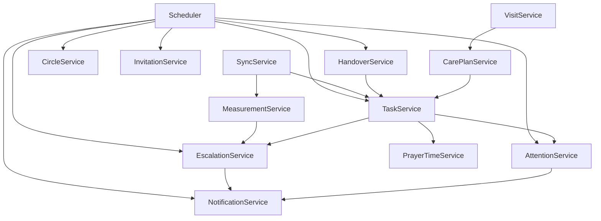
```mermaid
flowchart TB
    Sched["Scheduler"]
    Sync["SyncService"]

    Visit["VisitService"]
    Hand["HandoverService"]
    CircleS["CircleService"]
    Inv["InvitationService"]

    Plan["CarePlanService"]
    Meas["MeasurementService"]

    Task["TaskService"]

    Esc["EscalationService"]
    Att["AttentionService"]
    Prayer["PrayerTimeService"]

    Notif["NotificationService"]

    Sched --> Task
    Sched --> Esc
    Sched --> CircleS
    Sched --> Inv
    Sched --> Hand
    Sched --> Notif
    Sched --> Att
    Sync --> Task
    Sync --> Meas
    Visit --> Plan
    Hand --> Task
    Plan --> Task
    Meas --> Esc
    Task --> Esc
    Task --> Att
    Task --> Prayer
    Esc --> Notif
    Att --> Notif
```

| Arrow | Meaning |
| --- | --- |
| `Scheduler` to the services | Runs the timed jobs below: tasks, escalation steps, circle requests, invitations, and handovers. It also asks `NotificationService` for the daily summary and reminders, and `AttentionService` for the "no companion" item. |
| `SyncService` to `TaskService` and `MeasurementService` | Replays the records made offline. |
| `VisitService` to `CarePlanService` | A change made at a visit (a new dose, a stopped medicine). |
| `HandoverService` to `TaskService` | Reassigns the tasks of a handover. |
| `CarePlanService` to `TaskService` | Regenerates the future tasks when the plan changes. |
| `MeasurementService` to `EscalationService` | A reading outside the range of a critical plan. |
| `TaskService` to `EscalationService`, `AttentionService`, `PrayerTimeService` | A missed dose, a "needs your attention" item, and the clock time of a prayer period. |
| `EscalationService` and `AttentionService` to `NotificationService` | Every alert is sent through it. |

| Service | Responsibility | Main operations | Priority |
| --- | --- | --- | --- |
| `AuthService` | Sends a four-digit code by SMS (valid for 5 minutes, with limited resends), checks it, counts wrong codes on the device and on the phone number (`OtpAttemptLimit`), locks sign-in for 24 hours after the third, and issues tokens. | `requestCode`, `verifyCode`, `refresh`, `signOut` | Must |
| `AccountService` | Returns the user's circles with the role in each and the one used last; keeps the name and the user's own city; stores quiet time; exports the user's data; deletes an account after the user has left every circle. | `me`, `updateProfile`, `setQuietTime`, `exportMyData`, `deleteAccount` | Must (quiet time, export, and delete: Should) |
| `CircleService` | Creates a circle for yourself, or a request for someone else (a circle is made at once only when the patient has no phone); approves, declines, cancels, and expires requests; changes roles; removes members; leaves; archives and reopens; keeps the medical file and its emergency contacts; sets the patient's location (GPS from his own phone, or by hand); stops the app on a patient's phone; applies the last-manager rule and the one-number-one-circle rule. | `createCircle`, `createRequest`, `answerRequest`, `changeRole`, `leave`, `archive`, `reopen`, `setEscalationOrder`, `setPatientPhone`, `setPatientLocation`, `setMedicalProfile`, `setEmergencyContacts`, `stopPatientApp` | Must (archive, the medical file, and stopping the app: Should) |
| `InvitationService` | Creates an invitation to a phone number with a role, builds the WhatsApp link, and cancels, accepts, declines, or expires it. | `invite`, `pending`, `accept`, `decline`, `cancel`, `expire` | Must |
| `PermissionPolicy` | One place that decides whether a member's role allows an action (the 16 permissions of Section 3.1.6). Every service calls it. | `can`, `require` | Must |
| `CarePlanService` | Adds and changes medicines, measurement plans, and appointments; changes a dose or stops a medicine (history kept); adds a box to the stock and recounts it; sets ranges, priority, and maximum lateness; makes the dates of an appointment series, and reschedules or cancels the series or one date; assigns or volunteers a companion for one date. A dose change affects future tasks only. | `addMedication`, `changeDose`, `stopMedication`, `addStock`, `recountStock`, `addMeasurementPlan`, `addAppointment`, `rescheduleAppointment`, `cancelOccurrence`, `assignCompanion` | Must (supply: Should) |
| `TaskService` | Creates the day's tasks from the plan, applies a record with the first-valid-record rule (also late, after "could not" or "missed"), logs for the patient, postpones, records "could not", marks missed, assigns, accepts, declines, expires, reassigns, and finishes an assignment, and files a symptom report. There is no errand (BR38). | `today`, `record`, `logFor`, `postpone`, `couldNot`, `assign`, `answerAssignment`, `completeAssignment`, `reassign`, `reportSymptoms` | Must |
| `EscalationService` | Starts an escalation, notifies the next person in the order every 20 minutes, and stops when someone responds or nobody is left. | `start`, `notifyNext`, `respond` | Must |
| `AttentionService` | Raises, lists (most important first), and resolves "needs your attention" items, and lets a manager remind a member about one (for example the low-supply line). | `raise`, `list`, `resolve`, `remind` | Must |
| `NotificationService` | Stores device tokens, chooses the channel and strength, keeps health details out of the lock-screen text, applies quiet time, and sends the one summary after Isha. | `send`, `open`, `respond`, `registerDevice`, `sendDailySummary` | Must (quiet time and summary: Should) |
| `MeasurementService` | Saves readings with the range that applied (BR37), alerts the managers when a reading is outside it, and prepares history and chart data. | `record`, `history`, `chartData` | Must (saving) / Should (charts) |
| `HandoverService` | Proposes the tasks to hand over, sends the transfer requests, shows who accepted, and ends the handover when the period ends. | `propose`, `sendRequests`, `statusBoard`, `end` | Should |
| `VisitService` | Saves a visit, applies the companion's temporary rights, and adds the next appointment. | `save`, `addNextAppointment` | Should |
| `ReportService` | Builds the activity feed, the adherence calendar, the care report, the visit sheet, the emergency card, and the care record export, and stores the family's questions. | `activityFeed`, `adherence`, `careReport`, `visitSheet`, `emergencyCard`, `careRecordExport`, `addQuestion` | Must (feed) / Should (adherence, questions, emergency card) / Could (visit sheet, export) |
| `SyncService` | Replays actions recorded offline, ignores duplicates, and returns a result for each action. | `applyActions` | Should |
| `PrayerTimeService` | Returns prayer times for coordinates and a day from the cache, refreshes them, and calculates them offline if the source is down. | `timesFor`, `refresh`, `calculateOffline` | Must |
| `Scheduler` | Runs the timed jobs in the table below. | `runJobs` | Must |

**Timed jobs** (the intervals are proposals)

| Job | Runs | What it does |
| --- | --- | --- |
| Generate tasks | Every night, and when the plan changes | Creates the coming days' tasks, and the coming dates of repeating appointments, from the plan, with no duplicates. |
| Mark missed | Every minute | Marks pending tasks as missed after `latest_at` and starts the escalation. |
| Escalation step | Every minute | Notifies the next person in the order when 20 minutes have passed with no response. |
| Expire assignments | Every minute | Marks a waiting assignment as expired after 30 minutes, returns the task to the sender, and raises a "needs your attention" item. |
| Expire circle requests | Every 5 minutes | Ends a request after 24 hours and tells the creator. |
| Expire invitations | Every hour | Ends an invitation after 7 days. |
| Appointment checks | Every 5 minutes | Sends the day-before and one-hour-before reminders for each date, and raises a "no companion" item the day before a date that has none. |
| End handovers | Every 5 minutes | Ends a handover when its period ends and cancels the requests nobody accepted. |
| Daily summary | Every day after Isha | Sends the one summary of the non-urgent notifications held during quiet time. |

##### Who is told what

The patient is told first, or the member named to perform the task, or the managers when the patient has no phone (BR24). The rows below are the `NotificationType` values.

| Event | Type | Who is told | Strength |
| --- | --- | --- | --- |
| A dose or measurement is due | `DOSE_DUE`, `MEASUREMENT_DUE` | The patient, or the member named to perform it; the managers if the patient has no phone (BR24) | Normal |
| A dose is missed | `DOSE_MISSED` | The manager or the assigned person, then the members in the order the manager arranged | Very high |
| The help button is pressed | `HELP_PRESSED` | The managers first, then the members in the escalation order if none of them responds | High |
| Pills are finished | `MEDICINE_FINISHED` | The managers | High |
| The supply is low | `SUPPLY_LOW` | The managers, and a member that a manager reminds from the "needs your attention" line | Normal |
| A side effect is reported | `SIDE_EFFECT` | The managers | High |
| A reading is outside the range | `OUT_OF_RANGE` | The managers | High |
| A task is assigned to someone | `TASK_ASSIGNED` | The receiver | Normal |
| A task is declined, or not accepted in 30 minutes | `TASK_DECLINED_OR_EXPIRED` | Whoever assigned it | Normal |
| An appointment date is coming | `APPOINTMENT_COMING` | The patient and the companion of that date, the day before and an hour before | Normal |
| Visit notes are saved | `VISIT_SAVED` | All members, viewers included | Normal, early |
| A dose is changed or stopped | `DOSE_CHANGED` | All members, and the patient on the next medicine card in Simplified Mode | Normal |
| A member is invited or joins | `MEMBER_INVITED_OR_JOINED` | The managers | Normal |
| A handover request arrives | `HANDOVER_REQUEST` | The recipient | Normal |
| A circle request ends | `REQUEST_ENDED` | The creator | Normal |

"Very high" is built for the MVP as a time-sensitive notification on iPhone and a high-importance channel on Android. It stands out and can break through Focus modes, but it is not guaranteed to make a sound on a silenced phone. Making the phone ring regardless needs Apple's special approval for critical alerts and a full-screen alarm on Android, which the Charter puts after the MVP.

#### 3.1.5 Business rules enforced by the services

| # | Rule | Where |
| --- | --- | --- |
| BR1 | **One patient, one circle.** A phone number can be the patient of only one active circle. Circles with no number are ignored. | `CircleService`, unique `patients.active_phone` |
| BR2 | **The mode is fixed.** `Circle.patientMode` is set at creation and never changes. A wrong choice is fixed by creating a new circle. It is empty only when the patient has no phone, because there is no patient app to put in a mode. | `CircleService`, no update route |
| BR3 | **Phone settings only where they apply.** `PatientPhoneSettings` and `PatientPhoneStatus` exist only when the mode is Simplified and the patient has a phone. | `CircleService` |
| BR4 | **A patient with no phone has no account.** There is no `User` and no `CircleMember` for the patient, and the patient's reminders go to the managers. His location is entered by hand (BR34). | `CircleService`, `Task.firstRecipients()` |
| BR5 | **The manager chooses the patient's role** when creating the circle (stored in `circle_requests.patient_role`). In a Simplified circle it is empty and the patient is always `PATIENT_SIMPLIFIED`. In a Detailed circle the manager picks `MANAGER`, `PERFORMER`, or `VIEWER` (the list of three is my reading, open, Section 9, item 6), and the patient sees it when approving. A patient who creates a circle for himself is a Manager whose member is himself: the Self-manager. | `CircleService` |
| BR6 | **Joining is only by invitation.** The role is Manager, Performer, or Viewer (`InvitableRole`). There is no code. An invitation can be cancelled before it is accepted and expires after 7 days. A person already in the circle cannot be invited again. | `InvitationService` |
| BR7 | **Role and leaving rules.** A manager cannot change his own role. A Manager whose member is the patient (the Self-manager) cannot be removed or demoted by anyone else. When the last manager leaves, the circle is archived; the leave screen warns first and offers to appoint another manager. A Simplified patient cannot leave alone: a manager stops the app on the patient's phone. The automatic archive when the last manager leaves belongs to the Must work; archiving and reopening by hand are Should. | `CircleService`, `CircleMember.isLastManager()` |
| BR8 | **First valid record wins.** A task becomes done or could-not only through a record. A second record is refused and the person is told who recorded it and when. `client_action_id` makes a replayed record do nothing. A task becomes missed only by the system, after `latest_at`. | `TaskService.record`, `Scheduler` |
| BR9 | **A reminder is never a confirmation.** A `Notification` never changes a task's status. Only `complete()`, `logFor()`, and `couldNot()` do. | `TaskService`, `NotificationService` |
| BR10 | **Every medicine gets the full escalation** when a dose is missed, whatever its priority. For a measurement plan the priority still decides: critical starts an escalation, normal stops at a "needs your attention" item with no alert, and optional gets one reminder. Whether an optional medicine should keep one reminder only is open (Section 9, item 5). | `ScheduledItem.escalates()`, `EscalationService` |
| BR11 | **Answering means acting.** `Notification.respondedAt` is set only by pressing an action ("I'll handle it", "log for the patient") or by recording the task. Opening the notification only sets `openedAt`. | `NotificationService`, `EscalationService` |
| BR12 | **Timers.** Dose reminders repeat every 10 minutes until `latest_at`. Escalation steps are 20 minutes apart. An assignment must be answered in 30 minutes. A circle request lasts 24 hours and an invitation 7 days. A sign-in code lasts 5 minutes and a sign-in lock 24 hours. The companion's rights last until the visit is saved, or 24 hours. An archived circle stays readable for a year. | `Scheduler`, models |
| BR13 | **Who is in the escalation order.** Only Manager and Performer members, never a Viewer or a Simplified patient. For a Manager who is the patient (the Self-manager), the first person told is himself. | `EscalationOrder.isEligible()` |
| BR14 | **History is kept.** A dose change never edits past tasks: `Task.plannedDose` is a copy taken when the task is made. Stopping a medicine sets its status to stopped. Stock entries are added, never edited. There is no delete. | `CarePlanService` |
| BR15 | **Reports use only what was recorded.** The adherence report and the visit sheet read only recorded statuses and readings. A missing reading shows as missing. | `ReportService` |
| BR16 | **No health details on the lock screen.** The lock-screen text of a notification comes from `AlertSubject.lockScreenText()` and never contains a medicine name or a reading. | `NotificationService` |
| BR17 | **Prayer times.** `TimeSlot.resolve()` uses the prayer times of the patient's location (its coordinates), cached by place and day, with an offline calculation as the fallback. "After the prayer" adds `Patient.afterPrayerOffsetMin` (20 minutes by default). | `PrayerTimeService` |
| BR18 | **Permissions are checked on the server** for every request. Only members read a circle's data, and every action is checked with `CircleMember.can()`. | `PermissionPolicy` |
| BR19 | **No advice.** A measurement range may be empty, and the app never suggests a number. A reading outside the range alerts the managers and changes nothing by itself. | `MeasurementService` |
| BR20 | **Deleting an account** is possible only after leaving every circle. The number is removed, and the records about other patients stay in their circles. | `AccountService` |
| BR21 | **Supply is worked out.** There is no stored pill count. `Medication.remainingStock()` starts at the latest recount (or at zero if there is none), adds every new box after it, and subtracts every dose recorded as done after it. A result at or below `lowStockAt` raises a "needs your attention" item (`LOW_SUPPLY`). `forecastSupply()` gives the run-out date, the end of the treatment, and whether the stock covers it. | `Medication.remainingStock()` |
| BR22 | **Sign-in lock (approved on 7 October).** Three wrong codes lock sign-in for 24 hours. `OtpAttemptLimit` counts them twice: once for the device (scope `DEVICE`, key `installation_id`) and once for the phone number (scope `PHONE_NUMBER`). Either lock refuses to send or check codes until `locked_until`. Asking for a new code does not give three more tries, and a correct code resets both counts. The count on the phone number also stops a script that fakes a device id. | `AuthService`, `OtpAttemptLimit` |
| BR23 | **No companion.** An appointment date (`AppointmentOccurrence`) with no companion raises a "needs your attention" item (`NO_COMPANION`) the day before that date. If it still has none on the day, nothing more happens. | `Scheduler` |
| BR24 | **Who gets the dose-time alert.** Only the patient, including when the plan says anyone in the circle can perform it (whoever acts first records it, BR8). When the performer is a named member, that member is told first. A patient with no phone has no account, so the alert goes to the managers. | `Task.firstRecipients()` |
| BR25 | **One open request per number.** A second creator sees "a request is waiting". The creator is told how the request ended. If the patient creates their own circle first, the open request is cancelled automatically. | `CircleService` |
| BR26 | **Consent is kept, by creation path.** A circle for myself has neither a `Consent` nor a `CareAcknowledgment`. A circle for a patient with a phone has at least one `Consent`: the patient's approval, with its date and what the family will see (medicines, measurements, and appointments). A circle for a patient with no phone has one `CareAcknowledgment`: the creator's declaration, with its date. A circle never has both. | `CircleService` |
| BR27 | **Calls only open the dialer.** "Call" is shown to the managers, the Self-manager, and the assigned Performer, never to a Viewer. There is no calling inside the app. | Front-end, `PermissionPolicy` |
| BR28 | **The doctor is only a name.** There are no doctor accounts and no doctor records. | `CarePlanService` |
| BR29 | **The app never gives medical advice.** It never diagnoses, proposes a dose, or suggests a range. | All services |
| BR30 | **Performer for a patient with no phone.** A patient with no phone cannot be the performer "himself". The performer is a person, by default the manager. | `CarePlanService` |
| BR31 | **An appointment is a series of dates.** Each date is an `AppointmentOccurrence` with its own status, companion, and visit. Changing the series changes only the dates that have not happened yet. The day-before check (BR23) runs for each date. | `CarePlanService`, `Appointment.rescheduleSeries()` |
| BR32 | **The emergency card is information, built live.** It is built when someone opens it, from the patient's name, the medical file, and the medicines that are active now. Nothing is stored, so it cannot be out of date. It is opened only on the patient's own phone, from a button in his settings (the Simplified patient and the Self-manager): `view(by)` works only when `by.isThePatient()`. The app places no call, sends nothing, and shares no location from it. Whether a number on it may open the dialer is open (Section 9, item 29), and so is whether the managers may open it (item 32). | `ReportService`, `EmergencyCard.view()` |
| BR33 | **An emergency contact is a typed name.** A name, a relation, a phone number, and a place in the order. It has no account and no membership, and the app never sends it anything. It is edited and seen like the rest of the medical file. | `CircleService`, `EmergencyContact` |
| BR34 | **One location, one purpose.** A patient has exactly one `PatientLocation`, used only for the five prayer times. A patient with a phone gets it by GPS on his own phone (source `GPS`). A patient with no phone has it picked by hand by the person who creates the circle (source `MANUAL`), and so does a patient who refuses the permission. It is never a track, never shown to the family, and never sent. The one thing a manager sees is the city he picked by hand, so that he can change it. | `CircleService`, `PrayerTimeService` |
| BR35 | **The care record export is made on request.** It is a PDF of the patient, the medical file, the current plan, the medicine history, the readings, the appointments, and the visits. Only a manager may ask (`EXPORT_CARE_RECORD`). Nothing is stored. | `ReportService`, `CareRecordExport` |
| BR36 | **A user's own prayer city.** `User.city` and the quiet-time prayers (when his quiet time ends, and when his summary arrives) belong to the user himself and use the prayer times of his own city, not of the patient's location. | `NotificationService`, `PrayerTimeService` |
| BR37 | **A reading keeps its range.** A `Measurement` stores the `TargetRange` that applied when it was saved (`range_at_recording`). Changing the range later never recolours old readings, in the same way as `plannedDose` (BR14). | `MeasurementService` |
| BR38 | **There is no errand.** "Who brings it?" gives the same card to another member through a `TaskAssignment`, with a note and the switch "remind when the box arrives". Finishing the assignment ("Sara brought it, 6:10") never changes the card's status and never counts as a dose. A card that ended as "could not" can still be recorded late, and then shows "done late". | `TaskService`, `TaskAssignment.complete()` |
| BR39 | **Identity is never merged by itself.** `Patient.syncIdentityFrom(user)` is the only way the patient's record and his own account meet. The app never runs it by itself, so "everyone keeps what he typed" still holds. What starts it is open (Section 9, item 30). | `CircleService` |

#### 3.1.6 Roles and permissions

The table has one row for each of the 16 values of `Permission`, which `CircleMember.can(permission)` answers from the role. A dagger (†) marks a cell proposed by the designer that the team still has to confirm (Section 9). The columns are the five roles the user sees. The stored `Role` has four values, and the Self-manager column is a `MANAGER` whose member is the patient (`isThePatient()`).

| Permission | Self-manager (القادر) | Manager (المدير) | Performer (المنفّذ) | Viewer (المطّلع) | Patient (المريض, Simplified) |
| --- | --- | --- | --- | --- | --- |
| `SEE_PLAN`: see Today, plan, log, and charts | Yes | Yes | Yes † | Yes † | His one page only |
| `CARRY_OUT_OWN_TASKS`: carry out tasks assigned to them | Yes (own tasks are assigned automatically) | Yes | Yes | No | Yes (same) |
| `LOG_FOR_PATIENT`: log a dose or measurement for the patient | No (the Self-manager is the patient) | Yes | Only tasks assigned to them † | No | No |
| `EDIT_PLAN`: add or edit medicines, appointments, measurements, and the medical file | Yes | Yes | No | No | No |
| `CHANGE_DOSE`: change a dose or stop a medicine | Yes | Yes | Only as the visit companion † | No | No |
| `SET_RANGES_AND_PRIORITY`: set ranges, maximum lateness, and priority | Yes | Yes | No | No | No |
| `ASSIGN_TASKS`: assign or reassign tasks | Yes | Yes | No † | No | No |
| `ANSWER_ASSIGNMENT`: accept, decline, or finish a task assigned to them | Yes | Yes | Yes | No | No |
| `MANAGE_MEMBERS`: invite, change roles, remove members | Yes | Yes | No | No | No |
| `ARRANGE_ESCALATION`: arrange the escalation order | Yes | Yes | No | No | No |
| `HAND_OVER_TASKS`: hand over tasks ("I'm busy") | Yes | Yes | Yes † | No | No |
| `SHARE_VISIT_SHEET`: share the visit sheet | Yes | Yes | No † | No | No |
| `EXPORT_CARE_RECORD`: export the care record as a PDF | Yes | Yes | No | No | No |
| `SET_PATIENT_PHONE`: set the patient's phone (font size, read aloud) | No | Yes | No | No | No |
| `LEAVE_CIRCLE`: leave the circle alone | Yes (a warning first; the circle is archived when the last manager leaves) | Yes (a warning first; the circle is archived when the last manager leaves) | Yes | Yes | No (a manager stops the app on the patient's phone) |
| `ARCHIVE_CIRCLE`: archive the circle | Yes | Yes | No | No | No |

**A patient in a Detailed circle.** In a Detailed circle the manager gives the patient the role `MANAGER`, `PERFORMER`, or `VIEWER` (BR5), and he uses the column of that role. So there is no separate interface to design for him. The Patient column above describes the one Simplified page only. The list of three roles is my reading of "the manager chooses the patient's role" (open, Section 9, item 6).

**Not a permission.** Opening the emergency card is not one of the 16 permissions. It depends on who the member is (`isThePatient()`), not on his role, and it works only on the patient's own phone (BR32). Setting the patient's location is two cases: the patient's own phone sends GPS, and a manager who may `EDIT_PLAN` enters a city by hand (BR34).

Rules behind the table (see BR5 to BR7): a circle can have several managers, with the same rights, and a manager can change any other member's role but not his own. The Self-manager is the manager of his own circle and cannot be removed or demoted. One person can be invited for his own care and for someone else's at the same time. A Performer sees the whole plan but changes it only through a task assigned to them.

#### 3.1.7 States

A task, an assignment, an escalation, a circle request, and an invitation change over time in ways a class diagram cannot show. The state diagrams below show them, with the rules of the arrows written under each one. The table at the end maps the four stored task statuses to the eight shown on a card.

**A task**

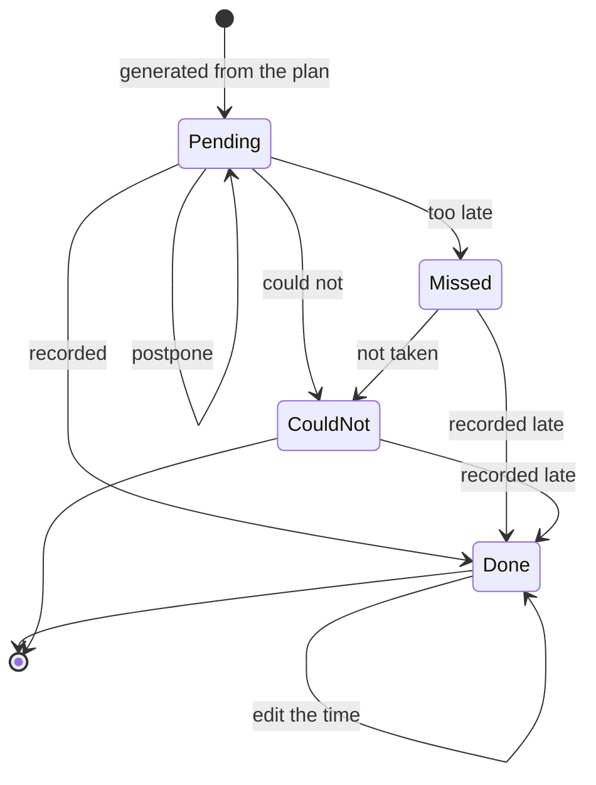
```mermaid
stateDiagram-v2
    direction TB
    [*] --> Pending : generated from the plan
    Pending --> Pending : postpone
    Pending --> Done : recorded
    Pending --> CouldNot : could not
    Pending --> Missed : too late
    Missed --> Done : recorded late
    Missed --> CouldNot : not taken
    CouldNot --> Done : recorded late
    Done --> Done : edit the time
    Done --> [*]
    CouldNot --> [*]
```

- A task is generated from the plan. There is no errand task: a card that could not be done goes to another member (BR38).
- **Postpone** moves it to a later time on the same day.
- **Recorded** is made by the performer, or by a manager for the patient. The first valid record wins (BR8).
- **Could not** needs a reason, and the task stays in "needs your attention" until someone completes or reassigns it. It is not a dead end: when the pills arrive, the dose can still be **recorded late**, and the card shows "done late". A missed task works the same way.
- **Too late** means the maximum lateness passed with no record. Only the system does this.
- **Edit the time** changes the recorded time. A second record by someone else is refused.

**An assignment**

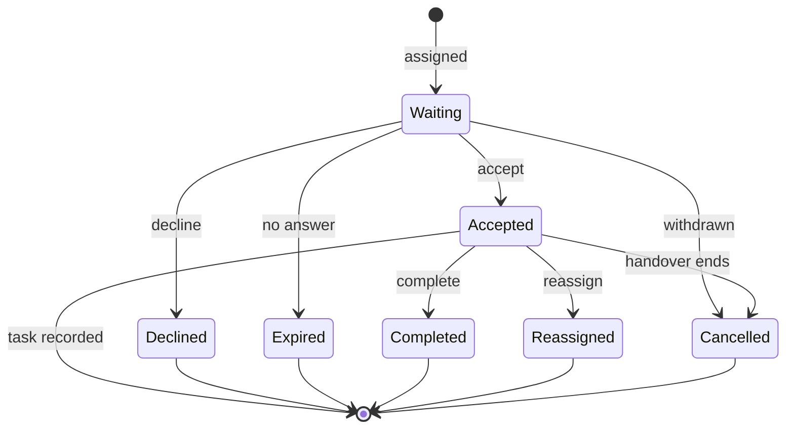
```mermaid
stateDiagram-v2
    direction TB
    [*] --> Waiting : assigned
    Waiting --> Accepted : accept
    Waiting --> Declined : decline
    Waiting --> Expired : no answer
    Waiting --> Cancelled : withdrawn
    Accepted --> Completed : complete
    Accepted --> Reassigned : reassign
    Accepted --> Cancelled : handover ends
    Accepted --> [*] : task recorded
    Declined --> [*]
    Expired --> [*]
    Completed --> [*]
    Reassigned --> [*]
    Cancelled --> [*]
```

- **Assigned** starts a 30-minute window to answer.
- **Decline** needs a reason. **No answer** means 30 minutes passed. In both cases the task goes back to the person who assigned it and into "needs your attention".
- **Withdrawn** means the assigner took the request back, or the handover period ended before an answer.
- **Reassign** is used when the accepted person hands the task over or a manager gives it to someone else. The old assignment is kept as history.
- **Complete** is used when the accepted person has done his part ("Sara brought it, 6:10"). It never changes the task's status and never counts as a dose: the dose still has to be recorded (BR38).

**An escalation** (every medicine gets this full path; for a measurement plan only critical ones do)

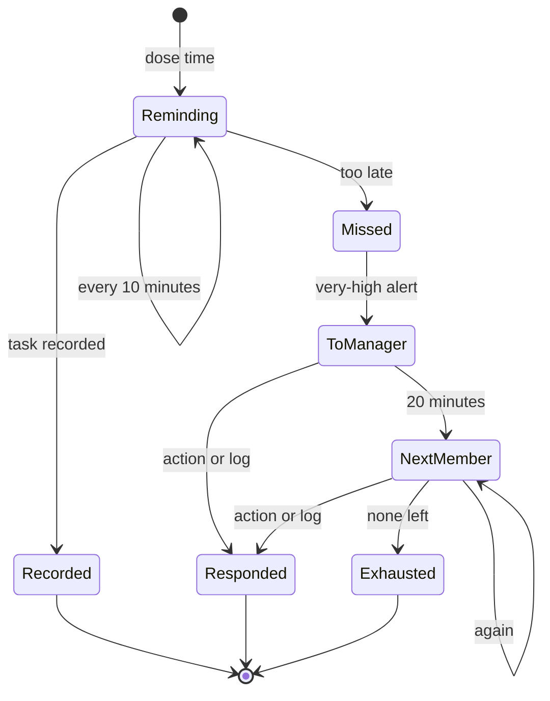
```mermaid
stateDiagram-v2
    direction TB
    [*] --> Reminding : dose time
    Reminding --> Reminding : every 10 minutes
    Reminding --> Recorded : task recorded
    Reminding --> Missed : too late
    Missed --> ToManager : very-high alert
    ToManager --> Responded : action or log
    ToManager --> NextMember : 20 minutes
    NextMember --> NextMember : again
    NextMember --> Responded : action or log
    NextMember --> Exhausted : none left
    Recorded --> [*]
    Responded --> [*]
    Exhausted --> [*]
```

- **Dose time**: the first alert goes to the patient, or to the named member (BR24).
- **Too late** means the maximum lateness passed. The very-high alert goes to the manager or the assigned person.
- **Action or log** means someone pressed an action ("I'll handle it", "log for the patient") or recorded the task (BR11).
- **20 minutes** with no response moves the alert to the next person in the order the manager arranged, and **again** repeats this for each person, 20 minutes apart.
- **None left** in the order: the item stays in "needs your attention".

**A circle request**

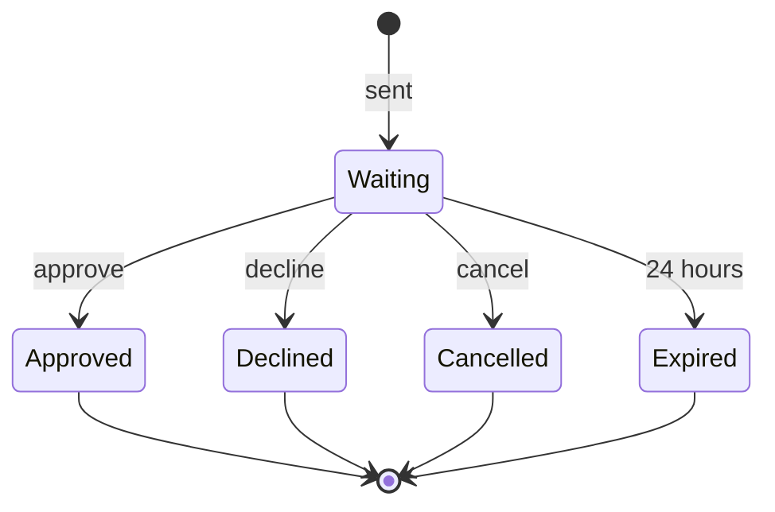
```mermaid
stateDiagram-v2
    direction TB
    [*] --> Waiting : sent
    Waiting --> Approved : approve
    Waiting --> Declined : decline
    Waiting --> Cancelled : cancel
    Waiting --> Expired : 24 hours
    Approved --> [*]
    Declined --> [*]
    Cancelled --> [*]
    Expired --> [*]
```

- The request waits up to 24 hours for the patient. **Approve** creates the circle and the consent.
- **Cancel** is done by the creator, or happens by itself when the patient creates their own circle first (BR25).

**An invitation**

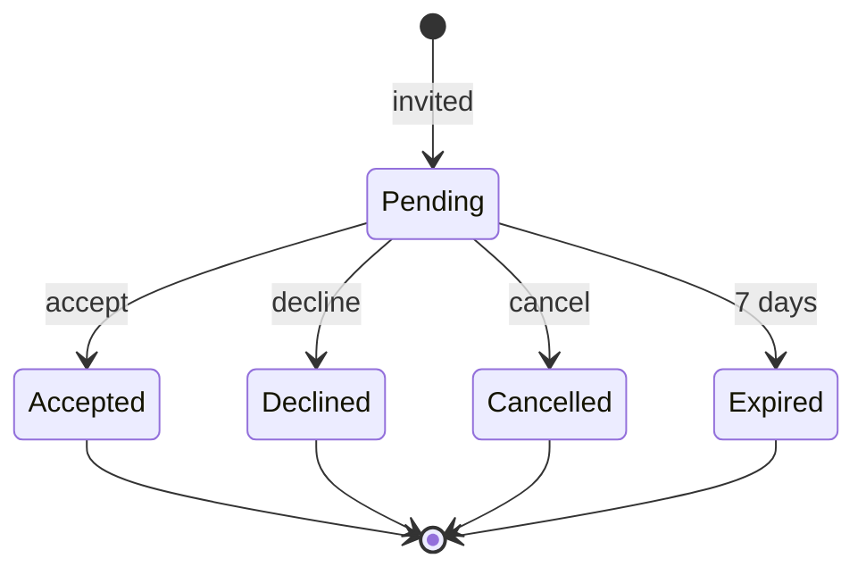
```mermaid
stateDiagram-v2
    direction TB
    [*] --> Pending : invited
    Pending --> Accepted : accept
    Pending --> Declined : decline
    Pending --> Cancelled : cancel
    Pending --> Expired : 7 days
    Accepted --> [*]
    Declined --> [*]
    Cancelled --> [*]
    Expired --> [*]
```

- A manager invites a phone number with a role. **Accept** makes the person a member.
- A manager can **cancel** before the person accepts. After 7 days the invitation expires by itself.

**Stored status and the status shown on a card.** A task stores four statuses. The eight shown on a card are worked out by `displayStatus(now)`, so "postponed", "declined", and "done late" are never stored.

| Shown on the card | How it is worked out |
| --- | --- |
| Later | Pending, and the time has not come |
| Now | Pending, due now, and not yet recorded |
| Done | Done, recorded at or before the due time |
| Done late | Done, recorded after the due time |
| Could not | Could not (the reason is kept, and the task goes to needs-attention). Recorded late later, it shows as Done late |
| Postponed | Pending with a later time chosen by the person; it shows as Later or Now again when that time comes |
| Declined | Pending, and the latest assignment was declined or expired; the task is back with whoever assigned it |
| Missed | Missed (the maximum lateness passed with no record) |

#### 3.1.8 Route groups

The request and the answer of every route are in Section 5.3. This table shows which service answers each group of routes, so a route can be found from the class that owns its rule. Every route except sign-in needs a token, and `PermissionPolicy` checks the role on the server.

| Route group | Specified in | Service |
| --- | --- | --- |
| Sign-in | 5.3.1 | `AuthService` |
| Account and devices | 5.3.2 | `AccountService`, `NotificationService` |
| Circles and requests (including the medical file and its emergency contacts, the patient's location, and the patient's phone) | 5.3.3, 5.3.5 | `CircleService` |
| Invitations and members | 5.3.4 | `InvitationService`, `CircleService` |
| Care plan: medicines and their stock, measurement plans, appointments and their dates | 5.3.5 | `CarePlanService` |
| Today and tasks, assignments, symptoms | 5.3.6 | `TaskService` |
| Alerts: needs your attention (resolve and remind), notifications, the help button, the escalation order | 5.3.7 | `AttentionService`, `EscalationService`, `NotificationService` |
| Measurements | 5.3.8 | `MeasurementService` |
| Visits and handover | 5.3.9 | `VisitService`, `HandoverService` |
| Log and reports, the emergency card, and the care record export | 5.3.10 | `ReportService` |
| Sync and prayer times (by coordinates) | 5.3.11 | `SyncService`, `PrayerTimeService` |

#### 3.1.9 Complete UML class diagram (domain model)

This is the UML class diagram of the back-end domain model. It shows inheritance, composition (the part cannot exist without its owner), associations with multiplicities, interfaces, and the enumerations used by the classes. Every class is mapped to its tables in Section 3.2.5. The source is the file `UML_Class_Diagram_v2.mmd` (Mermaid), and the pictures below are drawn from it.

**How to read it**

- Attributes read `-name : Type`. `[0..1]` means optional and `[0..*]` means a list. Operations read `+name(parameters) ReturnType`.
- `«abstract»` is a class nobody creates directly. `«interface»` is a promise several classes keep. `«derived»` classes are never stored. `«device»` lives on the phone. `«dataType»` is a small value that belongs to its owner. `«enumeration»` is a fixed list of values.
- A filled diamond means owns, and the part disappears with it. An empty diamond means has. A hollow triangle means inherits. A dashed line with a hollow triangle means implements. A dashed arrow means depends on.
- Fields that say who did something (`recordedBy`, `madeBy`, `resolvedBy`, and so on) are typed `CircleMember` and are not drawn as arrows.

##### 3.1.9.1 The whole app in one diagram


The picture is a vector drawing in the source files, so it stays sharp when zoomed. To keep it readable, the whole-app picture leaves out the lines from `Circle`, the lines that point to `CircleMember`, and the dashed lines between packages. The same classes also come as a page of the 18 main classes and six package pages, which draw those lines.


##### 3.1.9.2 Account (4 classes)

Classes: `User`, `Device`, `OtpChallenge`, `OtpAttemptLimit`.


- The lock is not on the device any more. `OtpAttemptLimit` counts the wrong codes for one key: an installation id (scope `DEVICE`) or a phone number (scope `PHONE_NUMBER`). `OtpChallenge` checks both, so signing out, reinstalling, or faking a device id does not clear a lock (BR22). The device does not own the limit (a dashed arrow, not a filled diamond), because a lock on a phone number has no device at all, and signing out or reinstalling must not clear a lock.
- The SMS code is valid for 5 minutes. Only its hash is stored.
- Quiet time is stored on the user: urgent alerts always arrive, the rest wait for one summary after Isha, and quiet hours run from 11 pm to Fajr. They use the prayer times of the user's own city (`User.city`), not of the patient's location (BR36).
- `Device.locationAllowed` is the GPS permission of the patient's own phone (BR34).
- `Notification` points to a `User`, because some alerts go to people who are not in a circle yet (the creator of a circle request).

##### 3.1.9.3 Circles (20 boxes)

Boxes: `Role`, `AppMode`, `InvitableRole` (enumerations), `Circle`, `Patient`, `PatientLocation`, `MedicalProfile`, `Allergy`, `Doctor`, `EmergencyContact`, `EmergencyCard`, `Consent`, `CareAcknowledgment`, `CircleRequest`, `Invitation`, `CircleMember`, `EscalationOrder`, `EscalationEntry`, `PatientPhoneSettings`, `PatientPhoneStatus`.


- The role lives on `CircleMember`, so one person can be a manager in one circle and a viewer in another. `Role` has four values. The Self-manager is a `MANAGER` whose member is the patient: `CircleMember.isThePatient()`.
- `CircleRequest` turns into a `Circle` only when the patient approves. Its 24-hour limit is `expiresAt`, and it holds the patient's first and last name and `patientRole`, the role the manager chose for the patient (empty in a Simplified circle). In the database it also keeps the details the creator typed (birth year, city, photo, and relation), which the diagram leaves out.
- The circle holds `Consent` or `CareAcknowledgment`, never both: a circle for a patient with a phone has the patient's consent (more than one if it is renewed), a circle for a patient with no phone has the creator's declaration, and a circle for oneself has neither (BR26).
- The patient has exactly one `PatientLocation`, used only for the prayer times (BR34). Its source is `GPS` or `MANUAL`.
- The medical file holds the allergies, the doctors as typed names, and the `EmergencyContact`s. The `EmergencyCard` is not stored: it is built from the patient, the medical file, and the medicines active now, and is opened only by the patient on his own phone (BR32).
- `EscalationOrder` is an ordered list of `EscalationEntry` rows, each pointing to a member: the "order the manager arranged" that every urgent alert follows. Only Manager and Performer members can be in it.
- `PatientPhoneSettings` and `PatientPhoneStatus` exist only for a Simplified circle whose patient has a phone. The status says which device the app is installed on, since when, the last activity, and when a manager stopped the app.
- When the last manager leaves, the circle is archived. `CircleMember.isLastManager()` tells the leave screen to warn the manager.

##### 3.1.9.4 Care plan (12 boxes)

Boxes: `CarePlanItem`, `ScheduledItem`, `Medication`, `MedicationQuantity`, `StockAddition`, `SupplyForecast`, `MedicationChange`, `MeasurementPlan`, `TargetRange`, `Appointment`, `AppointmentOccurrence`, `TimeSlot`.


- `ScheduledItem` is the layer between the plan item and the two kinds that repeat. It holds the priority, the maximum lateness the manager sets, the performer, the repeat every 10 minutes, and the times.
- The doctor is only text: `orderedBy` on every item and on every `MedicationChange`.
- `MedicationChange` is both a dose change and a stop. Past tasks keep their old dose.
- A quantity is a number with its own unit (`MedicationQuantity`), used for the dose, the low-stock level, and the stock.
- There is no stored pill count. `Medication.remainingStock()` starts at the latest recount, adds the boxes added after it, and subtracts the doses recorded as done (BR21). `StockAddition` is a new box (`BOX_ADDED`) or a recount (`RECOUNT`). `SupplyForecast` is worked out when asked.
- An `Appointment` is a series, and each date is an `AppointmentOccurrence` with its own status, companion, and visit (BR31).

##### 3.1.9.5 Tasks (5 classes)

Classes: `Task`, `TaskAssignment`, `TemporaryHandover`, `Visit`, `SymptomReport`.


- A `Task` stores four statuses. The eight shown on a card are worked out by `displayStatus(now)`.
- There is no errand. A card that could not be done goes to another member through a `TaskAssignment`, and the assignment can be finished (`complete(at)`) without changing the card (BR38).
- `TaskAssignment` keeps every request, including declined and expired ones, so the history of who was asked is never lost.
- `Visit` hangs on an `AppointmentOccurrence`: each date of an appointment has its own visit. The companion's rights are `companionRightsUntil` plus `mayEdit()`, not a separate role.

##### 3.1.9.6 Alerts (4 classes)

Classes: `AlertSubject`, `Notification`, `Escalation`, `AttentionItem`.


- `AlertSubject` is an interface: a task, a reading, a side-effect report, or a medicine. One interface replaces four optional links.
- `Escalation` is stored (one run of alerts), so the log can show who was told, when, and who responded.
- `AttentionItem` is stored, not computed, because it must stay until someone completes or reassigns it.

##### 3.1.9.7 Records and sync (8 classes)

Classes: `Measurement`, `ActivityEntry`, `FamilyQuestion`, `AdherenceReport`, `CareRecordExport`, `VisitSheet`, `PrayerTimes`, `OfflineAction`.


- `AdherenceReport`, `CareRecordExport`, and `VisitSheet` are derived: nothing of them is stored.
- A `Measurement` keeps the `TargetRange` that applied when it was saved (`rangeAtRecording`), so changing the range later never recolours old readings (BR37).
- `OfflineAction` lives on the phone only. It is in the diagram because the sync rules depend on it.
- `PrayerTimes` is cached per place (latitude and longitude) and day, with an offline calculation as the fallback.

##### Enumerations and value types

Enumerations, with their values:

| Type | Values |
| --- | --- |
| `Role` | MANAGER (المدير), PERFORMER (المنفّذ), VIEWER (المطّلع), PATIENT_SIMPLIFIED (المريض). The Self-manager (القادر) is a MANAGER with `isThePatient()` |
| `InvitableRole` | MANAGER, PERFORMER, VIEWER |
| `AppMode` | SIMPLIFIED, DETAILED |
| `CircleStatus` | ACTIVE, ARCHIVED |
| `CreationPath` | FOR_MYSELF, FOR_OTHER_WITH_PHONE, FOR_OTHER_NO_PHONE |
| `SharedData` | MEDICINES, MEASUREMENTS, APPOINTMENTS |
| `RequestStatus` | WAITING, APPROVED, DECLINED, CANCELLED, EXPIRED |
| `MemberStatus` | ACTIVE, LEFT, REMOVED, APP_STOPPED |
| `InvitationStatus` | PENDING, ACCEPTED, DECLINED, CANCELLED, EXPIRED |
| `LimitScope` | DEVICE, PHONE_NUMBER |
| `LocationSource` | GPS, MANUAL |
| `Permission` | SEE_PLAN, CARRY_OUT_OWN_TASKS, LOG_FOR_PATIENT, EDIT_PLAN, CHANGE_DOSE, SET_RANGES_AND_PRIORITY, ASSIGN_TASKS, ANSWER_ASSIGNMENT, MANAGE_MEMBERS, ARRANGE_ESCALATION, HAND_OVER_TASKS, SHARE_VISIT_SHEET, EXPORT_CARE_RECORD, SET_PATIENT_PHONE, LEAVE_CIRCLE, ARCHIVE_CIRCLE (the 16 rows of the permission table in Section 3.1.6) |
| `FontSize` | SMALL, MEDIUM, LARGE |
| `Severity` | MILD, MODERATE, SEVERE |
| `ItemStatus` | ACTIVE, STOPPED |
| `Priority` | CRITICAL, NORMAL, OPTIONAL |
| `PerformerMode` | PATIENT_SELF, SPECIFIC_MEMBER, ANYONE_IN_CIRCLE |
| `MealRelation` | BEFORE, WITH, AFTER, NO_MATTER |
| `InstructionIcon` | HALF_PILL, WITH_WATER, DO_NOT_CRUSH (the pictures on the card; the list can grow) |
| `ChangeKind` | DOSE_CHANGE, STOP |
| `StockEntryKind` | BOX_ADDED, RECOUNT |
| `MeasurementType` | SUGAR, PRESSURE (weight, temperature and oxygen come after the MVP) |
| `MeasureContext` | FASTING, AFTER_MEAL, ANY |
| `AppointmentKind` | DOCTOR_VISIT, LAB_TEST, THERAPY, OTHER |
| `AppointmentStatus` | SCHEDULED, DONE, CANCELLED |
| `RepeatRule` | NONE, WEEKLY, MONTHLY, CUSTOM |
| `SlotKind` | PRAYER, FIXED_TIME |
| `Prayer` | FAJR, DHUHR, ASR, MAGHRIB, ISHA |
| `TaskKind` | DOSE, MEASUREMENT, APPOINTMENT |
| `TaskStatus (stored)` | PENDING, DONE, COULD_NOT, MISSED |
| `DisplayStatus (on the card)` | LATER, NOW, DONE, DONE_LATE, COULD_NOT, POSTPONED, DECLINED, MISSED |
| `RecordBasis` | BY_PERFORMER, GAVE_MYSELF, HE_TOLD_ME, DID_NOT_TAKE (the last three are the choices of "how do you know the patient took it?") |
| `PatientOutcome` | TOOK_EARLIER, NOT_WITH_ME, FINISHED, BOTHERS_ME, OTHER_REASON (the choices under "I won't take it") |
| `AssignmentStatus` | WAITING, ACCEPTED, DECLINED, EXPIRED, REASSIGNED, CANCELLED, COMPLETED |
| `AssignmentSource` | DIRECT, HANDOVER |
| `HandoverScope / HandoverStatus` | ALL_CIRCLES, ONE_CIRCLE / DRAFT, REQUESTED, ACTIVE, ENDED |
| `VisitStatus` | PLANNED, SAVED |
| `Symptom` | DIZZINESS, STOMACH_PAIN, TIREDNESS, NAUSEA, DESCRIBED_BY_VOICE |
| `NotificationType` | DOSE_DUE, MEASUREMENT_DUE, DOSE_MISSED, HELP_PRESSED, MEDICINE_FINISHED, SUPPLY_LOW, SIDE_EFFECT, OUT_OF_RANGE, TASK_ASSIGNED, TASK_DECLINED_OR_EXPIRED, APPOINTMENT_COMING, VISIT_SAVED, DOSE_CHANGED, MEMBER_INVITED_OR_JOINED, HANDOVER_REQUEST, REQUEST_ENDED (the rows of "Who is told what" in Section 3.1.4) |
| `Strength` | NORMAL, HIGH, VERY_HIGH |
| `Channel` | LOCAL_SCHEDULED (on the phone, works offline), PUSH |
| `ResponseAction` | I_WILL_HANDLE_IT, LOG_FOR_HIM |
| `EscalationTrigger` | MISSED_CRITICAL_DOSE, HELP_BUTTON, MEDICINE_FINISHED, SIDE_EFFECT, OUT_OF_RANGE_READING, UNACCEPTED_TASK |
| `EscalationStatus` | RUNNING, RESPONDED, EXHAUSTED |
| `AttentionKind` | COULD_NOT_DO, SIDE_EFFECT, OUT_OF_RANGE, LOW_SUPPLY, DECLINED_OR_UNACCEPTED, MISSED_DOSE, NO_COMPANION, UNACCEPTED_HANDOVER (the eight kinds of line in "needs your attention") |
| `Resolution` | COMPLETED, REASSIGNED, ADDED_TO_VISIT_SHEET |
| `ActivityType` | DOSE_RECORDED, DOSE_MISSED, MEASUREMENT_RECORDED, TASK_ASSIGNED, TASK_DECLINED, TASK_COULD_NOT, ASSIGNMENT_COMPLETED, DOSE_CHANGED, MEDICINE_STOPPED, VISIT_SAVED, MEMBER_JOINED, MEMBER_REMOVED, CIRCLE_ARCHIVED (13 in all) |
| `TimeSource` | ONLINE, CACHED, OFFLINE_CALCULATION |
| `ActionKind / SyncStatus` | RECORD_TASK, RECORD_MEASUREMENT / QUEUED, SENT, DUPLICATE_IGNORED, ALREADY_RECORDED |
| `Platform` | IOS, ANDROID (the app is in Arabic only in the MVP, so there is no language setting) |

Value types used in the classes but not drawn as boxes:

| Type | What it holds |
| --- | --- |
| `RecordResult` | ACCEPTED, DUPLICATE_IGNORED, or ALREADY_RECORDED with who recorded it and when |
| `DayColor, DoseCount, AttentionAction` | Small results of `AdherenceReport` and `AttentionItem`: a calendar day's colour (green, amber, red), "17 of 19" per medicine, and a button on a needs-attention line |
| `UUID4, DateTime, Date, Time, Decimal, Json, File, Document` | Plain types. A reading and a quantity use `Decimal`, not a floating-point number, because 5.6 must be stored and compared as 5.6 |

The drawn value types (`PatientLocation`, `Allergy`, `Doctor`, `MedicationQuantity`, `SupplyForecast`, `TargetRange`, `TimeSlot`) are in Section 3.1.3.

#### 3.1.10 Layered UML diagram (controllers, services, entities)

This diagram shows how a request travels through the back-end layers. Blueprints only call services; services apply the rules and use the entities from Section 3.1.9. Each chain below is one request path. The calls between services are in Section 3.1.4, and the methods of the controllers are in the table after the diagram. Only the main entity of each service is drawn.


| Blueprint | Methods | Service |
| --- | --- | --- |
| `AuthBlueprint` | `requestCode`, `verifyCode`, `refresh`, `signOut` | `AuthService` |
| `AccountBlueprint` | `me`, `updateProfile`, `setQuietTime`, `exportMyData`, `deleteAccount` | `AccountService` |
| `CircleBlueprint` | `createCircle`, `createRequest`, `answerRequest`, `changeRole`, `leave`, `archive`, `reopen`, `stopPatientApp`, `setEscalationOrder`, `setPatientPhone`, `setPatientLocation`, `setMedicalProfile`, `setEmergencyContacts` | `CircleService` |
| `InvitationBlueprint` | `invite`, `pending`, `accept`, `decline`, `cancel` | `InvitationService` |
| `CarePlanBlueprint` | `addMedication`, `changeDose`, `stopMedication`, `addStock`, `recountStock`, `addMeasurementPlan`, `addAppointment`, `rescheduleAppointment`, `cancelOccurrence`, `assignCompanion` | `CarePlanService` |
| `TaskBlueprint` | `today`, `record`, `logFor`, `postpone`, `couldNot`, `assign`, `answerAssignment`, `completeAssignment`, `reassign`, `reportSymptoms` | `TaskService` |
| `AlertBlueprint` | `attention`, `resolve`, `remind`, `respond`, `help` | `AttentionService`, `EscalationService`, `NotificationService` |
| `MeasurementBlueprint` | `record`, `history` | `MeasurementService` |
| `ReportBlueprint` | `activity`, `adherence`, `visitSheet`, `emergencyCard`, `careRecordExport` | `ReportService` |
| `SyncBlueprint` | `applyActions` | `SyncService` (which calls `TaskService` and `MeasurementService`) |

Every service that reads or changes a circle's data calls `PermissionPolicy` before it acts, and `Scheduler` calls the services that run on a timer (Section 3.1.4).

---

### 3.2 Database: ER diagram and schema (PostgreSQL)

The database has 41 tables in six areas. Every box of the domain model (Section 3.1.9) is stored in one or more of them, except the ones that are never stored on the server (Section 3.2.5). Types are PostgreSQL types: `uuid`, `string` (text), `int`, `decimal`, `boolean`, `date`, `time`, `timestamp`, and `json`. Lists of a few fixed values (for example the reasons of a symptom report) are stored as a text list in one column. A quantity (a dose, a stock count, a low-stock level) is stored as two columns, a `_value` and a `_unit`, so that "0.5 tablet" and "5 ml" are never mixed.

#### 3.2.1 Overview of the tables and relationships


The overview leaves out three kinds of lines to stay readable. First, the columns that point to `circle_members` ("who did it", "who is responsible") and to `users`. Second, the `circle_id` column that most tables in areas C to F carry, because almost everything belongs to one circle. Third, the four optional subject links of `notifications`, `escalations`, and `attention_items` (Area E). All of them are in the area diagrams and tables below. The doctor is stored only as a name (`ordered_by`, and `patient_doctor_names` in the medical file), not as a separate table with an account. The patient's location is stored in columns of `patients`, so `PatientLocation` has no table of its own. `prayer_times` is found by coordinates and date and is not linked by a foreign key (the dotted arrow).

#### 3.2.2 Detailed schema by area

In the diagrams, `PK` is a primary key, `FK` a foreign key, and `UK` a unique key. A column marked `required` cannot be empty; the others are optional. The notes below each diagram explain the columns that need one. All ids are UUIDs. Enumerated values (such as roles and statuses) are stored as text with a `CHECK` constraint, and their values are listed in Section 3.1.9.

##### A. People and sign-in

These tables hold the accounts, the installations, and the sign-in steps. The wrong codes are counted in their own table, for the device and for the phone number, so a lock survives signing out and reinstalling.

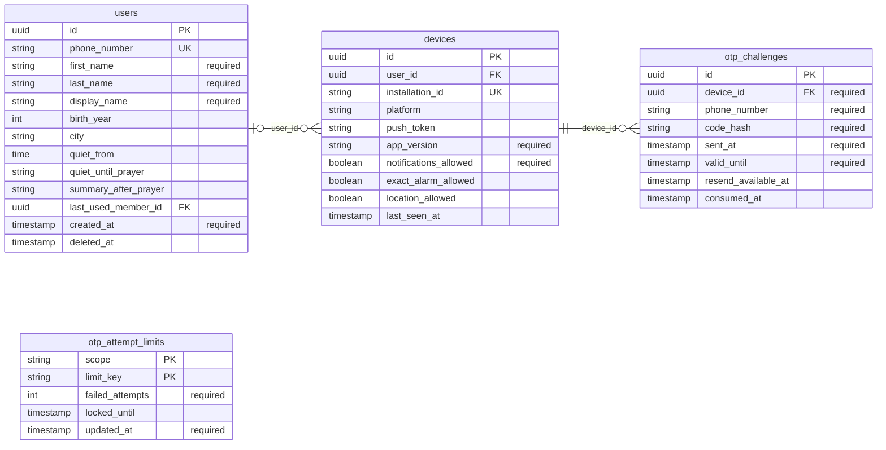
```mermaid
---
config:
  er:
    entityPadding: 5
    minEntityWidth: 60
    minEntityHeight: 30
  flowchart:
    nodeSpacing: 15
    rankSpacing: 25
---
erDiagram
    direction LR
    users {
        uuid id PK
        string phone_number UK
        string first_name "required"
        string last_name "required"
        string display_name "required"
        int birth_year
        string city
        time quiet_from
        string quiet_until_prayer
        string summary_after_prayer
        uuid last_used_member_id FK
        timestamp created_at "required"
        timestamp deleted_at
    }
    devices {
        uuid id PK
        uuid user_id FK
        string installation_id UK
        string platform
        string push_token
        string app_version "required"
        boolean notifications_allowed "required"
        boolean exact_alarm_allowed
        boolean location_allowed
        timestamp last_seen_at
    }
    otp_challenges {
        uuid id PK
        uuid device_id FK "required"
        string phone_number "required"
        string code_hash "required"
        timestamp sent_at "required"
        timestamp valid_until "required"
        timestamp resend_available_at
        timestamp consumed_at
    }
    otp_attempt_limits {
        string scope PK
        string limit_key PK
        int failed_attempts "required"
        timestamp locked_until
        timestamp updated_at "required"
    }
    users |o--o{ devices : user_id
    devices ||--o{ otp_challenges : device_id
```

`otp_attempt_limits` has no foreign key: its `limit_key` is an installation id (when `scope` is `DEVICE`) or a phone number (when `scope` is `PHONE_NUMBER`), and a lock on a phone number has no device at all.

Links to tables in other areas:

| Column | Points to |
| --- | --- |
| `users.last_used_member_id` | `circle_members` |

Notes on columns:

| Table | Column | Note |
| --- | --- | --- |
| `users` | `phone_number` | with country code (+966); emptied when the account is deleted |
| `users` | `first_name`, `last_name` | required; `display_name` is the name the family sees, by default the first name and the last name together |
| `users` | `city` | the user's own city, picked from the list of Saudi cities; it is used only for his quiet-time prayers (BR36) |
| `users` | `quiet_from` | default 23:00 |
| `users` | `quiet_until_prayer` | default fajr |
| `users` | `summary_after_prayer` | default isha |
| `users` | `last_used_member_id` | the circle the user opened last |
| `users` | `deleted_at` | set when the account is deleted, and the number is removed |
| `devices` | `user_id` | empty until a sign-in succeeds |
| `devices` | `installation_id` | random id made on first launch |
| `devices` | `platform` | ios or android |
| `devices` | `exact_alarm_allowed` | Android only |
| `devices` | `location_allowed` | the GPS permission; asked only on the patient's own phone (BR34) |
| `otp_challenges` | `code_hash` | required, the code itself is never stored |
| `otp_challenges` | `valid_until` | required, sent_at plus 5 minutes |
| `otp_challenges` | `consumed_at` | set when the code is accepted |
| `otp_attempt_limits` | `scope` | required, DEVICE or PHONE_NUMBER |
| `otp_attempt_limits` | `failed_attempts` | required, default 0; the tries left are 3 minus this number, worked out and not stored |
| `otp_attempt_limits` | `locked_until` | empty unless locked: the time of the third wrong code plus 24 hours |

| Table | Class | Priority | What it holds |
| --- | --- | --- | --- |
| `users` | `User` | Must | A person with a phone number. Quiet-time settings live here. |
| `devices` | `Device` | Must | One installation of the app. It holds the push token and the permissions, including the GPS permission. |
| `otp_challenges` | `OtpChallenge` | Must | One four-digit code sent by SMS. |
| `otp_attempt_limits` | `OtpAttemptLimit` | Must | The wrong-code count and the 24-hour lock, one row for each installation id and one for each phone number. |

##### B1. Circles, members, and invitations (1 of 2)

Everything hangs on the circle. The role is stored on the membership, so one person can be a manager in one circle and a viewer in another. The patient's location is not a table: it is five columns of `patients` (`PatientLocation` in the model).

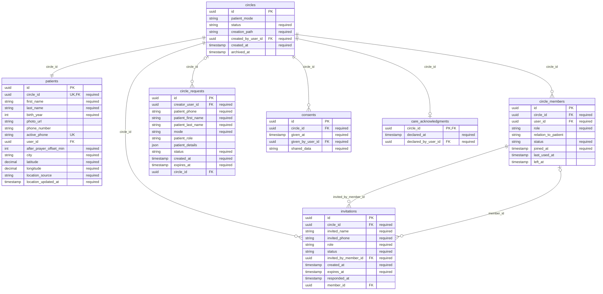
```mermaid
---
config:
  er:
    entityPadding: 5
    minEntityWidth: 60
    minEntityHeight: 30
  flowchart:
    nodeSpacing: 15
    rankSpacing: 25
---
erDiagram
    circles {
        uuid id PK
        string patient_mode
        string status "required"
        string creation_path "required"
        uuid created_by_user_id FK "required"
        timestamp created_at "required"
        timestamp archived_at
    }
    patients {
        uuid id PK
        uuid circle_id UK, FK "required"
        string first_name "required"
        string last_name "required"
        int birth_year "required"
        string photo_url
        string phone_number
        string active_phone UK
        uuid user_id FK
        int after_prayer_offset_min "required"
        string city "required"
        decimal latitude "required"
        decimal longitude "required"
        string location_source "required"
        timestamp location_updated_at "required"
    }
    circle_members {
        uuid id PK
        uuid circle_id FK "required"
        uuid user_id FK "required"
        string role "required"
        string relation_to_patient
        string status "required"
        timestamp joined_at "required"
        timestamp last_used_at
        timestamp left_at
    }
    circle_requests {
        uuid id PK
        uuid creator_user_id FK "required"
        string patient_phone "required"
        string patient_first_name "required"
        string patient_last_name "required"
        string mode "required"
        string patient_role
        json patient_details
        string status "required"
        timestamp created_at "required"
        timestamp expires_at "required"
        uuid circle_id FK
    }
    invitations {
        uuid id PK
        uuid circle_id FK "required"
        string invited_name "required"
        string invited_phone "required"
        string role "required"
        string status "required"
        uuid invited_by_member_id FK "required"
        timestamp created_at "required"
        timestamp expires_at "required"
        timestamp responded_at
        uuid member_id FK
    }
    consents {
        uuid id PK
        uuid circle_id FK "required"
        timestamp given_at "required"
        uuid given_by_user_id FK "required"
        string shared_data "required"
    }
    care_acknowledgments {
        uuid circle_id PK, FK
        timestamp declared_at "required"
        uuid declared_by_user_id FK "required"
    }
    circles ||--|| patients : circle_id
    circles ||--o{ circle_members : circle_id
    circles |o--o{ circle_requests : circle_id
    circles ||--o{ invitations : circle_id
    circle_members ||--o{ invitations : invited_by_member_id
    circle_members |o--o{ invitations : member_id
    circles ||--o{ consents : circle_id
    circles ||--o| care_acknowledgments : circle_id
```

Links to tables in other areas:

| Column | Points to |
| --- | --- |
| `circles.created_by_user_id` | `users` |
| `patients.user_id` | `users` |
| `circle_members.user_id` | `users` |
| `circle_requests.creator_user_id` | `users` |
| `consents.given_by_user_id` | `users` |
| `care_acknowledgments.declared_by_user_id` | `users` |

Notes on columns:

| Table | Column | Note |
| --- | --- | --- |
| `circles` | `patient_mode` | SIMPLIFIED or DETAILED, never changes. Empty only when the patient has no phone (`creation_path` is FOR_OTHER_NO_PHONE), because then nobody uses a patient app |
| `circles` | `status` | required, ACTIVE or ARCHIVED |
| `circles` | `creation_path` | required, FOR_MYSELF, FOR_OTHER_WITH_PHONE or FOR_OTHER_NO_PHONE |
| `circles` | `archived_at` | readable for one year after this |
| `patients` | `circle_id` | required, one patient per circle |
| `patients` | `first_name`, `last_name` | required, typed by the creator; they are never changed by the patient's own account unless someone chooses it (BR39) |
| `patients` | `phone_number` | empty when the patient has no phone |
| `patients` | `active_phone` | copy of phone_number while the circle is active, empty after archiving; unique, so one number is the patient of one active circle only |
| `patients` | `user_id` | the patient's own account, if there is one |
| `patients` | `after_prayer_offset_min` | required, default 20: how long after a prayer "after the prayer" times fall; it belongs to the patient, not to his phone, so it also works when he has none |
| `patients` | `city` | required, the city of the location; used only for prayer times (BR34) |
| `patients` | `latitude`, `longitude` | required, the coordinates of the location, rounded to two decimals in `prayer_times`. For a city picked by hand, the coordinates of that city in the app's list |
| `patients` | `location_source` | required, GPS (read on the patient's own phone) or MANUAL (picked by hand) |
| `patients` | `location_updated_at` | required, when the location was set last |
| `circle_members` | `role` | required, MANAGER, PERFORMER, VIEWER or PATIENT_SIMPLIFIED. The self-manager is a MANAGER whose `user_id` is the patient's `user_id` |
| `circle_members` | `relation_to_patient` | for example son, daughter |
| `circle_members` | `status` | required, ACTIVE, LEFT, REMOVED or APP_STOPPED |
| `circle_requests` | `patient_first_name`, `patient_last_name` | required, typed by the creator |
| `circle_requests` | `mode` | required, SIMPLIFIED or DETAILED |
| `circle_requests` | `patient_role` | MANAGER, PERFORMER or VIEWER for a Detailed patient; empty for a Simplified patient, who is always PATIENT_SIMPLIFIED |
| `circle_requests` | `patient_details` | birth year, photo, and relation typed by the creator. The location is not here: it is set when the patient approves, on his own phone |
| `circle_requests` | `status` | required, WAITING, APPROVED, DECLINED, CANCELLED or EXPIRED |
| `circle_requests` | `expires_at` | required, created_at plus 24 hours |
| `circle_requests` | `circle_id` | set when the request is approved |
| `invitations` | `role` | required, MANAGER, PERFORMER or VIEWER |
| `invitations` | `status` | required, PENDING, ACCEPTED, DECLINED, CANCELLED or EXPIRED |
| `invitations` | `expires_at` | required, created_at plus 7 days |
| `invitations` | `member_id` | set when the invitation is accepted |
| `consents` | `circle_id` | not unique: a later approval or a new consent adds a row, so the history is kept |
| `consents` | `shared_data` | required, list of: medicines, measurements, appointments |
| `care_acknowledgments` | `circle_id` | the key itself: there is at most one declaration per circle |
| `care_acknowledgments` | `declared_by_user_id` | the creator who declared that he looks after a patient with no phone |

| Table | Class | Priority | What it holds |
| --- | --- | --- | --- |
| `circles` | `Circle` | Must | The root of everything: one patient, one circle. The mode is fixed at creation. |
| `patients` | `Patient`, `PatientLocation` | Must | What the creator typed about the patient, and his one location. No phone means no account and no membership. |
| `circle_members` | `CircleMember` | Must | A person's place in one circle, with one of the four stored roles. |
| `circle_requests` | `CircleRequest` | Must | The request that waits up to 24 hours for a patient's approval. |
| `invitations` | `Invitation` | Must | An invitation to a phone number with a role. There is no code. |
| `consents` | `Consent` | Must | The patient's approval of what the circle may see. Used when the patient has a phone. |
| `care_acknowledgments` | `CareAcknowledgment` | Must | The creator's declaration for a patient with no phone. Used instead of a consent. |

##### B2. The escalation order, the patient's phone, and the medical file (2 of 2)

These tables hang on the patient and the circle members of the first diagram. The order of escalation is arranged by the managers; the phone settings, the phone status, and the medical file belong to the patient. The emergency contacts are part of the medical file.

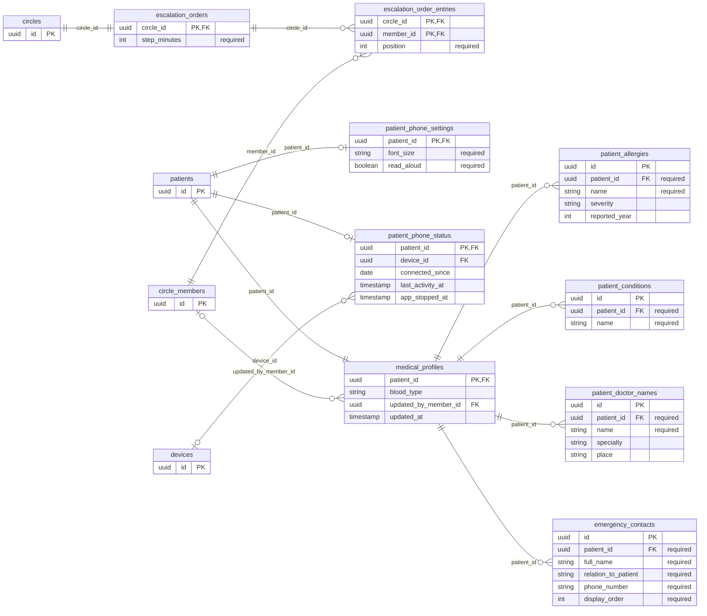
```mermaid
---
config:
  er:
    entityPadding: 5
    minEntityWidth: 60
    minEntityHeight: 30
  flowchart:
    nodeSpacing: 15
    rankSpacing: 25
---
erDiagram
    direction LR
    escalation_orders {
        uuid circle_id PK, FK
        int step_minutes "required"
    }
    escalation_order_entries {
        uuid circle_id PK, FK
        uuid member_id PK, FK
        int position "required"
    }
    patient_phone_settings {
        uuid patient_id PK, FK
        string font_size "required"
        boolean read_aloud "required"
    }
    patient_phone_status {
        uuid patient_id PK, FK
        uuid device_id FK
        date connected_since
        timestamp last_activity_at
        timestamp app_stopped_at
    }
    medical_profiles {
        uuid patient_id PK, FK
        string blood_type
        uuid updated_by_member_id FK
        timestamp updated_at
    }
    patient_allergies {
        uuid id PK
        uuid patient_id FK "required"
        string name "required"
        string severity
        int reported_year
    }
    patient_conditions {
        uuid id PK
        uuid patient_id FK "required"
        string name "required"
    }
    patient_doctor_names {
        uuid id PK
        uuid patient_id FK "required"
        string name "required"
        string specialty
        string place
    }
    emergency_contacts {
        uuid id PK
        uuid patient_id FK "required"
        string full_name "required"
        string relation_to_patient "required"
        string phone_number "required"
        int display_order "required"
    }
    circles {
        uuid id PK
    }
    patients {
        uuid id PK
    }
    circle_members {
        uuid id PK
    }
    devices {
        uuid id PK
    }
    circles ||--|| escalation_orders : circle_id
    escalation_orders ||--o{ escalation_order_entries : circle_id
    circle_members ||--o{ escalation_order_entries : member_id
    patients ||--o| patient_phone_settings : patient_id
    patients ||--o| patient_phone_status : patient_id
    devices |o--o{ patient_phone_status : device_id
    patients ||--|| medical_profiles : patient_id
    circle_members |o--o{ medical_profiles : updated_by_member_id
    medical_profiles ||--o{ patient_allergies : patient_id
    medical_profiles ||--o{ patient_conditions : patient_id
    medical_profiles ||--o{ patient_doctor_names : patient_id
    medical_profiles ||--o{ emergency_contacts : patient_id
```

In the diagram, `circles`, `patients`, `circle_members`, and `devices` are drawn with their key only, because their columns are in diagrams A and B1. The four child tables of the medical file use `patient_id` as the foreign key to `medical_profiles`, whose own key is `patient_id`.

Notes on columns:

| Table | Column | Note |
| --- | --- | --- |
| `escalation_orders` | `circle_id` | one order per circle |
| `escalation_orders` | `step_minutes` | required, default 20 |
| `escalation_order_entries` | `position` | required, unique within the circle |
| `patient_phone_settings` | `font_size` | required, SMALL, MEDIUM or LARGE |
| `patient_phone_settings` | `read_aloud` | required, default false |
| `patient_phone_status` | `device_id` | the installation on the patient's phone; empty until he signs in |
| `patient_phone_status` | `connected_since` | the day the patient first signed in on that phone |
| `patient_phone_status` | `last_activity_at` | the last time the app on that phone talked to the server |
| `patient_phone_status` | `app_stopped_at` | set when a manager stops the app on the phone |
| `patient_allergies` | `name` | the substance, typed |
| `patient_allergies` | `severity` | MILD, MODERATE or SEVERE |
| `patient_allergies` | `reported_year` | the year the allergy was found, if known |
| `emergency_contacts` | `relation_to_patient` | required, for example son, neighbour |
| `emergency_contacts` | `phone_number` | required, plain text: the app does not call it and sends nothing to it (BR33) |
| `emergency_contacts` | `display_order` | required, the order on the emergency card; unique within the patient |

| Table | Class | Priority | What it holds |
| --- | --- | --- | --- |
| `escalation_orders` | `EscalationOrder` | Must | The order in which members are told about an urgent alert. |
| `escalation_order_entries` | `EscalationEntry` | Must | One member's place in the order. Only Manager and Performer members can be listed (the self-manager is a Manager). |
| `patient_phone_settings` | `PatientPhoneSettings` | Should | Font size and read-aloud. Only for a Simplified circle whose patient has a phone. A manager sets it. |
| `patient_phone_status` | `PatientPhoneStatus` | Should | Whether and when the patient's phone is connected, and whether a manager stopped the app on it. |
| `medical_profiles` | `MedicalProfile` | Should | The medical file. It feeds the visit sheet, the emergency card, and the care record export. |
| `patient_allergies` | `Allergy` | Should | Allergies in the medical file. |
| `patient_conditions` | `MedicalProfile` | Should | Chronic conditions in the medical file. |
| `patient_doctor_names` | `Doctor` | Should | Doctors as typed names. There are no doctor accounts. |
| `emergency_contacts` | `EmergencyContact` | Should | A typed name, a relation, and a phone number, in order. The emergency card shows them as plain text. |

##### C. Care plan

A medicine, a measurement plan, and an appointment are all care plan items. Joined-table inheritance keeps the shared columns in one table and the extra columns in one table per kind. An appointment is a series (`appointments`) that has dated occurrences (`appointment_occurrences`); the companion and the visit belong to one occurrence, not to the series. The stock of a medicine is not a column: it is worked out from `stock_additions`.


```mermaid
---
config:
  er:
    entityPadding: 5
    minEntityWidth: 60
    minEntityHeight: 30
  flowchart:
    nodeSpacing: 15
    rankSpacing: 25
---
erDiagram
    direction LR
    care_plan_items {
        uuid id PK
        uuid circle_id FK "required"
        string kind "required"
        string title "required"
        string ordered_by
        date starts_on "required"
        date ends_on
        string status "required"
        string priority
        int max_lateness_min
        string performer_mode
        uuid performer_member_id FK
        int repeat_every_min
        uuid created_by_member_id FK "required"
        timestamp created_at "required"
    }
    medications {
        uuid item_id PK, FK
        string scientific_name
        string strength
        decimal dose_value "required"
        string dose_unit "required"
        string meal_relation
        int duration_days
        string instruction_icons
        string photo_url
        decimal low_stock_value
        string low_stock_unit
    }
    measurement_plans {
        uuid item_id PK, FK
        string type "required"
        string context "required"
        decimal range_primary_lower
        decimal range_primary_upper
        decimal range_secondary_lower
        decimal range_secondary_upper
        string range_unit
        string range_ordered_by
    }
    appointments {
        uuid item_id PK, FK
        string appointment_kind "required"
        timestamp series_starts_at "required"
        string place
        string repeat_rule "required"
        string preparation
    }
    appointment_occurrences {
        uuid id PK
        uuid appointment_id FK "required"
        timestamp starts_at "required"
        string status "required"
        uuid companion_member_id FK
        timestamp asked_circle_at
    }
    time_slots {
        uuid id PK
        uuid item_id FK "required"
        string kind "required"
        string prayer
        time exact_time
        string days_of_week
    }
    medication_changes {
        uuid id PK
        uuid medication_id FK "required"
        string kind "required"
        decimal previous_dose_value "required"
        string previous_dose_unit "required"
        decimal new_dose_value
        string new_dose_unit
        string ordered_by "required"
        string reason
        timestamp effective_from "required"
        uuid made_by_member_id FK "required"
        timestamp made_at "required"
        uuid visit_id FK
    }
    stock_additions {
        uuid id PK
        uuid medication_id FK "required"
        string kind "required"
        decimal quantity_value "required"
        string quantity_unit "required"
        date added_on "required"
        uuid recorded_by_member_id FK "required"
        timestamp created_at "required"
    }
    visits {
        uuid id PK
        uuid occurrence_id UK, FK "required"
        date visit_date "required"
        string status "required"
        string notes
        string voice_note_url
        string report_photo_urls
        timestamp saved_at
        uuid saved_by_member_id FK
        timestamp companion_rights_until
    }
    care_plan_items ||--o| medications : item_id
    care_plan_items ||--o| measurement_plans : item_id
    care_plan_items ||--o| appointments : item_id
    care_plan_items ||--o{ time_slots : item_id
    appointments ||--o{ appointment_occurrences : appointment_id
    appointment_occurrences ||--o| visits : occurrence_id
    medications ||--o{ medication_changes : medication_id
    visits |o--o{ medication_changes : visit_id
    medications ||--o{ stock_additions : medication_id
```

Links to tables in other areas:

| Column | Points to |
| --- | --- |
| `care_plan_items.circle_id` | `circles` |
| `care_plan_items.performer_member_id` | `circle_members` |
| `care_plan_items.created_by_member_id` | `circle_members` |
| `appointment_occurrences.companion_member_id` | `circle_members` |
| `medication_changes.made_by_member_id` | `circle_members` |
| `stock_additions.recorded_by_member_id` | `circle_members` |
| `visits.saved_by_member_id` | `circle_members` |

Notes on columns:

| Table | Column | Note |
| --- | --- | --- |
| `care_plan_items` | `kind` | required, MEDICATION, MEASUREMENT_PLAN or APPOINTMENT |
| `care_plan_items` | `title` | required, the name the family uses |
| `care_plan_items` | `ordered_by` | the doctor's name, as text |
| `care_plan_items` | `status` | required, ACTIVE or STOPPED |
| `care_plan_items` | `priority` | CRITICAL, NORMAL or OPTIONAL |
| `care_plan_items` | `max_lateness_min` | set by the manager |
| `care_plan_items` | `performer_mode` | PATIENT_SELF, SPECIFIC_MEMBER or ANYONE_IN_CIRCLE |
| `care_plan_items` | `performer_member_id` | used when the performer is a specific member |
| `care_plan_items` | `repeat_every_min` | default 10 |
| `medications` | `strength` | for example 5 mg |
| `medications` | `dose_value`, `dose_unit` | required, the base dose, for example 0.5 and `tablet`, or 5 and `ml` |
| `medications` | `meal_relation` | BEFORE, WITH, AFTER or NO_MATTER |
| `medications` | `duration_days` | empty means continuous |
| `medications` | `instruction_icons` | list, for example HALF_PILL |
| `medications` | `low_stock_value`, `low_stock_unit` | the level at which the family is told that the medicine is running low; both set or both empty. The app suggests 5 tablets |
| `measurement_plans` | `type` | required, SUGAR or PRESSURE |
| `measurement_plans` | `context` | required, FASTING, AFTER_MEAL or ANY |
| `measurement_plans` | `range_primary_lower`, `range_primary_upper` | the doctor's range for sugar, or for the top pressure number, entered by a manager |
| `measurement_plans` | `range_secondary_lower`, `range_secondary_upper` | the range of the bottom pressure number |
| `measurement_plans` | `range_unit` | for example mg/dL or mmHg; set whenever a range is set |
| `measurement_plans` | `range_ordered_by` | the doctor who set the range, as text |
| `appointments` | `appointment_kind` | required, DOCTOR_VISIT, LAB_TEST, THERAPY or OTHER |
| `appointments` | `series_starts_at` | required, the first date and time of the series |
| `appointments` | `repeat_rule` | required, NONE, WEEKLY, MONTHLY or CUSTOM |
| `appointments` | `preparation` | for example fasting from Isha |
| `appointment_occurrences` | `starts_at` | required, one date and time; it can be moved without moving the series |
| `appointment_occurrences` | `status` | required, SCHEDULED, DONE or CANCELLED |
| `appointment_occurrences` | `companion_member_id` | empty when nobody goes with the patient on that date |
| `appointment_occurrences` | `asked_circle_at` | set when the circle is asked to volunteer for that date |
| `time_slots` | `item_id` | required, a medicine or a measurement plan |
| `time_slots` | `kind` | required, PRAYER or FIXED_TIME |
| `time_slots` | `prayer` | FAJR, DHUHR, ASR, MAGHRIB or ISHA |
| `time_slots` | `days_of_week` | default every day |
| `medication_changes` | `kind` | required, DOSE_CHANGE or STOP |
| `medication_changes` | `previous_dose_value`, `previous_dose_unit` | required, the dose before the change |
| `medication_changes` | `new_dose_value`, `new_dose_unit` | empty for a stop |
| `medication_changes` | `ordered_by` | required, a name as text |
| `medication_changes` | `visit_id` | set when the change was made at a visit |
| `stock_additions` | `kind` | required, BOX_ADDED (a new box) or RECOUNT (the family counted what is left) |
| `stock_additions` | `quantity_value`, `quantity_unit` | required, in the unit of the medicine, for example 28 tablet. For a BOX_ADDED it is the content of the box; for a RECOUNT it is what was counted |
| `stock_additions` | `added_on` | required, the date of the box or of the count |
| `stock_additions` | `created_at` | required, when the row was saved; it orders two rows of the same day and tells which doses were taken after a count |
| `visits` | `occurrence_id` | required and unique: one visit record for one occurrence |
| `visits` | `status` | required, PLANNED or SAVED |
| `visits` | `report_photo_urls` | list |
| `visits` | `companion_rights_until` | the earlier of saving the visit and 24 hours |

| Table | Class | Priority | What it holds |
| --- | --- | --- | --- |
| `care_plan_items` | `CarePlanItem`, `ScheduledItem` | Must | One row for every medicine, measurement plan, and appointment. The columns from priority to repeat_every_min belong to the ScheduledItem layer and are empty for an appointment. |
| `medications` | `Medication`, `MedicationQuantity` | Must | The extra columns of a medicine. It shares its id with care_plan_items. There is no "pills in the box" column. |
| `measurement_plans` | `MeasurementPlan`, `TargetRange` | Must | The extra columns of a measurement plan, with the doctor's range. |
| `appointments` | `Appointment` | Must | The extra columns of an appointment series. |
| `appointment_occurrences` | `AppointmentOccurrence` | Must | One dated visit of a series, with its own status and companion. |
| `time_slots` | `TimeSlot` | Must | One time of day: a prayer period or a fixed hour. |
| `medication_changes` | `MedicationChange` | Must | A dose change or a stop. Together they form the previous medicines list. |
| `stock_additions` | `StockAddition` | Should | A new box, or a count of what is left. Rows are only added, never edited. The remaining stock and the supply forecast are worked out from them. |
| `visits` | `Visit` | Should | What the doctor said at one occurrence. The companion may edit it until it is saved, or for 24 hours. |

##### D. Tasks and handoffs

A task is one thing to do at one time. Assignments keep the full history of who was asked, what they answered, and whether they finished. There is no errand task: a card that cannot be done is given, as the same card, to another member through an assignment.

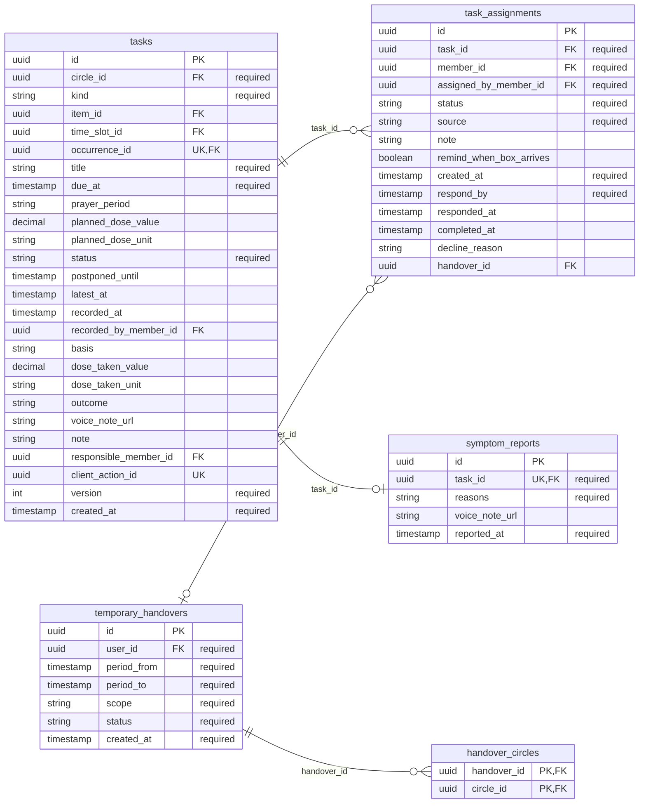
```mermaid
---
config:
  er:
    entityPadding: 5
    minEntityWidth: 60
    minEntityHeight: 30
  flowchart:
    nodeSpacing: 15
    rankSpacing: 25
---
erDiagram
    direction LR
    tasks {
        uuid id PK
        uuid circle_id FK "required"
        string kind "required"
        uuid item_id FK
        uuid time_slot_id FK
        uuid occurrence_id UK, FK
        string title "required"
        timestamp due_at "required"
        string prayer_period
        decimal planned_dose_value
        string planned_dose_unit
        string status "required"
        timestamp postponed_until
        timestamp latest_at
        timestamp recorded_at
        uuid recorded_by_member_id FK
        string basis
        decimal dose_taken_value
        string dose_taken_unit
        string outcome
        string voice_note_url
        string note
        uuid responsible_member_id FK
        uuid client_action_id UK
        int version "required"
        timestamp created_at "required"
    }
    task_assignments {
        uuid id PK
        uuid task_id FK "required"
        uuid member_id FK "required"
        uuid assigned_by_member_id FK "required"
        string status "required"
        string source "required"
        string note
        boolean remind_when_box_arrives
        timestamp created_at "required"
        timestamp respond_by "required"
        timestamp responded_at
        timestamp completed_at
        string decline_reason
        uuid handover_id FK
    }
    temporary_handovers {
        uuid id PK
        uuid user_id FK "required"
        timestamp period_from "required"
        timestamp period_to "required"
        string scope "required"
        string status "required"
        timestamp created_at "required"
    }
    handover_circles {
        uuid handover_id PK, FK
        uuid circle_id PK, FK
    }
    symptom_reports {
        uuid id PK
        uuid task_id UK, FK "required"
        string reasons "required"
        string voice_note_url
        timestamp reported_at "required"
    }
    tasks ||--o{ task_assignments : task_id
    temporary_handovers |o--o{ task_assignments : handover_id
    temporary_handovers ||--o{ handover_circles : handover_id
    tasks ||--o| symptom_reports : task_id
```

Links to tables in other areas:

| Column | Points to |
| --- | --- |
| `tasks.circle_id` | `circles` |
| `tasks.item_id` | `care_plan_items` |
| `tasks.time_slot_id` | `time_slots` |
| `tasks.occurrence_id` | `appointment_occurrences` |
| `tasks.recorded_by_member_id` | `circle_members` |
| `tasks.responsible_member_id` | `circle_members` |
| `task_assignments.member_id` | `circle_members` |
| `task_assignments.assigned_by_member_id` | `circle_members` |
| `temporary_handovers.user_id` | `users` |
| `handover_circles.circle_id` | `circles` |

Notes on columns:

| Table | Column | Note |
| --- | --- | --- |
| `tasks` | `kind` | required, DOSE, MEASUREMENT or APPOINTMENT |
| `tasks` | `item_id` | the medicine or measurement plan that generated it; empty for an appointment task |
| `tasks` | `time_slot_id` | the slot that generated it; empty for an appointment task |
| `tasks` | `occurrence_id` | set on an appointment task: the dated occurrence it stands for. Unique, so an occurrence has one task |
| `tasks` | `prayer_period` | FAJR, DHUHR, ASR, MAGHRIB or ISHA |
| `tasks` | `planned_dose_value`, `planned_dose_unit` | copied from the plan when the task is made, so a later dose change never rewrites the past (BR14) |
| `tasks` | `status` | required, PENDING, DONE, COULD_NOT or MISSED. A COULD_NOT or MISSED task can still become DONE when someone records it late |
| `tasks` | `latest_at` | due_at plus the maximum lateness |
| `tasks` | `recorded_at` | when the task was really done, can be edited |
| `tasks` | `basis` | BY_PERFORMER, GAVE_MYSELF, HE_TOLD_ME or DID_NOT_TAKE |
| `tasks` | `dose_taken_value`, `dose_taken_unit` | what was really taken, when it differs from the plan |
| `tasks` | `outcome` | the choice under I won't take it |
| `tasks` | `responsible_member_id` | the member responsible now |
| `tasks` | `client_action_id` | guards against a repeated offline record |
| `tasks` | `version` | required, default 1 |
| `task_assignments` | `member_id` | required, who receives the card |
| `task_assignments` | `status` | required, WAITING, ACCEPTED, DECLINED, EXPIRED, REASSIGNED, CANCELLED or COMPLETED |
| `task_assignments` | `source` | required, DIRECT or HANDOVER |
| `task_assignments` | `remind_when_box_arrives` | the switch of "who brings it?" |
| `task_assignments` | `respond_by` | required, created_at plus 30 minutes |
| `task_assignments` | `completed_at` | set when the accepted person says he did his part ("Sara brought it, 6:10"); the card itself does not change |
| `task_assignments` | `handover_id` | set when it came from a temporary handover |
| `temporary_handovers` | `user_id` | required, who asks |
| `temporary_handovers` | `scope` | required, ALL_CIRCLES or ONE_CIRCLE |
| `temporary_handovers` | `status` | required, DRAFT, REQUESTED, ACTIVE or ENDED |
| `symptom_reports` | `reasons` | required, list: DIZZINESS, STOMACH_PAIN, TIREDNESS, NAUSEA, DESCRIBED_BY_VOICE |

| Table | Class | Priority | What it holds |
| --- | --- | --- | --- |
| `tasks` | `Task` | Must | One scheduled dose, measurement, or appointment on one day. It holds what was recorded and by whom. |
| `task_assignments` | `TaskAssignment` | Must | Giving the same card to a person. It keeps accepted, declined, expired, and finished requests as history. |
| `temporary_handovers` | `TemporaryHandover` | Should | "I'm busy": a period during which someone hands over tasks. |
| `handover_circles` | `TemporaryHandover` | Should | The circles a handover covers. |
| `symptom_reports` | `SymptomReport` | Should | The reasons a patient gives when a medicine bothers them. |

##### E. Alerts

An alert is always about something: a task, a reading, a side-effect report, or a medicine. Each of the three tables has four optional links for that, and a check that at most one is set.

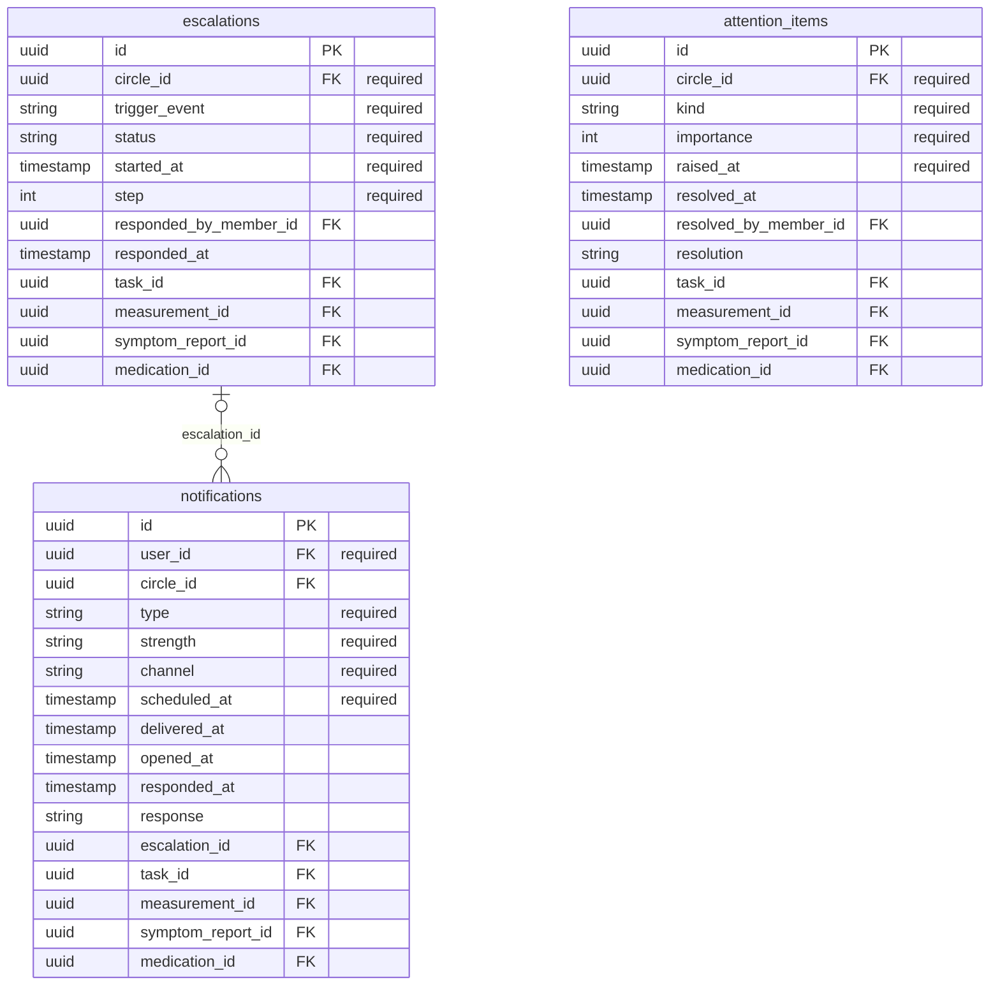
```mermaid
---
config:
  er:
    entityPadding: 5
    minEntityWidth: 60
    minEntityHeight: 30
  flowchart:
    nodeSpacing: 15
    rankSpacing: 25
---
erDiagram
    notifications {
        uuid id PK
        uuid user_id FK "required"
        uuid circle_id FK
        string type "required"
        string strength "required"
        string channel "required"
        timestamp scheduled_at "required"
        timestamp delivered_at
        timestamp opened_at
        timestamp responded_at
        string response
        uuid escalation_id FK
        uuid task_id FK
        uuid measurement_id FK
        uuid symptom_report_id FK
        uuid medication_id FK
    }
    escalations {
        uuid id PK
        uuid circle_id FK "required"
        string trigger_event "required"
        string status "required"
        timestamp started_at "required"
        int step "required"
        uuid responded_by_member_id FK
        timestamp responded_at
        uuid task_id FK
        uuid measurement_id FK
        uuid symptom_report_id FK
        uuid medication_id FK
    }
    attention_items {
        uuid id PK
        uuid circle_id FK "required"
        string kind "required"
        int importance "required"
        timestamp raised_at "required"
        timestamp resolved_at
        uuid resolved_by_member_id FK
        string resolution
        uuid task_id FK
        uuid measurement_id FK
        uuid symptom_report_id FK
        uuid medication_id FK
    }
    escalations |o--o{ notifications : escalation_id
```

Links to tables in other areas:

| Column | Points to |
| --- | --- |
| `notifications.user_id` | `users` |
| `notifications.circle_id` | `circles` |
| `notifications.task_id` | `tasks` |
| `notifications.measurement_id` | `measurements` |
| `notifications.symptom_report_id` | `symptom_reports` |
| `notifications.medication_id` | `medications` |
| `escalations.circle_id` | `escalation_orders` |
| `escalations.responded_by_member_id` | `circle_members` |
| `escalations.task_id` | `tasks` |
| `escalations.measurement_id` | `measurements` |
| `escalations.symptom_report_id` | `symptom_reports` |
| `escalations.medication_id` | `medications` |
| `attention_items.circle_id` | `circles` |
| `attention_items.resolved_by_member_id` | `circle_members` |
| `attention_items.task_id` | `tasks` |
| `attention_items.measurement_id` | `measurements` |
| `attention_items.symptom_report_id` | `symptom_reports` |
| `attention_items.medication_id` | `medications` |

Notes on columns:

| Table | Column | Note |
| --- | --- | --- |
| `notifications` | `user_id` | required, who it is sent to |
| `notifications` | `circle_id` | empty for alerts about a circle request |
| `notifications` | `type` | required, for example DOSE_DUE or DOSE_MISSED |
| `notifications` | `strength` | required, NORMAL, HIGH or VERY_HIGH |
| `notifications` | `channel` | required, LOCAL_SCHEDULED or PUSH |
| `notifications` | `responded_at` | set only by an action or by recording the task |
| `notifications` | `response` | I_WILL_HANDLE_IT or LOG_FOR_HIM |
| `notifications` | `escalation_id` | set when it is a step of an escalation |
| `notifications` | `task_id` | subject |
| `notifications` | `measurement_id` | subject |
| `notifications` | `symptom_report_id` | subject |
| `notifications` | `medication_id` | subject |
| `escalations` | `circle_id` | required, the order it follows |
| `escalations` | `trigger_event` | required, for example MISSED_CRITICAL_DOSE or HELP_BUTTON |
| `escalations` | `status` | required, RUNNING, RESPONDED or EXHAUSTED |
| `escalations` | `step` | required, default 1 |
| `escalations` | `task_id` | subject |
| `escalations` | `measurement_id` | subject |
| `escalations` | `symptom_report_id` | subject |
| `escalations` | `medication_id` | subject |
| `attention_items` | `kind` | required, for example COULD_NOT_DO or NO_COMPANION |
| `attention_items` | `importance` | required, the most important is shown first |
| `attention_items` | `resolution` | COMPLETED, REASSIGNED or ADDED_TO_VISIT_SHEET |
| `attention_items` | `task_id` | subject |
| `attention_items` | `measurement_id` | subject |
| `attention_items` | `symptom_report_id` | subject |
| `attention_items` | `medication_id` | subject |

| Table | Class | Priority | What it holds |
| --- | --- | --- | --- |
| `notifications` | `Notification` | Must | One alert to one user. The columns task_id to medication_id are the AlertSubject: at most one of them is set. |
| `escalations` | `Escalation` | Must | One run of alerts for an urgent event. |
| `attention_items` | `AttentionItem` | Must | A line in needs your attention. It stays until someone completes or reassigns it. |

##### F. Records

These tables hold what was recorded. The adherence report, the visit sheet, the emergency card, and the care record export are never stored: they are worked out from these tables and from the medical file when asked.

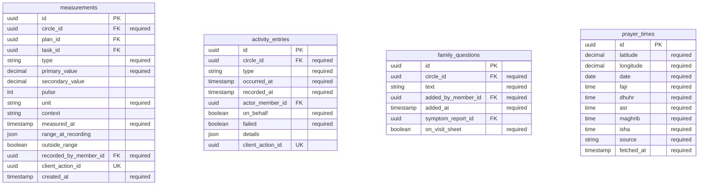
```mermaid
---
config:
  er:
    entityPadding: 5
    minEntityWidth: 60
    minEntityHeight: 30
  flowchart:
    nodeSpacing: 15
    rankSpacing: 25
---
erDiagram
    measurements {
        uuid id PK
        uuid circle_id FK "required"
        uuid plan_id FK
        uuid task_id FK
        string type "required"
        decimal primary_value "required"
        decimal secondary_value
        int pulse
        string unit "required"
        string context
        timestamp measured_at "required"
        json range_at_recording
        boolean outside_range
        uuid recorded_by_member_id FK "required"
        uuid client_action_id UK
        timestamp created_at "required"
    }
    activity_entries {
        uuid id PK
        uuid circle_id FK "required"
        string type "required"
        timestamp occurred_at "required"
        timestamp recorded_at "required"
        uuid actor_member_id FK
        boolean on_behalf "required"
        boolean failed "required"
        json details
        uuid client_action_id UK
    }
    family_questions {
        uuid id PK
        uuid circle_id FK "required"
        string text "required"
        uuid added_by_member_id FK "required"
        timestamp added_at "required"
        uuid symptom_report_id FK
        boolean on_visit_sheet "required"
    }
    prayer_times {
        uuid id PK
        decimal latitude "required"
        decimal longitude "required"
        date date "required"
        time fajr "required"
        time dhuhr "required"
        time asr "required"
        time maghrib "required"
        time isha "required"
        string source "required"
        timestamp fetched_at "required"
    }
```

Links to tables in other areas:

| Column | Points to |
| --- | --- |
| `measurements.circle_id` | `circles` |
| `measurements.plan_id` | `measurement_plans` |
| `measurements.task_id` | `tasks` |
| `measurements.recorded_by_member_id` | `circle_members` |
| `activity_entries.circle_id` | `circles` |
| `activity_entries.actor_member_id` | `circle_members` |
| `family_questions.circle_id` | `circles` |
| `family_questions.added_by_member_id` | `circle_members` |
| `family_questions.symptom_report_id` | `symptom_reports` |

`prayer_times` has no foreign key. It is found by coordinates and date, so one row serves every patient who lives in the same place.

Notes on columns:

| Table | Column | Note |
| --- | --- | --- |
| `measurements` | `plan_id` | the measurement plan it follows, if any |
| `measurements` | `task_id` | the task it fulfils, if any |
| `measurements` | `type` | required, SUGAR or PRESSURE |
| `measurements` | `primary_value` | required, sugar or the top pressure number |
| `measurements` | `secondary_value` | the bottom pressure number |
| `measurements` | `context` | FASTING, AFTER_MEAL or ANY |
| `measurements` | `measured_at` | required, the original time |
| `measurements` | `range_at_recording` | a copy of the target range (the lower and upper numbers, the unit, and who ordered it) that applied when the reading was saved; empty when there was no range (BR37) |
| `measurements` | `outside_range` | stored flag, set when the reading is saved by comparing it with `range_at_recording`, so a later change of the range never recolours it |
| `measurements` | `client_action_id` | guards against a repeated offline record |
| `activity_entries` | `type` | required, for example DOSE_RECORDED; the 13 types are in Section 3.1.9 |
| `activity_entries` | `occurred_at` | required, when it happened |
| `activity_entries` | `recorded_at` | required, when the server saved it |
| `activity_entries` | `actor_member_id` | empty when the system did it |
| `activity_entries` | `on_behalf` | required, default false |
| `activity_entries` | `failed` | required, default false |
| `activity_entries` | `client_action_id` | guards against a repeated offline record |
| `family_questions` | `symptom_report_id` | set when it comes from a side-effect report |
| `family_questions` | `on_visit_sheet` | required, default true |
| `prayer_times` | `latitude`, `longitude` | required, rounded to two decimals (about one kilometre) before the lookup, so the cache stays small and nobody's exact position is kept |
| `prayer_times` | `source` | required, ONLINE, CACHED or OFFLINE_CALCULATION |

| Table | Class | Priority | What it holds |
| --- | --- | --- | --- |
| `measurements` | `Measurement`, `TargetRange` (copy) | Must | A sugar or blood-pressure reading with its original time and the range that applied when it was saved. |
| `activity_entries` | `ActivityEntry` | Must | One line of the activity log. |
| `family_questions` | `FamilyQuestion` | Should | A question for the doctor. It goes to the visit sheet. |
| `prayer_times` | `PrayerTimes` | Must | The five prayer times for one place and one day, cached. |

#### 3.2.3 Constraints, enumerations, and indexes

| Item | Rule |
| --- | --- |
| One patient per circle | `patients.circle_id` is unique. |
| One number, one patient circle | `patients.active_phone` is unique. It holds the patient's number while the circle is active and is emptied when the circle is archived, so an archived circle does not block a new one. Circles with no number leave it empty (BR1). |
| One open request per number | A unique partial index on `circle_requests(patient_phone)` where `status` is `WAITING`. |
| Unique members | `circle_members` is unique on (`circle_id`, `user_id`). A person who left and is invited again gets their old row back with `status` set to `ACTIVE` and the new role. |
| One open invitation per person | A unique partial index on `invitations(circle_id, invited_phone)` where `status` is `PENDING`. A person who is already an active member cannot be invited (checked by the service). |
| The mode never changes | No route updates `circles.patient_mode`, and a database trigger rejects any change (BR2). A `CHECK` says that `patient_mode` is empty if and only if `creation_path` is `FOR_OTHER_NO_PHONE`. |
| Consent or declaration by creation path | The service creates a `consents` row when a request for a patient with a phone is approved, and a `care_acknowledgments` row when a circle for a patient with no phone is made. A circle for myself has neither (BR26). `care_acknowledgments.circle_id` is its own primary key, so there is at most one declaration. |
| The patient's role | `circle_requests.patient_role` is empty when `mode` is `SIMPLIFIED` and one of MANAGER, PERFORMER or VIEWER when it is `DETAILED` (a `CHECK`). The member row of a Simplified patient has the role `PATIENT_SIMPLIFIED`, and no other row may have it. |
| At least one manager | The service counts the active managers inside the same transaction as a leave or a removal, and archives the circle in that transaction when the last manager leaves (BR7). |
| Order of escalation | `escalation_order_entries` is unique on (`circle_id`, `position`). The service accepts only Manager and Performer members (BR13). |
| Emergency contacts | `emergency_contacts` is unique on (`patient_id`, `display_order`). It holds plain text only; no other table points to it. |
| The patient's location | `patients.city`, `latitude`, `longitude`, `location_source`, and `location_updated_at` are `NOT NULL`. A `CHECK` limits `location_source` to GPS and MANUAL, latitude to -90..90, and longitude to -180..180. Nothing keeps a history of locations (BR34). |
| Plan item columns | A `CHECK` on `care_plan_items`: `priority`, `max_lateness_min`, `performer_mode`, and `repeat_every_min` are all set when `kind` is not `APPOINTMENT`, and all empty when it is. `performer_member_id` is required when `performer_mode` is `SPECIFIC_MEMBER`. |
| One owner per subtype row | `medications.item_id`, `measurement_plans.item_id`, and `appointments.item_id` are the primary key and also point to `care_plan_items.id`. The service keeps the `kind` consistent. |
| Quantities in pairs | For every `_value` and `_unit` pair (dose, planned dose, dose taken, low-stock level, stock entries, previous and new dose), a `CHECK` says that both are set or both are empty. Where the value is `required`, so is the unit. |
| Range columns | A `CHECK` on `measurement_plans`: when any of the four range numbers is set, `range_unit` is set, and each lower number is not above its upper number. |
| Time slot shape | A `CHECK` on `time_slots`: when `kind` is `PRAYER`, `prayer` is set and `exact_time` is empty; when it is `FIXED_TIME`, the reverse. |
| No duplicate tasks | `tasks` is unique on (`time_slot_id`, `due_at`) and on `occurrence_id`, so generating tasks twice does not create copies. A `CHECK` says that a DOSE or MEASUREMENT task has `item_id` and `time_slot_id` and no `occurrence_id`, and an APPOINTMENT task has `occurrence_id` and neither of the others. |
| One visit per occurrence | `visits.occurrence_id` is unique. |
| Safe concurrent updates | `tasks.version` increases on every change; an update that uses an old version is rejected (BR8). |
| One open assignment per task | A unique partial index on `task_assignments(task_id)` where `status` is `WAITING` or `ACCEPTED`. A `COMPLETED` assignment is history and does not block a new one. |
| Offline duplicates | `client_action_id` is unique in `tasks`, `measurements`, and `activity_entries`; a repeated id is ignored (BR8). |
| One subject per alert | A `CHECK` on `notifications`, `escalations`, and `attention_items`: at most one of `task_id`, `measurement_id`, `symptom_report_id`, and `medication_id` is set. |
| Sign-in locks | `otp_attempt_limits` has the primary key (`scope`, `limit_key`): one row for each installation id and one for each phone number. `scope` is limited to DEVICE and PHONE_NUMBER (BR22). The row is not deleted by signing out or reinstalling, because it hangs on the installation id and the number, not on a session. |
| Prayer-time cache | `prayer_times` is unique on (`latitude`, `longitude`, `date`), after the coordinates are rounded to two decimals. |
| Stock entries are never edited | `stock_additions` rows are only inserted (BR14, BR21). A wrong count is corrected by a new `RECOUNT`. |
| Required fields | Columns marked `required` in the diagrams are `NOT NULL`. (`users.phone_number` is not marked, because it is emptied when an account is deleted.) A reading always has a `primary_value`; a missing reading is simply a missing row, so charts show a gap instead of a zero. |
| Nothing is deleted | There is no delete route for medicines, tasks, readings, stock entries, or log entries. A medicine is stopped, and an account that is deleted loses its number (`users.phone_number` is emptied and `deleted_at` is set) while the records stay. |
| Not stored (worked out) | The eight card statuses of a task, the adherence calendar and counts, the visit sheet, the emergency card, the care record export, the remaining stock of a medicine, the supply forecast ("lasts N days"), and the number of tries left before a lock are calculated from the records, so they can never disagree with them. |

| Index | Used for |
| --- | --- |
| `tasks` on (`circle_id`, `due_at`) | The Today view |
| `tasks` on (`responsible_member_id`, `status`) | A member's own tasks |
| `tasks` on (`status`, `latest_at`) | The job that marks tasks as missed |
| `task_assignments` on (`status`, `respond_by`) | The job that expires unanswered assignments |
| `escalations` on (`status`, `started_at`) | The job that moves an escalation to the next person |
| `attention_items` on (`circle_id`, `resolved_at`, `importance`) | The "needs your attention" list |
| `activity_entries` on (`circle_id`, `occurred_at`) | The activity log |
| `measurements` on (`circle_id`, `type`, `measured_at`) | History and charts |
| `notifications` on (`user_id`, `scheduled_at`) | A user's alerts |
| `circle_requests` on (`status`, `expires_at`), and `invitations` on (`invited_phone`, `status`) | The expiry jobs, and the invitations shown after sign-in |
| `appointment_occurrences` on (`starts_at`, `status`) | The day-before check for a companion and the "coming up" list |
| `stock_additions` on (`medication_id`, `added_on`, `created_at`) | Finding the latest count and the boxes after it |
| `otp_attempt_limits` on (`locked_until`) | Cleaning up old locks |

The values of the enumerations are listed in Section 3.1.9.

#### 3.2.4 Priority of the tables

There are 28 tables for the Must scope and 13 for the Should scope.

| Priority | Tables |
| --- | --- |
| **Must** (28) | `users`, `devices`, `otp_challenges`, `otp_attempt_limits`, `circles`, `patients`, `circle_members`, `circle_requests`, `invitations`, `consents`, `care_acknowledgments`, `escalation_orders`, `escalation_order_entries`, `care_plan_items`, `medications`, `measurement_plans`, `appointments`, `appointment_occurrences`, `time_slots`, `medication_changes`, `tasks`, `task_assignments`, `notifications`, `escalations`, `attention_items`, `measurements`, `activity_entries`, `prayer_times` |
| **Should** (13) | `patient_phone_settings`, `patient_phone_status`, `medical_profiles`, `patient_allergies`, `patient_conditions`, `patient_doctor_names`, `emergency_contacts`, `stock_additions`, `visits`, `temporary_handovers`, `handover_circles`, `symptom_reports`, `family_questions` |

If time runs short, the Should tables are built last. The Must tables alone support the whole first release: sign-in, the circle, the plan, the day's tasks, the alerts, and the log.

#### 3.2.5 From classes to tables

The model has 53 boxes: 50 classes and 3 enumerations (`Role`, `AppMode`, `InvitableRole`). Thirty-nine of them have a table of their own, and two more tables (`patient_conditions` and `handover_circles`) are child tables, which makes 41. The other 14 boxes are not tables: the 3 enumerations; 4 boxes stored as columns of another table (`PatientLocation`, `MedicationQuantity`, `TargetRange`, `ScheduledItem`); the interface `AlertSubject`; 5 boxes that are worked out when asked and never stored (`EmergencyCard`, `SupplyForecast`, `AdherenceReport`, `CareRecordExport`, `VisitSheet`); and `OfflineAction`, which lives on the phone.

| Class | Package | Stored in | Note |
| --- | --- | --- | --- |
| `User` | Account | `users` |  |
| `Device` | Account | `devices` |  |
| `OtpChallenge` | Account | `otp_challenges` |  |
| `OtpAttemptLimit` | Account | `otp_attempt_limits` | one row for each installation id and one for each phone number |
| `Role`, `AppMode`, `InvitableRole` | Circles | text columns with a `CHECK` | enumerations, not tables: `circle_members.role`, `circles.patient_mode`, `circle_requests.mode`, `circle_requests.patient_role`, `invitations.role` |
| `Circle` | Circles | `circles` |  |
| `Patient` | Circles | `patients` |  |
| `PatientLocation` | Circles | columns of `patients` | `city`, `latitude`, `longitude`, `location_source`, `location_updated_at`; a value that belongs to the patient |
| `MedicalProfile` | Circles | `medical_profiles`, `patient_conditions` | the list of chronic conditions is a child table |
| `Allergy` | Circles | `patient_allergies` | a value with `name`, `severity`, `reported_year` |
| `Doctor` | Circles | `patient_doctor_names` | a typed name, not an account |
| `EmergencyContact` | Circles | `emergency_contacts` |  |
| `EmergencyCard` | Circles | not stored | built live from `patients`, `medical_profiles`, `emergency_contacts`, and the active `medications`, and only on the patient's own phone |
| `Consent` | Circles | `consents` |  |
| `CareAcknowledgment` | Circles | `care_acknowledgments` |  |
| `CircleRequest` | Circles | `circle_requests` | the typed patient details are kept in `patient_details` |
| `Invitation` | Circles | `invitations` |  |
| `CircleMember` | Circles | `circle_members` |  |
| `EscalationOrder` | Circles | `escalation_orders` | one row for each circle |
| `EscalationEntry` | Circles | `escalation_order_entries` | the ordered list is a child table |
| `PatientPhoneSettings` | Circles | `patient_phone_settings` |  |
| `PatientPhoneStatus` | Circles | `patient_phone_status` |  |
| `CarePlanItem` | CarePlan | `care_plan_items` | shared columns of every plan item |
| `ScheduledItem` | CarePlan | `care_plan_items` | columns priority, max_lateness_min, performer_mode, performer_member_id, repeat_every_min |
| `Medication` | CarePlan | `medications` |  |
| `MedicationQuantity` | CarePlan | `_value` and `_unit` column pairs | a value used by the dose, the low-stock level, the stock entries, and the dose changes |
| `StockAddition` | CarePlan | `stock_additions` | the content of a box, or a count |
| `SupplyForecast` | CarePlan | not stored | worked out from the stock entries and the doses done |
| `MedicationChange` | CarePlan | `medication_changes` |  |
| `MeasurementPlan` | CarePlan | `measurement_plans` |  |
| `TargetRange` | CarePlan | `range_*` columns of `measurement_plans`; `measurements.range_at_recording` | the plan holds the current range; each reading keeps a JSON copy of the range that applied |
| `Appointment` | CarePlan | `appointments` | the series |
| `AppointmentOccurrence` | CarePlan | `appointment_occurrences` | one dated visit |
| `TimeSlot` | CarePlan | `time_slots` | a value that belongs to its item, stored as rows |
| `Task` | Tasks | `tasks` |  |
| `TaskAssignment` | Tasks | `task_assignments` |  |
| `TemporaryHandover` | Tasks | `temporary_handovers`, `handover_circles` | the covered circles are a child table |
| `Visit` | Tasks | `visits` |  |
| `SymptomReport` | Tasks | `symptom_reports` |  |
| `AlertSubject` | Alerts | task_id, measurement_id, symptom_report_id, medication_id | an interface, stored as four optional links on notifications, escalations, and attention_items |
| `Notification` | Alerts | `notifications` | PUSH rows are on the server; LOCAL_SCHEDULED ones are in the phone's local database |
| `Escalation` | Alerts | `escalations` |  |
| `AttentionItem` | Alerts | `attention_items` |  |
| `Measurement` | Records | `measurements` |  |
| `ActivityEntry` | Records | `activity_entries` |  |
| `FamilyQuestion` | Records | `family_questions` |  |
| `AdherenceReport` | Records | not stored | worked out from tasks and measurements |
| `CareRecordExport` | Records | not stored | built when a manager asks, from the whole record |
| `VisitSheet` | Records | not stored | built from the log when asked |
| `PrayerTimes` | Records | `prayer_times` | found by coordinates and date |
| `OfflineAction` | Records | local table `pending_actions` on the phone | never on the server |

---

### 3.3 Front-end: components and interactions (Flutter)

#### 3.3.1 Structure of the app

| Layer | What it contains |
| --- | --- |
| Screens and widgets | The pages and reusable components listed in Section 3.3.4. They only show data and send user actions to controllers. |
| State controllers (Riverpod) | `AuthController`, `CircleController` (the selected circle, the switch between circles, and the permissions of the user's role there), `CreationController` (creating a circle and waiting for approval), `InvitationController`, `TodayController`, `PlanController`, `AssignmentController`, `AlertsController` (needs your attention and notifications), `LogController`, `CircleAdminController` (members, escalation order, medical file with its emergency contacts, the patient's phone, the patient's details), `LocationController` (reads the GPS on the patient's own phone and offers the city list), `AccountController`, `SimplifiedController` (the one page and the emergency card button), `SyncController`. They hold what the screen shows and call repositories. |
| Repositories | Decide whether to read from the local database or the API, and write actions to the offline queue when there is no internet. |
| API client and local database | HTTPS calls to the Flask API; SQLite tables `cached_circles`, `cached_plan`, `cached_tasks`, `cached_prayer_times`, `pending_actions` (the `OfflineAction` class), and `local_notifications` for offline use. |
| Notification scheduler | Creates local notifications from the cached tasks, so reminders work without internet. |

**One circle at a time.** Every screen names the selected circle and, under the title, the user's role ("your role: manager"). A switch button opens a sheet listing the user's circles with the role in each. The app opens the circle used last, in the interface of the user's role there. The permissions sent by the server (the 16 permissions of Section 3.1.6) decide which buttons are shown; the server still checks every request.

**Which interface each role gets**

| Role | Interface |
| --- | --- |
| Self-manager (القادر) | Detailed Mode, with every text in the first person ("my plan", "I took it"). Sees the "+" button. Settings has the button "My emergency card" (Section 3.3.2). A Self-manager is a Manager whose member is the patient: a patient who made a circle for himself, or a patient to whom the creator gave the Manager role. |
| Manager (المدير) | Detailed Mode, with every text naming the patient. Sees the "+" button. |
| Performer (المنفّذ) | Detailed Mode without the "+" button. The plan is read-only, with a banner ("View only. The tasks assigned to you are yours"). |
| Viewer (المطّلع) | Detailed Mode without the "+" button and with nothing to press on a task card. |
| Patient (المريض) | Simplified Mode: one page, and a small settings page that holds only the button "My emergency card". Font size, read-aloud, and sign-out are handled by the manager. A patient in a Detailed circle has no interface of his own: he gets the one of the role the creator gave him (Manager, Performer, or Viewer), as Section 3.1.6 says. |
| Patient with no phone | None. The patient has no account, the manager receives the reminders, and the creator picks the patient's city by hand. |

#### 3.3.2 Navigation map

The maps below show where each screen leads. Getting in is drawn as two flowcharts; the Detailed Mode and the Simplified Mode are drawn as maps with the screens as branches.

**Getting in (1 of 2): sign-in and invitations**

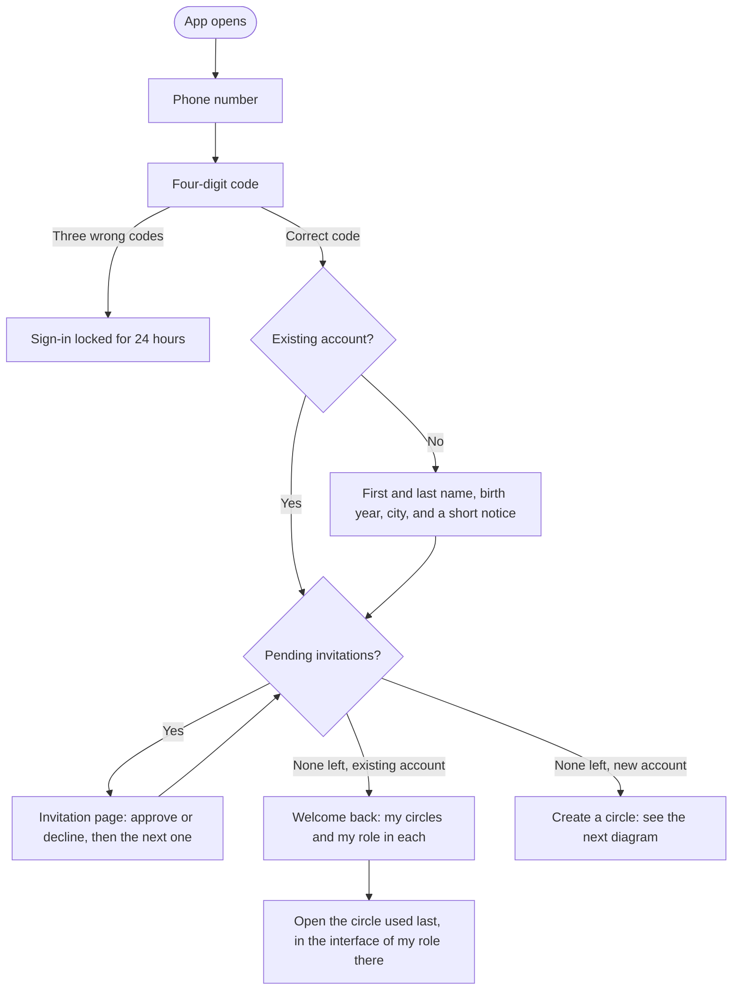
```mermaid
flowchart TD
    Start(["App opens"]) --> Phone["Phone number"]
    Phone --> Code["Four-digit code"]
    Code -->|"Three wrong codes"| Locked["Sign-in locked for 24 hours"]
    Code -->|"Correct code"| Known{"Existing account?"}
    Known -->|"No"| NewData["First and last name, birth year, city, and a short notice"]
    Known -->|"Yes"| Pending
    NewData --> Pending{"Pending invitations?"}
    Pending -->|"Yes"| Inv["Invitation page: approve or decline, then the next one"]
    Inv --> Pending
    Pending -->|"None left, existing account"| Welcome["Welcome back: my circles and my role in each"]
    Welcome --> Enter["Open the circle used last, in the interface of my role there"]
    Pending -->|"None left, new account"| Choice["Create a circle: see the next diagram"]
```

| Screen | What it shows |
| --- | --- |
| Four-digit code | Auto-fill when the SMS arrives, a resend countdown, and the tries left. After three wrong codes sign-in is locked for 24 hours, on this device and for this phone number (BR22). |
| First and last name, birth year, city | Asked once, for a new account. The city is the user's own, for his quiet-time prayers (BR36). It ends with a short notice: TFAQUD organizes care, it does not diagnose or change a dose. |
| Invitation page | Who invited the user, the role, and what the role allows. Several invitations come one above another. |

**Getting in (2 of 2): creating a circle**

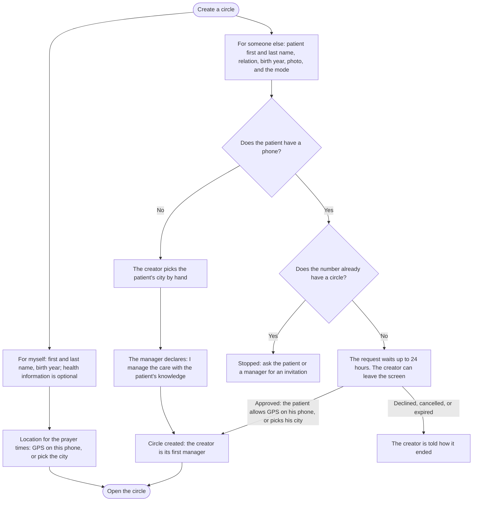
```mermaid
flowchart TD
    Choice(["Create a circle"]) --> Self["For myself: first and last name, birth year; health information is optional"]
    Choice --> Other["For someone else: patient first and last name, relation, birth year, photo, and the mode"]
    Self --> LocSelf["Location for the prayer times: GPS on this phone, or pick the city"]
    LocSelf --> Enter(["Open the circle"])
    Other --> HasPhone{"Does the patient have a phone?"}
    HasPhone -->|"No"| CityHand["The creator picks the patient's city by hand"]
    CityHand --> Declare["The manager declares: I manage the care with the patient's knowledge"]
    Declare --> Created["Circle created: the creator is its first manager"]
    HasPhone -->|"Yes"| Check{"Does the number already have a circle?"}
    Check -->|"Yes"| Stop["Stopped: ask the patient or a manager for an invitation"]
    Check -->|"No"| Wait["The request waits up to 24 hours. The creator can leave the screen"]
    Wait -->|"Approved: the patient allows GPS on his phone, or picks his city"| Created
    Wait -->|"Declined, cancelled, or expired"| Ended["The creator is told how it ended"]
    Created --> Enter
```

**Detailed Mode (Self-manager, Manager, Performer, and Viewer)**

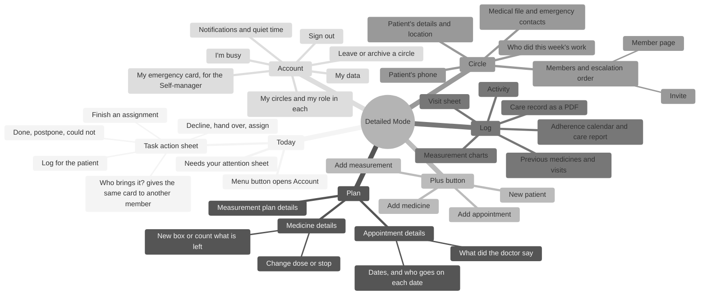
```mermaid
---
config:
  theme: neutral
---
mindmap
  root((Detailed Mode))
    Today
      Needs your attention sheet
      Task action sheet
        Done, postpone, could not
        Who brings it? gives the same card to another member
        Finish an assignment
        Decline, hand over, assign
        Log for the patient
      Menu button opens Account
    Plan
      Medicine details
        Change dose or stop
        New box or count what is left
      Appointment details
        Dates, and who goes on each date
        What did the doctor say
      Measurement plan details
    Plus button
      Add medicine
      Add measurement
      Add appointment
      New patient
    Log
      Activity
      Measurement charts
      Adherence calendar and care report
      Previous medicines and visits
      Visit sheet
      Care record as a PDF
    Circle
      Who did this week's work
      Members and escalation order
        Invite
        Member page
      Medical file and emergency contacts
      Patient's details and location
      Patient's phone
    Account
      My circles and my role in each
      I'm busy
      Notifications and quiet time
      My emergency card, for the Self-manager
      My data
      Leave or archive a circle
      Sign out
```

The "+" button opens the add-medicine steps (photo or manual entry, check, when, who and priority), the add-measurement and add-appointment screens, and the creation of a new circle. It is shown to the Self-manager and the Manager only.

**Simplified Mode (Patient): the first start**

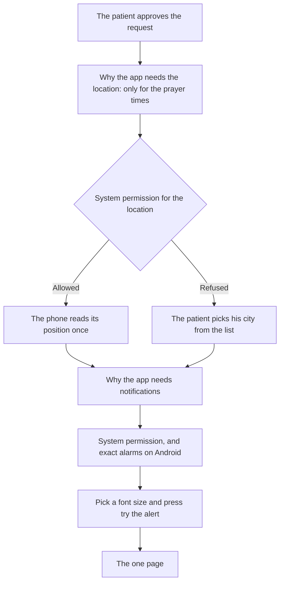
```mermaid
flowchart TB
    Approve["The patient approves the request"] --> WhyLoc["Why the app needs the location: only for the prayer times"]
    WhyLoc --> LocPerm{"System permission for the location"}
    LocPerm -->|"Allowed"| Gps["The phone reads its position once"]
    LocPerm -->|"Refused"| City["The patient picks his city from the list"]
    Gps --> WhyNotif["Why the app needs notifications"]
    City --> WhyNotif
    WhyNotif --> Perm["System permission, and exact alarms on Android"]
    Perm --> Font["Pick a font size and press try the alert"]
    Font --> Page["The one page"]
```

**Simplified Mode (Patient): the one page**

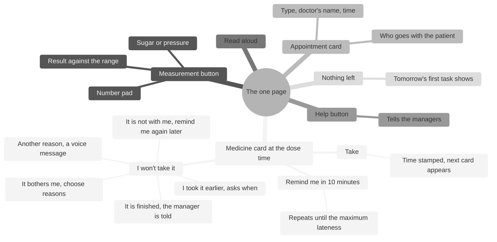
```mermaid
---
config:
  theme: neutral
---
mindmap
  root((The one page))
    Medicine card at the dose time
      Take
        Time stamped, next card appears
      Remind me in 10 minutes
        Repeats until the maximum lateness
      I won't take it
        I took it earlier, asks when
        It is not with me, remind me again later
        It is finished, the manager is told
        It bothers me, choose reasons
        Another reason, a voice message
    Measurement button
      Sugar or pressure
      Number pad
      Result against the range
    Appointment card
      Type, doctor's name, time
      Who goes with the patient
    Read aloud
    Help button
      Tells the managers
    Nothing left
      Tomorrow's first task shows
```

"It is not with me" offers to remind the patient again in an hour, after Maghrib, or when he gets home. "It bothers me" ends with "speak to your doctor first". The help button is always at the bottom of the page.

**Simplified Mode (Patient): the settings page.** A small gear in the corner of the one page opens a page with one button, "My emergency card". Nothing else is there, because the font size, the read-aloud switch, and signing out are set by the manager. The card shows the patient's name, blood type, allergies, chronic conditions, the medicines he takes now, and his emergency contacts, as plain text built live (BR32). The app places no call, sends nothing, and shares no location from it. The same button is in the Settings of the Self-manager, and it is shown on no other phone.

#### 3.3.3 Component hierarchy

The hierarchy is drawn in three pictures: the shells of the app, the pages of the Detailed Mode, and the page of the Simplified Mode.

**The shells**

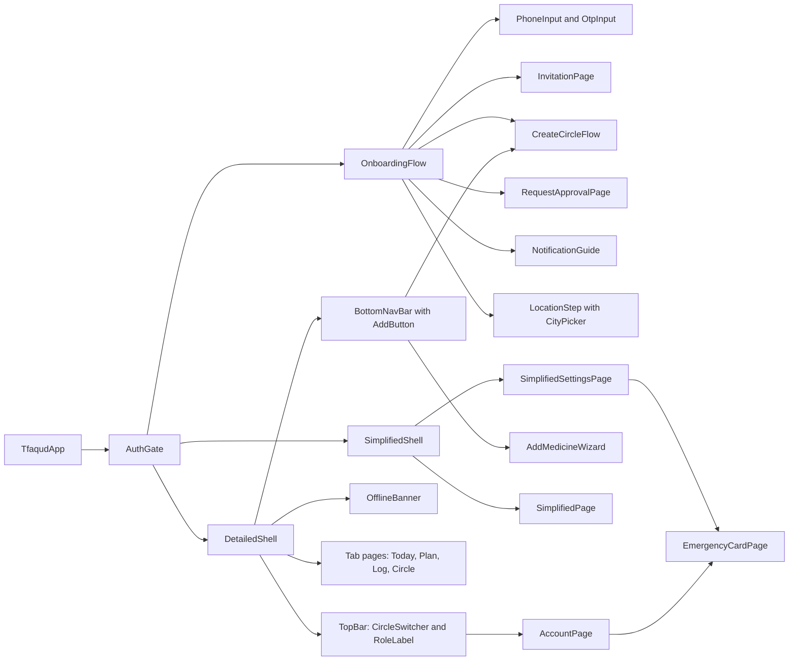
```mermaid
flowchart LR
    Root["TfaqudApp"] --> Gate["AuthGate"]
    Gate --> Onb["OnboardingFlow"]
    Gate --> DShell["DetailedShell"]
    Gate --> SShell["SimplifiedShell"]

    Onb --> PhoneIn["PhoneInput and OtpInput"]
    Onb --> InvPage["InvitationPage"]
    Onb --> CreateFlow["CreateCircleFlow"]
    Onb --> ApproveFlow["RequestApprovalPage"]
    Onb --> NGuide["NotificationGuide"]
    Onb --> LocStep["LocationStep with CityPicker"]

    DShell --> TopBar["TopBar: CircleSwitcher and RoleLabel"]
    DShell --> OfflineBar["OfflineBanner"]
    DShell --> Pages["Tab pages: Today, Plan, Log, Circle"]
    DShell --> BNav["BottomNavBar with AddButton"]
    TopBar --> AccountPage["AccountPage"]
    BNav --> AddMedWizard["AddMedicineWizard"]
    BNav --> CreateFlow

    SShell --> SPage["SimplifiedPage"]
    SShell --> SSet["SimplifiedSettingsPage"]
    SSet --> ECard["EmergencyCardPage"]
    AccountPage --> ECard
```

**The pages of the Detailed Mode**

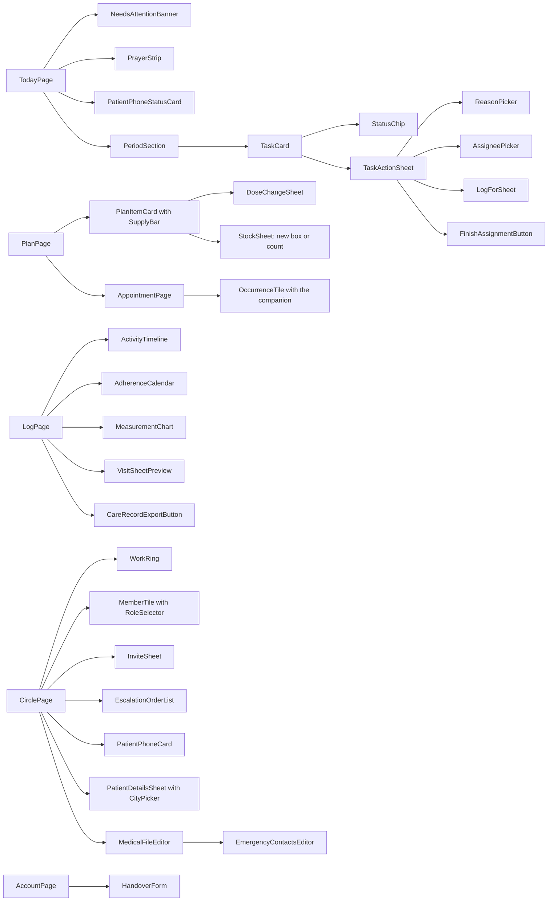
```mermaid
flowchart LR
    TodayPage["TodayPage"] --> Banner["NeedsAttentionBanner"]
    TodayPage --> Strip["PrayerStrip"]
    TodayPage --> PatientCard["PatientPhoneStatusCard"]
    TodayPage --> Section["PeriodSection"]
    Section --> TCard["TaskCard"]
    TCard --> Chip["StatusChip"]
    TCard --> TSheet["TaskActionSheet"]
    TSheet --> Reason["ReasonPicker"]
    TSheet --> Assignee["AssigneePicker"]
    TSheet --> LogFor["LogForSheet"]
    TSheet --> Finish["FinishAssignmentButton"]

    PlanPage["PlanPage"] --> ItemCard["PlanItemCard with SupplyBar"]
    ItemCard --> DoseSheet["DoseChangeSheet"]
    ItemCard --> StockSheet["StockSheet: new box or count"]
    PlanPage --> ApptPage["AppointmentPage"]
    ApptPage --> OccTile["OccurrenceTile with the companion"]

    LogPage["LogPage"] --> ActTimeline["ActivityTimeline"]
    LogPage --> AdhCal["AdherenceCalendar"]
    LogPage --> MChart["MeasurementChart"]
    LogPage --> SheetPreview["VisitSheetPreview"]
    LogPage --> ExportBtn["CareRecordExportButton"]

    CirclePage["CirclePage"] --> WorkRing["WorkRing"]
    CirclePage --> MTile["MemberTile with RoleSelector"]
    CirclePage --> Invite["InviteSheet"]
    CirclePage --> OrderList["EscalationOrderList"]
    CirclePage --> PhoneCard["PatientPhoneCard"]
    CirclePage --> PDetails["PatientDetailsSheet with CityPicker"]
    CirclePage --> MedFile["MedicalFileEditor"]
    MedFile --> ContactsEd["EmergencyContactsEditor"]

    AccountPage["AccountPage"] --> HandForm["HandoverForm"]
```

**The page of the Simplified Mode**

```mermaid
flowchart LR
    SPage["SimplifiedPage"] --> Stack["TaskStack"]
    Stack --> MedCard["MedicineCard with ThreeChoices"]
    MedCard --> WontSheet["WontTakeSheet"]
    SPage --> MeasBtn["MeasureButton"]
    MeasBtn --> NPad["NumberPad"]
    MeasBtn --> RangeBar["RangeIndicator"]
    SPage --> AloudBtn["ReadAloudButton"]
    SPage --> HelpBtn["HelpButton"]
```

#### 3.3.4 Main UI components and what they do

| Component | Used in | Purpose | Main inputs | Interactions |
| --- | --- | --- | --- | --- |
| `AuthGate` | App root | Chooses the first screen: onboarding, Detailed Mode, or Simplified Mode. | Sign-in state, the circle used last, the user's role there | Redirects after sign-in, joining a circle, switching circles, or sign-out. |
| `PhoneInput`, `OtpInput` | Onboarding | Collect the phone number and the four-digit code; fill the code in by itself when the SMS arrives; show the resend countdown, the tries left, and the locked message (device and number). | Phone number, code | Submit, resend, edit the number. |
| `InvitationPage` | Onboarding | Shows who invited the user, the role, and what the role allows. Pending invitations come one above another. | Invitation | Approve or decline, then the next one appears. A cancelled or expired invitation shows "no longer available". |
| `CreateCircleFlow` | Onboarding, "+" button | The paths for creating a circle: for myself, for someone with a phone, or for someone without. Asks for the patient's details and the mode and, for a patient with no phone, the patient's city (`CityPicker`). | Patient details, mode, city | Submit; shows the waiting screen for a request. |
| `RequestApprovalPage` | The patient's phone | Tells the patient who asked, the role chosen for them, and what the family will see (medicines, measurements, appointments). | Request | Approve or decline. |
| `LocationStep` and `CityPicker` | The patient's first start, "For myself", and the creation of a circle for a patient with no phone | Explains that the location is used only for the prayer times, asks for the system's location permission, and reads the position once. If the permission is refused, or if the patient has no phone, shows the list of Saudi cities with a search box. | Permission state, the city list | Allow, or pick a city. Saves with `PUT /patients/{id}/location` (source `GPS` or `MANUAL`). The position is never shown to the family and never tracked (BR34). |
| `NotificationGuide` | Patient's first start, onboarding | Explains why notifications are needed, opens the system permission, and asks for exact alarms on Android. | Permission state | Opens the system permission dialog. |
| `CircleSwitcher` and `RoleLabel` | Top bar | Show the selected circle and the user's role in it, and open the list of the user's circles. | Circles list | Tap to switch circle, or to start a new patient. |
| `OfflineBanner` | Detailed Mode | Tells the user there is no internet and how many actions are waiting to sync. | Connection state, queue size | Tap to see waiting actions. |
| `PrayerStrip` | Today | Five prayer markers with "now" marked. Finished periods collapse to a line such as "Fajr and Dhuhr · 4 done". | Prayer times, current time | Tap a period to jump to its tasks. |
| `PeriodSection` | Today | Groups tasks under one prayer period, with an approximate time. | Period, tasks | Expand or collapse. |
| `TaskCard` | Today, Simplified Mode | Shows the task's title, the person responsible, the time, and the status. | Task, responsible member, display status | Tap opens `TaskActionSheet`. |
| `StatusChip` | Task cards, Log | Shows later, now, done, done late, could not, postponed, declined, missed, or "will sync". | Display status | Display only. |
| `NeedsAttentionBanner` | Today | A red banner with the count and the most important item. Opens a list, most important first. An item stays until someone completes or reassigns it. | Attention items | Tap opens the sheet with the action for each kind of item (for example "Who brings it?", "Ask the doctor today", "I'll accompany", "Remind a member"). |
| `PatientPhoneStatusCard` | Today (Simplified circle) | A status line such as "Abdullah · Simplified Mode · 5 of 6 done · last activity 6:32". | Phone settings, tasks | Display only. |
| `TaskActionSheet` | Today | The actions for one task: done (the time can be edited), postpone, could not do (with a reason), decline while not yet accepted, hand over, assign, call the person. Actions depend on the user's role. | Task, permissions | Each action calls a controller, which sends it to the API or to the offline queue. |
| `LogForSheet` | Task sheet | Asks "how do you know the patient took it?": I gave it myself, he told me he took it, or he didn't take it. The time defaults to now and can be edited. | Task | Save sends `logFor`. |
| `ReasonPicker` | Task sheet | The reason for "could not" (for example, the pills ran out). | Task | Choosing "the pills ran out" opens `AssigneePicker` to give the same card to another member (BR38). |
| `AssigneePicker` | Task sheet, handover | Used for "who brings it?", "assign", and "hand over". Lists the members who can act, each with their day ("with you: cardiology appointment 4:30"), a note, and a switch "when the box arrives, remind the patient of the dose". | Members | Select a member, then send the request. The task shows "waiting for acceptance" for 30 minutes. |
| `AssignmentRequestSheet` | Opened from a push notification | Shows "Mohammed assigned you a task", what it is, by when and why. | Assignment | Accept or decline (with a reason). |
| `FinishAssignmentButton` | Task sheet, assignment sheet | Shown to the person who accepted an assignment: "I did my part", with the time ("Sara brought it, 6:10"). | Assignment | Calls `complete`. The card does not change and is not counted as a dose: the dose still has to be recorded (BR38). |
| `PlanItemCard` and `SupplyBar` | Plan | Shows a medicine, appointment, or measurement plan with its next time, priority tag, and supply ("lasts 22 days", amber, red). The supply is worked out by the server from the boxes and counts (BR21). | Plan item | Tap opens details. |
| `StockSheet` | Medicine details | Two tabs: "new box" (how much it holds and the date) and "count what is left" (the family counts, and the app starts from the new number). It never shows a stored pill count. | Medicine | Save calls `stock/boxes` or `stock/recount`. |
| `AppointmentPage` and `OccurrenceTile` | Plan | The dates of an appointment series. Each date shows its status and its companion, with "ask the circle", "I'll accompany", reschedule, and cancel for that date only. After the visit, the visit record opens from its date. | Appointment, dates | A change of the series changes only the dates that have not happened yet (BR31). |
| `AddMedicineWizard` | "+" button | Steps with a progress bar: photo or manual entry, check what was read, when, and who performs it with the priority and the supply. Reading a photo is a Could item, so manual entry always works. | Medicine data | Next, back, save. |
| `DoseChangeSheet` | Medicine details | One sheet with two tabs: change dose, stop. Asks by whose order (a doctor's name), the reason, and from when. Saving keeps the old dose in "previous medicines". | Medicine, new dose | Save calls `changeDose` or `stop`. |
| `NumberPad` | Measurement entry | Large number keys like a calculator. Sugar takes one number; pressure takes two and an optional pulse. | Value, field | Type, delete, save. |
| `RangeIndicator` | Measurement result | Shows the reading against the range the manager set. It only shows inside or outside the range and gives no advice. | Value, range | Display only. |
| `MeasurementChart` | Log | Plots readings over 7, 30, or 90 days with the range as a band; missing readings appear as gaps. | Readings, range | Tap a point to see its details. |
| `AdherenceCalendar` | Log | Month grid: green (every dose on time), amber (late or incomplete), red (a missed critical dose), with a count per medicine. | Task results by day | Tap a day to see its tasks; open the care report. |
| `ActivityTimeline` | Log | The care record: who did what and when, failed tasks in red, with filters (all, late, changes, a person). | Activity entries | Filter, open an entry. |
| `VisitSheetPreview` | Log | Previews the one-page sheet for the doctor, then shares it as a PDF or shows it on screen. | Visit sheet | Share (Manager and Self-manager). |
| `CareRecordExportButton` | Log | Asks the server for the whole care record as one PDF (the patient, the medical file, the plan, the medicine history, the readings, the appointments, and the visits). Shown to managers only. A Could item. | Circle | Opens the share sheet (BR35). |
| `WorkRing` | Circle | A ring chart of each member's share of this week's tasks. It does not count what the patient did. | Tasks | Display only. |
| `MemberTile`, `RoleSelector`, `InviteSheet` | Circle | Show each member with the name, relation, role, and place in the escalation order; change a role; invite by name, phone, and role, and send the WhatsApp link. | Members | Change role, invite, cancel an invitation, remove a member. |
| `EscalationOrderList` | Circle | Lets a manager move members up or down. Viewers and Patients cannot be listed. | Members | Drag to arrange. |
| `PatientPhoneCard` | Circle (managers, Simplified circle) | Status line, font size, read-aloud switch, "try the alert", the consent line, and "stop the app on the patient's phone". The "after the prayer" minutes are not here: they belong to the patient and are in `PatientDetailsSheet`. | Phone settings | Save, try the alert, stop the app. |
| `PatientDetailsSheet` | Circle (managers) | The patient's first and last name, birth year, photo, the "after the prayer" minutes, and his location: for a patient with no phone, or one who refused GPS, a `CityPicker`; for a patient whose phone sends GPS, only "set by GPS on his phone" with the date. | Patient | Save calls `PATCH /circles/{id}/patient`, or `PUT /patients/{id}/location` for a city. |
| `MedicalFileEditor` and `EmergencyContactsEditor` | Circle (managers) | The medical file: blood type, allergies, chronic conditions, doctors as names, and the emergency contacts (a name, a relation, a phone number, and the order). Contacts are text only. | Medical file | Save calls `PUT /circles/{id}/medical-profile` and `PUT /circles/{id}/emergency-contacts`. |
| `HandoverForm` | Account | Choose the period and the circles, see the tasks in it with a proposed person for each, send the transfer requests, and see who accepted. | Dates, tasks, members | "Send transfer requests" creates assignments. |
| `SimplifiedPage` and `TaskStack` | Simplified Mode | The one page: a stacked list of today's tasks sorted by time left. When nothing is left it says so and shows tomorrow's first task. | Tasks | Check a card to record it. |
| `MedicineCard` and `ThreeChoices` | Simplified Mode | The card at the dose time with three choices: take, remind me in 10 minutes, I won't take it. | Task | Take records the time and shows a stamp. |
| `WontTakeSheet` | Simplified Mode | The list: I took it earlier, it is not with me, it is finished, it bothers me, another reason. | Task | Choosing "it bothers me" opens the symptom reasons; "another reason" records a voice message. |
| `MeasureButton` | Simplified Mode | Offers sugar or pressure, then the `NumberPad`. | Plan | Save stores the reading with its time. |
| `SimplifiedSettingsPage` and `EmergencyCardPage` | Simplified Mode (settings), Self-manager (Settings) | A small page with one button, "My emergency card". The card is plain text: name, blood type, allergies, chronic conditions, the medicines now, and the emergency contacts. No call, no share, no location. It is shown only on the patient's own phone. | Card from the server | Open calls `GET /circles/{id}/emergency-card` (BR32). It needs internet (Section 9, item 35). |
| `ReadAloudButton` and `HelpButton` | Simplified Mode | Read the page aloud; send a high-priority notification to the managers. There is no call, no emergency number, and no voice message. | Settings | The patient sees that the request was sent. |
| `SettingsPage` and `AccountPage` | Account | My circles, I'm busy, quiet time, my emergency card (Self-manager only), my data, help and support, sign out. | Settings | Save to the server and the local cache. |

#### 3.3.5 Interactions

Every interaction follows the same path. The widget sends the user's action to its controller. The controller asks a repository. The repository reads from the local database or the API, or, when there is no internet and the action is allowed offline, writes it to the queue (Section 3.3.6). The answer comes back to the controller, and the widget draws the new state. The widgets never call the API and never decide a permission. The buttons shown are the ones the server sent in the user's permissions (Section 3.1.6), and the server checks the action again.

The main interactions are in the table. The ones that involve several parts at once have a sequence diagram in Section 4.

| Interaction | Widgets | Controller | API route (Section 5) | What the user sees |
| --- | --- | --- | --- | --- |
| Sign in with the SMS code | `PhoneInput`, `OtpInput` | `AuthController` | `POST /auth/code/request`, `POST /auth/code/verify`, `GET /me` | The resend countdown and the tries left. After three wrong codes: "sign-in is locked for 24 hours". Then pending invitations, then the circle used last. (Section 4.2) |
| Create a circle for myself, or for someone else | `CreateCircleFlow` | `CreationController` | `POST /circles`, `POST /circle-requests` | For a patient with no phone, the creator picks the patient's city. For a patient with a phone, a waiting screen that the creator may leave. A push tells the creator the result. (Section 4.6) |
| Approve or decline a request about me | `RequestApprovalPage` | `CreationController` | `POST /circle-requests/{id}/approve`, `…/decline` | What the family will see, then the location step (GPS, or the city list), then "approved". Nothing is created before the patient says yes. |
| Answer an invitation | `InvitationPage` | `InvitationController` | `GET /invitations/pending`, `POST /invitations/{id}/accept`, `…/decline` | One invitation above another, with the role and what it allows. |
| Invite a member | `InviteSheet` | `CircleAdminController` | `POST /circles/{id}/invitations` | The WhatsApp message opens ready to send (or the share sheet). The invitation shows as pending for 7 days and can be cancelled. |
| Record a dose | `TaskCard`, `TaskActionSheet` | `TodayController` | `POST /tasks/{id}/record` | The card turns done. If someone recorded it first: "Noura recorded it two minutes ago. We did not record it twice." Offline: the chip "will sync". (Section 4.3) |
| Log for the patient | `LogForSheet` | `TodayController` | `POST /tasks/{id}/log-for` | The question "how do you know?", the time (editable), then the record, marked as logged by the member. |
| Say a dose could not be done | `ReasonPicker`, `AssigneePicker` | `TodayController`, `AssignmentController` | `POST /tasks/{id}/could-not`, `POST /tasks/{id}/assign` | The reason, and for "the pills ran out", "who brings it?", which gives the same card to another member. The task stays in "needs your attention", and can still be recorded late. |
| Give a task to someone | `AssigneePicker` | `AssignmentController` | `POST /tasks/{id}/assign` | The person's day beside each name and a note. The task shows "waiting for an answer" for 30 minutes. (Section 4.5) |
| Answer an assigned task | `AssignmentRequestSheet` (opened from the push) | `AssignmentController` | `POST /assignments/{id}/accept`, `…/decline` | Accept, or decline with a reason. The sender is told either way. |
| Finish an assignment | `FinishAssignmentButton` | `AssignmentController` | `POST /assignments/{id}/complete` | "Sara brought it, 6:10" appears in the log. The card does not change, and it is not a dose (BR38). |
| Answer a missed-dose alert | The notification and its action buttons, `NeedsAttentionBanner` | `AlertsController` | `POST /notifications/{id}/respond`, `POST /tasks/{id}/log-for` | Only an action stops the escalation; opening the alert does not. (Section 4.4) |
| Arrange the escalation order | `EscalationOrderList` | `CircleAdminController` | `PUT /circles/{id}/escalation-order` | Members move up or down. Viewers and Patients cannot be added to the list. |
| Record a measurement | `MeasureButton`, `NumberPad`, `RangeIndicator` | `TodayController` | `POST /circles/{id}/measurements` | A large number pad. The result is shown inside or outside the range, with no advice. Works offline. |
| Take a dose in Simplified Mode | `SimplifiedPage`, `MedicineCard`, `ThreeChoices`, `WontTakeSheet` | `TodayController` | `POST /tasks/{id}/record`, `POST /tasks/{id}/symptoms` | Three large choices: take, remind me in 10 minutes, I won't take it. "Remind me" is a local notification, so it needs no internet. |
| Press the help button | `HelpButton` | `AlertsController` | `POST /circles/{id}/help` | "Sent to your manager". It never calls and never goes to an emergency number. |
| Change or stop a medicine | `DoseChangeSheet` | `PlanController` | `POST /medications/{id}/change-dose`, `…/stop` | The doctor's name, the reason, and the date. The old dose moves to "previous medicines". |
| Add a box, or count what is left | `StockSheet` | `PlanController` | `POST /medications/{id}/stock/boxes`, `POST /medications/{id}/stock/recount` | "Lasts 22 days" is worked out again. A wrong count is corrected by counting again. |
| Plan one appointment date | `OccurrenceTile` | `PlanController` | `PATCH /occurrences/{id}`, `POST /occurrences/{id}/cancel`, `…/companion`, `…/ask-circle`, `…/volunteer` | The date changes alone, and the rest of the series stays. "No companion" appears the day before (BR23). |
| Set the patient's location | `LocationStep`, `CityPicker`, `PatientDetailsSheet` | `LocationController` | `PUT /patients/{id}/location` | GPS is asked only on the patient's own phone. If refused, or for a patient with no phone, a city is picked from the list. Used only for the prayer times (BR34). |
| Edit the medical file and the emergency contacts | `MedicalFileEditor`, `EmergencyContactsEditor` | `CircleAdminController` | `PUT /circles/{id}/medical-profile`, `GET` and `PUT /circles/{id}/emergency-contacts` | Plain text. A contact is never called or sent anything (BR33). |
| Open my emergency card | `SimplifiedSettingsPage`, `EmergencyCardPage` | `SimplifiedController` | `GET /circles/{id}/emergency-card` | One page of plain text, built when opened. No call, nothing sent, no location (BR32). |
| Export the care record | `CareRecordExportButton` | `LogController` | `GET /circles/{id}/care-record` | A PDF to share (managers only). |
| Switch circle | `CircleSwitcher` | `CircleController` | `GET /me` (the list is already loaded) | The interface changes to the user's role in the other circle. Nothing is mixed between circles. |

**Rules for every screen**

- **Four states.** Every screen that loads data has a loading state, an error state with a retry button, an empty state with one clear next step, and the normal state.
- **No guessing.** The app does not show a task as done until the server (or the local queue) has the record. A queued action shows "will sync", never "done".
- **Conflicts are explained.** A 409 answer is shown in words that say who did what and when. A 403 never appears for a normal user, because the button was hidden. If it happens (the role changed a moment ago), the app reloads the permissions.
- **Reminders are planned after every change.** When the plan or the cached tasks change, `NotificationScheduler` plans the local notifications again (Section 3.3.6).
- **Large text and right to left.** All layouts use start and end, and every screen is tested with the largest font size.

#### 3.3.6 Offline behavior

| Topic | Design |
| --- | --- |
| What is cached | The user's circles, the plan, the next few days of tasks, and the prayer times of the patient's coordinates, so Today and the Simplified page open without internet. The city list is part of the app. The emergency card is not cached (Section 9, item 35). |
| What can be done offline | Record a task as done (a dose or another task) and record a measurement: these are the two kinds of `OfflineAction`. "Remind me in 10 minutes" also works, because it is a local notification. Everything else (postponing, "could not", inviting, creating a circle, changing the plan, counting the stock, assigning, finishing an assignment, setting the location, opening the emergency card) needs internet. |
| Waiting actions | Saved in `pending_actions` with a `client_action_id` and the original time, shown with the "will sync" chip. The patient can change a recorded check later, and the old time is replaced. |
| Syncing | Sent in order when internet returns. The server accepts, ignores duplicates, or says the task was already recorded by someone else; the app then updates the cards and tells the user who recorded it and when. Nothing is overwritten. |
| Reminders | Scheduled on the phone from the cached tasks (the `local_notifications` table), so they fire without internet. They are rescheduled whenever the plan changes. The escalation to other people needs the server and internet. |
| Notifications turned off | If notifications are turned off after the first start, the Simplified page shows "alerts are stopped" with a button that opens the phone's settings. |

#### 3.3.7 UML class diagram of the front-end (Flutter)

This diagram shows the main Dart classes and how they depend on each other. Read it from left to right: widgets watch controllers, controllers use repositories, and repositories use the API client and the local database. Only the main members are drawn.

```mermaid
classDiagram
    direction LR

    class TodayPage {
        <<widget>>
    }
    class TaskCard {
        <<widget>>
        +TaskModel task
    }
    class TaskActionSheet {
        <<widget>>
        +Set~String~ permissions
    }
    class SimplifiedPage {
        <<widget>>
    }
    class EmergencyCardPage {
        <<widget>>
    }
    class LocationStep {
        <<widget>>
    }

    class AuthController {
        <<controller>>
        +requestCode(phone) Future
        +verifyCode(phone, code) Future
    }
    class CircleController {
        <<controller>>
        +switchTo(circleId) void
        +requestForOther(data) Future
    }
    class TodayController {
        <<controller>>
        +load(circleId) Future
        +record(taskId, takenAt) Future
        +logFor(taskId, basis, at) Future
    }
    class AssignmentController {
        <<controller>>
        +assign(taskId, memberId) Future
        +answer(assignmentId, accept) Future
        +complete(assignmentId) Future
    }
    class AlertsController {
        <<controller>>
        +loadAttention(circleId) Future
        +respond(notificationId, action) Future
    }
    class SimplifiedController {
        <<controller>>
        +take(taskId) Future
        +wontTake(taskId, outcome) Future
        +pressHelp() Future
        +openEmergencyCard(circleId) Future
    }
    class LocationController {
        <<controller>>
        +useGps() Future
        +pickCity(city) Future
    }
    class SyncController {
        <<controller>>
        +syncPending() Future
    }

    class TaskRepository {
        <<repository>>
        +fetchToday(circleId) Future
        +submitAction(action) Future
    }
    class CircleRepository {
        <<repository>>
        +fetchCircles() Future
        +createRequest(data) Future
        +setLocation(location) Future
        +fetchEmergencyCard(circleId) Future
    }
    class AuthRepository {
        <<repository>>
        +verifyCode(phone, code) Future
    }

    class ApiClient {
        +get(path) Future
        +post(path, body) Future
    }
    class LocalDatabase {
        +saveTasks(tasks) Future
        +addPendingAction(action) Future
    }
    class NotificationScheduler {
        +scheduleForTasks(tasks) Future
    }

    class TaskModel {
        <<model>>
        +String displayStatus
        +DateTime dueAt
        +int version
    }
    class PendingAction {
        <<model>>
        +String clientActionId
        +DateTime originalTime
    }

    TodayPage ..> TodayController : watches
    TodayPage *-- TaskCard : shows
    TaskCard ..> TaskActionSheet : opens
    TaskActionSheet ..> TodayController : calls
    TaskActionSheet ..> AssignmentController : calls
    SimplifiedPage ..> SimplifiedController : watches
    SimplifiedPage ..> EmergencyCardPage : settings button
    EmergencyCardPage ..> SimplifiedController : calls
    LocationStep ..> LocationController : calls

    TodayController --> TaskRepository : uses
    TodayController ..> NotificationScheduler : reschedules
    SimplifiedController --> TaskRepository : uses
    AssignmentController --> TaskRepository : uses
    AlertsController --> TaskRepository : uses
    CircleController --> CircleRepository : uses
    LocationController --> CircleRepository : uses
    SimplifiedController --> CircleRepository : emergency card
    AuthController --> AuthRepository : uses
    SyncController --> TaskRepository : replays queue

    TaskRepository --> ApiClient : online
    TaskRepository --> LocalDatabase : offline cache
    CircleRepository --> ApiClient
    CircleRepository --> LocalDatabase
    AuthRepository --> ApiClient

    TaskRepository ..> TaskModel
    TaskRepository ..> PendingAction
    TaskCard o-- TaskModel
```

---

## 4. Sequence Diagrams

The diagrams show how the phone app, the API, the database, the scheduler, and the outside services work together in the most important cases. The names of the routes are the ones of Section 5, and the rules are the business rules of Section 3.1.5.

### 4.1 The use cases

Three use cases are critical, because the rest of the app depends on them: signing in, recording a dose (including when two people act at once, and when there is no internet), and the escalation of a missed dose. Three more are added because they involve several people or a decision about privacy: giving a task to someone (also used for "who brings it?"), creating a circle for a patient who has a phone, and where the patient is (his location).

| Section | Use case | Why it is critical | Stories | Main routes |
| --- | --- | --- | --- | --- |
| 4.2 | Signing in with the SMS code | Every other action needs a signed-in user, and the sign-in lock protects the patient's data | US-01, US-02 | `POST /auth/code/request`, `POST /auth/code/verify`, `GET /me` |
| 4.3 | Recording a dose: online, in conflict, and offline | The care record must be true, even when two people act at once or the phone has no internet | US-28, US-30, US-35 | `POST /tasks/{id}/record`, `POST /sync/actions` |
| 4.4 | A missed dose and its escalation | This is the reason the app exists: somebody must be told when a dose is missed | US-37 | `POST /notifications/{id}/respond`, `POST /tasks/{id}/log-for` |
| 4.5 | Giving a task to someone | Every task must have a person who said yes | US-32, US-61 | `POST /tasks/{id}/assign`, `POST /assignments/{id}/accept`, `POST /assignments/{id}/complete` |
| 4.6 | Creating a circle for a patient who has a phone | No circle may be made about a person without his approval | US-06, US-09 | `POST /circle-requests`, `POST /circle-requests/{id}/approve` |
| 4.7 | The patient's location: GPS or by hand | Every "after the prayer" reminder depends on one right place, and the position must stay private | US-56 | `PUT /patients/{id}/location`, `POST /circles`, `GET /circles/{id}/prayer-times` |

### 4.2 Signing in with the SMS code

```mermaid
---
config:
  sequence:
    wrap: true
    width: 170
    messageFontSize: 15
---
sequenceDiagram
    actor U as User
    participant App as Phone app
    participant API as API and AuthService
    participant DB as PostgreSQL
    participant SMS as SMS provider

    U->>App: Enter the phone number
    App->>API: POST /auth/code/request with the installation id
    API->>DB: Is this device locked, or this phone number?
    alt The device or the number is locked
        API-->>App: 423 locked until a time
        App-->>U: Try again after 24 hours
    else Both are free
        API->>DB: Save the code (hashed), valid 5 minutes, 3 tries
        API->>SMS: Send the four-digit code to the number
        API-->>App: 200 challenge id and resend time
        U->>App: Enter the four digits
        App->>API: POST /auth/code/verify
        API->>DB: Check the code, and count a wrong code twice: on the device and on the number
        alt The code is right
            API->>DB: Mark the code as used, clear both counts, and link the device to the user
            API-->>App: 200 access token, refresh token, user
            App->>API: GET /me
            API-->>App: Circles with the role in each, pending invitations
            App-->>U: Pending invitations first, then the circle used last
        else The code is wrong
            API-->>App: 400 wrong code and tries left
            Note over API,DB: The third wrong code locks the device and the number for 24 hours
        end
    end
```

- The sign-in code is four digits and lasts 5 minutes (BR12). Only its hash is stored.
- Wrong codes are counted twice, on the **device** (its installation id) and on the **phone number**, not on the code. Asking for a new code does not give three more tries, and neither signing out, reinstalling the app, nor using another phone clears the lock (BR22).
- After a successful sign-in the app asks for `GET /me`. If there are pending invitations, they come before anything else (US-03).

### 4.3 Recording a dose: online, in conflict, and offline

```mermaid
---
config:
  sequence:
    wrap: true
    width: 170
    messageFontSize: 15
---
sequenceDiagram
    actor U as Performer
    participant App as Phone app
    participant LQ as Local queue
    participant API as API and TaskService
    participant DB as PostgreSQL

    U->>App: Tap Done on a dose
    App->>App: Make a client_action_id and note the time
    alt Phone is online
        App->>API: POST /tasks/{id}/record with version and client_action_id
        API->>API: PermissionPolicy checks the role
        API->>DB: Update the task only if it is open and the version matches
        alt Task is still open
            DB-->>API: Updated
            API->>DB: Add an activity entry and close the reminders
            API-->>App: 200 and the new status
            App-->>U: Card turns done
        else Someone already recorded it
            DB-->>API: No row updated
            API-->>App: 409 with who and when
            App-->>U: Noura recorded it two minutes ago. We did not record it twice.
        end
    else Phone is offline
        App->>LQ: Save the action with its original time
        App-->>U: Card shows will sync
        LQ->>API: POST /sync/actions with the waiting actions when internet returns
        API-->>LQ: A result for each: accepted, duplicate, or already recorded
        LQ-->>App: Update the cards
    end
```

- The first valid record wins (BR8). A second record is refused, and the person is told who recorded the task and when.
- `client_action_id` makes a replay harmless: the same action sent twice changes nothing.
- An offline record keeps its original time. The server saves it as the time of the dose and adds the time it was received.
- A card that ended as "could not" or "missed" can still be recorded late with the same route. It then shows "done late" (BR8, BR38). The stock is worked out from the doses done, so no pill count is changed here (BR21).

### 4.4 A missed dose and its escalation

```mermaid
---
config:
  sequence:
    wrap: true
    width: 170
    messageFontSize: 15
---
sequenceDiagram
    participant SCH as Scheduler
    participant API as TaskService and EscalationService
    participant DB as PostgreSQL
    participant PN as Push service (FCM and APNs)
    actor M as Manager
    actor N as Next member in the order

    Note over SCH: Runs every minute
    SCH->>API: Mark missed tasks
    API->>DB: Find pending tasks past their maximum lateness
    DB-->>API: A task with no record
    API->>DB: Task becomes Missed, start an escalation at step 1
    API->>PN: Very-high alert to the manager or the assigned person
    PN-->>M: Notification, with no medicine name on the lock screen
    alt The manager presses an action or logs the task
        M->>API: POST /notifications/{id}/respond or POST /tasks/{id}/log-for
        API->>DB: Escalation is Responded and an activity entry is added
    else No response in 20 minutes
        SCH->>API: Escalation step
        API->>DB: Move to the next person in the order, step 2
        API->>PN: Very-high alert to the next member
        PN-->>N: Notification
        N->>API: Presses an action or logs the task
        API->>DB: Escalation is Responded
    end
    Note over API,DB: If nobody is left, the item stays in needs your attention
```

The same path as a picture of the states:

```mermaid
flowchart TD
    A["Dose time: local alert on the phone of the patient, or of the member named to perform it"] --> B["Repeats every 10 minutes until the maximum lateness"]
    B -->|"Someone records the task"| R["Reminders stop and the log is written"]
    B -->|"Maximum lateness passes with no record"| C["The task becomes Missed"]
    C --> D["Very-high alert to the manager or the assigned person"]
    D -->|"Action pressed or task logged"| R2["Escalation responded"]
    D -->|"No response in 20 minutes"| E["Next person in the order the manager arranged"]
    E -->|"Action pressed or task logged"| R2
    E -->|"No response in 20 minutes"| E
    E -->|"Nobody left in the order"| X["Stays in needs your attention"]
```

- Every missed medicine gets this full path (BR10). A measurement plan follows its priority.
- Answering means acting: opening the notification does not stop the escalation, only an action or a record does (BR11).
- Only a Manager (the Self-manager included) or a Performer can be in the order, never a Viewer or a Simplified patient (BR13).

### 4.5 Giving a task to someone: accept, decline, or no answer

```mermaid
---
config:
  sequence:
    wrap: true
    width: 150
    messageFontSize: 15
---
sequenceDiagram
    actor M as Manager Muhammad
    actor S as Performer Sara
    participant App as Phone app
    participant API as API
    participant SCH as Scheduler
    participant PN as Push service

    M->>App: Open a card that could not be done (the pills ran out) and press who brings it
    App->>API: POST /tasks/{id}/assign with a note and remind when the box arrives
    API->>API: The same card goes to Sara. The assignment is Waiting, answer due in 30 minutes
    API->>PN: Push to Sara: Muhammad assigned you a task
    alt Sara accepts
        S->>App: Tap Accept
        App->>API: POST /assignments/{id}/accept
        API->>API: Responsible member becomes Sara
        S->>App: Later taps I did my part
        App->>API: POST /assignments/{id}/complete
        API->>API: The assignment is Completed and the log shows Sara brought it at 6:10
        Note over API: The card does not change. The dose is recorded on its own, late if needed
        S->>App: Record the dose when it is given
        App->>API: POST /tasks/{id}/record
        API->>API: The card shows done late
    else Sara declines
        S->>App: Tap Decline with a reason
        App->>API: POST /assignments/{id}/decline
        API->>PN: Push to Muhammad: Sara apologised
        API->>API: The task is back in needs your attention
        M->>App: Choose someone else
    else No answer in 30 minutes
        SCH->>API: Expire the assignment
        API->>PN: Push to Muhammad: not accepted
        API->>API: The task returns to Muhammad and his needs your attention list
    end
```

- There is no errand: "who brings it?" gives the **same card** to another member (BR38). The card keeps its own status. An accepted assignment can be finished with `complete`, which only records that the person did his part. It never records a dose.
- A card that ended as "could not" can still be recorded late. The record is accepted, and the card shows "done late" (BR8).
- Every answer is a record in `task_assignments`: accepted, declined, expired, reassigned, or completed. Nothing is deleted (BR14).

### 4.6 Creating a circle for a patient who has a phone

```mermaid
---
config:
  sequence:
    wrap: true
    width: 170
    messageFontSize: 15
---
sequenceDiagram
    actor C as Creator
    actor P as Patient
    participant App as Phone app
    participant API as API
    participant PN as Push service

    C->>App: Enter the patient's first and last name, phone, birth year, mode, and in a Detailed circle his role
    App->>API: POST /circle-requests
    API->>API: Check that the number has no active circle and no open request
    alt Number already has a circle
        API-->>App: 409 Stopped: ask the patient or a manager for an invitation
    else Free
        API->>API: Request is Waiting for 24 hours
        API-->>App: Waiting screen, the creator may leave
        API->>PN: Push to the patient: a request is waiting
        P->>App: Open the request and see the role and what the family will see
        alt Patient approves
            P->>App: Approve, then allow GPS or pick a city (Section 4.7)
            App->>API: POST /circle-requests/{id}/approve with the location
            API->>API: Create the circle, the patient with his location, and the consent, and make the creator the first manager
            API->>PN: Push to the creator: approved
        else Declined, cancelled, or 24 hours pass
            API->>PN: Push to the creator: the request ended, and how
        end
    end
```

### 4.7 The patient's location: GPS or by hand

```mermaid
---
config:
  sequence:
    wrap: true
    width: 170
    messageFontSize: 15
---
sequenceDiagram
    actor P as Patient on his own phone
    actor C as Creator
    participant App as Phone app
    participant OS as Phone system
    participant API as API and CircleService
    participant DB as PostgreSQL
    participant PT as PrayerTimeService
    participant AL as Prayer-times service

    alt The patient has a phone
        P->>App: Approve the request, or create a circle for myself
        App-->>P: The location is used only for the prayer times
        App->>OS: Ask for the location permission
        alt Allowed
            OS-->>App: One position, read once
            App->>API: Approve (or create the circle) with latitude, longitude, city, source GPS
        else Refused
            App-->>P: Show the list of cities
            P->>App: Pick a city
            App->>API: Approve (or create the circle) with the coordinates of the city, source MANUAL
        end
    else The patient has no phone
        C->>App: Pick the patient's city in the list
        App->>API: POST /circles with the coordinates of the city, source MANUAL
    end
    API->>DB: Save the location in the patient's row
    Note over API,DB: Nothing is tracked. The position is read once, shown to nobody, and sent to nobody
    Note over PT,AL: Later, when tasks are made for a day
    API->>PT: timesFor(latitude, longitude, day)
    PT->>DB: Look up the cache by the rounded coordinates and the date
    alt Found
        DB-->>PT: The five times
    else Not found
        PT->>AL: GET /v1/timings/date with latitude and longitude
        AL-->>PT: The five times
        PT->>DB: Save them for that place and day
    end
    PT-->>API: The five times, or an offline calculation if the service is down
```

- The location has one purpose: the five prayer times, and so every dose that is set "after Fajr" or "after Isha" (BR34, BR17).
- GPS is asked only on the patient's own phone. A creator never reads, sends, or sees a position: for a patient with no phone he picks a city from the list, and the app uses the coordinates of that city.
- A patient who refuses the permission is not blocked. He picks a city, and the source is `MANUAL`. If the patient later allows GPS, `PUT /patients/{id}/location` replaces it with `GPS`. A manager who may `EDIT_PLAN` can change a `MANUAL` location, never a `GPS` one.
- The server rounds the coordinates to two decimals (about one kilometre) before it looks in the cache, so one cached day serves every patient in the same place, and the exact position stays in the patient's row only.
- The user's own city (`User.city`) is a different thing. It is used only for his quiet-time prayers (BR36).

## 5. API Specifications

This section describes the two sides of the system's interfaces. Section 5.1 lists the external services the back-end and the app use, and why each was chosen. Sections 5.2 to 5.5 define the back-end's own REST API: the conventions, every endpoint with its path, method, input, and output, worked examples, and the error codes. Every endpoint belongs to one of the route groups of the back-end design, and the role of the caller is always checked on the server (BR18).

### 5.1 External APIs

The back-end calls three outside services (an SMS provider, Firebase Cloud Messaging, and a prayer-times API). The fourth row is a link that the manager's phone opens, not a server call. The "What we send" and "What we receive" lines follow the providers' public documentation, except where a line says "to be confirmed".

The table says what each one is for and why it was chosen. The lines under it give the details of each call: what we send, what we receive, and what happens when it is down.

| API | Used for | Why we chose it |
| --- | --- | --- |
| SMS provider (proposal: Unifonic with a Saudi sender name; alternative: Twilio) | The four-digit sign-in code (valid for 5 minutes) | Sign-in by phone number is a Must. A provider with a registered Saudi sender name reaches Saudi numbers, and both candidates offer a plain "send an SMS" call, so we can change provider without changing our own API. |
| Firebase Cloud Messaging (FCM) HTTP v1, which also reaches iPhones through Apple Push Notification service (APNs) | Push notifications for everything that involves other people (the table "Who is told what"): a missed dose, the help button, an assigned task, and the rest | One server call reaches Android and, through APNs, iPhone. It is free. It supports the two strengths we need: high priority on Android and the time-sensitive level on iPhone. |
| Prayer-times API (proposal: Aladhan, `api.aladhan.com`) | The five prayer times of the patient's location, to turn "after Asr" into a clock time (BR17) and to show the prayer strip on Today | It is a free JSON service with a calculation method used in Saudi Arabia (`method=4`, Umm Al-Qura University, Makkah). The back-end asks once for each place (the coordinates rounded to two decimals) and day and keeps the answer, so the load is small and no name or address of the patient is sent. |
| WhatsApp share link `https://wa.me/<number>?text=<message>` | The invitation message to a member. This is not a server call: the manager's phone opens the link, WhatsApp shows the message ready to send, and the manager presses send. | It costs nothing, needs no WhatsApp Business account or message templates, and the message comes from the manager's own number, which the invited person already knows. The invitation itself is stored on our server (BR6). |

**SMS provider (proposal: Unifonic with a Saudi sender name; alternative: Twilio)**

- **What we send:** The number in international format, a sender name, and the message text that contains the code. Exact fields: to be confirmed with the chosen provider (see note 1).
- **What we receive:** A message id and a status such as sent or failed. Exact fields: to be confirmed with the chosen provider.
- **If it is down:** The sign-in endpoint answers `503 SMS_UNAVAILABLE` and the app shows "try again". People already signed in are not affected. There is no second provider in the MVP.

**Firebase Cloud Messaging (FCM) HTTP v1, which also reaches iPhones through Apple Push Notification service (APNs)**

- **What we send:** `POST https://fcm.googleapis.com/v1/projects/{project_id}/messages:send` with an OAuth 2.0 access token of a service account. A `message` with the device `token`, a generic `notification`, a `data` payload, and the `android` and `apns` settings (see note 2).
- **What we receive:** `200` with `{name}`, the id of the message. An error status when the device token is no longer valid (exact error codes: to be confirmed).
- **If it is down:** The server retries a few times. The 20-minute step timer of the escalation keeps running, so the next person is still told, and the item stays in "needs your attention". Reminders on the phone are local and do not depend on FCM.

**Prayer-times API (proposal: Aladhan, `api.aladhan.com`)**

- **What we send:** `GET https://api.aladhan.com/v1/timings/{date}?latitude={lat}&longitude={lng}&method=4`, where `{date}` is `DD-MM-YYYY`. Only two rounded numbers leave the server: no patient, no circle, and no name (BR34).
- **What we receive:** `{code, status, data}`. `data.timings` holds `Fajr`, `Sunrise`, `Dhuhr`, `Asr`, `Sunset`, `Maghrib`, `Isha`, and others as `HH:MM` text; `data.date` and `data.meta` describe the day and the method. We keep the five prayer times.
- **If it is down:** `PrayerTimeService` answers from the cache, then from an offline calculation (BR17). The `source` field says `CACHED` or `OFFLINE_CALCULATION`, and Today shows the times as approximate.

**WhatsApp share link `https://wa.me/<number>?text=<message>`**

- **What we send:** Nothing goes to a server. The invitation endpoint returns the link as `whatsapp_link`; the app opens it with the phone's URL launcher. The number is written in international format with digits only (format to be re-checked on WhatsApp's own help page).
- **What we receive:** Nothing. The server does not know whether the message was sent. The invitation stays "pending" until the person signs in and accepts.
- **If it is down:** If WhatsApp is not installed, the app offers the phone's share sheet with the same text. The invitation is valid for 7 days either way.


**Notes on the calls**

1. The two candidate SMS calls, as documented by the providers. Unifonic: `POST https://el.cloud.unifonic.com/rest/SMS/messages`, form-encoded, with `AppSid`, `SenderID`, `Recipient`, and `Body`; the JSON answer has `success`, `errorCode`, and `data` with `MessageID` and `Status`. Twilio: `POST https://api.twilio.com/2010-04-01/Accounts/{AccountSid}/Messages.json` with `To`, `From` or `MessagingServiceSid`, and `Body`; the answer has `sid`, `status`, and `error_code`. The code is never logged and only its hash is stored (`otp_challenges.code_hash`). Whether the Saudi sender name needs registration, and how long it takes, is to be confirmed with the provider.
2. The FCM message of a missed dose, with generic lock-screen text only (BR16). `data` values must be strings. `apns-priority` is `10` for a message that shows an alert; Google's documentation says a data-only message to an iPhone must use `5`. The `interruption-level` key and its value `time-sensitive` are Apple's. The Time Sensitive capability of the iPhone app and the Android channel `channel_id` are set up in the app (to be confirmed in Stage 4). Google's reference now marks `token` as deprecated in favour of `fid` (a Firebase Installation ID) during a transition, so the team confirms which one the Flutter plugin returns.

```json
{
  "message": {
    "token": "<device push token>",
    "notification": { "title": "TFAQUD", "body": "A task needs your attention" },
    "data": { "type": "DOSE_MISSED", "circle_id": "<uuid>", "task_id": "<uuid>", "notification_id": "<uuid>" },
    "android": { "priority": "HIGH", "notification": { "channel_id": "urgent" } },
    "apns": {
      "headers": { "apns-priority": "10" },
      "payload": { "aps": { "interruption-level": "time-sensitive" } }
    }
  }
}
```

3. Prayer-times details. The route needs the date in `DD-MM-YYYY`, and `latitude` and `longitude`. The API description states no rate limit and no key; the team confirms the fair-use terms before launch. The app never types a city name into the call: a patient who allows GPS gives coordinates, and a city picked from the fixed list of Saudi cities has its own coordinates in that list (BR34). The call is made by the server, so the family's phones never see the patient's coordinates.

**Device (platform) interfaces used by the Flutter app**

These are not web services. They are features of the phone that the app calls through Flutter packages. The package names are proposals.

| Interface | Flutter package (proposal) | Why we need it |
| --- | --- | --- |
| Local notifications | `flutter_local_notifications` | Dose and measurement reminders at the scheduled time, repeated every 10 minutes, with no internet. Android also needs the exact-alarm permission. |
| Location (GPS) | `geolocator` | Reads the patient's position once, on his own phone, and only to get the prayer times (BR34). It is asked once, explained first, and never tracked. If the patient refuses, a city is picked from the list. |
| Camera and photo picker | `image_picker` | A photo of the medicine box, the patient's photo, and report photos at a visit. |
| Microphone (voice note) | `record` | The patient's voice message ("another reason"), a symptom described by voice, and the companion's visit note. |
| Text-to-speech (read aloud) | `flutter_tts` | Reads the Simplified page aloud for a patient who cannot read well. Whether the phone has an Arabic voice is to be confirmed. |
| Phone dialer (`tel:` link) | `url_launcher` | The "call" button only opens the dialer (BR27). There is no calling inside the app. The numbers on the emergency card are plain text, and whether one may open the dialer is open (Section 9, item 29). |
| Share sheet | `share_plus` | Shares the visit sheet as a PDF (Could) and the invitation text when WhatsApp is not installed. |
| Secure storage | `flutter_secure_storage` | Keeps the access token, the refresh token, and the installation id (the Keychain on iPhone, encrypted storage on Android). |

Reading medicine details from a photo (a Could item) is not decided. An on-device text recognizer is the likely option, for example Google ML Kit text recognition, which works without internet; its documented scripts are Latin, Chinese, Devanagari, Japanese, and Korean, so reading Arabic text is not covered (to be confirmed). Entering a medicine by hand always works.

### 5.2 Conventions for all internal endpoints

| Topic | Rule |
| --- | --- |
| Base path | `{API_BASE}/v1`, where `{API_BASE}` is the host of the server. Every path in 5.3 starts after `/v1`. |
| Format | Request and response bodies are JSON in UTF-8 with `Content-Type: application/json`. The one exception is `POST /uploads` (a file, sent as `multipart/form-data`). Field names are the snake_case names of the database columns. |
| Sign-in | `Authorization: Bearer <access token>` on every endpoint except `POST /auth/code/request` and `POST /auth/code/verify`. `POST /auth/refresh` carries the refresh token in the same header. |
| Device | `X-Installation-Id: <installation id>` on every request. It is the random id made on the first launch (`devices.installation_id`). |
| Ids | All ids are UUIDs. A path parameter such as `{id}` is a UUID. |
| Times | ISO 8601 with an offset, for example `2026-10-07T16:07:00+03:00`. The server stores UTC and returns the offset of the Saudi time zone. A date is `YYYY-MM-DD`. |
| Quantities | A dose, a planned dose, a dose taken, a low-stock level, and a stock count are an object `{"value": 0.5, "unit": "tablet"}`, so "0.5 tablet" and "5 ml" are never mixed (Section 3.2). A reading has its own `unit` field. |
| Lists | A list endpoint takes `limit` (default 50, most 100) and `cursor` (the `next_cursor` of the previous page) and returns `{items, next_cursor}`. `next_cursor` is `null` on the last page. |
| Roles and permissions | The server always checks the caller's role in the circle (BR18). The permission names in the "Who" column are the 16 values of `Permission` in Section 3.1.6. "Any member" means an active member with any of the four stored roles (`MANAGER`, `PERFORMER`, `VIEWER`, `PATIENT_SIMPLIFIED`); a Simplified patient sees only his own page and his emergency card. A person who is not a member of a circle gets `404`, not `403`, so the circle's existence is not revealed. |
| Idempotency | An action that can be repeated, such as recording a task, carries a `client_action_id` (a UUID made by the app). A replay with the same id does nothing: the record endpoints return the first result, and `POST /sync/actions` answers `DUPLICATE_IGNORED` (BR8). The offline queue uses the same id. |
| Concurrent change | A task has a `version`. An action that changes a task sends the `version` the app last saw. |
| Language | Arabic text is returned exactly as stored. Error messages are in Arabic; `code` is the stable value the app reads. |
| Errors | One shape for every error: `{"error": {"code": "...", "message": "...", "details": {}}}`. The codes are in Section 5.5. |
| Not available | There is no endpoint for an emergency call, sharing or tracking the patient's position, invitation codes, changing a circle's mode, deleting a medicine, task, or record, medical advice, or doctor accounts. The emergency card and the emergency contacts are information only: the app calls no one and sends nothing (BR32, BR33). No endpoint returns the patient's coordinates (BR34). |

HTTP status codes used:

| Status | Meaning in this API |
| --- | --- |
| `200` | Done. The body is the result. |
| `201` | Created. The body holds the new `id`. |
| `202` | Accepted for sending (a test alert). |
| `204` | Done, no body. |
| `400` | The input is wrong: a missing or badly formed field, or a wrong code. |
| `401` | The token is missing, wrong, or expired. The app uses the refresh token once, then asks for sign-in. |
| `403` | The caller's role does not allow the action. |
| `404` | The thing does not exist, or the caller is not in that circle. |
| `409` | Conflict with the current state: a task already recorded by someone else (BR8), a number that already has a circle (BR1), the last manager leaving (BR7). |
| `410` | Expired or no longer available: a code, a request, an invitation, or an assignment. |
| `423` | Sign-in is locked for 24 hours after three wrong codes, on the device or on the phone number (BR22). |
| `429` | Too many requests, for example resending a code too soon. |
| `500`, `503` | A server fault, or an outside service (the SMS provider) is down. |

### 5.3 Internal endpoints

Every path starts after `{API_BASE}/v1`. The tables follow the order of the route groups. In the "Input" column a trailing `?` means the field is optional, `query:` lists query parameters, and `{id}` is a path parameter. In the "Notes" column the first word is the priority of the service that owns the endpoint (Must, Should, or Could), then the business rule and the typical errors.

#### 5.3.1 Sign-in (Auth)

Four endpoints sign a person in with a phone number and a four-digit code, keep the session, and end it. Only the first two need no token.

| Method and path | Who (role or permission) | Input | Output | Notes |
| --- | --- | --- | --- | --- |
| `POST /auth/code/request` | Anyone (no token) | `{phone, platform, app_version}` | `200 {challenge_id, valid_until, resend_available_at, attempts_left}` | (Must) Sends the four-digit SMS code, valid for 5 minutes (BR12). Creates the device record for `X-Installation-Id` if it is new. `423 SIGNIN_LOCKED` (the device or the number is locked), `429 TOO_MANY_REQUESTS` (resend too soon), `503 SMS_UNAVAILABLE`. |
| `POST /auth/code/verify` | Anyone (no token) | `{challenge_id, code}` | `200 {access_token, refresh_token, expires_in, is_new_user, user}` | (Must) A wrong code gives `400 WRONG_CODE` with `attempts_left`. A wrong code is counted on the device and on the phone number; the third gives `423 SIGNIN_LOCKED` with `locked_until` and `locked_by` (BR22). `410 CODE_EXPIRED`. A correct code resets both counts. |
| `POST /auth/refresh` | Any signed-in user | none (the refresh token is in the `Authorization` header) | `200 {access_token, refresh_token, expires_in}` | (Must) The old refresh token stops working. `401 UNAUTHENTICATED` if it was revoked. |
| `POST /auth/sign-out` | Any member except a Patient in Simplified Mode | none | `204` | (Must) Ends this device's session and clears its push token. A Simplified patient cannot sign out alone: a manager uses `stop-patient-app` (BR7). `403 FORBIDDEN_ROLE`. |

#### 5.3.2 Account and devices

These endpoints return the user's circles with the role in each, keep the profile and quiet time, export or delete the account, and register the phone for push notifications.

| Method and path | Who (role or permission) | Input | Output | Notes |
| --- | --- | --- | --- | --- |
| `GET /me` | Any signed-in user | none | `200 {user, circles, pending_invitations, pending_requests, last_used_circle_id}` | (Must) `circles` holds `{circle_id, member_id, role, is_the_patient, patient_mode, patient_name, status}` for each circle, so the app opens the circle used last in the interface of the role there (`role` is `MANAGER` and `is_the_patient` is true for the Self-manager). `patient_mode` is empty when the patient has no phone. `pending_requests` are circle requests waiting for this user as the patient. |
| `PATCH /me` | Any signed-in user | `{first_name?, last_name?, display_name?, birth_year?, city?}` | `200 {user}` | (Must) The new-account screen sends the first and last name, birth year, and city. `display_name` cannot be empty and is the first and last name together by default. `city` is the user's own city, used only for his quiet-time prayers (BR36). The app is in Arabic only in the MVP, so there is no language setting. The phone number cannot be changed. |
| `PUT /me/quiet-time` | Any signed-in user | `{quiet_from, quiet_until_prayer, summary_after_prayer}` | `200 {quiet_from, quiet_until_prayer, summary_after_prayer}` | (Should) `quiet_from` is a time; the other two are prayer names (`FAJR` to `ISHA`). Non-urgent notifications are held and sent as one summary after Isha. |
| `GET /me/export` | Any signed-in user | none | `200 {exported_at, user, memberships, records}` (a JSON file) | (Should) The user's own data (BR20). |
| `DELETE /me` | Any signed-in user | none | `204` | (Should) `409 STILL_IN_CIRCLE` while the user is in any active circle; `details` lists them (BR20). The number is removed; the records about other patients stay in their circles. |
| `POST /devices` | Any signed-in user | `{platform, push_token, app_version, notifications_allowed, exact_alarm_allowed?, location_allowed?}` | `201 {id}` | (Must) Registers this installation for push. A repeat for the same `X-Installation-Id` updates it and returns `200 {id}`. `platform` is `IOS` or `ANDROID`. |
| `PATCH /devices/{id}` | Any signed-in user (own device) | `{push_token?, notifications_allowed?, exact_alarm_allowed?, location_allowed?, app_version?}` | `200 {id, notifications_allowed, exact_alarm_allowed}` | (Must) Sent when the push token changes or the user changes the phone's permission. `404 NOT_FOUND` for another user's device. |

#### 5.3.3 Circles and requests

These endpoints create a circle (for yourself, for someone without a phone, or through a request that the patient approves), end a request, and archive, reopen, or leave a circle. A circle's mode is chosen once at creation and cannot be changed, so there is no route for it (BR2); a wrong choice is fixed by creating a new circle.

| Method and path | Who (role or permission) | Input | Output | Notes |
| --- | --- | --- | --- | --- |
| `POST /circles` | Any signed-in user | `{creation_path, patient_mode?, patient: {first_name, last_name, birth_year, photo_url?, relation?}, location: {city, latitude, longitude, source}, declaration?}` | `201 {circle_id, member_id, role, patient_mode, status}` | (Must) `creation_path` is `FOR_MYSELF` (the user becomes the Self-manager, a Manager whose member is the patient; the mode is `DETAILED`; `location` is read by GPS on his own phone, or picked by hand if he refuses) or `FOR_OTHER_NO_PHONE` (needs `declaration: true`, kept as the care acknowledgment, BR26; `patient_mode` is not sent and stays empty; `location` is the city the creator picked by hand, source `MANUAL`, BR34; the user becomes Manager; no patient account, BR4). `FOR_OTHER_WITH_PHONE` gives `400`: use `POST /circle-requests`. `409 PHONE_HAS_CIRCLE` (BR1). |
| `POST /circle-requests` | Any signed-in user | `{patient_phone, patient_first_name, patient_last_name, patient_mode, patient_role?, patient_details: {birth_year, photo_url?, relation?}}` | `201 {id, status, expires_at}` | (Must) For a patient who has a phone. The request waits 24 hours and the patient is notified. `patient_role` is left out in a `SIMPLIFIED` circle, where the patient is always `PATIENT_SIMPLIFIED`; in a `DETAILED` circle it is `MANAGER`, `PERFORMER`, or `VIEWER` (BR5, open: Section 9, item 6). The location is not sent here: the patient gives it when he approves. `409 PHONE_HAS_CIRCLE` (BR1), `409 REQUEST_WAITING` (BR25). |
| `GET /circle-requests/{id}` | The creator, or the patient it is for | none | `200 {id, status, creator_name, patient_first_name, patient_last_name, patient_mode, patient_role, shared_data, expires_at, circle_id?}` | (Must) Used by the creator's waiting screen and by the patient's approval screen, which shows the role and what the family will see (`shared_data`: `MEDICINES`, `MEASUREMENTS`, `APPOINTMENTS`). `404` for anyone else. |
| `POST /circle-requests/{id}/approve` | The patient it is for | `{location: {city, latitude, longitude, source}}` | `200 {circle_id, member_id, role}` | (Must) Creates the circle, the patient with his location, and the consent (with its date), and makes the creator the first manager (BR26). `source` is `GPS` (read once on his own phone) or `MANUAL` (the city he picked after refusing the permission, BR34). `410 NO_LONGER_AVAILABLE` after 24 hours. `409 STATE_CONFLICT` if it was declined or cancelled. |
| `POST /circle-requests/{id}/decline` | The patient it is for | `{reason?}` | `200 {id, status}` | (Must) The creator is told how it ended (`REQUEST_ENDED`). `409 STATE_CONFLICT` if it is no longer waiting. |
| `POST /circle-requests/{id}/cancel` | The creator | none | `200 {id, status}` | (Must) Only while waiting. The request also cancels itself when the patient creates their own circle first (BR25). |
| `GET /circles/{id}` | Any member | none | `200 {id, patient_mode, status, creation_path, patient, my_member, permissions, consent?, care_acknowledgment?, patient_phone?}` | (Must) `permissions` is the list of `Permission` names the caller holds; the app hides buttons from it, and the server still checks (BR18). `patient_phone` appears only for `SET_PATIENT_PHONE` in a Simplified circle whose patient has a phone (BR3). `patient` has the names, birth year, photo, `after_prayer_offset_min`, and `location: {source, updated_at}`; the city is added only when the source is `MANUAL` (a manager typed it), and the coordinates are never returned (BR34). `consent` is present for a patient with a phone, `care_acknowledgment` for a patient with no phone, and neither for a circle for myself (BR26). Marks this circle as the user's last used. An archived circle is readable for one year, then `410 NO_LONGER_AVAILABLE` (BR12). |
| `PATCH /circles/{id}/patient` | Self-manager, Manager (`EDIT_PLAN`) | `{first_name?, last_name?, birth_year?, photo_url?, after_prayer_offset_min?}` | `200 {patient}` | (Must) There is no field for the mode (BR2), the phone number (BR1), or the location (use `PUT /patients/{id}/location`). The "after the prayer" minutes (20 by default, BR17) belong to the patient, so a Detailed circle has them too; a new value changes future tasks. None of the 16 permissions names this action; `EDIT_PLAN` is a proposal. |
| `PUT /patients/{id}/location` | The patient himself (`GPS` or `MANUAL`); a Manager with `EDIT_PLAN` (`MANUAL` only) | `{city, latitude, longitude, source}` | `200 {source, updated_at}` | (Must) The patient's one location, used only for the prayer times (BR34). `GPS` is accepted only from the patient's own account; from anyone else `403 FORBIDDEN_ROLE`. A manager may enter a city by hand only for a patient with no phone or whose source is already `MANUAL`: otherwise `409 STATE_CONFLICT`, because a phone that sends GPS is the source of truth. `city` and the coordinates must belong together (a city of the app's list, or the position the phone read): `400 VALIDATION_FAILED`. Future tasks use the new prayer times. No endpoint returns the coordinates. |
| `POST /circles/{id}/archive` | `ARCHIVE_CIRCLE` | none | `200 {id, status, archived_at}` | (Should) Frees the patient's number for a new circle (BR1). Readable for one year (BR12). The last manager leaving archives the circle automatically (BR7). |
| `POST /circles/{id}/reopen` | `ARCHIVE_CIRCLE` | none | `200 {id, status}` | (Should) `409 PHONE_HAS_CIRCLE` if the patient's number now belongs to another active circle (BR1). `410 NO_LONGER_AVAILABLE` after a year. |
| `POST /circles/{id}/leave` | `LEAVE_CIRCLE` | `{appoint_manager_id?, confirm_archive?}` | `200 {left, circle_archived}` | (Must) The last manager gets `409 LAST_MANAGER` until the app sends `appoint_manager_id` or `confirm_archive: true` (BR7). A Simplified patient gets `403 FORBIDDEN_ROLE`: a manager stops the app. History stays (BR14). |
| `POST /circles/{id}/stop-patient-app` | `SET_PATIENT_PHONE` | none | `200 {member_id, status, app_stopped_at}` | (Should) Ends the app on the patient's phone: the membership becomes `APP_STOPPED` (BR7). Only for a Simplified circle whose patient has a phone. |

#### 5.3.4 Invitations and members

A manager invites a person by phone number and role. There is no invitation code. The invited person accepts or declines inside the app after signing in, and the manager can change roles or remove members. The escalation order, which is also about members, is in 5.3.7.

| Method and path | Who (role or permission) | Input | Output | Notes |
| --- | --- | --- | --- | --- |
| `POST /circles/{id}/invitations` | `MANAGE_MEMBERS` | `{invited_name, invited_phone, role, relation_to_patient?}` | `201 {id, status, expires_at, whatsapp_link}` | (Must) `role` is `MANAGER`, `PERFORMER`, or `VIEWER` (BR6). Valid for 7 days (BR12). `409 ALREADY_MEMBER` if the number is already a member or has a pending invitation. The app opens `whatsapp_link` on the manager's phone. |
| `GET /circles/{id}/invitations` | `MANAGE_MEMBERS` | `query: status?, limit, cursor` | `200 {items: [{id, invited_name, invited_phone, role, status, created_at, expires_at}], next_cursor}` | (Must) The manager sees the pending invitations in order to cancel one. |
| `GET /invitations/pending` | Any signed-in user | none | `200 {items: [{id, circle_id, patient_name, invited_by_name, role, permissions, expires_at}]}` | (Must) Found by the user's phone number. The app shows them one above another. `permissions` says what the role allows. |
| `POST /invitations/{id}/accept` | The invited user | none | `200 {circle_id, member_id, role}` | (Must) Makes the person a member. The managers are told (`MEMBER_INVITED_OR_JOINED`). `410 NO_LONGER_AVAILABLE` if cancelled or expired. `409 ALREADY_MEMBER`. |
| `POST /invitations/{id}/decline` | The invited user | none | `200 {id, status}` | (Must) `410 NO_LONGER_AVAILABLE` if cancelled or expired. |
| `POST /invitations/{id}/cancel` | `MANAGE_MEMBERS` | none | `200 {id, status}` | (Must) Only while pending (BR6). `409 STATE_CONFLICT` once it was accepted, declined, or expired. |
| `GET /circles/{id}/members` | Any member | `query: status?` | `200 {items: [{member_id, user_id, display_name, role, relation_to_patient, status, escalation_position, joined_at, last_used_at}]}` | (Must) `status` defaults to `ACTIVE`. `escalation_position` is `null` for a member who is not in the order. A patient with no phone is not listed (BR4). |
| `PATCH /members/{id}/role` | `MANAGE_MEMBERS` | `{role}` | `200 {member_id, role}` | (Must) `role` is `MANAGER`, `PERFORMER`, or `VIEWER`. `403 FORBIDDEN_ROLE` for one's own role and for the Self-manager (BR7). A member who becomes a Viewer leaves the escalation order (BR13). |
| `DELETE /members/{id}` | `MANAGE_MEMBERS` | none | `204` | (Must) Sets the member's status to `REMOVED`; the records stay (BR14). `403 FORBIDDEN_ROLE` for the Self-manager (BR7). The member leaves the escalation order. |

#### 5.3.5 Care plan (medicines and their stock, measurement plans, appointments and their dates, medical file, emergency contacts, patient phone)

These endpoints build and change the plan that generates the day's tasks, count the stock of a medicine, plan the dates of an appointment, keep the medical file and its emergency contacts, set the patient's phone, and upload photos and voice notes. Nothing in the plan is deleted: a medicine, a plan, or an appointment is stopped and its history stays (BR14).

| Method and path | Who (role or permission) | Input | Output | Notes |
| --- | --- | --- | --- | --- |
| `GET /circles/{id}/plan` | `SEE_PLAN` | `query: status?` (`ACTIVE` by default, `STOPPED`, or `ALL`) | `200 {medications, measurement_plans, appointments}` | (Must) Each item has its `time_slots`, `priority`, `max_lateness_min`, and performer; a medicine also has `remaining_stock` (a `{value, unit}`) and `days_left`, both worked out from the boxes and counts and never stored (BR21); an appointment has its `next_occurrence`. A Patient in Simplified Mode gets `403`: his page is Today. |
| `POST /circles/{id}/medications` | `EDIT_PLAN`, `SET_RANGES_AND_PRIORITY` | `{title, scientific_name?, strength?, dose: {value, unit}, meal_relation?, duration_days?, instruction_icons?, photo_url?, first_box?: {quantity: {value, unit}, added_on}, low_stock_at?: {value, unit}, ordered_by?, starts_on, ends_on?, priority, max_lateness_min, performer_mode, performer_member_id?, repeat_every_min?, time_slots: [{kind, prayer?, exact_time?, days_of_week?}]}` | `201 {id, status, tasks_generated}` | (Must) `ordered_by` is the doctor's name as text (BR28). A slot is `PRAYER` (with `prayer` from `FAJR` to `ISHA`) or `FIXED_TIME` (with `exact_time`). `performer_mode` is `PATIENT_SELF`, `SPECIFIC_MEMBER`, or `ANYONE_IN_CIRCLE`; for a patient with no phone `PATIENT_SELF` gives `400 VALIDATION_FAILED` (BR30). Supply fields (`first_box`, `low_stock_at`): Should. There is no "pills in the box" field: the stock is worked out from the boxes and counts (BR21). |
| `GET /medications/{id}` | `SEE_PLAN` | none | `200 {medication, time_slots, changes, stock, remaining_stock, days_left}` | (Must) `changes` is the history of dose changes and stops of this medicine. `stock` lists the new boxes and the counts, newest first (Should). `remaining_stock` and `days_left` are worked out when asked (BR21). |
| `PATCH /medications/{id}` | `EDIT_PLAN` (`SET_RANGES_AND_PRIORITY` for priority and lateness) | `{title?, strength?, meal_relation?, instruction_icons?, photo_url?, low_stock_at?: {value, unit}, time_slots?, priority?, max_lateness_min?, performer_mode?, performer_member_id?}` | `200 {medication}` | (Must) There is no dose field: use `change-dose` (BR14). Future tasks are made again; past tasks keep their own copy of the dose. `409 STATE_CONFLICT` if the medicine is stopped. |
| `POST /medications/{id}/change-dose` | `CHANGE_DOSE` | `{new_dose, ordered_by, reason?, effective_from, visit_id?}` | `201 {change_id, previous_dose, new_dose, effective_from}` | (Must) Changes future tasks only; the old dose stays in "previous medicines" (BR14). All members are told (`DOSE_CHANGED`). A Performer who is the visit companion may call it with `visit_id` until the visit is saved or 24 hours pass (BR12). `409 STATE_CONFLICT` if stopped. |
| `POST /medications/{id}/stop` | `CHANGE_DOSE` | `{ordered_by, reason?, effective_from}` | `201 {change_id, status}` | (Must) The medicine's status becomes `STOPPED`; nothing is deleted (BR14). `409 STATE_CONFLICT` if already stopped. |
| `POST /medications/{id}/stock/boxes` | `EDIT_PLAN` | `{quantity: {value, unit}, added_on}` | `201 {id, remaining_stock, days_left}` | (Should) "New box": adds a row of kind `BOX_ADDED`. The stock is worked out from the latest count and the boxes after it, minus the doses done since (BR21). A result above `low_stock_at` closes the low-supply item. |
| `POST /medications/{id}/stock/recount` | `EDIT_PLAN` | `{counted: {value, unit}}` | `201 {id, remaining_stock, days_left}` | (Should) "Count what is left": adds a row of kind `RECOUNT`. Older rows are never edited; a wrong count is corrected by counting again (BR14, BR21). Doses recorded after the count are subtracted from it. |
| `GET /circles/{id}/medication-changes` | `SEE_PLAN` | `query: limit, cursor` | `200 {items: [{id, medication_id, title, kind, previous_dose, new_dose, ordered_by, reason, effective_from, made_by, made_at, visit_id}], next_cursor}` | (Must) The "previous medicines" list of the whole circle, newest first. |
| `POST /circles/{id}/measurement-plans` | `EDIT_PLAN`, `SET_RANGES_AND_PRIORITY` | `{type, context, title, range?: {primary_lower, primary_upper, secondary_lower?, secondary_upper?, unit, ordered_by?}, starts_on, ends_on?, priority, max_lateness_min, performer_mode, performer_member_id?, time_slots: [{kind, prayer?, exact_time?, days_of_week?}]}` | `201 {id, status, tasks_generated}` | (Must) `type` is `SUGAR` or `PRESSURE`; `context` is `FASTING`, `AFTER_MEAL`, or `ANY`. The range may be empty and the app never suggests one (BR19, BR29). `priority` decides the escalation (BR10). BR30 as for medicines. |
| `PATCH /measurement-plans/{id}` | `EDIT_PLAN` (`SET_RANGES_AND_PRIORITY` for range, priority, lateness) | `{title?, context?, range?: {primary_lower, primary_upper, secondary_lower?, secondary_upper?, unit, ordered_by?}, priority?, max_lateness_min?, performer_mode?, performer_member_id?, time_slots?, ends_on?, status?}` | `200 {measurement_plan}` | (Must) A range can be set to `null` (BR19). Future tasks only. Readings already saved keep the range that applied to them (BR37). To stop the plan send `status: "STOPPED"`; there is no delete (BR14). |
| `POST /circles/{id}/appointments` | `EDIT_PLAN` | `{appointment_kind, title, series_starts_at, place?, repeat_rule, preparation?, ordered_by?, companion_member_id?}` | `201 {id, status, occurrences: [{id, starts_at}]}` | (Must) `appointment_kind` is `DOCTOR_VISIT`, `LAB_TEST`, `THERAPY`, or `OTHER`; `repeat_rule` is `NONE`, `WEEKLY`, `MONTHLY`, or `CUSTOM`. The server makes one dated occurrence for each visit of the series, up to 90 days ahead (proposal, Section 9, item 37), and the scheduler makes the next ones. `companion_member_id` applies to the first date only. With no companion, a "no companion" item is raised the day before each date (BR23, BR31). |
| `PATCH /appointments/{id}` | `EDIT_PLAN` | `{title?, series_starts_at?, place?, repeat_rule?, preparation?, ordered_by?}` | `200 {appointment}` | (Must) Changes the series. Only the dates that have not happened yet change (BR31); one date is moved with `PATCH /occurrences/{id}`. |
| `POST /appointments/{id}/cancel` | `EDIT_PLAN` | `{reason?}` | `200 {id, status, cancelled_occurrences}` | (Must) Ends the series: its coming dates become `CANCELLED`, and the dates that have passed stay. There is no delete (BR14). |
| `GET /appointments/{id}/occurrences` | `SEE_PLAN` | `query: status?, from?, to?` | `200 {items: [{id, starts_at, status, companion, asked_circle_at, visit_id?}]}` | (Must) The dates of a series with the companion and the visit of each. |
| `PATCH /occurrences/{id}` | `EDIT_PLAN` | `{starts_at}` | `200 {id, starts_at, status}` | (Must) Moves one date. The series and the other dates stay. `409 STATE_CONFLICT` for a date that has passed or was cancelled. |
| `POST /occurrences/{id}/cancel` | `EDIT_PLAN` | `{reason?}` | `200 {id, status}` | (Must) Cancels one date only. |
| `POST /occurrences/{id}/companion` | `ASSIGN_TASKS` | `{member_id}` | `200 {occurrence_id, companion_member_id}` | (Must) The member must be a Self-manager, Manager, or Performer; a Viewer gives `400 VALIDATION_FAILED`. Closes the "no companion" item of that date (BR23). No permission of the 16 names this action; `ASSIGN_TASKS` is a proposal. |
| `POST /occurrences/{id}/ask-circle` | `ASSIGN_TASKS` | none | `200 {occurrence_id, asked_circle_at}` | (Must) Asks the members to volunteer for that date. The table "Who is told what" has no notification type for this yet. |
| `POST /occurrences/{id}/volunteer` | Self-manager, Manager, Performer (`CARRY_OUT_OWN_TASKS`) | none | `200 {occurrence_id, companion_member_id}` | (Must) "I'll accompany" on that date. `409 STATE_CONFLICT` if someone is already the companion. |
| `GET /circles/{id}/medical-profile` | `SEE_PLAN` | none | `200 {blood_type, allergies: [{name, severity, reported_year}], conditions: [{name}], doctors: [{name, specialty, place}], updated_at}` | (Should) Doctors are typed names only (BR28). |
| `PUT /circles/{id}/medical-profile` | `EDIT_PLAN` | `{blood_type?, allergies, conditions, doctors}` | `200 {blood_type, allergies, conditions, doctors, updated_at}` | (Should) Replaces the whole file, so the app sends all lists. `severity` is `MILD`, `MODERATE`, or `SEVERE`. |
| `GET /circles/{id}/emergency-contacts` | `SEE_PLAN` | none | `200 {items: [{id, full_name, relation_to_patient, phone_number, display_order}]}` | (Should) Typed text. A contact has no account and no membership, and the app never sends it anything (BR33). |
| `PUT /circles/{id}/emergency-contacts` | `EDIT_PLAN` | `{items: [{full_name, relation_to_patient, phone_number}]}` | `200 {items: [{id, full_name, relation_to_patient, phone_number, display_order}]}` | (Should) Replaces the list; the order of the array is the order on the emergency card. `phone_number` is plain text. Whether a number may open the dialer is open (Section 9, item 29). |
| `PUT /circles/{id}/patient-phone` | `SET_PATIENT_PHONE` | `{font_size, read_aloud}` | `200 {font_size, read_aloud, connected_since, last_activity_at, app_stopped_at}` | (Should) `font_size` is `SMALL`, `MEDIUM`, or `LARGE`. The "after the prayer" minutes are not here: they belong to the patient (`PATCH /circles/{id}/patient`, BR17). `404 NOT_FOUND` unless the circle is Simplified and the patient has a phone (BR3). The current values are read with `GET /circles/{id}`. |
| `POST /circles/{id}/patient-phone/try-alert` | `SET_PATIENT_PHONE` | none | `202 {sent_at}` | (Should) Sends a test alert to the patient's phone so the manager can check it. It changes no task (BR9). `404 NOT_FOUND` as above. |
| `POST /uploads` | Any member | `multipart/form-data: file, purpose` (`PATIENT_PHOTO`, `MEDICINE_PHOTO`, `VOICE_NOTE`, or `REPORT_PHOTO`) | `201 {url, content_type, size_bytes}` | (Should) The returned `url` goes into `photo_url`, `voice_note_url`, or `report_photo_urls` of another request. The only endpoint that is not JSON. `400 VALIDATION_FAILED` for a wrong type or a file that is too large (limit to be decided). |

#### 5.3.6 Today and tasks (including assignments and symptoms)

These endpoints show the day's tasks and change them: record, log for the patient, postpone, "could not", assign, accept, decline, finish, and symptom reports. A task becomes done or could-not only through a record, and the first valid record wins (BR8). A task becomes missed only by the system, so there is no endpoint for it.

| Method and path | Who (role or permission) | Input | Output | Notes |
| --- | --- | --- | --- | --- |
| `GET /circles/{id}/today` | `SEE_PLAN` (a Patient in Simplified Mode: his own page) | `query: date?` (today by default) | `200 {date, prayer_times, patient_phone_status?, attention, periods}` | (Must) `periods` is `[{prayer, approx_time, tasks: [{id, kind, title, due_at, latest_at, display_status, version, planned_dose, responsible_member, recorded_at, recorded_by, assignment?}]}]`. `planned_dose` is a `{value, unit}` or null. `prayer_times` has only the five times and their `source`, never a place. `display_status` is one of the eight values worked out by `displayStatus(now)`. `attention` is `{count, items}`. `patient_phone_status` is `{done, total, last_activity_at}`. The app calls it again for the next days to fill its offline cache. |
| `GET /tasks/{id}` | `SEE_PLAN` | none | `200 {task, assignment?, allowed_actions}` | (Must) The task with its latest assignment. A push notification opens this. `allowed_actions` lists what the caller may do, from the role (BR18). |
| `POST /tasks/{id}/record` | `CARRY_OUT_OWN_TASKS` | `{client_action_id, version, taken_at?, dose_taken?: {value, unit}, outcome?, note?, voice_note_url?}` | `200 {id, status, display_status, recorded_at, recorded_by, version}` | (Must) First valid record wins (BR8). `taken_at` defaults to now and may be an earlier original time. `409 ALREADY_RECORDED` with `recorded_by` and `recorded_at` in `details`; `409 VERSION_CONFLICT`. A replay with the same `client_action_id` returns the first result. For a task that anyone may perform, whoever acts first records it (BR24). It also works on a task that is `COULD_NOT` or `MISSED`: the record is accepted and the card shows done late (BR8). The stock is worked out from the doses done, so no count is changed (BR21). `outcome: "TOOK_EARLIER"` is the Simplified choice "I took it earlier". |
| `POST /tasks/{id}/log-for` | `LOG_FOR_PATIENT` | `{client_action_id, version, basis, at?, dose_taken?, note?}` | `200 {id, status, display_status, recorded_at, recorded_by, on_behalf, version}` | (Must) "How do you know the patient took it?": `basis` is `GAVE_MYSELF`, `HE_TOLD_ME`, or `DID_NOT_TAKE`. The log shows that it was done for the patient. A Performer may do it only for tasks assigned to them. `409 ALREADY_RECORDED`. What `DID_NOT_TAKE` stores as the task status is to be confirmed. |
| `POST /tasks/{id}/edit-time` | The member who recorded it, or `LOG_FOR_PATIENT` | `{version, recorded_at}` | `200 {id, recorded_at, display_status, version}` | (Must) Changes the recorded time of a done task; the change is written to the log. The card may change between done and done late. `409 STATE_CONFLICT` if the task is not done. A second record by someone else is refused (BR8). |
| `POST /tasks/{id}/postpone` | `CARRY_OUT_OWN_TASKS` | `{version, postponed_until, outcome?}` | `200 {id, postponed_until, display_status, version}` | (Must) Moves the task to a later time on the same day; another day or an earlier time gives `400 VALIDATION_FAILED`. Needs internet. Whether `latest_at` moves with it is to be confirmed. `outcome: "NOT_WITH_ME"` is the Simplified choice "it is not with me". "Remind me in 10 minutes" is a local reminder and has no endpoint. |
| `POST /tasks/{id}/could-not` | `CARRY_OUT_OWN_TASKS` | `{version, reason?, outcome?, note?, voice_note_url?}` | `200 {id, status, display_status, attention_item_id, version}` | (Must) A reason is required: send `reason`, or `outcome` in Simplified Mode (`FINISHED`, `BOTHERS_ME`, or `OTHER_REASON`). The task goes to "needs your attention" until someone completes or reassigns it, and it can still be recorded later (done late). `FINISHED` tells the managers (`MEDICINE_FINISHED`). `409 VERSION_CONFLICT`. |
| `POST /tasks/{id}/symptoms` | `CARRY_OUT_OWN_TASKS` (the patient) | `{reasons, voice_note_url?}` | `201 {id, task_id, reasons, reported_at}` | (Should) `reasons` are `DIZZINESS`, `STOMACH_PAIN`, `TIREDNESS`, `NAUSEA`, or `DESCRIBED_BY_VOICE`. Tells the managers (`SIDE_EFFECT`) and adds a "needs your attention" item that can become a question for the doctor. One report per task (`409 STATE_CONFLICT`). The app shows the fixed text "speak to your doctor first"; it gives no advice (BR29). |
| `POST /tasks/{id}/assign` | `ASSIGN_TASKS` | `{member_id, note?, remind_when_box_arrives?}` | `201 {assignment_id, status, respond_by}` | (Must) The same card goes to the receiver (BR38): there is no errand. "Who brings it?" is this call with a `note` and `remind_when_box_arrives`. The receiver has 30 minutes to answer (BR12) and is told (`TASK_ASSIGNED`). The member must be a Self-manager, Manager, or Performer. `409 STATE_CONFLICT` if the task is already done or an assignment is waiting or accepted. |
| `POST /assignments/{id}/accept` | `ANSWER_ASSIGNMENT` (the receiver) | none | `200 {id, status, task_id, responsible_member_id}` | (Must) The receiver becomes the person responsible. `410 NO_LONGER_AVAILABLE` after 30 minutes or if it was withdrawn. |
| `POST /assignments/{id}/complete` | `ANSWER_ASSIGNMENT` (the receiver, after accepting) | `{at?, note?}` | `200 {id, status, completed_at}` | (Should) "I did my part" ("Sara brought it, 6:10"). `at` defaults to now. The assignment becomes `COMPLETED` and the log shows it. The task and its status do not change and nothing counts as a dose: the dose is recorded on its own (BR38). `409 STATE_CONFLICT` unless the assignment is `ACCEPTED`. |
| `POST /assignments/{id}/decline` | `ANSWER_ASSIGNMENT` (the receiver) | `{reason}` | `200 {id, status, task_id, attention_item_id}` | (Must) The reason is required. The task goes back to whoever assigned it and into "needs your attention", and they are told (`TASK_DECLINED_OR_EXPIRED`). `410 NO_LONGER_AVAILABLE`. |
| `POST /assignments/{id}/reassign` | `ASSIGN_TASKS`, or the person who accepted (`HAND_OVER_TASKS`) | `{member_id, note?}` | `201 {assignment_id, previous_status, status, respond_by}` | (Must) The old assignment becomes `REASSIGNED` and stays as history; the new one starts a 30-minute window. `409 STATE_CONFLICT` if the old one is not accepted. |
| `POST /assignments/{id}/cancel` | `ASSIGN_TASKS` (the assigner) | none | `200 {id, status}` | (Must) Takes back a request that is still waiting. `409 STATE_CONFLICT` if it was already answered. |

#### 5.3.7 Alerts (attention, notifications, help button, escalation order)

These endpoints list and close "needs your attention" items, give the user's notifications and their answers, send the help button, and set the order in which members are told about an urgent event. A notification never changes a task (BR9), and it counts as answered only when someone presses an action or records the task (BR11).

| Method and path | Who (role or permission) | Input | Output | Notes |
| --- | --- | --- | --- | --- |
| `GET /circles/{id}/attention` | `SEE_PLAN` | none | `200 {count, items: [{id, kind, importance, raised_at, subject, actions}]}` | (Must) Most important first. `kind` is `COULD_NOT_DO`, `SIDE_EFFECT`, `OUT_OF_RANGE`, `LOW_SUPPLY`, `DECLINED_OR_UNACCEPTED`, `MISSED_DOSE`, `NO_COMPANION`, or `UNACCEPTED_HANDOVER`. `subject` is `{type, id, title}`. `actions` are the buttons for that kind. Resolved items are not listed. |
| `POST /attention/{id}/resolve` | Self-manager, Manager | `{resolution, member_id?, note?}` | `200 {id, resolved_at, resolution}` | (Must) `resolution` is `COMPLETED`, `REASSIGNED`, or `ADDED_TO_VISIT_SHEET`. An item about a task closes by itself when the task is recorded or reassigned; this call is for items with no task (low supply, a side effect, no companion). `409 STATE_CONFLICT` if already resolved. |
| `POST /attention/{id}/remind` | Self-manager, Manager | `{member_id, note?}` | `200 {id, reminded_member_id, reminded_at}` | (Must) Reminds one member about a line, for example the low-supply line (`SUPPLY_LOW`, normal strength). It changes nothing in the item. `400 VALIDATION_FAILED` if the member is not active in the circle. |
| `GET /notifications` | Any signed-in user (own) | `query: circle_id?, limit, cursor` | `200 {items: [{id, type, strength, circle_id, title, scheduled_at, delivered_at, opened_at, responded_at, subject}], next_cursor}` | (Must) The user's own notifications, newest first. `type` is a `NotificationType` value and `strength` is `NORMAL`, `HIGH`, or `VERY_HIGH`. `title` is the generic text only; the details show inside the app (BR16). |
| `POST /notifications/{id}/open` | The user it was sent to | none | `200 {id, opened_at}` | (Must) Sets `opened_at` only. Opening is never an answer (BR11) and never changes a task (BR9). |
| `POST /notifications/{id}/respond` | The user it was sent to | `{action}` | `200 {id, responded_at, escalation_status?}` | (Must) `action` is `I_WILL_HANDLE_IT` or `LOG_FOR_HIM`. Stops the escalation of that event (BR11). `LOG_FOR_HIM` is followed by `POST /tasks/{id}/log-for`. `409 STATE_CONFLICT` if already answered. |
| `POST /circles/{id}/help` | Patient (Simplified Mode) | `{client_action_id?}` | `201 {escalation_id, status, notified_count}` | (Must) The help button: a high-priority notification (`HELP_PRESSED`) to the managers, then to the members in the escalation order if none responds. There is no call, no emergency number, and no location (BR34). Proposal: pressing again while one runs returns `200` with the same `escalation_id`. |
| `PUT /circles/{id}/escalation-order` | `ARRANGE_ESCALATION` | `{member_ids}` (the first is told first) | `200 {step_minutes, entries: [{position, member_id, display_name, role}]}` | (Must) Only Manager and Performer members can be listed (the Self-manager is a Manager, BR13): `400 INELIGIBLE_MEMBER` for a Viewer or a Simplified patient. Steps are 20 minutes apart (BR12). The current order is read from `GET /circles/{id}/members` (`escalation_position`). |

#### 5.3.8 Measurements

These endpoints save a sugar or blood-pressure reading with its original time, give the history, and give the data for the chart. The app compares a reading with the range the manager typed and gives no advice (BR19, BR29).

| Method and path | Who (role or permission) | Input | Output | Notes |
| --- | --- | --- | --- | --- |
| `POST /circles/{id}/measurements` | `CARRY_OUT_OWN_TASKS` (own reading, the patient included) or `LOG_FOR_PATIENT` | `{client_action_id, type, primary_value, secondary_value?, pulse?, unit, context?, measured_at, plan_id?, task_id?}` | `201 {id, outside_range, measured_at}` | (Must) `type` is `SUGAR` or `PRESSURE`; pressure needs `secondary_value` (`400 VALIDATION_FAILED` without it). `unit` is for example `mg/dL` or `mmHg` (to be confirmed). `outside_range` is set from the plan's range, and a copy of that range is saved with the reading (`range_at_recording`, BR37), so a later change of the range never recolours it. A reading outside the range alerts the managers (`OUT_OF_RANGE`) and, for a critical plan, starts an escalation (BR10); it changes nothing else (BR19). With `task_id` it records that task under the first-valid-record rule: `409 ALREADY_RECORDED` (BR8). A replay returns the first result. |
| `GET /circles/{id}/measurements` | `SEE_PLAN` | `query: type, days?, limit, cursor` | `200 {items: [{id, type, primary_value, secondary_value, pulse, unit, context, measured_at, outside_range, recorded_by}], next_cursor}` | (Must) `days` is 7, 30, or 90. Newest first. A missing reading is not filled in (BR15). |
| `GET /circles/{id}/measurements/chart` | `SEE_PLAN` | `query: type, days` | `200 {type, days, range, points, missing_days}` | (Should) `range` is the manager's range, or `null` if none was typed (BR19). `points` is `[{measured_at, primary_value, secondary_value, outside_range}]`. `missing_days` lists the dates with no reading, which the chart shows as gaps (BR15). |

#### 5.3.9 Visits and handover

A visit holds what the doctor said at one appointment. The companion may fill it in, with temporary rights that end when the visit is saved or after 24 hours (BR12). A handover ("I'm busy") proposes the tasks of a period, sends transfer requests, shows who accepted, and ends. Every handover endpoint is for the user who asked for it.

| Method and path | Who (role or permission) | Input | Output | Notes |
| --- | --- | --- | --- | --- |
| `POST /occurrences/{id}/visits` | The companion, or `EDIT_PLAN` | `{visit_date?}` | `201 {id, status, companion_rights_until}` | (Should) Opens "What did the doctor say?" for that date (`visit_date` is the date of the occurrence by default). A repeat for the same occurrence returns `200` with the same visit. `companion_rights_until` is the earlier of saving the visit and 24 hours (BR12). |
| `GET /visits/{id}` | `SEE_PLAN` | none | `200 {id, occurrence_id, appointment_id, visit_date, status, notes, voice_note_url, report_photo_urls, saved_at, saved_by, companion_rights_until, changes}` | (Should) `changes` lists the dose changes made at this visit. |
| `GET /circles/{id}/visits` | `SEE_PLAN` | `query: appointment_id?, limit, cursor` | `200 {items: [{id, occurrence_id, appointment_id, title, visit_date, status, saved_at}], next_cursor}` | (Should) The "previous visits" of the Log. |
| `POST /visits/{id}/save` | The companion while the rights last, or `EDIT_PLAN` | `{notes?, voice_note_url?, report_photo_urls?, next_appointment?: {appointment_kind, starts_at, place?, preparation?}}` | `200 {id, status, saved_at, next_appointment_id?}` | (Should) Saves the visit and ends the companion's rights. Every member, viewers included, is told (`VISIT_SAVED`). A next appointment is added by the same call. A dose change made at the visit is a separate call to `change-dose` with `visit_id`. `403 FORBIDDEN_ROLE` once the rights ended; `409 STATE_CONFLICT` if already saved. |
| `POST /handovers` | Self-manager, Manager, Performer (`HAND_OVER_TASKS`) | `{period_from, period_to, scope, circle_ids?}` | `201 {id, status, proposed_tasks: [{task_id, circle_id, title, due_at, proposed_member_id}]}` | (Should) `scope` is `ALL_CIRCLES` or `ONE_CIRCLE` (with `circle_ids`). The handover starts as `DRAFT`; the proposed person for each task is only a suggestion and nothing is sent yet. `400 VALIDATION_FAILED` if the period is wrong. |
| `POST /handovers/{id}/requests` | `HAND_OVER_TASKS` (the one who asked) | `{assignments: [{task_id, member_id}], note?}` | `201 {id, status, requests: [{assignment_id, task_id, member_id, status}]}` | (Should) Sends one transfer request per task (`source` is `HANDOVER`); each receiver is told (`HANDOVER_REQUEST`) and the handover becomes `REQUESTED`. Whether the 30-minute window (BR12) applies to these requests, or they wait until the period ends, is to be confirmed. |
| `GET /handovers/{id}/status` | `HAND_OVER_TASKS` (the one who asked) | none | `200 {id, status, period_from, period_to, requests: [{task_id, title, due_at, member, status}], counts: {accepted, waiting, declined, expired}}` | (Should) The board of who accepted. A request nobody accepts raises an `UNACCEPTED_HANDOVER` item. |
| `POST /handovers/{id}/end` | `HAND_OVER_TASKS` (the one who asked) | none | `200 {id, status, cancelled_requests}` | (Should) Ends the handover before `period_to`; the scheduler also ends it at that time. Requests nobody accepted are cancelled. |

#### 5.3.10 Log and reports

These endpoints give the activity log, the adherence calendar and care report, the visit sheet, the emergency card, the care record export, and the family's questions for the doctor. Reports use only what was recorded, and a missing reading shows as missing (BR15). Nothing here is stored as a report: it is built when asked.

| Method and path | Who (role or permission) | Input | Output | Notes |
| --- | --- | --- | --- | --- |
| `GET /circles/{id}/activity` | `SEE_PLAN` | `query: filter?, member_id?, limit, cursor` | `200 {items: [{id, type, occurred_at, recorded_at, actor, on_behalf, failed, details}], next_cursor}` | (Must) The care record, newest first. `filter` is `ALL`, `LATE`, `CHANGES`, or `PERSON` (with `member_id`). `type` is an `ActivityType` value. `actor` is `null` when the system did it. `failed` marks a missed or failed task. |
| `GET /circles/{id}/adherence` | `SEE_PLAN` | `query: month?, days?` | `200 {from, to, calendar: [{date, color}], per_medicine: [{medication_id, title, done, due}], previous?: {done, due}}` | (Should) Send `month` (`YYYY-MM`) for the calendar, or `days` (7, 30, or 90) for the counts. `color` is `GREEN`, `AMBER`, or `RED`. `previous` compares with the period before. |
| `GET /circles/{id}/care-report` | `SEE_PLAN` | `query: days` | `200 {from, to, totals, per_medicine, measurements, by_member, changes}` | (Should) `totals` is `{done, late, missed, could_not}`. `by_member` is `[{member_id, display_name, tasks_done}]` and feeds the "who did this week's work" ring; it does not count what the patient did. |
| `GET /circles/{id}/visit-sheet` | `SHARE_VISIT_SHEET` | `query: days?, format?` (`json` by default, or `pdf`) | `200 {patient, medical_profile, medicines, previous_medicines, measurements, adherence, questions, generated_at}` or a PDF file | (Could) The one page for the doctor, built when asked and never stored. The app shares the PDF with the phone's share sheet. `days` is 30 by default. |
| `GET /circles/{id}/emergency-card` | The patient himself (`isThePatient()`): the Simplified patient or the Self-manager, on his own phone | none | `200 {generated_at, patient: {full_name, age}, blood_type, allergies: [{name, severity}], chronic_conditions, medicines_now: [{title, strength, dose}], emergency_contacts: [{full_name, relation_to_patient, phone_number}]}` | (Should) Built when asked from the medical file and the active medicines, and never stored (BR32). Plain text only: the app places no call, sends nothing, and shares no location from it. `403 FORBIDDEN_ROLE` for any other member (whether managers may also open it is open: Section 9, item 32). It needs internet (Section 9, item 35). Not one of the 16 permissions. |
| `GET /circles/{id}/care-record` | `EXPORT_CARE_RECORD` | `query: format?` (`pdf` by default, or `json`) | `200` a PDF file, or `{patient, medical_profile, plan, medication_history, measurements, appointments, visits, generated_at}` | (Could) The whole care record: the patient, the medical file, the current plan, the medicine history, the readings, the appointments with their dates, and the visits. Built when a manager asks and never stored (BR35). |
| `POST /circles/{id}/questions` | Self-manager, Manager, Performer | `{text, symptom_report_id?}` | `201 {id, on_visit_sheet}` | (Should) A question for the doctor. It goes to the visit sheet. `symptom_report_id` links a question that comes from a side-effect report. A Viewer cannot add one (proposal). |
| `GET /circles/{id}/questions` | `SEE_PLAN` | `query: limit, cursor` | `200 {items: [{id, text, added_by, added_at, symptom_report_id, on_visit_sheet}], next_cursor}` | (Should) The family's questions, newest first. |

#### 5.3.11 Sync and prayer times

The first endpoint replays the actions that were recorded without internet. The second gives the prayer times of the patient's location (without telling the coordinates). `PrayerTimeService` also refreshes its cache and calculates times offline, but both are internal and have no route.

| Method and path | Who (role or permission) | Input | Output | Notes |
| --- | --- | --- | --- | --- |
| `POST /sync/actions` | Any member (the role is checked for each action) | `{actions: [{client_action_id, kind, circle_id, task_id?, occurred_at, payload}]}` | `200 {results: [{client_action_id, result, id?, recorded_by?, recorded_at?, error?}]}` | (Should) `kind` is `RECORD_TASK` or `RECORD_MEASUREMENT`; `payload` is the body of `record` or of `measurements`. `occurred_at` is the original time. Actions are applied in the order sent. `result` is `ACCEPTED`, `DUPLICATE_IGNORED`, or `ALREADY_RECORDED` (BR8). The status is `200` even when some actions fail; an action that fails validation or permission comes back with `error` (the usual error object) in place of `result`. At most 100 actions per call (proposal). |
| `GET /circles/{id}/prayer-times` | `SEE_PLAN` (a Simplified patient: his own page) | `query: date?, days?` | `200 {items: [{date, fajr, dhuhr, asr, maghrib, isha, source}]}` | (Must) The prayer times of the patient's location, found by its coordinates, which the route never returns (BR34). `date` is today by default and `days` is 1 by default and at most 7, so the app can fill its offline cache. Times are `HH:MM` in local time. `source` is `ONLINE`, `CACHED`, or `OFFLINE_CALCULATION` (BR17). The answer comes from the cache first; if the outside service is down, it is calculated offline. |

### 5.4 Examples

The examples use one circle: the patient is عبدالله الحربي, the manager is محمد الحربي, and the performers are سارة الحربي and نورة الحربي. Ids are shortened UUIDs from a test run, and the tokens are cut. Every request also carries `Authorization: Bearer <access token>` and `X-Installation-Id`, except the two sign-in calls (5.2).

**1. Sign in: request a code, verify it, and the sign-in lock**

Request: `POST {API_BASE}/v1/auth/code/request`

```json
{
  "phone": "+966501234567",
  "platform": "ANDROID",
  "app_version": "1.0.0"
}
```

Response `200`:

```json
{
  "challenge_id": "66102fb2-2a9e-584f-96e4-ff7eb81af148",
  "valid_until": "2026-10-07T16:05:00+03:00",
  "resend_available_at": "2026-10-07T16:01:00+03:00",
  "attempts_left": 3
}
```

Request: `POST {API_BASE}/v1/auth/code/verify` with the code that arrived by SMS

```json
{
  "challenge_id": "66102fb2-2a9e-584f-96e4-ff7eb81af148",
  "code": "4821"
}
```

Response `200` (success):

```json
{
  "access_token": "eyJhbGciOiJIUzI1NiIs...",
  "refresh_token": "d1f0c7e2a9...",
  "expires_in": 3600,
  "is_new_user": false,
  "user": {
    "id": "1c9af364-aaa2-5959-80ae-1a3bd3a36ecf",
    "first_name": "محمد",
    "last_name": "الحربي",
    "display_name": "محمد الحربي",
    "city": "الرياض"
  }
}
```

Response `400` (a wrong code, two tries left):

```json
{
  "error": {
    "code": "WRONG_CODE",
    "message": "الرمز غير صحيح",
    "details": {
      "attempts_left": 2
    }
  }
}
```

Response `423` (the third wrong code: sign-in is locked for 24 hours, on the device and on the phone number, BR22):

```json
{
  "error": {
    "code": "SIGNIN_LOCKED",
    "message": "تم قفل تسجيل الدخول لمدة ٢٤ ساعة بعد ثلاث محاولات خاطئة",
    "details": {
      "locked_until": "2026-10-08T16:03:40+03:00",
      "locked_by": "DEVICE"
    }
  }
}
```

**2. Create a circle for someone who has a phone, and the patient approves**

Request: `POST {API_BASE}/v1/circle-requests` (made by the manager)

```json
{
  "patient_phone": "+966555000111",
  "patient_first_name": "عبدالله",
  "patient_last_name": "الحربي",
  "patient_mode": "SIMPLIFIED",
  "patient_details": {
    "birth_year": 1948,
    "relation": "أب"
  }
}
```

Response `201`:

```json
{
  "id": "e64d618d-836b-541c-be68-087a237c0130",
  "status": "WAITING",
  "expires_at": "2026-10-08T16:10:00+03:00"
}
```

In a Simplified circle there is no `patient_role`: the patient is always `PATIENT_SIMPLIFIED`. The patient allows GPS on his own phone, and the app sends the position it read once (BR34).

Request: `POST {API_BASE}/v1/circle-requests/e64d618d-836b-541c-be68-087a237c0130/approve` (made by the patient)

```json
{
  "location": {
    "city": "الرياض",
    "latitude": 24.7136,
    "longitude": 46.6753,
    "source": "GPS"
  }
}
```

Response `200`:

```json
{
  "circle_id": "793e5bec-ce75-5414-b452-952e2a3ee59e",
  "member_id": "08e84b67-b9ae-5444-8d7d-8c8f0729580a",
  "role": "PATIENT_SIMPLIFIED"
}
```

**3. Invite a member by phone number**

Request: `POST {API_BASE}/v1/circles/793e5bec-ce75-5414-b452-952e2a3ee59e/invitations`

```json
{
  "invited_name": "سارة الحربي",
  "invited_phone": "+966555000222",
  "role": "PERFORMER",
  "relation_to_patient": "ابنة"
}
```

Response `201` (the app opens `whatsapp_link` on the manager's phone):

```json
{
  "id": "2ec29a46-3d47-53b0-b25b-f31461f74577",
  "status": "PENDING",
  "expires_at": "2026-10-14T16:20:00+03:00",
  "whatsapp_link": "https://wa.me/966555000222?text=%D9%85%D8%B1%D8%AD%D8%A8%D8%A7%D9%8B%20%D8%B3%D8%A7%D8%B1%D8%A9%D8%8C%20%D8%AF%D8%B9%D8%A7%D9%83%20%D9%85%D8%AD%D9%85%D8%AF%20%D8%A5%D9%84%D9%89%20%D8%AF%D8%A7%D8%A6%D8%B1%D8%A9%20%D8%B1%D8%B9%D8%A7%D9%8A%D8%A9%20%D8%B9%D8%A8%D8%AF%D8%A7%D9%84%D9%84%D9%87%20%D9%81%D9%8A%20%D8%AA%D8%B7%D8%A8%D9%8A%D9%82%20%D8%AA%D9%81%D9%82%D9%91%D8%AF.%20%D8%A7%D9%81%D8%AA%D8%AD%D9%8A%20%D8%A7%D9%84%D8%AA%D8%B7%D8%A8%D9%8A%D9%82%20%D9%88%D8%B3%D8%AC%D9%91%D9%84%D9%8A%20%D8%A7%D9%84%D8%AF%D8%AE%D9%88%D9%84%20%D8%A8%D8%B1%D9%82%D9%85%20%D8%AC%D9%88%D8%A7%D9%84%D9%83%20%D9%84%D9%82%D8%A8%D9%88%D9%84%20%D8%A7%D9%84%D8%AF%D8%B9%D9%88%D8%A9%3A%20https%3A%2F%2Ftfaqud.example%2Fjoin"
}
```

**4. Add a medicine with two time slots**

The first slot is prayer-based: Asr, with the clock time worked out from the prayer time plus the offset of 20 minutes (BR17). The second is a fixed time. The priority is `CRITICAL` and the maximum lateness is 120 minutes. The doctor is only a typed name (BR28).

Request: `POST {API_BASE}/v1/circles/793e5bec-ce75-5414-b452-952e2a3ee59e/medications`

```json
{
  "title": "حبة الضغط",
  "scientific_name": "Amlodipine",
  "strength": "5 mg",
  "dose": {
    "value": 0.5,
    "unit": "tablet"
  },
  "meal_relation": "AFTER",
  "instruction_icons": [
    "HALF_PILL"
  ],
  "first_box": {
    "quantity": {
      "value": 30,
      "unit": "tablet"
    },
    "added_on": "2026-10-07"
  },
  "low_stock_at": {
    "value": 5,
    "unit": "tablet"
  },
  "ordered_by": "د. خالد",
  "starts_on": "2026-10-08",
  "priority": "CRITICAL",
  "max_lateness_min": 120,
  "performer_mode": "SPECIFIC_MEMBER",
  "performer_member_id": "ee918fd8-d693-5cd0-92b9-9b385e738abc",
  "repeat_every_min": 10,
  "time_slots": [
    {
      "kind": "PRAYER",
      "prayer": "ASR"
    },
    {
      "kind": "FIXED_TIME",
      "exact_time": "22:00"
    }
  ]
}
```

Response `201`:

```json
{
  "id": "af142efb-0bf0-510d-8967-0365b5499487",
  "status": "ACTIVE",
  "tasks_generated": 14
}
```

**5. Record a task, and the conflict when someone else already did**

The Asr dose of حبة الضغط was due at 15:24. Noura records it first, at 16:07 (request `POST {API_BASE}/v1/tasks/8022a441-a630-596c-be88-d6b99a8f0f8f/record`):

```json
{
  "client_action_id": "30fb30b0-120e-5619-abbd-590e75668cd3",
  "version": 1,
  "taken_at": "2026-10-07T16:07:00+03:00",
  "dose_taken": {
    "value": 0.5,
    "unit": "tablet"
  }
}
```

Response `200`:

```json
{
  "id": "8022a441-a630-596c-be88-d6b99a8f0f8f",
  "status": "DONE",
  "display_status": "DONE_LATE",
  "recorded_at": "2026-10-07T16:07:00+03:00",
  "recorded_by": {
    "member_id": "bd7553c5-9ace-56d4-ab31-77cf58ec218e",
    "display_name": "نورة الحربي"
  },
  "version": 2
}
```

Two minutes later Sara sends the same request with her own `client_action_id` (BR8):

```json
{
  "client_action_id": "cd453755-c532-518d-a8be-b83a255aa713",
  "version": 1,
  "taken_at": "2026-10-07T16:09:00+03:00",
  "dose_taken": {
    "value": 0.5,
    "unit": "tablet"
  }
}
```

Response `409`:

```json
{
  "error": {
    "code": "ALREADY_RECORDED",
    "message": "سجّلت نورة هذه الجرعة الساعة 4:07 م. لم نسجّلها مرتين.",
    "details": {
      "recorded_by": {
        "member_id": "bd7553c5-9ace-56d4-ab31-77cf58ec218e",
        "display_name": "نورة الحربي"
      },
      "recorded_at": "2026-10-07T16:07:00+03:00"
    }
  }
}
```

**6. The Today response, with the needs-your-attention list**

Request: `GET {API_BASE}/v1/circles/793e5bec-ce75-5414-b452-952e2a3ee59e/today?date=2026-10-07`, sent at 16:10. The tasks show all eight `display_status` values: `LATER`, `NOW`, `DONE`, `DONE_LATE`, `COULD_NOT`, `POSTPONED`, `DECLINED`, and `MISSED`. The `actions` codes in the attention items are examples; the list of buttons for each kind is to be confirmed.

Response `200`:

```json
{
  "date": "2026-10-07",
  "prayer_times": {
    "fajr": "04:30",
    "dhuhr": "11:41",
    "asr": "15:04",
    "maghrib": "17:34",
    "isha": "19:04",
    "source": "CACHED"
  },
  "patient_phone_status": {
    "done": 3,
    "total": 9,
    "last_activity_at": "2026-10-07T16:07:00+03:00"
  },
  "attention": {
    "count": 3,
    "items": [
      {
        "id": "ce14631d-19b9-57d4-bfb4-d471b3f7d5ce",
        "kind": "MISSED_DOSE",
        "importance": 1,
        "raised_at": "2026-10-07T14:00:00+03:00",
        "subject": {
          "type": "TASK",
          "id": "4ab715e7-93e6-5fe6-a916-8e275e4c57f3",
          "title": "حبة الضغط"
        },
        "actions": [
          "LOG_FOR_PATIENT",
          "ASSIGN"
        ]
      },
      {
        "id": "8beedd46-0072-5b19-bad9-b6315a3d7003",
        "kind": "DECLINED_OR_UNACCEPTED",
        "importance": 2,
        "raised_at": "2026-10-07T13:20:00+03:00",
        "subject": {
          "type": "TASK",
          "id": "71c3543c-d0da-548d-9080-c7c0a9aeaf81",
          "title": "حبة الكوليسترول"
        },
        "actions": [
          "ASSIGN",
          "LOG_FOR_PATIENT"
        ]
      },
      {
        "id": "a619ca40-1477-56b9-91a7-c1099f72cb36",
        "kind": "COULD_NOT_DO",
        "importance": 3,
        "raised_at": "2026-10-07T12:35:00+03:00",
        "subject": {
          "type": "TASK",
          "id": "7b659dc8-4bcf-5c05-affd-5ddc48fa135d",
          "title": "فيتامين د"
        },
        "actions": [
          "WHO_BRINGS_IT",
          "LOG_FOR_PATIENT"
        ]
      }
    ]
  },
  "periods": [
    {
      "prayer": "FAJR",
      "approx_time": "04:30",
      "tasks": [
        {
          "id": "5ffc685c-7d21-5cae-855a-5104bcc6df8c",
          "kind": "MEASUREMENT",
          "title": "قياس السكر (صائم)",
          "due_at": "2026-10-07T04:45:00+03:00",
          "latest_at": "2026-10-07T06:45:00+03:00",
          "display_status": "DONE",
          "version": 2,
          "planned_dose": null,
          "responsible_member": {
            "member_id": "08e84b67-b9ae-5444-8d7d-8c8f0729580a",
            "display_name": "عبدالله الحربي"
          },
          "recorded_at": "2026-10-07T04:50:00+03:00",
          "recorded_by": {
            "member_id": "08e84b67-b9ae-5444-8d7d-8c8f0729580a",
            "display_name": "عبدالله الحربي"
          }
        },
        {
          "id": "7d893b85-cfcb-57a5-bee9-962db59bacfd",
          "kind": "DOSE",
          "title": "حبة السكر",
          "due_at": "2026-10-07T05:00:00+03:00",
          "latest_at": "2026-10-07T07:00:00+03:00",
          "display_status": "DONE_LATE",
          "version": 2,
          "planned_dose": { "value": 1.0, "unit": "tablet" },
          "responsible_member": {
            "member_id": "08e84b67-b9ae-5444-8d7d-8c8f0729580a",
            "display_name": "عبدالله الحربي"
          },
          "recorded_at": "2026-10-07T05:40:00+03:00",
          "recorded_by": {
            "member_id": "08e84b67-b9ae-5444-8d7d-8c8f0729580a",
            "display_name": "عبدالله الحربي"
          }
        }
      ]
    },
    {
      "prayer": "DHUHR",
      "approx_time": "11:41",
      "tasks": [
        {
          "id": "7b659dc8-4bcf-5c05-affd-5ddc48fa135d",
          "kind": "DOSE",
          "title": "فيتامين د",
          "due_at": "2026-10-07T12:00:00+03:00",
          "latest_at": "2026-10-07T14:00:00+03:00",
          "display_status": "COULD_NOT",
          "version": 2,
          "planned_dose": { "value": 1.0, "unit": "tablet" },
          "responsible_member": {
            "member_id": "8f6e1152-20d7-5491-8ec2-8a6dd5a3f27f",
            "display_name": "محمد الحربي"
          },
          "recorded_at": null,
          "recorded_by": null
        },
        {
          "id": "4ab715e7-93e6-5fe6-a916-8e275e4c57f3",
          "kind": "DOSE",
          "title": "حبة الضغط",
          "due_at": "2026-10-07T12:00:00+03:00",
          "latest_at": "2026-10-07T14:00:00+03:00",
          "display_status": "MISSED",
          "version": 2,
          "planned_dose": { "value": 0.5, "unit": "tablet" },
          "responsible_member": {
            "member_id": "ee918fd8-d693-5cd0-92b9-9b385e738abc",
            "display_name": "سارة الحربي"
          },
          "recorded_at": null,
          "recorded_by": null
        },
        {
          "id": "71c3543c-d0da-548d-9080-c7c0a9aeaf81",
          "kind": "DOSE",
          "title": "حبة الكوليسترول",
          "due_at": "2026-10-07T13:00:00+03:00",
          "latest_at": "2026-10-07T15:00:00+03:00",
          "display_status": "DECLINED",
          "version": 3,
          "planned_dose": { "value": 1.0, "unit": "tablet" },
          "responsible_member": {
            "member_id": "8f6e1152-20d7-5491-8ec2-8a6dd5a3f27f",
            "display_name": "محمد الحربي"
          },
          "recorded_at": null,
          "recorded_by": null,
          "assignment": {
            "id": "2050d9c5-a80b-562b-8aca-49c8fd90e756",
            "status": "DECLINED",
            "member": "سارة الحربي"
          }
        }
      ]
    },
    {
      "prayer": "ASR",
      "approx_time": "15:04",
      "tasks": [
        {
          "id": "8022a441-a630-596c-be88-d6b99a8f0f8f",
          "kind": "DOSE",
          "title": "حبة الضغط",
          "due_at": "2026-10-07T15:24:00+03:00",
          "latest_at": "2026-10-07T17:24:00+03:00",
          "display_status": "DONE_LATE",
          "version": 2,
          "planned_dose": { "value": 0.5, "unit": "tablet" },
          "responsible_member": {
            "member_id": "ee918fd8-d693-5cd0-92b9-9b385e738abc",
            "display_name": "سارة الحربي"
          },
          "recorded_at": "2026-10-07T16:07:00+03:00",
          "recorded_by": {
            "member_id": "bd7553c5-9ace-56d4-ab31-77cf58ec218e",
            "display_name": "نورة الحربي"
          }
        },
        {
          "id": "18e5c098-97de-5bfb-b92e-578105df5cb1",
          "kind": "DOSE",
          "title": "حبة الغدة",
          "due_at": "2026-10-07T16:00:00+03:00",
          "latest_at": "2026-10-07T18:00:00+03:00",
          "display_status": "NOW",
          "version": 1,
          "planned_dose": { "value": 1.0, "unit": "tablet" },
          "responsible_member": {
            "member_id": "ee918fd8-d693-5cd0-92b9-9b385e738abc",
            "display_name": "سارة الحربي"
          },
          "recorded_at": null,
          "recorded_by": null
        },
        {
          "id": "4ea6a6c7-738a-5023-bce8-8911e2e33e9a",
          "kind": "DOSE",
          "title": "حبة المعدة",
          "due_at": "2026-10-07T15:30:00+03:00",
          "latest_at": "2026-10-07T17:30:00+03:00",
          "display_status": "POSTPONED",
          "version": 2,
          "planned_dose": { "value": 1.0, "unit": "tablet" },
          "responsible_member": {
            "member_id": "08e84b67-b9ae-5444-8d7d-8c8f0729580a",
            "display_name": "عبدالله الحربي"
          },
          "recorded_at": null,
          "recorded_by": null,
          "postponed_until": "2026-10-07T17:00:00+03:00"
        }
      ]
    },
    {
      "prayer": "ISHA",
      "approx_time": "19:04",
      "tasks": [
        {
          "id": "fc66f177-6e56-5db4-8f7c-d440a8d84bf2",
          "kind": "MEASUREMENT",
          "title": "قياس الضغط",
          "due_at": "2026-10-07T20:00:00+03:00",
          "latest_at": "2026-10-07T22:00:00+03:00",
          "display_status": "LATER",
          "version": 1,
          "planned_dose": null,
          "responsible_member": {
            "member_id": "08e84b67-b9ae-5444-8d7d-8c8f0729580a",
            "display_name": "عبدالله الحربي"
          },
          "recorded_at": null,
          "recorded_by": null
        }
      ]
    }
  ]
}
```

**7. Send two offline actions**

The patient's phone recorded a dose and a sugar reading yesterday evening without internet and sends them now that it is back online. Each action keeps its original time (`occurred_at`) and its own `client_action_id`.

Request: `POST {API_BASE}/v1/sync/actions`

```json
{
  "actions": [
    {
      "client_action_id": "55884291-3114-5e99-aba6-7222ac6b58fc",
      "kind": "RECORD_TASK",
      "circle_id": "793e5bec-ce75-5414-b452-952e2a3ee59e",
      "task_id": "55c35300-13d4-591b-9504-43409324d981",
      "occurred_at": "2026-10-06T21:12:00+03:00",
      "payload": {
        "version": 3,
        "taken_at": "2026-10-06T21:12:00+03:00",
        "dose_taken": {
          "value": 1.0,
          "unit": "tablet"
        }
      }
    },
    {
      "client_action_id": "ccb456df-f517-571a-9340-a2dd42f6c841",
      "kind": "RECORD_MEASUREMENT",
      "circle_id": "793e5bec-ce75-5414-b452-952e2a3ee59e",
      "occurred_at": "2026-10-06T21:30:00+03:00",
      "payload": {
        "type": "SUGAR",
        "primary_value": 112,
        "unit": "mg/dL",
        "context": "AFTER_MEAL",
        "measured_at": "2026-10-06T21:30:00+03:00"
      }
    }
  ]
}
```

Response `200`. Noura had already recorded the dose while the phone was offline, so the first action is refused with who and when, and the second is accepted:

```json
{
  "results": [
    {
      "client_action_id": "55884291-3114-5e99-aba6-7222ac6b58fc",
      "result": "ALREADY_RECORDED",
      "recorded_by": {
        "member_id": "bd7553c5-9ace-56d4-ab31-77cf58ec218e",
        "display_name": "نورة الحربي"
      },
      "recorded_at": "2026-10-06T21:05:00+03:00"
    },
    {
      "client_action_id": "ccb456df-f517-571a-9340-a2dd42f6c841",
      "result": "ACCEPTED",
      "id": "0f8427e4-3d63-5b75-ba4f-4a1b957ab125"
    }
  ]
}
```

If the answer is lost and the app sends the same request again, nothing is recorded twice. The accepted action comes back as `DUPLICATE_IGNORED`:

```json
{
  "results": [
    {
      "client_action_id": "55884291-3114-5e99-aba6-7222ac6b58fc",
      "result": "ALREADY_RECORDED",
      "recorded_by": {
        "member_id": "bd7553c5-9ace-56d4-ab31-77cf58ec218e",
        "display_name": "نورة الحربي"
      },
      "recorded_at": "2026-10-06T21:05:00+03:00"
    },
    {
      "client_action_id": "ccb456df-f517-571a-9340-a2dd42f6c841",
      "result": "DUPLICATE_IGNORED",
      "id": "0f8427e4-3d63-5b75-ba4f-4a1b957ab125"
    }
  ]
}
```

**8. The help button**

Request: `POST {API_BASE}/v1/circles/793e5bec-ce75-5414-b452-952e2a3ee59e/help` (sent from the patient's phone)

```json
{
  "client_action_id": "ccc09542-26b9-5fcd-ab80-9f22b2ca38c2"
}
```

Response `201`. The patient sees that the request was sent. The two managers are told first; if neither responds, the members in the escalation order are told, 20 minutes apart.

```json
{
  "escalation_id": "d6fdecab-a1fe-5463-b5ce-1ee2f3ad8c09",
  "status": "RUNNING",
  "notified_count": 2
}
```

**9. The emergency card (information only)**

Request: `GET {API_BASE}/v1/circles/793e5bec-ce75-5414-b452-952e2a3ee59e/emergency-card`, sent from the patient's own phone when he presses "My emergency card" in his settings (BR32).

Response `200`. The card is built at this moment and is not stored. It is plain text: the app places no call, sends nothing, and shares no location.

```json
{
  "generated_at": "2026-10-07T16:12:00+03:00",
  "patient": {
    "full_name": "عبدالله الحربي",
    "age": 78
  },
  "blood_type": "O+",
  "allergies": [
    { "name": "البنسلين", "severity": "SEVERE" }
  ],
  "chronic_conditions": [
    "السكري",
    "ضغط الدم"
  ],
  "medicines_now": [
    {
      "title": "حبة الضغط",
      "strength": "5 mg",
      "dose": { "value": 0.5, "unit": "tablet" }
    }
  ],
  "emergency_contacts": [
    {
      "full_name": "محمد الحربي",
      "relation_to_patient": "ابن",
      "phone_number": "+966555000333"
    }
  ]
}
```

Any other member who asks for the same route gets `403 FORBIDDEN_ROLE` (open: Section 9, item 32).

**10. Set the location by hand, and count what is left**

For a patient with no phone, the manager picks the city from the list. The coordinates are those of the city in the app's list (BR34).

Request: `PUT {API_BASE}/v1/patients/0b6f5f3e-8d54-5c1f-9a6c-2f6a1d0b7a11/location`

```json
{
  "city": "جدة",
  "latitude": 21.4858,
  "longitude": 39.1925,
  "source": "MANUAL"
}
```

Response `200`:

```json
{
  "source": "MANUAL",
  "updated_at": "2026-10-07T16:20:00+03:00"
}
```

The family counted 12 tablets in the box of حبة الضغط. Request: `POST {API_BASE}/v1/medications/af142efb-0bf0-510d-8967-0365b5499487/stock/recount`

```json
{
  "counted": {
    "value": 12,
    "unit": "tablet"
  }
}
```

Response `201`. The number is worked out from this count and the doses recorded after it:

```json
{
  "id": "5d0f2f94-4d7a-5f4e-9b3d-8a9c1c2a4e10",
  "remaining_stock": {
    "value": 12,
    "unit": "tablet"
  },
  "days_left": 24
}
```

### 5.5 Status codes and errors

Every error uses the one shape of Section 5.2, `{"error": {"code": "...", "message": "...", "details": {}}}`. The HTTP statuses are in the table of 5.2. The app reads `code`, never `message`. The values of `code` are these:

| Code | HTTP status | When it happens |
| --- | --- | --- |
| `VALIDATION_FAILED` | `400` | A field is missing or badly formed, or a rule on the input is broken (for example the performer of a patient with no phone set to the patient, BR30). `details` names the field. |
| `WRONG_CODE` | `400` | The four-digit code is wrong. `details.attempts_left` says how many tries remain. |
| `INELIGIBLE_MEMBER` | `400` | A Viewer or a Simplified patient is put in the escalation order (BR13). |
| `UNAUTHENTICATED` | `401` | The token is missing, wrong, or expired, or the refresh token was revoked. |
| `FORBIDDEN_ROLE` | `403` | The caller's role in the circle does not allow the action (BR18). `details.reason` can say that the companion's rights ended (BR12) or that the Self-manager cannot be changed (BR7). |
| `NOT_FOUND` | `404` | The thing does not exist, or the caller is not a member of that circle. |
| `ALREADY_RECORDED` | `409` | The task was already recorded or logged by someone else (BR8). `details` holds `recorded_by` and `recorded_at`. |
| `VERSION_CONFLICT` | `409` | The task changed since the app loaded it (for example it was postponed). The app reloads it and asks again. |
| `PHONE_HAS_CIRCLE` | `409` | The patient's number is already the patient of an active circle (BR1). |
| `REQUEST_WAITING` | `409` | A request for the same number is already waiting (BR25). |
| `ALREADY_MEMBER` | `409` | The invited number is already a member, or already has a pending invitation (BR6). |
| `LAST_MANAGER` | `409` | The last manager tries to leave without appointing another manager or confirming the archive (BR7). |
| `STILL_IN_CIRCLE` | `409` | The user tries to delete the account while still in a circle (BR20). `details` lists the circles. |
| `STATE_CONFLICT` | `409` | The thing is no longer in a state that allows the action: already answered, stopped, saved, resolved, or taken. `details.reason` says which. |
| `CODE_EXPIRED` | `410` | The four-digit code is older than 5 minutes (BR12). |
| `NO_LONGER_AVAILABLE` | `410` | A request, invitation, or assignment has expired or was withdrawn, or an archived circle is past its year of reading. `details.kind` says which. |
| `SIGNIN_LOCKED` | `423` | Sign-in is locked for 24 hours after three wrong codes, on the device (its installation id) or on the phone number (BR22). `details.locked_until` gives the time and `details.locked_by` is `DEVICE` or `PHONE_NUMBER`. |
| `TOO_MANY_REQUESTS` | `429` | A code is asked for again too soon, or a client sends too many requests. `details.retry_after_s` gives the wait. |
| `SMS_UNAVAILABLE` | `503` | The SMS provider did not accept the message (Section 5.1). |
| `INTERNAL_ERROR` | `500` | An unexpected fault. Nothing was changed, because each action is one database transaction. |

## 6. SCM and QA Plans

> Everything in this section is a proposal for the team to confirm, including the tools, the names, and the numbers.

TFAQUD records who gave which medicine and tells other people when a dose is missed, so one hidden bug can mean a missed dose that nobody sees or a record that shows the wrong person. The main technical risks in the Charter (conflicting or lost records, unreliable reminders, and logging without internet) are answered by the same habits: every change is read by a teammate, every business rule has a test, and the parts that depend on time and on real phones are tested on purpose. The plan is small enough for three people in the six weeks of Stage 4, and GitHub or the automatic checks enforce most rules, so the team does not have to rely on memory.

### 6.1 Source control (SCM)

#### 6.1.1 Tools and repositories

The team uses Git for version control and GitHub to store the code, review changes, run the automatic checks, and keep the list of work. There is one repository, `tfaqud` (a monorepo), with these folders.

| Folder | What it holds |
| --- | --- |
| `backend/` | Flask API, scheduler, models, Alembic migrations, `Dockerfile`, back-end tests |
| `app/` | Flutter app (Dart) and the app tests |
| `docs/` | Stage documents, API specification, manual test scripts, Postman collection |
| `deploy/` | Docker Compose files, proxy settings, `.env.example`, deploy and backup scripts |
| `.github/` | Workflows, pull request template, issue templates |

**Why one repository.** For three people it is simpler than two or three repositories.

- One pull request can change an endpoint, the Flutter code that calls it, and the API specification (Section 5) together, so the parts do not drift apart.
- There is one list of issues, one set of labels, and one place to look for work.
- One tag, for example `v0.2.0`, names a back-end and an app that work together.
- A new member runs one `git clone`.
- The cost is that CI must run only the part that changed. The workflows use path filters (Section 6.3.3).

**What is committed.** Source code, tests, migrations, docs, lock files (`pubspec.lock` and a pinned `requirements.txt`), Docker files, workflows, the Postman collection (with variables, no real values), the seed script (fake data only), and `.env.example` (variable names with fake values).

**What is never committed.** Real `.env` files, the JWT secret, database passwords, SMS provider keys, the Firebase service-account JSON, the Android keystore (`.jks`, `key.properties`), iPhone certificates and provisioning profiles, and any real patient or family data. Secrets live in each developer's local `.env` and in GitHub Secrets for CI and deploys. If a secret is committed by mistake, the team treats it as leaked: the key is replaced at once and then removed from the history. Deleting the file in a new commit is not enough. A `gitleaks` scan in CI catches most mistakes (Section 6.3.3).

The root `.gitignore` starts with these lines and adds the standard Flutter and Python ignores.

```
.env
.env.*
!.env.example
key.properties
*.jks
*.keystore
*.p12
*.mobileprovision
serviceAccount*.json
google-services.json
GoogleService-Info.plist
build/
.dart_tool/
__pycache__/
.venv/
.pytest_cache/
pgdata/
```

The root `README.md` says what TFAQUD is, shows the folder map, and gives the three commands that start everything locally (`docker compose up`, `flutter run`, and the test commands). It also names the pinned versions of Python, Flutter, and PostgreSQL, so a test that passes on a laptop passes in CI too. Each of `backend/` and `app/` has a short README for its own setup.

#### 6.1.2 Branching strategy

The strategy is a small Git-flow. It keeps two long-lived branches, as in the common Git-flow model, and drops the heavy parts for a team of three.

| Branch | Made from | Merged into | Rules |
| --- | --- | --- | --- |
| `main` | first commit | not merged | Always deployable. Protected. Every merge gets a tag `vX.Y.Z`. Production deploys from tags. |
| `develop` | `main` | `main` | Where finished work meets. Protected. CI stays green. Staging deploys from it. |
| `feature/<issue>-<short-name>` | `develop` | `develop` | One issue. Lives 3 to 4 days at most. Deleted after the merge. |
| `fix/<issue>-<short-name>` | `develop` | `develop` | A bug found in `develop` or on staging. |
| `hotfix/<issue>-<short-name>` | `main` | `main` and `develop` | A blocker found in production only. |
| `release/<version>` (optional) | `develop` | `main` and `develop` | Only if `develop` must move on while a release is calmed down. Fixes only. |

Names from this project (the number is the GitHub issue number): `feature/12-record-task`, `feature/20-escalation-service`, `fix/27-invitation-expiry`, and `hotfix/31-device-lock-reset`. A feature that cannot be finished in 3 to 4 days is split into several issues, so branches stay short and conflicts stay small.

```mermaid
gitGraph
    commit id: "repository set up"
    branch develop
    checkout develop
    commit id: "project skeleton"
    branch "feature/12-record-task"
    checkout "feature/12-record-task"
    commit id: "feat: record endpoint"
    commit id: "test: first record wins"
    checkout develop
    merge "feature/12-record-task"
    branch "feature/20-escalation-service"
    checkout "feature/20-escalation-service"
    commit id: "feat: escalation steps"
    commit id: "test: 20 minute steps"
    checkout develop
    merge "feature/20-escalation-service"
    checkout main
    merge develop tag: "v0.2.0"
    branch "hotfix/31-device-lock-reset"
    checkout "hotfix/31-device-lock-reset"
    commit id: "fix: count wrong codes per device and per number"
    checkout main
    merge "hotfix/31-device-lock-reset" tag: "v0.2.1"
    checkout develop
    merge main
```

How a change travels:

1. Take an issue, move it to "In progress", and create the branch from an up-to-date `develop`.
2. Commit often and push every day. To bring in new work, run `git merge origin/develop` in your branch (this is simpler than `rebase` for a team still learning Git).
3. Open a pull request into `develop` (Section 6.1.4). After review and green checks it is merged and the branch is deleted.
4. At the end of a milestone, when the manual test sheet passes (Section 6.2.1), a pull request from `develop` into `main` is merged and the QA lead adds the tag.
5. A hotfix goes into `main` first, gets a patch tag, and is merged back into `develop` so the fix is not lost.

#### 6.1.3 Commits

Commits are small and frequent, with one idea in each. If the message needs the word "and", it should be two commits. The prefixes follow Conventional Commits.

| Prefix | Use |
| --- | --- |
| `feat` | New behaviour for a user |
| `fix` | A bug fix |
| `docs` | Documentation or API specification only |
| `test` | Tests only |
| `refactor` | Code change that does not change behaviour |
| `chore` | Tooling, dependencies, workflows, configuration |

Four examples:

- `feat(tasks): refuse a second record and say who recorded first`
- `fix(auth): count wrong codes per device and per number, not per code`
- `test(escalation): move to the next member after 20 minutes`
- `docs(api): add the 409 response to the task record route`

Rules:

- The subject line is in English, in the imperative, and under about 72 characters. The body is optional and ends with `Refs #12` when an issue exists.
- Everyone commits at least at the end of every work session and pushes the branch the same day. This protects the work and shows progress at the Tuesday meeting.
- Nobody pushes directly to `main` or `develop`. Branch protection blocks it (Section 6.1.4).
- A branch that a reviewer has already read is not force-pushed.
- Build output, generated files, and secrets are not committed.

#### 6.1.4 Pull requests and code review

Every change reaches `develop` through a pull request. The pull request description follows this template, saved as `.github/pull_request_template.md`.

```
WHAT
One or two sentences: what changes for the user or the system.

WHY
Closes #<issue number>   Story: US-xx

HOW IT WAS TESTED
- [ ] Tests added or updated (name them)
- [ ] Tried on: emulator / Android phone / iPhone (say which)

SCREENSHOTS
Arabic screens, right to left, before and after (for any screen change).

CHECKLIST
- [ ] CI is green and the branch is up to date with develop
- [ ] API specification and docs updated if an endpoint or rule changed
- [ ] No secrets, and no health details in notification text
- [ ] Works in Arabic, right to left
```

**Rules**

- At least 1 approval from a teammate who did not write the change.
- CI must be green (`backend-ci`, `app-ci`, and `docs-check`).
- Nobody merges their own pull request. The reviewer who approves also merges. GitHub does not enforce this part, so it is an agreement.
- A pull request into `develop` is squash-merged, so `develop` has one clean commit for each feature. The pull request title is written like a commit subject (`feat(tasks): ...`) and becomes the commit message.
- A pull request from `develop` into `main`, and a hotfix into `main`, is merged with a merge commit, so the release and its tag stay visible in the history.
- Pull requests are small: under about 400 changed lines, not counting generated files and lock files. A larger change is split, or the author tells the reviewers in advance.
- A review is done within 24 hours of the request on a working day. A reviewer who cannot do it says so in the pull request, and the author asks the other teammate.
- A Draft pull request may be opened early to ask for opinions. It is not merged until it is marked ready.

**Review checklist.** The reviewer checks these points, besides reading the code.

- Every new or changed route checks the member's permission on the server (BR18), and a test proves a refusal.
- A task changes status only through the allowed actions (BR8, BR9). A notification never changes a status.
- Notification text and logs contain no medicine name, no reading, no one-time code, and no full phone number (BR16).
- Screens use start and end, not left and right, and all texts are Arabic and come from one strings file. Large font sizes do not overflow.
- Code that depends on time uses the injected clock, never `datetime.now()` or `DateTime.now()` (Section 6.2.3).
- The change has tests for the rule it touches, and the tests would fail if the rule were broken.
- A change to the database comes with an Alembic migration (Section 6.3.5).
- Names, comments, and error messages are clear, and nothing is commented out.

**Branch protection** is set in GitHub with these settings.

| Setting | `main` | `develop` |
| --- | --- | --- |
| Pull request required before merging | Yes | Yes |
| Approvals needed | 1, not the author | 1, not the author |
| Old approvals dismissed when new commits arrive | Yes | Yes |
| Required checks | `backend-ci`, `app-ci`, `docs-check` | `backend-ci`, `app-ci`, `docs-check` |
| Branch must be up to date before merging | Yes | Yes |
| All conversations resolved | Yes | Yes |
| Force push and deletion | Blocked | Blocked |
| Applies to administrators too | Yes | Yes |
| Source branch limited to `develop`, `release/*`, `hotfix/*` | By agreement | Not needed |

Branch protection on a private repository needs a GitHub plan that includes it, so the owner of the repository must check this (for example through a student plan). If it is not available, the team keeps the same rules by agreement, and the Tuesday meeting looks at any merge that skipped them.

#### 6.1.5 Issues, tasks, and releases

Work is tracked in GitHub Issues. Each issue is small enough for one feature branch (1 to 3 days) and holds the story ID (US-xx, from Section 1), the acceptance criteria copied from the story, the labels, and the person responsible. The issue number appears in the branch name and in `Closes #n` in the pull request, so the link between story, branch, and code is always visible.

| Label group | Labels | Meaning |
| --- | --- | --- |
| Priority | `must`, `should`, `could` | Same as the Charter (Section 3.1) |
| Area | `backend`, `app`, `docs` | Where the work is |
| Type | `bug`, `usability` | Problems found by testing |
| Severity | `blocker`, `major`, `minor` | For bugs only (Section 6.2.5) |

**Board.** The team has not yet chosen between Trello and Jira (Stage 1, Section 1.3). The board has the columns Backlog, To do, In progress, In review, and Done. If the team has not decided by the start of Stage 4 (October 11), it uses GitHub Projects, which needs no extra account and moves cards when a pull request is merged. Whichever tool is chosen, the GitHub issue stays the one source of truth, and a card only links to it.

**Milestones.** The GitHub milestones match the Charter's plan. The Setup milestone is the Stage 3 work the Charter asks for before development starts. Owners: Alanoud for the repository and CI, Lama for labels, board, and milestones.

| Milestone | Dates | Content | Tag |
| --- | --- | --- | --- |
| Setup | Until Oct 10 | Repository and folders, README, branch protection, labels, Docker Compose, CI with one passing test in the back-end and one in the app | None |
| Period 1 | Oct 11 to Oct 24 | Sign-in and the sign-in lock, circles in three ways with the patient's location, roles, invitations, care plan (Must) | `v0.1.0` |
| Period 2 | Oct 25 to Nov 7 | Today, task actions, reminders, escalation, "needs your attention", log. All Must features complete. | `v0.2.0` |
| Period 3 | Nov 8 to Nov 14 | Simplified Mode, offline logging, adherence, charts, handover, medical file with emergency contacts and the emergency card, supply and recount, appointment dates, visits (Should); the care record export (Could) if time remains | `v0.3.0` |
| Period 4 | Nov 15 to Nov 21 | Testing on iPhone and Android, usability sessions, bug fixes | `v1.0.0` (MVP) |

**Tags.** Tags use `vMAJOR.MINOR.PATCH`. `v0.1` to `v0.3` are the period releases, `v1.0.0` is the MVP, and a hotfix raises the patch number (`v0.2.1`). Only the QA lead creates a tag, after the manual test sheet for that milestone has passed.

**Weekly Tuesday meeting.** One fixed item is a 15-minute look at the board and the open pull requests: any pull request older than 24 hours, any failing check on `develop`, the bugs by severity, and the issues planned for the next week. The daily 15-minute stand-up asks one extra question: "Is any pull request waiting for me?"

**Who does what (proposal).** The split follows the skills in Stage 1: Alanoud has full-stack and security experience and is the Team Lead, Leen knows Flask and databases, and Lama knows Python, Flask, REST APIs, and UI/UX. "Leads" means the person who decides and unblocks, not the only person who works on it. Everyone writes code and tests for their own work, reviews, and tests on their own phone. Leen is learning Flutter (Stage 1), so she pairs with Alanoud on the first app tasks.

| Member | Leads | Also |
| --- | --- | --- |
| Alanoud Aloraydi (Team Lead) | Flutter app and deployment | Owns the app structure, the Arabic right-to-left checks, GitHub Secrets, and the workflows. Approves production deploys. Runs the integration tests before each tag. |
| Lama Alzahrani (Project Manager) | Planning, QA, UI, and documentation | Owns the board, milestones, the test sheet, the mockups, and usability sessions. Creates tags. |
| Leen Algraawi | Back-end and database | Owns the models, the migrations, the services, and the scheduler. Runs the performance check. Pairs on the Flutter screens that call her routes. |

The default review rotation is: Alanoud's pull requests go to Lama, Lama's go to Leen, and Leen's go to Alanoud. The third person may review any pull request too.

### 6.2 Quality assurance (QA)

#### 6.2.1 Test strategy

The plan has many fast automatic tests at the bottom and a few slow tests on real phones at the top. This is the usual test pyramid. The table runs from the bottom to the top.

| Level | What it checks | Tool | Who runs it | When |
| --- | --- | --- | --- | --- |
| Static checks, back-end | Python style and simple mistakes | `ruff`, `black --check` | Each developer (optional hook), CI | Every push |
| Static checks, app | Dart style and simple mistakes | `flutter analyze`, `dart format` | Each developer (optional hook), CI | Every push |
| Back-end unit tests | Model methods (`Task.displayStatus`, `CircleMember.can`, `Medication.remainingStock`), the sign-in lock, invitation expiry, services with a fake clock | `pytest` | Each developer, CI | Every push |
| Back-end API and integration tests | Every route of Section 5: success, 400 bad input, 401, 403 role, 404, 409 | `pytest`, Flask test client, PostgreSQL in Docker | Each developer, CI | Every push |
| Contract and manual API tests | Status codes and JSON fields of the main routes on a real server | Postman collection, `newman` | Lama in Postman, CI runs Newman | After every deploy to staging |
| Flutter unit and widget tests | Controllers, repositories, reminder times, Arabic right-to-left screens (Simplified page, Today) | `flutter_test`, `mocktail` | Each developer, CI | Every push |
| Flutter integration tests | The app with a local API: sign in, create a circle, record a dose offline, then sync | `integration_test` on an emulator | Alanoud (app lead) | Before each tag |
| End-to-end manual tests | Notifications, alarms, Focus modes, offline reminders, and every Must flow, on real phones | Test scripts, one iPhone and one Android | Lama coordinates, all three test | End of each period and before each tag |
| Usability test | Charter Objective 3: at least 2 of 3 users finish each Simplified Mode task without help | Task script, notes sheet | Lama leads, Leen and Alanoud observe | Period 4 |
| Security tests | Permission matrix, token expiry, the sign-in lock, no health details on the lock screen, no coordinates in any answer | `pytest`, manual lock-screen check | Developers, Alanoud reviews | Every push (automatic part) |
| Performance check | Today for a circle with 50 tasks answers in under 500 ms (a target) | `pytest` timer, Newman response time | Leen | Once per period, on staging |

Notes on the table:

- **Tools.** Jest, named in the requirement as an example, is for JavaScript. This project uses `pytest` for Python and `flutter_test` for Dart, which do the same job. Postman is used as asked.
- **Back-end tests use PostgreSQL, not SQLite.** The design relies on features that SQLite does not have in the same way, such as the unique index for one patient in one circle, `CHECK` constraints, and transactions. The test database is created once from the Alembic migrations, so the migrations are tested too, and each test runs in its own transaction that is rolled back. The test that records one task from two connections at the same moment (BR8) commits for real.
- **Test data in tests.** Unit and API tests create their own small data with factory functions (for example `make_circle(mode, patient_phone)` and `add_member(circle, role)`). They do not depend on the seed script.
- **Permission matrix.** One table in the tests, copied from Section 3.1.6, produces 80 cases (16 permissions times 5 roles). A cell marked † in Section 3.1.6 is tested as written, and when the team confirms or changes it, the table and the test change in the same pull request. A user who is not a member is refused on every route (the exact status is the one in Section 5). Invalid input returns 400, never 500.
- **Flutter reminder tests.** What a unit test can prove is that the app plans the right notifications: times 10 minutes apart, none after `latest_at`, and a new plan after a change (Section 3.3.6). Whether the phone really shows them is proved only on a real phone.
- **Right-to-left.** Widget tests set `TextDirection.rtl`, check that large font sizes do not overflow, and use a few golden images for the Simplified page and Today. Golden images are compared in CI only, because fonts differ between computers.
- **End-to-end.** Here it means the real app talking to the real API and database (Docker Compose) and, for notifications, a real phone. Each sequence diagram in Section 4 becomes one manual test script (steps and expected result). The Must-flow test sheet in `docs/test-sheet.md` has one row for each Must flow and a pass or fail for the iPhone and for the Android phone. It is the proof for Charter Objectives 1 and 2.
- **Coverage.** CI prints the coverage of `backend/services/` with `pytest-cov`. The target is 70 percent. It is reported and not a gate, because a rule that is tested matters more than a number.

**Real-device checklist (one iPhone and one Android phone).** The emulator never counts as proof for these.

- A reminder arrives at the right time with the phone in airplane mode, with the app closed, and after the phone restarts.
- Reminders repeat every 10 minutes and stop at the maximum lateness. On iPhone, a day with many doses stays under the system limit of 64 waiting local notifications, and the app schedules the soonest ones and refills when it opens.
- Notification permission denied and then allowed; on Android, the exact-alarm permission and battery saver.
- Location permission on the patient's own phone: allowed (the prayer times match the place), refused (the city list opens and the source is `MANUAL`), and a patient with no phone (the creator picks the city). Nothing about the position appears on any other phone.
- The emergency card opens only from the patient's own settings, shows plain text, and starts no call and no message.
- A very-high alert on a phone with Focus or Do Not Disturb on, and on a silenced phone (the app does not promise a sound, see Section 3.1.4).
- The lock screen shows no medicine name and no reading (BR16).
- Record a dose offline, go online, and see the sync result, including a record made first by someone else.
- A phone with a different time zone, and a task near Isha or midnight.
- Arabic right-to-left layout, with the largest font size.

#### 6.2.2 What must be tested

The business rules of Section 3.1.5 are what the tests must prove. Each test name starts with the rule it proves, for example `test_br8_second_record_is_refused`. Must rules are tested first.

| Test focus | Rules or stories proven | Type |
| --- | --- | --- |
| A second active circle for the same patient number is refused | BR1 | API |
| No route changes the mode of a circle | BR2 | API |
| A patient with no phone has no account, and reminders go to the managers | BR4, BR24 | Unit |
| Dose alert goes to the patient, or to the named performer first | BR24 | Unit |
| Invitation: cancel before accepting, expires after 7 days, no second invitation | BR6, BR12 | API, fake clock |
| Last manager leaves: warning, then the circle is archived | BR7 | API |
| Simplified patient cannot leave alone, and a manager cannot change their own role | BR7 | API |
| First valid record wins, and the second user is told who recorded it and when | BR8, Objective 2 | API |
| Two people record the same task at the same moment: one succeeds, one gets 409 | BR8 | API, two connections |
| The same `client_action_id` sent twice changes nothing | BR8 | API |
| A task becomes missed only through the job, after `latest_at` | BR8 | Unit, fake clock |
| Sending or opening a notification leaves the task pending | BR9 | Unit |
| Opening sets `openedAt` only, and an action sets `respondedAt` | BR11 | Unit |
| Every missed medicine escalates, and a measurement plan follows its priority | BR10 | Unit |
| Escalation steps are 20 minutes apart, stop on a response, and end in "needs your attention" | BR10, BR12 | Unit, fake clock |
| The escalation order has no Viewer and no Simplified patient | BR13 | Unit |
| Timers: 10-minute repeat, 30-minute answer, 24-hour request, 5-minute code, 24-hour lock | BR12 | Unit, fake clock |
| A dose change does not edit past tasks, and a stopped medicine is not deleted | BR14 | API |
| The lock-screen text has no medicine name and no reading | BR16 | Unit, device |
| Prayer times: daily cache, offline calculation when the source is down, offset after prayer | BR17 | Unit |
| Every permission for every role, and a non-member is refused | BR18 | API, 80 cases |
| Three wrong codes lock sign-in for 24 hours, on the device and on the phone number; a new code, a new install, or another phone does not clear it; a correct code before the lock does | BR22 | API, fake clock |
| An appointment with no companion raises one item the day before | BR23 | Unit, fake clock |
| One open request per number, and the patient's own circle cancels it | BR25 | API |
| A reading outside the range alerts the managers and changes nothing | BR19 | Unit |
| Remaining stock is the latest recount plus the later boxes minus the doses done after it, and a wrong count is fixed by a new count | BR21 (Should) | Unit |
| An appointment series has one dated occurrence for each visit; changing the series changes only the dates not yet passed; each date has its own companion and visit | BR31 | API |
| The emergency card is built when asked, only for the patient himself, stores nothing, and calls or sends nothing | BR32, BR33 | API, device |
| The location is read only on the patient's own phone, a manager sets `MANUAL` only, and no answer contains the coordinates | BR34 | API |
| The care record export is refused to everyone but a manager and stores nothing | BR35 | API |
| A reading keeps the range that applied when it was saved | BR37 | Unit |
| "Who brings it?" gives the same card to another member, finishing the assignment never changes the card, and a card that was "could not" can be recorded late | BR38, BR8 | API |
| The consent or the care acknowledgment is kept by creation path, never both | BR26 | API |
| A dose recorded offline is sent later, and a duplicate or earlier record is shown | BR8, Objective 1 | Integration, device |

#### 6.2.3 Time-dependent behaviour

Many rules are about time: reminders every 10 minutes, escalation every 20, an answer in 30 minutes, an invitation for 7 days. The tests never wait.

- Code never reads the system clock directly. It asks an injected `Clock` object (`clock.now()` in Python and the `clock` package in Dart). A test uses a `FakeClock` that starts at a chosen time and moves with `clock.advance(minutes=20)`.
- A timed job is called directly with the time to test: `Scheduler.runJobs(now)`. No test uses `sleep`.
- A job compares stored times (`latest_at`, the time of the last alert, an expiry time) with `now`. It does not remember when it last ran. So a late run still gives the right result, and running the same time twice does nothing more.

The shape of a test:

```
def test_br12_escalation_moves_after_20_minutes(clock, circle, scheduler):
    task = make_dose_task(circle, due=clock.now())
    clock.advance(minutes=task.max_lateness_minutes + 1)
    scheduler.runJobs(clock.now())      # marks it missed, alerts the manager
    clock.advance(minutes=20)
    scheduler.runJobs(clock.now())      # alerts the next member in the order
    assert alerted_members(task) == [manager, performer]
```

The timed jobs of Section 3.1.4 and what each test proves:

| Job | The test proves |
| --- | --- |
| Generate tasks | Running twice makes no duplicate tasks, and a plan change affects future tasks only (BR14) |
| Mark missed | A pending task becomes missed only after `latest_at`, and a recorded task never does (BR8) |
| Escalation step | The next person is told after 20 minutes with no response, not before, and it stops after a response (BR10, BR11, BR13) |
| Expire assignments | After 30 minutes the task returns to the sender and an item appears in "needs your attention" (BR12) |
| Expire circle requests | A request ends after 24 hours and the creator is told (BR12, BR25) |
| Expire invitations | An invitation ends after 7 days and not before (BR6, BR12) |
| Appointment checks | The day-before and one-hour reminders are sent once for each date, and the "no companion" item appears the day before a date with no companion (BR23, BR31) |
| End handovers (Should) | A handover ends with its period and the requests nobody accepted are cancelled |
| Daily summary (Should) | One summary after Isha, and urgent alerts are never held back |

Extra cases for every job above:

- **Edges.** One minute before and one minute after each limit (for example 6 days 23 hours 59 minutes and 7 days 1 minute for an invitation).
- **Late run.** The scheduler is stopped for 30 minutes of fake time and then runs once. The result is the correct step, once, and not several steps at once.
- **Double run.** Two calls with the same `now` send no second alert. This protects against two schedulers running by mistake.
- **Time zones.** Times are stored in UTC. A task near Isha or midnight, and a phone in another time zone, give the right day (BR17).

#### 6.2.4 Test data

- **Seed script.** `flask seed-demo` (in `backend/`) resets a local or staging database and creates the demo family. It is for demos and manual tests, and it never runs in production.
- **The demo family.** Abdullah is the patient. Mohammed and Noura are managers, Sara is a performer, and Huda is a viewer. They appear in three circles, so every mode is covered.

| Circle | Mode | People |
| --- | --- | --- |
| Abdullah, Simplified | Simplified | Abdullah (Patient, has a phone), Mohammed and Noura (Manager), Sara (Performer), Huda (Viewer) |
| Abdullah, Detailed | Detailed | Abdullah (Self-manager), Mohammed and Noura (Manager), Sara (Performer), Huda (Viewer) |
| Abdullah, no phone | Detailed | Abdullah has no account. Mohammed and Noura (Manager), Sara (Performer) |

- **What each circle contains.** A few medicines, one sugar plan marked critical, one appointment tomorrow with no companion, one task already missed, and one assignment still waiting. Every state can be seen without waiting. `flask seed-demo --tasks 50` makes one circle with 50 tasks for the performance check.
- **Test phone numbers.** Numbers of the form `+9665000000NN` (NN from 01 to 99) are the team's test numbers.
- **SMS in test mode.** With `SMS_MODE=test` no message is sent, and the code `1234` is accepted for a number in the test range only. This works only in local and staging (`APP_ENV` is `local` or `staging`), so a tester on staging signs in with a test number, and a real number gets no code. The server refuses to start with `APP_ENV=production` and `SMS_MODE=test`, and a test checks this. In production the code is random and is sent by the real provider.
- **No real data.** No real patient or family data goes into staging, the seed script, a test, a bug report, or a screenshot. The usability sessions use the demo circles.

#### 6.2.5 Definition of done and bug handling

A story is done when every point is true. The author ticks them in the pull request, and the reviewer checks them.

- [ ] The acceptance criteria of the story (Section 1) are met and ticked in the issue.
- [ ] Tests exist for the new behaviour and for the business rules it touches, and all tests are green in CI.
- [ ] A teammate has reviewed and approved the pull request.
- [ ] There are no new warnings from `ruff` and `flutter analyze`.
- [ ] The API specification (Section 5) and the docs are updated if a route, a field, or a rule changed, and a migration exists if the database changed.
- [ ] It works in Arabic, right to left, with a large font.
- [ ] It has been deployed to staging and seen working there.
- [ ] For a Must flow: it passes on one real Android phone and one real iPhone before the milestone tag. This check may come after the merge, and its result goes into the test sheet.

**Bug severity**

| Severity | Meaning | Example | Target |
| --- | --- | --- | --- |
| Blocker | A Must flow is stopped, data is lost or shown to the wrong person, or a reminder or escalation does not arrive | A viewer sees the medicine list of another circle | Start at once, fix and deploy the same day (hotfix if in production) |
| Major | A Must flow works only with a workaround, a Should flow fails, or a wrong status is shown | An offline record is not synced | Fix before the next tag, and within 5 days |
| Minor | A small visual or text problem with no effect on the care record | A label is misaligned in right-to-left | Fix in Period 4, or list it as a known issue in v1.0 |

**Bug reports** are GitHub Issues with the labels `bug` and a severity. The report has: the steps to repeat it, the device and system version, the app version (tag and build number), what was expected, what happened, and a screenshot or log. The log must not contain real patient data.

**Every fixed bug gets a regression test** in the same pull request, written first so it fails before the fix. When a test cannot be automatic (for example a phone brand behaviour), a line is added to the manual test sheet instead.

### 6.3 Continuous integration and deployment pipeline

#### 6.3.1 Environments

The parts of the system are described in Section 2, and the reasons for Docker, PostgreSQL, and the other tools are in Section 7. There are three environments.

| Environment | Runs on | Database and data | SMS and push | Updated by |
| --- | --- | --- | --- | --- |
| Local | Developer laptop, Docker Compose (`api`, `scheduler`, `db`) | Local PostgreSQL with the seed script | SMS test mode. Push messages are written to the log. | The developer |
| Staging | One small cloud VM, Docker Compose, HTTPS proxy | Own PostgreSQL, demo data only | SMS test mode. Real FCM test project. | `deploy-staging`, automatically after a merge to `develop` |
| Production | Same image and compose file, own `.env` | Own PostgreSQL, daily backups | Real SMS provider, real FCM and APNs | `deploy-production`, after approval, from a tag on `main` |

- **Hosting is not decided.** The proposal is one small VM at any provider that runs Docker. Staging and production may share the VM at first, as two Compose projects with separate databases and ports, and move apart if the budget allows. Production is created by the end of Period 2 (November 7), and until then staging is the only server.
- **The scheduler is its own container** (`scheduler`) and runs as one copy, so several API workers do not each start the jobs.
- **HTTPS.** A reverse proxy (Caddy is the proposal) gives HTTPS with a free certificate and needs a domain name. Both iPhone and current Android phones block plain HTTP by default.
- **Secrets** are in a `.env` file on each server (not in Git) and in GitHub Secrets for the workflows.
- **Backups.** A nightly `pg_dump` (`deploy/backup.sh`) is kept for 14 days and copied off the VM to an encrypted place chosen by the team, because the data is health information.

#### 6.3.2 Pipeline

```mermaid
flowchart LR
    PR["Push or pull request"] --> CI
    subgraph CI["CI on GitHub Actions"]
        direction TB
        L["Lint"] --> U["Unit tests"] --> A["API tests with PostgreSQL"] --> F["Flutter analyze and tests"] --> D["Build Docker image"]
    end
    CI --> M1["Merge to develop"]
    M1 --> STG
    subgraph STG["Staging"]
        direction TB
        S["Deploy to staging, automatic"] --> T["Smoke tests with Newman and manual checks"]
    end
    STG --> REL
    subgraph REL["Release"]
        direction TB
        M2["Merge to main with tag"] --> P["Deploy to production, manual approval"] --> B["Mobile build for Android and TestFlight"]
    end
```

1. **Push or pull request.** The author pushes a feature branch and opens a pull request into `develop`. CI starts by itself. Nobody approves this step.
2. **CI checks.** The checks run in this order: lint (`ruff`, `black`, `flutter analyze`, `dart format`), unit tests, API tests against a PostgreSQL service container, Flutter tests, and the Docker image build. In practice the back-end and app workflows run side by side (Section 6.3.3). A red check blocks the merge.
3. **Merge to `develop`.** A teammate who did not write the change approves, and that reviewer squash-merges after the checks are green (Section 6.1.4).
4. **Deploy to staging.** It starts by itself after the merge. The workflow pulls the new image, runs the Alembic migration, restarts the containers, and waits for `GET /health`. Nobody approves it.
5. **Smoke tests and manual checks.** Newman runs the Postman smoke collection against staging (sign in with the test code, create a circle, record a task, and the 403 and 409 cases). The author then tries the feature on a phone with the staging build. Lama (QA lead) confirms the checks for the milestone.
6. **Merge to `main` with a tag.** At the end of a milestone, a pull request from `develop` into `main` needs 1 approval from a teammate who did not write it, and the manual test sheet must have passed. Lama creates the tag.
7. **Deploy to production.** The tag starts `deploy-production`, which waits for approval. Alanoud or Lama approves, using a GitHub Environment named `production` with required reviewers. If the plan does not offer that, the workflow is started by hand by one of them after both agree. The workflow backs up the database first, runs the migration, restarts, and checks `GET /health`. If the check fails, it puts the previous image back (Section 6.3.5).
8. **Mobile build.** The same tag builds the signed Android app bundle and APK. The iPhone build is made when the team has the Apple account or a Mac (Section 6.3.4). The same people who approve the deploy release the mobile build.

#### 6.3.3 GitHub Actions jobs

`backend-ci` and `app-ci` run on every push and pull request, but their heavy steps run only when their own folder changed. In this way the required check always reports, and a pull request that changes only `docs/` is not left waiting for a check that never ran.

| Workflow | Trigger | Steps |
| --- | --- | --- |
| `backend-ci` | Push and pull request | Set up Python (pinned) and the pip cache. Run `ruff check` and `black --check`. Start PostgreSQL as a service container. Run `alembic upgrade head` and `alembic check`. Run `pytest --cov`. Build the Docker image (not pushed). |
| `app-ci` | Push and pull request | Set up Flutter (pinned). Run `flutter pub get`, `dart format --set-exit-if-changed`, `flutter analyze`, and `flutter test`. On a pull request into `main`, build an APK to prove that the app builds. |
| `deploy-staging` | Push to `develop`, after `backend-ci` passes | Build and push the image to GitHub Container Registry with the commit as tag. Over SSH, pull the image, run `alembic upgrade head`, restart, and wait for `GET /health`. Run Newman. Build the staging APK and attach it to the run for testers. |
| `deploy-production` | Tag `v*` on `main`, or started by hand | Wait for approval. Back up the database. Pull the image with the tag, migrate, restart, and check `GET /health`. On failure, put the previous tag back. Then build the signed Android app bundle (and the iPhone build when possible). |
| `docs-check` | Every pull request | Check that the Mermaid diagrams in `docs/` render, check Markdown links, and run `gitleaks` for committed secrets. |

GitHub Free gives a limited number of Actions minutes for private repositories, and macOS minutes cost about ten times more than Linux minutes. So CI uses Linux only, and iPhone builds are not part of the normal CI.

#### 6.3.4 Releasing the mobile app

| Phone | Route | What it needs |
| --- | --- | --- |
| Android, quick | A signed APK from the workflow, shared as a download link | Keystore in GitHub Secrets. The phone allows installs from outside the store. |
| Android, testers | A signed app bundle to Google Play internal testing | A Google Play developer account (paid, once) |
| iPhone, with account | TestFlight | Apple Developer Program (paid, every year) and a Mac with Xcode for the build |
| iPhone, no account | The app is installed from a Mac onto a connected iPhone with a free provisioning profile | A Mac with Xcode. The app stops working after 7 days and must be installed again. |

For the MVP the shared APK is enough on Android. The keystore is kept in private storage and never in Git, because losing it blocks updates.

**An honest risk.** iPhone testing needs a Mac, an iPhone, and, for the full result, a paid Apple account. Without the account, local reminders work, but the server cannot send push notifications to the iPhone, because that capability is not available with a free profile. The escalation alerts and every message from other people therefore cannot reach that iPhone. The iPhone is then useful as the patient's phone (local reminders and the Simplified page) and the Android phone plays the manager. This does not meet the full Charter measure that every Must flow passes on an iPhone. **Decision for the team:** buy the Apple account or not, in the first week of Stage 4 (by October 17), because registration can take several days and push work starts in Period 2.

**Versions.** The app version is `MAJOR.MINOR.PATCH+BUILD` in `app/pubspec.yaml`, for example `0.2.0+41`. The first part matches the Git tag. The build number after the plus is the CI run number, so it always goes up (the stores require this). `GET /health` returns the back-end version, so a tester can see what is running. There are two build variants, staging (points to the staging API) and production. A change in the API that breaks the app is made in one pull request with the app change (the benefit of one repository), and testers update the app after each staging deploy.

#### 6.3.5 Database changes

- **Alembic migrations** in `backend/migrations/` are the only way to change the database. Nobody edits a database by hand, in any environment. The first migration creates the tables of Section 3.2.
- A model change and its migration are in the same pull request. CI runs `alembic upgrade head` on an empty database and `alembic check`, which fails if the models and the migrations disagree.
- **Staging.** The migration runs automatically on every deploy.
- **Production.** The migration is read in the pull request by the reviewer, the database is backed up right before it (`pg_dump`), and then `deploy-production` runs it. A change that removes data (a dropped column) is done in two releases: first the code stops using it, then the next release removes it.
- **Rollback plan.** The first step is to deploy the previous image tag, which works when the migration only added things. If the migration cannot be undone that way, the team runs the migration's `downgrade`, or restores the backup taken before the deploy. Restoring loses what was saved after the backup, which the MVP accepts. The team restores one backup into staging before v1.0, to prove that backups can be used.

#### 6.3.6 Monitoring and logs

Only what the team can run is planned.

- **Health endpoint.** `GET /health` returns 200 with the version when the API can reach the database and the scheduler is alive. Otherwise it returns 503.
- **Scheduler heartbeat.** The escalation depends on the scheduler, so it is watched. A heartbeat job writes the current time every minute. `/health` fails if that time is older than 3 minutes. The heartbeat needs a place to be stored (a one-row table or a file on a shared volume), which the team must decide (Section 3.2 has no such table yet).
- **Alerting.** A free uptime monitor (any provider) calls `GET /health` on staging and production every 5 minutes and emails the three members when it fails.
- **Restart.** Every container has `restart: unless-stopped`, so it comes back after a crash or a reboot of the VM.
- **Logs.** The API writes structured logs (one JSON line for each request, with a request ID and the user ID) to the container output. Docker keeps the last 3 files of 10 MB. Logs never contain one-time codes, tokens, full phone numbers, medicine names, or readings. A test checks the sign-in log line.

### 6.4 Risks of this plan

| Risk | Mitigation |
| --- | --- |
| The scheduler is a single point of failure. If it stops, no dose is marked missed and nobody is alerted. | One scheduler container with a restart policy, the heartbeat and `/health` check, an uptime monitor, and the late-run test (Section 6.2.3). |
| Three people review each other, so one absent member slows every merge. | Review within 24 hours, a fixed rotation, small pull requests, and a member who will be away for more than two days tells the team. Two present members can still approve each other. |
| iPhone testing needs a Mac, an iPhone, and a paid Apple account for push. | An early decision (by October 17), Android first, the iPhone as the patient's phone if there is no account, and simulators for screen checks only (Section 6.3.4). |
| Time: tests and workflows cost hours in a six-week plan. | Setup is done in Stage 3. Tests are written with each feature, not at the end. Must rules are tested first. If Period 2 runs late, Should features are cut and the tests of the Must rules are not. |
| Notification behaviour differs by phone brand and system version (battery saver, Focus, exact alarms, the iPhone limit of 64 waiting notifications). | The real-device checklist (Section 6.2.1) on at least one phone of each kind, more phones from the usability sessions when possible, and a short file of the differences found. |
| A free GitHub plan may not offer branch protection or approval of deploys on a private repository, and Actions minutes are limited. | Check for a student plan. If there is none, keep the same rules by agreement, with CI as the check and a manual production workflow, or use a public repository that holds no secrets. |

## 7. Technical Justifications

This section gives the reasons behind the technical choices of Sections 2 to 6, so that a reader can see why each one was made and what was left out. Every choice is judged by the same six questions.

| Question | Why it matters for TFAQUD |
| --- | --- |
| Does the team already know it, or can it learn it in time? | Three students have six weeks of development (October 11 to November 21). Flutter is the one new skill (Stage 1). |
| Does it keep the care record true? | A wrong status, a lost record, or a record shown to the wrong person is the worst failure (Charter, risks). |
| Does it work without internet? | Reminders and logging must not depend on the network (Objective 1). |
| Does it work in Arabic, right to left, on iPhone and Android? | The app is Arabic only, for two platforms, with one codebase. |
| Is it small enough to build, test, and run for the MVP? | Anything that adds a service to run must earn its place. |
| Can it grow after the MVP without a rewrite? | The Charter lists device integration, alarms, and photo reading as later work. |

The technology is a proposal for the team to confirm (Section 9, item 1). The reasons below are written so that the team can check them and change a choice if one no longer holds.

### 7.1 Technology choices

| Part | Choice | Why we chose it | Alternatives, and why not |
| --- | --- | --- | --- |
| Mobile app | **Flutter (Dart)**, one codebase for iOS and Android | One team and one codebase give both phones, which is the only way three students can cover both in six weeks. Flutter draws its own widgets, so the Arabic right-to-left layout and the large Simplified screens look the same on both phones. It has mature packages for local notifications, secure storage, and a local database. | **Two native apps (Swift and Kotlin):** double the work. **React Native:** also one codebase, but nobody on the team knows it, and Flutter was the team's earlier decision. **A web app (PWA):** cannot plan reliable local reminders on iPhone, and the app depends on them. |
| App state | **Riverpod** | State is kept outside the widgets, so a controller can be tested without a screen. It handles data that loads, fails, or is empty, which every screen here has. | **Bloc:** more files for the same result. **Provider:** the older form of the same idea. **setState alone:** hard to test for a large app. |
| Phone storage | **SQLite through Drift** | The cached plan, today's tasks, the offline queue, and the planned reminders are related tables, and the app needs queries over them. Drift gives typed queries and migrations. | **Hive or Isar:** simple stores of objects, but weaker for joins. **Shared preferences:** only for small settings. |
| Reminders on the phone | **Local notifications** (`flutter_local_notifications`) planned from the cached plan | They fire at dose time with no internet and no server. A reminder that depends on a server fails exactly when the network fails. | **Push for every reminder:** fails offline and can arrive late. **A background service that polls:** drains the battery and is stopped by the system. |
| API | **Python Flask**, REST, JSON | Two of the three members already know Flask (Stage 1), so the back-end can start on the first day. Flask is small, so the team writes the business rules itself and sees every layer. | **Django:** larger than needed. **FastAPI:** a good fit, but no one has used it, and one new framework next to Flutter is enough. **Node.js:** no one on the team uses it. **Firebase as the whole back-end:** the permission rules, the escalation, and the first-record-wins rule are business logic that must be in our own tested code. |
| Data access | **SQLAlchemy** models with **Alembic** migrations | The 53 boxes of the model map to 41 tables (Section 3.2.5). Alembic makes every database change a reviewed file, the same on every machine (Section 6.3.5). | **Raw SQL everywhere:** more mistakes and no model methods. **Manual schema changes:** cannot be repeated or reviewed. |
| Sign-in | **Phone number with an SMS code**, then a **JWT** access token and a refresh token | The phone number is the identity of the app, because invitations, the one-patient rule, and the patient's own account all use it. There is no password to forget, which suits older users. A signed token lets the API check the caller without a server session. | **Email and password:** the family would need email addresses, and older patients forget passwords. **Social sign-in:** no link to the phone number. **Server sessions:** need shared state between workers. |
| Database | **PostgreSQL** (relational) | The data is highly connected: members, tasks, assignments, escalations, and history. We need foreign keys, `CHECK` constraints, a unique index for one patient in one circle, and transactions for "the first record wins". | **MongoDB or Firestore:** no joins, and the rules above would move into code. **SQLite on the server:** one writer, which is not enough for two people recording at the same moment (BR8). |
| Timed jobs | **A separate scheduler container**, one copy | Marking missed doses, escalation steps, and expiries must run once and never stop. A separate container is one copy by design, while the API may run several workers. Each job compares stored times with `now`, so a late or repeated run gives the right result (Section 6.2.3). | **A scheduler inside the API:** every worker would start the jobs. **Celery with Redis:** two more services to run for a job that is "look at the clock every minute". **Cron on the host:** outside Docker, harder to test and to move. |
| Push notifications | **Firebase Cloud Messaging**, which reaches iPhone through APNs | One server call reaches both phones, it is free, and it supports high priority on Android and the time-sensitive level on iPhone. | **APNs and a separate Android service:** two integrations. **SMS for alerts:** costs money for every alert and shows medical text on the lock screen. **WebSocket:** only works while the app is open. |
| SMS | **An SMS provider** (proposal: Unifonic, with Twilio as an alternative) | A provider with a registered Saudi sender name reaches Saudi numbers. Both candidates have a plain "send a message" call, so the choice can change without touching our API (Section 5.1). | **Our own SMS gateway:** not realistic. **Sign-in by call or WhatsApp code:** the WhatsApp Business API needs approved templates and an account. |
| Prayer times | **Aladhan API** (method 4, Umm Al-Qura), cached once for each place (rounded coordinates) and day, with an offline calculation as a fallback | Prayer-time periods are how the family speaks about doses ("after Asr"), so Today and the plan need them. A free JSON service with a Saudi method is enough, and the fallback means a service outage does not stop a reminder (BR17). | **Ship a fixed table:** wrong for other cities and years. **Calculate only on the phone:** possible, but the server also needs the times to compute escalations. |
| The patient's location | **GPS on the patient's own phone** (`geolocator`), or a **city picked from a fixed list** of Saudi cities | The prayer times must be right for where the patient lives, and a patient with a phone should not have to type it. The position is read once, used only for the prayer times, and never shown, tracked, or sent to the family (BR34). A patient with no phone, or one who refuses, gets the city list. | **Typed city names:** spelling and Arabic names do not match a service. **Always-on tracking:** a privacy cost for no benefit. **Location from the IP address:** wrong on mobile networks. |
| Invitations | **A WhatsApp link** (`wa.me`) opened on the manager's phone | It costs nothing, needs no business account, and the message comes from a person the invited member already knows. The invitation itself lives on our server (BR6). | **The WhatsApp Business API:** approval, templates, and cost. **SMS invitations:** cost, and strangers' numbers may block them. |
| Delivery | **Docker and Docker Compose**, a reverse proxy for HTTPS, **GitHub Actions** | The same images run on a laptop, on staging, and on production, so "it works on my machine" is a smaller problem. Compose is enough for three containers. Actions is next to the code and free for the MVP's needs (Section 6.3). | **Kubernetes:** far too large for the MVP. **A managed platform:** possible later, but hides things the team wants to learn. |
| Source control | **Git on GitHub, one repository**, a small Git-flow | One pull request can change an endpoint, the app that calls it, and the specification together (Section 6.1.1). | **Two repositories:** the parts drift apart. **Trunk-only with no `develop`:** staging would have nothing to deploy from. |
| Testing | **pytest** and **flutter_test**, with PostgreSQL in the tests; **Postman** and Newman for the API | `pytest` and `flutter_test` do for Python and Dart what Jest does for JavaScript. PostgreSQL is used in tests because the rules rely on its constraints and transactions. Postman is easy for Lama to use and runs in CI through Newman. | **SQLite in tests:** a different behaviour from production. **Jest:** a JavaScript tool, and this project has no JavaScript. |

### 7.2 Design decisions

| Decision | Reason | Where it is |
| --- | --- | --- |
| **The care circle is the root.** One circle has exactly one patient, and every record belongs to one circle. | The product is "a family looks after one person". One owner for every record makes the permission check one question: what is this person's role in this circle? | Section 3.1.2, Section 3.2 |
| **The role is stored on the membership, not on the person.** | The same person can be a manager in one circle and a viewer in another. | `CircleMember.role` |
| **Four stored roles (five for the user) and sixteen permissions, checked on the server for every request.** | The phone can be changed or copied, so hiding a button is not security. The Self-manager is a Manager whose member is the patient, so no fifth value is stored. The permission table is also the test table (80 cases). | Section 3.1.6, BR18, Section 6.2.1 |
| **The mode (Simplified or Detailed) is chosen once, when the circle is created.** | Switching would change what a patient sees and who is told, and it would need more cases to design and test. A fixed mode is simpler for the user and for the code (BR2). | Section 3.1.5 |
| **Four stored task statuses, eight shown ones.** | The database keeps only what happened (pending, done, could not, missed). The card status (for example "late" or "waiting for an answer") is worked out from the stored status, the time, and the assignment. It can never be out of date. | `Task.displayStatus(now)` |
| **The first valid record wins.** | Two family members may record the same dose. A `version` on the task and a `client_action_id` on the action mean one record is kept, the second person is told who recorded it and when, and a repeated request changes nothing (BR8). | Section 4.3, Section 5.2 |
| **A reminder is never a confirmation.** | Only a record changes a task, so the log shows what really happened and not what the app guessed (BR9). Opening a notification does not stop an escalation either. Only an action does (BR11). | BR9, BR11 |
| **Two kinds of alert: local for reminders, push for people.** | The reminder at dose time must work offline, so the phone makes it. A missed dose and its escalation involve other people, and only the server knows that it was missed and who is next (Section 2.2). | Section 2.2 |
| **Escalation is run by the scheduler, in an order the manager sets, and 20 minutes apart.** | A missed dose is the reason the app exists, so it must reach someone even if the first person does not answer. The manager knows the family and chooses the order. Only members who can act are in it (BR13). | Section 4.4, BR10 to BR13 |
| **Every missed medicine gets the full escalation.** | The app does not decide which medicine "matters". It does not give medical advice (BR19). A measurement plan follows the priority the manager set. | BR10 |
| **Offline, the phone can record only two kinds of action:** a task and a measurement. | These are the actions that happen at the bedside without internet. Other changes (members, plan, assignments) affect other people and need the server to decide. Keeping the queue small makes it possible to test every case. | `OfflineAction`, Section 3.3.6 |
| **An offline record keeps its original time.** | The log must say when the dose was taken, not when the phone found internet. The server also saves the time it received it. | Section 4.3 |
| **People join only by invitation to a phone number, and a circle for someone else needs that person's approval.** | No codes to share or guess, and nobody is added to a circle, or made the subject of one, without knowing. An invitation can be cancelled and ends after 7 days (BR6, BR25). | Section 4.6, BR6 |
| **One phone number has one active patient circle.** | A person's care plan must exist once, so two families do not keep two different plans for the same patient (BR1). The database enforces it with a unique index on `active_phone`. | Section 3.2 |
| **A plan change never edits the past, and nothing in the plan is deleted.** | A task done last week must still show the dose that was ordered last week. A stopped medicine stays in the history (BR14). | `medication_changes`, BR14 |
| **Stock is worked out, not stored.** | A stored "pills in the box" number drifts every time a dose is missed or counted twice. The app stores the boxes added and the counts, and works out what is left from the latest count plus the later boxes minus the doses done. A wrong count is fixed by counting again, so no row is ever edited (BR21). | `stock_additions`, BR21 |
| **An appointment is a series of dated occurrences.** | The companion, the status, and the visit belong to one date, not to the series, so next week's visit is not mixed with this week's (BR31). | `appointment_occurrences`, BR31 |
| **There is no errand: the same card goes to another person.** | A second kind of task would need its own statuses, alerts, and tests. Giving the same card through an assignment reuses the rules that exist, and finishing it never counts as a dose (BR38). | `task_assignments`, BR38 |
| **A reading keeps the range that applied.** | Changing a range later must not recolour old readings, in the same way as a dose change never edits a past task (BR37, BR14). | `measurements.range_at_recording`, BR37 |
| **One location, with one purpose.** | The prayer times are the only thing that needs a place. Keeping one location in the patient's row, never returning it, and rounding it before the lookup keeps the app from becoming a tracking tool (BR34). | `patients`, BR34 |
| **The sign-in lock is counted twice, on the device and on the phone number.** | A count on the device alone is dodged by a script that fakes device ids, and a count on the number alone is dodged by nothing but costs a stranger's lock-out. Counting both stops a guesser and keeps the cost to 24 hours (BR22, Section 7.5). | `otp_attempt_limits`, BR22 |
| **The doctor is only a name, and the app gives no advice.** | The app records what was ordered and done. A reading outside the range the manager typed raises an alert and a flag, and nothing else (BR19). This keeps the app a care record and not a medical device. | BR19, Section 9, item 14 |
| **Emergency services are not part of the app. An emergency card is.** | An app that looks like an emergency service (a 997 call, sharing the patient's location, a call from the help button) creates a promise that three students cannot keep, so the help button only asks the managers. The card is different: it is information that a helper can read (blood type, allergies, chronic conditions, the medicines now, the emergency contacts). It is opened only on the patient's own phone, built live, and never calls, sends, or shares anything (BR32, BR33). | Charter, scope; BR32, BR33 |
| **A relational schema with 41 tables, built from the 53 boxes of the model.** | Each stored class has a table or is a set of columns of its owner, enums are text with a `CHECK`, and every foreign key is declared. Five boxes are worked out and never stored, so they cannot disagree with the records. The database refuses an impossible state, even if a code bug asks for one. | Section 3.2, Section 3.2.5 |
| **One `care_plan_items` table, with one table for each kind (medicine, measurement plan, appointment).** | The common part (name, who ordered it, dates) is stored once and is shown in one plan list. The special parts stay in their own tables. | Section 3.2.2 (area C) |
| **REST with action routes** (for example `POST /tasks/{id}/record`). | Actions such as "record" and "assign" are not plain updates, because each has rules. A named route maps to one service method, one permission, and one test (Section 5.3). | Section 5 |
| **One error shape, UUIDs, ISO 8601 times with an offset, and cursor lists.** | The app has one place that reads errors. UUIDs cannot be guessed. A cursor does not skip or repeat items when the list changes. | Section 5.2 |
| **A person who is not in a circle gets 404, not 403.** | Saying "forbidden" reveals that the circle exists. | Section 5.2 |
| **Arabic text from one strings file, with start and end instead of left and right.** | Right-to-left is built in from the start. A later translation is a new file, not a rewrite. | Section 3.3 |

### 7.3 Process decisions (SCM and QA)

| Decision | Reason |
| --- | --- |
| A small Git-flow with `main`, `develop`, and short `feature/` branches | `develop` is what staging runs, `main` is what production runs, and short branches keep conflicts small (Section 6.1.2). |
| Every change by pull request, with one review and green checks, squash-merged | A hidden bug can mean a missed dose that nobody sees. A second reader and automatic checks catch most mistakes, and GitHub enforces them, so the team does not rely on memory (Section 6.1.4). |
| One test for every business rule, named after the rule | The business rules (BR1 to BR39) are the promise of the app. A test named `test_br8_second_record_is_refused` shows at once which promise broke. |
| An injected clock and a fake clock in tests | Reminders every 10 minutes and escalation every 20 cannot be tested by waiting. The tests move time and call the scheduler directly (Section 6.2.3). |
| A real iPhone and a real Android phone for notifications | The emulator does not show Focus modes, battery limits, exact-alarm permission, or the iPhone limit of 64 waiting notifications. These decide whether a reminder arrives (Section 6.2.1). |
| The same Docker image for staging and production, with migrations as the only way to change the database | What was tested is what is deployed, and a database change can be read, repeated, and undone (Section 6.3). |
| A nightly backup and a health check that includes the scheduler | The data is health information, and a stopped scheduler means no one is alerted. Both are cheap to add and expensive to miss (Section 6.3.6). |

### 7.4 Fit with the team and the time

| Member | Strength (Stage 1) | Where it is used |
| --- | --- | --- |
| Alanoud Aloraydi | Full-stack and backend experience, cybersecurity | The Flutter app structure, the deployment, the workflows, and the review of security tests |
| Leen Algraawi | Flask and databases, learning Flutter | The models, migrations, services, and scheduler, and pairing on the first Flutter screens |
| Lama Alzahrani | Python, Flask, REST APIs, UI/UX | Planning, the test sheet and Postman collection, the mockups, and the usability sessions |

The plan keeps the time risk small in four ways:

- The features are built in priority order: Must first, then Should, then Could (Section 1.2). If a period runs late, the Should and Could features are dropped and the tests of the Must rules are not.
- The technology is the smallest set that does the job: three containers, one database, and no queue, cache, or search service.
- Flutter is the only new skill, and it is learned on real screens in pairs, not in a course.
- Tests and workflows are written with each feature and not at the end (Section 6.2).

### 7.5 What the choices cost, and what is still open

| Choice | Cost or risk | What we do about it |
| --- | --- | --- |
| Flutter, one codebase | A new skill for the team, and phone-specific behaviour (alarms, Focus) still needs testing on each phone | Pair on the first screens, keep the screens simple, and use the real-device checklist (Section 6.2.1) |
| A single scheduler | If it stops, no dose is marked missed and nobody is alerted | A restart policy, a heartbeat in `/health`, an uptime monitor, and a late-run test (Section 6.3.6) |
| Push for iPhone through FCM | The server cannot push to an iPhone without a paid Apple Developer account | Decide by October 17. Until then, the iPhone works as the patient's phone with local reminders (Section 6.3.4) |
| An outside SMS provider | A Saudi sender name may need registration, and a provider outage stops new sign-ins | Ask the provider early. The sign-in endpoint answers clearly, and people already signed in are not affected (Section 5.1) |
| A free prayer-times service | No key and no stated limit, so fair-use terms must be checked | Cache once for each place and day, and calculate offline if the service is down (BR17) |
| The sign-in lock on the phone number | A stranger who types three wrong codes for a real number locks that person out of sign-in for 24 hours | Accepted for the MVP: the lock lasts one day, people who are signed in are not affected, and the Charter decided it. The team can reconsider after the usability sessions (Section 9, item 4) |
| An emergency card that needs the server | A helper with no internet cannot open it | Open (Section 9, item 35). The proposal is to keep the last card shown in the phone's local database |
| GPS permission | A patient may refuse, and a family may fear tracking | The permission is explained before the system dialog, the position is used once and only for the prayer times, and a city list is always available (BR34) |
| Offline logging for two actions only | A family member cannot change the plan or assign a task without internet | This is by design. The offline records are the ones that cannot wait |
| Fixed mode, fixed one-number rule | A family that picked the wrong mode must create a new circle | Choose the mode with a clear explanation at creation, and add a change of mode only after the MVP if testing shows the need |
| Hosting not chosen | A free or student plan may lack branch protection or deploy approval | Keep the same rules by agreement, and decide hosting by the end of Period 2 (Section 6.3.1) |

The decisions that the team still has to confirm are listed in Section 9. They include the technology table (item 1), the open readings of the 7 October answers (items 29 to 39), and the choice of an Apple account (October 17). The sign-in lock itself was decided on 7 October (item 4, BR22).

## 8. Traceability: Charter to Components

Every objective, feature group, and risk of the Project Charter (Version 4) is linked to the parts that build it. Class names are in Section 3.1, tables in Section 3.2, and screens and components in Section 3.3.

### 8.1 Objectives

| Charter item | Back-end | Database | Front-end |
| --- | --- | --- | --- |
| Objective 1: care plan, Today view, reminders | `CarePlanService`, `TaskService`, `PrayerTimeService`, `NotificationService`, `Scheduler`; classes `CarePlanItem`, `Medication`, `MeasurementPlan`, `Appointment`, `AppointmentOccurrence`, `StockAddition`, `TimeSlot`, `Task`, `PrayerTimes` | `care_plan_items`, `medications`, `measurement_plans`, `appointments`, `appointment_occurrences`, `stock_additions`, `time_slots`, `tasks`, `prayer_times` | `TodayPage`, `PrayerStrip`, `PlanPage`, `AddMedicineWizard`, `NotificationScheduler` |
| Objective 2: responsibility and family coordination | `CircleService`, `InvitationService`, `PermissionPolicy`, `TaskService` (assign, answer, reassign, finish), `EscalationService`, `AttentionService`, `ReportService` (activity feed) | `circles`, `circle_members`, `circle_requests`, `consents`, `care_acknowledgments`, `invitations`, `task_assignments`, `escalation_orders`, `escalation_order_entries`, `escalations`, `notifications`, `attention_items`, `activity_entries` | `CreateCircleFlow`, `InvitationPage`, `CirclePage` (`MemberTile`, `EscalationOrderList`), `NeedsAttentionBanner`, `TaskActionSheet`, `AssigneePicker`, `ActivityTimeline` |
| Objective 3: simple experience for the patient | The same services, with `PatientPhoneSettings`, `PatientPhoneStatus`, and `EmergencyCard` (through `CircleService` and `ReportService`) and `SymptomReport` (through `TaskService`) | `circles.patient_mode`, `patient_phone_settings`, `patient_phone_status`, `symptom_reports` | `SimplifiedShell`, `SimplifiedPage`, `SimplifiedSettingsPage`, `EmergencyCardPage`, `MedicineCard`, `WontTakeSheet`, `MeasureButton`, `NumberPad`, `HelpButton`, `ReadAloudButton` |

### 8.2 Features

| Charter feature | Priority | Back-end | Database | Front-end |
| --- | --- | --- | --- | --- |
| Phone sign-in with a four-digit code; 5-minute code; sign-in lock for 24 hours after three wrong codes (counted on the device and on the number) | Must | `AuthService`; `User`, `Device`, `OtpChallenge`, `OtpAttemptLimit`; BR22 | `users`, `devices`, `otp_challenges`, `otp_attempt_limits` | `PhoneInput`, `OtpInput`, `AuthController` |
| Creating a circle in three ways, with the mode chosen once | Must | `CircleService`; `Circle`, `Patient`, `CircleRequest`, `Consent`, `CareAcknowledgment`; BR1 to BR5, BR25, BR26 | `circles`, `patients`, `circle_requests`, `consents`, `care_acknowledgments` | `CreateCircleFlow`, `RequestApprovalPage`, `NotificationGuide` |
| The patient's location: GPS on his own phone, or a city picked by hand | Must | `CircleService.setPatientLocation`, `PrayerTimeService`; `PatientLocation`, `PrayerTimes`; BR34, BR36 | The location columns of `patients`, `devices.location_allowed`, `prayer_times` | `LocationStep`, `CityPicker`, `PatientDetailsSheet`, `LocationController` |
| Care circle: four stored roles (five for the user), invitations by phone number (cancel, 7 days), leaving, switching circles | Must | `CircleService`, `InvitationService`, `PermissionPolicy`; `CircleMember`, `Invitation`; BR6, BR7, BR18 | `circle_members`, `invitations` | `CirclePage`, `MemberTile`, `InviteSheet`, `CircleSwitcher`, `RoleLabel` |
| Care plan: medicines (change dose, stop, previous medicines), appointments, measurements | Must | `CarePlanService`; `Medication`, `MedicationChange`, `MeasurementPlan`, `Appointment`, `AppointmentOccurrence`; BR14, BR19, BR31, BR37 | `care_plan_items`, `medications`, `medication_changes`, `measurement_plans`, `appointments`, `appointment_occurrences`, `time_slots` | `PlanPage`, `PlanItemCard`, `AddMedicineWizard`, `DoseChangeSheet`, `AppointmentPage`, `OccurrenceTile` |
| Today view with prayer periods, task statuses, and "needs your attention" | Must | `TaskService.today`, `Task.displayStatus`; `AttentionService`; BR17 | `tasks`, `attention_items`, `prayer_times` | `TodayPage`, `PeriodSection`, `TaskCard`, `StatusChip`, `NeedsAttentionBanner` |
| Task actions: done, postpone, could not, decline, assign and reassign (30 minutes), log for the patient | Must | `TaskService`; `Task`, `TaskAssignment`; BR8, BR9, BR12 | `tasks`, `task_assignments` | `TaskActionSheet`, `LogForSheet`, `ReasonPicker`, `AssigneePicker`, `AssignmentRequestSheet` |
| Finishing an assignment ("Sara brought it"), without changing the card | Should | `TaskService.completeAssignment`; `TaskAssignment`; BR38 | `task_assignments.completed_at` | `FinishAssignmentButton` |
| Reminders on the phone that work without internet | Must | `NotificationService`; `Task.firstRecipients()`; BR24 | The cached tasks and `time_slots` (phone: `local_notifications`) | `NotificationScheduler` |
| Missed-dose escalation in the manager's order | Must | `EscalationService`, `Scheduler`; `Escalation`, `EscalationOrder`, `Notification` (`respond`); BR10 to BR13 | `escalations`, `escalation_orders`, `escalation_order_entries`, `notifications` | `EscalationOrderList`, notification handling |
| Basic notifications for the main events | Must | `NotificationService` ("Who is told what", Section 3.1.4); BR16 | `notifications`, `devices` | `NotificationGuide`, push handling |
| Activity log | Must | `ReportService.activityFeed`; `ActivityEntry` | `activity_entries` | `ActivityTimeline` |
| Simplified Mode, with the patient's phone settings | Should | `CircleService`; `PatientPhoneSettings`, `PatientPhoneStatus`; BR3, BR24 | `patient_phone_settings`, `patient_phone_status`, `circles.patient_mode` | `SimplifiedShell`, `SimplifiedPage`, `PatientPhoneCard`, `PatientPhoneStatusCard` |
| Logging without internet, and syncing later | Should | `SyncService`; `OfflineAction`; BR8 | `client_action_id` in `tasks`, `measurements`, `activity_entries` | `OfflineBanner`, `pending_actions`, `SyncController` |
| Adherence calendar, charts, and care report | Should | `ReportService`, `MeasurementService`; `AdherenceReport`; BR15 | Worked out from `tasks` and `measurements` | `AdherenceCalendar`, `MeasurementChart` |
| Temporary handover ("I'm busy") | Should | `HandoverService`; `TemporaryHandover` | `temporary_handovers`, `handover_circles`, `task_assignments.handover_id` | `HandoverForm` |
| Medical file and emergency contacts | Should | `CircleService`; `MedicalProfile`, `Allergy`, `Doctor`, `EmergencyContact`; BR28, BR33 | `medical_profiles`, `patient_allergies`, `patient_conditions`, `patient_doctor_names`, `emergency_contacts` | `MedicalFileEditor`, `EmergencyContactsEditor` in `CirclePage` |
| The emergency card, opened from a button in the settings of the Simplified patient and the Self-manager | Should | `ReportService.emergencyCard`; `EmergencyCard`; BR32, BR33 | Not stored (built from `patients`, `medical_profiles`, `emergency_contacts`, and `medications`) | `SimplifiedSettingsPage`, `EmergencyCardPage` |
| Medicine supply: a new box, a recount, and "lasts N days" | Should | `Medication.addStock`, `recountStock`, `remainingStock`, `forecastSupply`; BR21 | `stock_additions` | `SupplyBar`, `StockSheet` |
| Visit documentation by the companion, for one date | Should | `VisitService`; `Visit`, `AppointmentOccurrence`; BR12, BR31 | `visits` (by `occurrence_id`), `appointment_occurrences.companion_member_id` | "What did the doctor say?" page, `OccurrenceTile` |
| Symptom reports and the family's questions | Should | `TaskService.reportSymptoms`, `ReportService.addQuestion`; `SymptomReport`, `FamilyQuestion` | `symptom_reports`, `family_questions` | `WontTakeSheet`, `NeedsAttentionBanner` ("Ask the doctor today") |
| Archive and reopen a circle; quiet time; my data and delete account | Should | `CircleService.archive`, `NotificationService`, `AccountService`; BR20 | `circles.archived_at`, `users.quiet_*`, `users.deleted_at` | `AccountPage` |
| Visit sheet shared as a PDF | Could | `ReportService.visitSheet`; `VisitSheet` | Not stored | `VisitSheetPreview` |
| Care record export as a PDF | Could | `ReportService.careRecordExport`; `CareRecordExport`; BR35 | Not stored | `CareRecordExportButton` |
| Reading medicine details from a photo | Could | None in the MVP (manual entry always works) | `medications.photo_url` | The photo step of `AddMedicineWizard` |
| Action buttons on the lock-screen notification | Could | `Notification.respond` | `notifications.response` | Notification action handlers |

### 8.3 Risks

| Charter risk | Back-end | Database | Front-end |
| --- | --- | --- | --- |
| Wrong task status | BR8, BR9 | `tasks.version`; `notifications` kept apart from `tasks` | `StatusChip` shows only recorded statuses |
| Conflicting, duplicated, or lost records | BR8; `SyncService` | `client_action_id` unique; `tasks.version` | The "who recorded it and when" message; `pending_actions` |
| Mistakes in medicine information and changes | BR14; `CarePlanService` | `medication_changes`; no delete | The review step and `DoseChangeSheet` |
| Locking sign-in after three wrong codes | `AuthService`; BR22 | `otp_attempt_limits` (`failed_attempts`, `locked_until`, one row for each installation id and one for each phone number) | The locked message in `OtpInput` |
| Escalation that does not reach anyone, or reaches too many | `EscalationService`; BR10 to BR13 | `escalations`, `escalation_order_entries` | `EscalationOrderList`; the item stays in `NeedsAttentionBanner` |
| Private health information seen by the wrong person | `PermissionPolicy`; BR16, BR18 | The role on `circle_members` | Buttons hidden by the permissions the server sends |
| A circle created without the patient's knowledge | `CircleService`; BR25, BR26 | `circle_requests`, `consents`, `care_acknowledgments` | `RequestApprovalPage` |
| Mistaken for medical advice or for an emergency service | BR19, BR29, BR32 | Only an `outside_range` flag is stored | `RangeIndicator` (no advice), the notice before first use, the help button's "sent to your manager" message, and an emergency card that is plain text with no call |
| Privacy of the emergency contacts | `CircleService`; BR33 | `emergency_contacts` (text only, no account, no link to another table) | `EmergencyContactsEditor`; the card shows them as plain text |
| GPS permission and the patient's location | `CircleService`, `PrayerTimeService`; BR34 | The location columns of `patients`; `prayer_times` holds rounded coordinates and no patient; no answer returns the coordinates | `LocationStep` (the explanation first, then the permission), `CityPicker` |
| Unclear task handoffs | `TaskService`, `Scheduler` (expire assignments) | `task_assignments` keeps every request | `NeedsAttentionBanner`, `AssignmentRequestSheet` |
| A circle left without a manager | `CircleService`; BR7 | `circle_members.status` | The warning on the leave screen |
| Outside services not working | `PrayerTimeService`, `AuthService` | `prayer_times`, `otp_challenges` | Offline prayer-time calculation; clear error messages |
| Learning curve and workload; availability and communication; MVP scope expansion | Not a component risk. The plan handles them (Charter, Section 5). Section 8.2 gives the priority of every feature, so the Must items are built first and Should and Could items are dropped if time runs short. | None | None |
| Unreliable reminders | `NotificationService`, `Task.firstRecipients()`; BR9, BR24 | `devices.notifications_allowed`, `devices.exact_alarm_allowed`; the cached `tasks` and `time_slots` on the phone | `NotificationGuide`, `NotificationScheduler`, the "alerts are stopped" message (Section 3.3.6) |
| Misleading measurement displays | `MeasurementService`; BR15, BR19 | `measurements`, and the range columns of `measurement_plans` | `MeasurementChart` (missing readings as gaps), `RangeIndicator` |
| Parts of the system not working together | The route groups of Section 3.1.8; `SyncService` | The whole schema of Section 3.2 | Repositories and the API client (Section 3.3.1) |
| Hard to use for patients and busy family members | None | None | `SimplifiedShell`, `SimplifiedPage`, `NumberPad`, `ReadAloudButton`, and the usability sessions of Stage 4 |

### 8.4 User stories

Every group of user stories (Section 1.3) is built from the parts below. The mockup numbers of each story are in Section 1.3.

| Stories | Group | Services and classes (Section 3.1) | Tables (Section 3.2) | Routes (Section 5.3) | Screens and components (Section 3.3.4) |
| --- | --- | --- | --- | --- | --- |
| US-01 to US-04 (4 Must) | A. Signing in and joining | `AuthService`, `InvitationService`, `AccountService`; `User`, `Device`, `OtpChallenge`, `Invitation` | `users`, `devices`, `otp_challenges`, `invitations` | 5.3.1, 5.3.2, 5.3.4 | `AuthGate`, `PhoneInput`, `OtpInput`, `InvitationPage`, `NotificationGuide` |
| US-05 to US-09 and US-56 (6 Must) | B. Creating a circle | `CircleService`; `Circle`, `Patient`, `PatientLocation`, `CircleRequest`, `Consent`, `CareAcknowledgment` | `circles`, `patients`, `circle_requests`, `consents`, `care_acknowledgments` | 5.3.3 | `CreateCircleFlow`, `RequestApprovalPage`, `LocationStep`, `CityPicker` |
| US-10 to US-16 (5 Must, 2 Should) | C. The circle and its members | `CircleService`, `InvitationService`, `PermissionPolicy`, `EscalationService`; `CircleMember`, `EscalationOrder` | `circle_members`, `escalation_orders`, `escalation_order_entries` | 5.3.3, 5.3.4, 5.3.7 | `CirclePage`, `MemberTile`, `RoleSelector`, `InviteSheet`, `EscalationOrderList`, `CircleSwitcher` |
| US-17 to US-25 and US-57 to US-60 (6 Must, 6 Should, 1 Could) | D. The care plan | `CarePlanService`, `MeasurementService`, `CircleService`, `ReportService`; `CarePlanItem`, `Medication`, `StockAddition`, `MeasurementPlan`, `Appointment`, `AppointmentOccurrence`, `MedicalProfile`, `EmergencyContact`, `EmergencyCard` | `care_plan_items`, `medications`, `stock_additions`, `measurement_plans`, `appointments`, `appointment_occurrences`, `medical_profiles`, `emergency_contacts` | 5.3.5 | `PlanPage`, `PlanItemCard`, `AddMedicineWizard`, `DoseChangeSheet`, `SupplyBar`, `StockSheet`, `AppointmentPage`, `OccurrenceTile`, `MedicalFileEditor`, `EmergencyContactsEditor`, `EmergencyCardPage` |
| US-26 to US-35 and US-61 (7 Must, 4 Should) | E. Today and tasks | `TaskService`, `SyncService`, `HandoverService`; `Task`, `TaskAssignment`, `TemporaryHandover` | `tasks`, `task_assignments` (with `completed_at`), `temporary_handovers` | 5.3.6, 5.3.9, 5.3.11 | `TodayPage`, `PeriodSection`, `TaskCard`, `StatusChip`, `TaskActionSheet`, `LogForSheet`, `ReasonPicker`, `AssigneePicker`, `AssignmentRequestSheet`, `FinishAssignmentButton`, `OfflineBanner` |
| US-36 to US-42 (4 Must, 2 Should, 1 Could) | F. Reminders and alerts | `NotificationService`, `EscalationService`, `AttentionService`, `Scheduler`; `Notification`, `Escalation`, `AttentionItem` | `notifications`, `escalations`, `attention_items`, `devices` | 5.3.2, 5.3.7 | `NotificationScheduler`, `NotificationGuide`, `NeedsAttentionBanner`, notification action handlers |
| US-43 to US-49 (7 Should) | G. Simplified Mode (the patient) | `CircleService` (`PatientPhoneSettings`), `TaskService`, `MeasurementService` | `patient_phone_settings`, `patient_phone_status`, `symptom_reports`, `measurements` | 5.3.5, 5.3.6, 5.3.7, 5.3.8 | `SimplifiedShell`, `SimplifiedPage`, `SimplifiedSettingsPage`, `EmergencyCardPage`, `MedicineCard`, `ThreeChoices`, `WontTakeSheet`, `MeasureButton`, `NumberPad`, `ReadAloudButton`, `HelpButton` |
| US-50 to US-55 and US-62 (1 Must, 4 Should, 2 Could) | H. Records and reports | `ReportService`, `VisitService`, `AccountService`; `ActivityEntry`, `Visit`, `FamilyQuestion`, `CareRecordExport` | `activity_entries`, `visits`, `family_questions` | 5.3.2, 5.3.9, 5.3.10 | `ActivityTimeline`, `AdherenceCalendar`, `MeasurementChart`, `VisitSheetPreview`, `CareRecordExportButton`, `AccountPage` |

Together the groups hold the 62 stories: 33 Must, 25 Should, and 4 Could.

## 9. Assumptions and Open Decisions

| # | Item | Status |
| --- | --- | --- |
| 1 | The technology choices in the table at the top (Flask, PostgreSQL, Riverpod, SQLite, FCM and APNs, a background scheduler, an SMS provider) are proposals. | Team to confirm |
| 2 | The manager sets the maximum lateness of each medicine and measurement plan. A default for when none is set is not decided (proposal: 2 hours). | Team to confirm |
| 3 | The timers (a reminder every 10 minutes, escalation steps of 20 minutes, a 30-minute answer window, a 24-hour request, a 7-day invitation, a 5-minute code) come from the final app idea. The job intervals in Section 3.1.4 are proposals. | Matches the app idea |
| 4 | The sign-in lock is decided (7 October, BR22): three wrong codes lock sign-in for 24 hours, counted on the device (a random installation id kept on the phone) and on the phone number (`otp_attempt_limits`). The cost is that a stranger can lock a real number out for a day (Section 7.5). | Decided (7 October) |
| 5 | Every medicine gets the full escalation. For a measurement plan the priority still decides how far it goes. Whether an optional medicine should keep one reminder only is open. | Open |
| 6 | In a Detailed circle the manager chooses the patient's role from Manager, Performer, or Viewer (a Manager whose member is the patient is the Self-manager). In a Simplified circle it is always the Simplified patient. The list of three is my reading of the 7 October answers, so a patient in a Detailed circle needs no interface of his own (Section 3.1.6). | Team to confirm |
| 7 | The cells marked † in the permission table (Section 3.1.6) are proposals. | Team to confirm |
| 8 | If the manager has not arranged the escalation order, the proposal is the managers by join date, then the performers by join date. | Team to confirm |
| 9 | The design has two measurement types, sugar and blood pressure. Other types (weight, temperature, oxygen) come after the MVP, as stated in the Charter. | Matches Charter |
| 10 | Advanced notification designs (system alarms, full-screen alerts, critical alerts) are out of scope. "Very high" alerts use a time-sensitive notification on iPhone and a high-importance channel on Android. | Matches Charter |
| 11 | The app shows one circle at a time and has no "all circles" view. | Open |
| 12 | A "no companion" item is raised the day before an appointment, and nothing more happens after that. | Team to confirm |
| 13 | A relational database was chosen. The data is highly connected (members, tasks, assignments, history), so it is simpler and safer than a document database. | Decided |
| 14 | The doctor is stored only as a name (`ordered_by`, and a typed name in the medical file). There are no doctor accounts, and a doctor's phone is not stored. | Decided |
| 15 | Database design choices proposed here: one `care_plan_items` table with one table per kind; four optional subject links on alerts instead of a generic link; an `active_phone` column for the one-number rule; a stored `outside_range` flag; the creator's typed patient details kept as JSON on `circle_requests`; enumerations as text with a `CHECK`; the stock worked out from boxes and counts instead of a stored count; dated appointment occurrences; the patient's location as columns of `patients`; a copy of the range on each reading; and quantities as `_value` and `_unit` pairs. | Team to confirm |
| 16 | An invitation is sent as a WhatsApp message that the manager's phone opens with the app link ready to send. There is no WhatsApp API and no code. | Team to confirm |
| 17 | The privacy and security chapter is written by the team separately. This document holds only the technical rules (BR16, BR18, BR20). | Open |
| 18 | Three actions are not named by any of the 16 permissions: editing the patient's details (`PATCH /circles/{id}/patient`, proposed as `EDIT_PLAN`), choosing the companion and asking the circle (`ASSIGN_TASKS`), and adding a question for the doctor (Self-manager, Manager, and Performer). Opening the emergency card (BR32) and setting the location (BR34) are not permissions either. | Team to confirm |
| 19 | Whether postponing a task also moves its maximum lateness (`latest_at`) is not decided. | Open |
| 20 | The SMS provider (proposal: Unifonic, alternative Twilio) is not chosen. A Saudi sender name may need registration, and the exact request fields are confirmed with the provider (Section 5.1). | Open |
| 21 | An Apple Developer account is needed for the server to push to iPhones. Decision by October 17. Without it, the iPhone is the patient's phone with local reminders only (Section 6.3.4). | Team to decide |
| 22 | Hosting is not chosen: one small VM that runs Docker for staging and production, a domain name for HTTPS, and a place for backups (Section 6.3.1). | Open |
| 23 | The scheduler heartbeat needs a place to be stored (a one-row table or a file). The 41 tables do not include it (Section 6.3.6). | Open |
| 24 | The board tool (Trello or Jira, from Stage 1) is not chosen. If there is no decision by October 11, the team uses GitHub Projects (Section 6.1.5). | Open |
| 25 | The split of work between the three members (Section 6.1.5 and Section 7.4) is a proposal based on the skills in Stage 1. | Team to confirm |
| 26 | The prayer-times service has no stated limit. The fair-use terms are checked before launch. The call uses rounded coordinates, and the app has a fixed list of Saudi cities with coordinates for a patient who refuses GPS or has no phone (Section 5.1). | Open |
| 27 | Reading medicine details from a photo (Could): the on-device recognizer may not read Arabic. Entering a medicine by hand always works (Section 5.1). | Open |
| 28 | Branch protection and deploy approval on a private GitHub repository need a plan that includes them (for example a student plan). If not, the same rules are kept by agreement (Section 6.1.4). | Open |
| 29 | May a number on the emergency card open the phone's dialer? Now it is plain text only (BR33). A tap-to-call would help a helper, but the app would then have a call path next to the one in BR27. | Open |
| 30 | What runs `Patient.syncIdentityFrom(user)`. My reading: only when a manager or the patient chooses it, never by itself (BR39). | Open |
| 31 | `Circle.detachPatientAccount()` and `Circle.deleteWhenUnmanaged()` are in the team's class model, but what they do is not stated. They have no route and no table. My reading, the same as in the UML file: the first means the patient deleted his account, so the circle continues as a circle with no patient phone, run by the managers (`patients.user_id` and the number are emptied); the second means an archived circle with no manager is deleted when its year of reading ends (BR12). The second would be the only deletion in the app, next to BR14, so it needs a clear yes. | Open |
| 32 | May the managers also open the emergency card? Now only the patient can, on his own phone (BR32). | Open |
| 33 | A patient with a phone who refuses GPS picks his city by hand on his own phone (source `MANUAL`), and a manager who may `EDIT_PLAN` can change a `MANUAL` location but never a `GPS` one (BR34). | Team to confirm |
| 34 | `User.city` is kept as the user's own city, used only for his quiet-time prayers (BR36). It is separate from the patient's location. | Team to confirm |
| 35 | The emergency card is built on the server when it is opened, so it needs internet, and a helper may have none. Proposal: keep the last card the phone showed in its local database. That would be a stored copy on the phone, which BR32 does not now allow. | Open |
| 36 | The visit sheet no longer prints the emergency contacts. The sheet is for the doctor and the card is for a helper. | Team to confirm |
| 37 | How far ahead the dates of an appointment series are made (proposal: 90 days, then the scheduler makes the next ones), and the shape of a `CUSTOM` repeat rule (proposal: every N days, or chosen weekdays). | Team to confirm |
| 38 | Coordinates are rounded to two decimals (about one kilometre) before the prayer-times lookup, and the exact ones stay only in the patient's row (BR34). | Team to confirm |
| 39 | The list of units for a quantity (proposal: tablet, capsule, ml, drop, puff, unit). An unknown unit is refused with `VALIDATION_FAILED`. | Team to confirm |
