# Stage 3: Technical Documentation
## Contents

1. [User Stories and Mockups](#1-user-stories-and-mockups)
2. [System Architecture](#2-system-architecture)
3. [Components, Classes, and Database Design](#3-components-classes-and-database-design)
4. [Sequence Diagrams](#4-sequence-diagrams)
5. [API Specifications](#5-api-specifications)
6. [SCM and QA Plans](#6-scm-and-qa-plans)
7. [Technical Justifications](#7-technical-justifications)

---
## 1. User Stories and Mockups

In this part we say what TFAQUD must do from the point of view of the people who use it, and we show the screens. We write every story as "As a [user type], I want to [action], so that [goal]" and rank it with MoSCoW.

### 1.1 Our users

Our app has five roles for the user. We store the role on the membership of a person in a circle, so the same person can be a manager in one circle and a viewer in another.

| Role | Arabic | Who they are | How they use the app |
| --- | --- | --- | --- |
| Self-manager | القادر | A patient who manages his own care | Detailed Mode, with the rights of a Manager over his own circle, and every text in the first person |
| Patient | المريض | A patient who follows the plan on his own phone, or has no phone | Simplified Mode: one page with large buttons. A patient with no phone has no account |
| Manager | المدير | A family member who runs the plan: medicines, appointments, members, alerts | Detailed Mode, with the "+" button |
| Performer | المنفّذ | A family member or helper who carries out the tasks given to them | Detailed Mode. They see the plan and change it only through their own tasks |
| Viewer | المطّلع | A relative who only wants to know how the patient is | Detailed Mode, read only |

We store four role values (`MANAGER`, `PERFORMER`, `VIEWER`, `PATIENT_SIMPLIFIED`). The Self-manager is a `MANAGER` whose member is the patient.

### 1.2 Priorities (MoSCoW)

| Priority | Meaning for us |
| --- | --- |
| **Must have** | Without it the main flow does not work: a circle, a plan, today's tasks, reminders, and the escalation of a missed dose. We build it first. |
| **Should have** | Important and planned, but the main flow works without it. We build it after the Musts. |
| **Could have** | Nice to have. We build it only if time remains. |
| **Won't have** | We leave it out of this release on purpose (Section 1.5). |

### 1.3 User stories

The last column shows the mockup screens of Section 1.4 that show the story. A dash means that we have not drawn that screen yet. The word "Manager" in a story includes the Self-manager.

**A. Signing in and joining**

| ID | Story | Priority | Mockups |
| --- | --- | --- | --- |
| US-01 | As a new user, I want to sign in with my phone number and a four-digit code, so that I do not have to remember a password. | Must | M-01, M-02 |
| US-02 | As a user, I want sign-in to be locked for 24 hours after three wrong codes, counted on the device and on the phone number, so that nobody can guess the code, even from another phone or a new install, and open the patient's information. | Must | M-03 |
| US-03 | As an invited person, I want to see my pending invitations when I sign in and to accept or decline each one, so that I join only the circles I agree to. | Must | M-08 |
| US-04 | As a member of more than one circle, I want to switch between circles and see my role in each, so that I can care for my father and my mother in the same app. | Must | M-19, M-34 |

**B. Creating a circle**

| ID | Story | Priority | Mockups |
| --- | --- | --- | --- |
| US-05 | As a person who manages his own medicines, I want to create a circle for myself, so that my family can follow my plan. | Must | M-04 |
| US-06 | As a family member, I want to create a circle for a relative who has a phone and wait for his approval, so that nobody is added without his knowledge. | Must | M-05, M-07 |
| US-07 | As a family member, I want to create a circle for a relative with no phone by declaring that I manage his care with his knowledge, so that a patient who cannot use a phone is still covered. | Must | M-06 |
| US-08 | As a Manager creating a circle, I want to choose its mode (Simplified or Detailed) once, and in a Detailed circle the patient's role (Manager, Performer, or Viewer), so that the app fits the patient. | Must | M-06 |
| US-09 | As a patient, I want to see what my family will see and to approve or decline the request within 24 hours, so that I decide who follows my care. | Must | M-07 |
| US-56 | As a patient with a phone, I want the app to find my location by GPS on my own phone, and as the person who creates a circle for a patient with no phone, I want to pick his city by hand, so that the prayer times, and so every "after Fajr" dose, are right for where he lives. | Must | M-05 |

**C. The circle and its members**

| ID | Story | Priority | Mockups |
| --- | --- | --- | --- |
| US-10 | As a Manager, I want to invite a person by name, phone number, and role (Manager, Performer, or Viewer) and send the invitation by WhatsApp, so that I can build the circle without codes. | Must | M-09 |
| US-11 | As a Manager, I want to cancel an invitation nobody has accepted (it also expires after 7 days), so that an old invitation or a wrong number cannot join. | Must | M-34 |
| US-12 | As a Manager, I want to change a member's role or remove a member, so that the circle matches the people who really help. | Must | M-34 |
| US-13 | As a member, I want to leave a circle, and as the last Manager I want a warning that the circle will be archived, so that the patient is not left without care by mistake. | Must | M-36 |
| US-14 | As a Manager, I want to arrange the order in which members are told when a dose is missed, so that the right person is told first. | Must | — |
| US-15 | As a Manager, I want to archive and reopen a circle, so that a closed case does not stay in my list. | Should | — |
| US-16 | As a Manager of a Simplified circle, I want to set the font size, read-aloud, and the "after the prayer" minutes on the patient's phone, send a test alert, and stop the app there, so that the patient's phone works for him. | Should | M-35 |

**D. The care plan**

| ID | Story | Priority | Mockups |
| --- | --- | --- | --- |
| US-17 | As a Manager, I want to add a medicine in steps (photo or typing, review, timing, who performs it), so that its reminders are made for the right person at the right time. | Must | M-28, M-29 |
| US-18 | As a Manager, I want to set the maximum lateness of a medicine and of a measurement, so that the app knows when a dose counts as missed. | Must | M-29 |
| US-19 | As a Manager, I want to change a dose or stop a medicine and keep the old one in a "previous medicines" list, so that the history stays true. | Must | M-30 |
| US-20 | As a Manager, I want to add a sugar or blood-pressure plan with the range my doctor gave, so that a reading outside the range is noticed. | Must | M-27 |
| US-21 | As a Manager, I want to add an appointment and name who goes with the patient, or ask the circle, so that the patient does not go alone. | Must | M-26 |
| US-22 | As a Performer, I want to see the whole plan, so that I know what I am helping with. | Must | M-25 |
| US-23 | As a Manager, I want the app to work out the pills left from the boxes I add and the doses recorded, and to warn me when the supply is low, so that the medicine never runs out. | Should | M-41 |
| US-24 | As a Manager, I want to keep the patient's medical file (blood type, allergies, chronic diseases, and doctors as names), so that the family has one place for it. | Should | — |
| US-25 | As a Manager, I want to fill in a medicine's details from a photo of its box, so that typing is shorter. | Could | M-28 |
| US-57 | As a Manager, I want to keep the patient's emergency contacts (a name, a relation, and a phone number each) in his medical file, so that the family has them in one place. | Should | — |
| US-58 | As a patient in Simplified Mode, or a Self-manager, I want a button in my settings that opens my emergency card (blood type, allergies, chronic conditions, the medicines I take now, and my emergency contacts), so that a person who helps me can read it at once. The card places no call and sends nothing. | Should | — |
| US-59 | As a Manager, I want to recount the pills in a box when my count and the app's count differ, so that the supply estimate stays true. | Should | M-41 |
| US-60 | As a Manager, I want a repeating appointment to have one date for each visit, with the companion, the status, and the visit kept for that date, so that next week's visit is not mixed with this week's. | Should | M-26 |

**E. Today and tasks**

| ID | Story | Priority | Mockups |
| --- | --- | --- | --- |
| US-26 | As a member, I want to see today's tasks grouped by prayer time, with a clear status on each, so that I know what comes next. | Must | M-19 |
| US-27 | As a Manager, I want a "needs your attention" list for what nobody has finished (a task that could not be done, a declined task, an appointment with no companion), so that nothing is lost. | Must | M-20 |
| US-28 | As a Performer, I want to record a dose or a measurement as done, so that the family knows it was done. | Must | M-19 |
| US-29 | As a Manager, I want to log a dose for the patient (I gave it, he told me, he did not take it), so that the record is true even when he has no phone. | Must | M-21 |
| US-30 | As a member, I want to be told who has already recorded a task and when, so that nobody records it twice. | Must | M-40 |
| US-31 | As a Performer or Manager, I want to postpone a task to a later time today, or say that I could not do it and why, so that the record is honest. | Must | — |
| US-32 | As a Manager, I want to give a task to a member, and as that member I want to accept or decline it within 30 minutes, so that every task has a person who said yes. | Must | M-22, M-23, M-24 |
| US-33 | As a Manager who is busy, I want to hand my tasks to other members for a period, so that the patient is covered while I am away. | Should | M-37 |
| US-34 | As the companion at a visit, I want to write down what the doctor said (notes, voice, photos) and change a medicine for that visit, so that the plan is updated at once. | Should | M-38 |
| US-35 | As a member with a weak connection, I want to record a dose or a reading without internet and have it sent later with its real time, so that nothing is lost. | Should | — |
| US-61 | As a member who was given a task, I want to mark my part as finished ("Sara brought it, 6:10"), so that the manager knows the pills arrived. The dose itself is recorded separately. | Should | M-22, M-23 |

**F. Reminders and alerts**

| ID | Story | Priority | Mockups |
| --- | --- | --- | --- |
| US-36 | As a patient, I want a reminder at dose time that works without internet and repeats every 10 minutes until the time limit, so that I do not forget. | Must | M-10, M-12 |
| US-37 | As a Manager, I want to be alerted when a dose is missed and, if I do not answer, to have the next person told after 20 minutes, so that a missed dose does not go unnoticed. | Must | — |
| US-38 | As a member, I want a notification for the main events (a task given to me, a declined task, a dose changed, a person joined), so that I stay informed. | Must | M-23 |
| US-39 | As a user, I want the app to ask clearly for permission to send notifications (and for exact alarms on Android), so that reminders are not blocked by mistake. | Must | M-10 |
| US-40 | As a Manager, I want to be alerted when a reading is outside the range the doctor gave, so that I can decide what to do. | Should | M-20 |
| US-41 | As a user, I want a quiet time at night and one summary after Isha, so that the app does not disturb me for things that can wait. | Should | — |
| US-42 | As a member, I want action buttons on the lock-screen notification, so that I can answer without opening the app. | Could | — |

**G. Simplified Mode (the patient)**

| ID | Story | Priority | Mockups |
| --- | --- | --- | --- |
| US-43 | As a patient, I want one page that shows only the next medicine and a big button "I took it", so that I can act with one tap. | Should | M-12 |
| US-44 | As a patient, I want to ask for a reminder in 10 minutes, so that I can take the medicine a little later. | Should | M-14 |
| US-45 | As a patient, I want to say that I will not take a medicine and choose why (including a voice message), and to say how I feel, so that my family knows. | Should | M-13, M-15 |
| US-46 | As a patient, I want to enter my sugar or pressure with a large number pad, so that my family sees the reading. | Should | M-16, M-17 |
| US-47 | As a patient, I want to hear the card read aloud, so that I can use the app even if I do not read well. | Should | M-11 |
| US-48 | As a patient, I want a help button that tells my managers that I need help, so that someone comes. The button does not call anyone. | Should | M-12 |
| US-49 | As a patient, I want to be told clearly when everything is done for today, so that I can rest. | Should | M-18 |

**H. Records and reports**

| ID | Story | Priority | Mockups |
| --- | --- | --- | --- |
| US-50 | As a member, I want an activity log of what was done, by whom, and when, so that the family can see what really happened. | Must | M-33 |
| US-51 | As a Manager, I want an adherence calendar and a care report, so that I can see how the month went. | Should | M-32 |
| US-52 | As a Manager, I want measurement charts, so that I can see the readings over time. | Should | M-31 |
| US-53 | As a Manager, I want to keep the family's questions for the doctor, so that nobody forgets them at the visit. | Should | M-39 |
| US-54 | As the companion, I want a one-page visit sheet to show on screen or share as a PDF, so that the doctor sees what he needs quickly. | Could | M-39 |
| US-55 | As a user, I want to download my data and to delete my account after I leave every circle, so that I control my information. | Should | — |
| US-62 | As a Manager, I want to export the whole care record as a PDF, so that I can keep it or give it to a clinic. | Could | — |

In total we have 62 stories: 33 Must, 25 Should, and 4 Could.

### 1.4 Mockups

Our mockups are in Figma, in Arabic (right to left):

**Figma file: PASTE THE FIGMA LINK HERE**

The 41 screens below (M-01 to M-41) are the ones we use for the final app. Together they show every main flow. The names in the screens are examples (Abu Mohammed and his family).

The screens by flow:

| Flow | Screens |
| --- | --- |
| Signing in | M-01 to M-03 |
| Creating a circle | M-04 to M-06 |
| Approving and joining | M-07 to M-09 |
| The patient's phone: first start | M-10 to M-12 |
| Simplified Mode: a medicine | M-13 to M-15 |
| Simplified Mode: a measurement and the end of the day | M-16 to M-18 |
| Detailed Mode: Today | M-19 to M-21 |
| Giving a task to someone | M-22 to M-24 |
| The care plan | M-25 to M-27 |
| Adding and changing | M-28 to M-30 |
| The log and reports | M-31 to M-33 |
| The circle | M-34 to M-36 |
| Handover and visits | M-37 to M-39 |
| Records and supply | M-40 and M-41 |

The screens one by one, with the stories they show:

| ID | Screen | Stories |
| --- | --- | --- |
| M-01 | Phone number | US-01 |
| M-02 | Four-digit code, with a resend timer | US-01 |
| M-03 | Wrong code, tries left | US-02 |
| M-04 | How will you use the app | US-05, US-06 |
| M-05 | Who is the patient (first name, last name, relation, birth year, city) | US-06, US-56 |
| M-06 | How will the patient use the app | US-07, US-08 |
| M-07 | The patient approves | US-06, US-09 |
| M-08 | An invitation to join, with the role | US-03 |
| M-09 | Invite a member by name, phone number, and role | US-10 |
| M-10 | Why notifications are needed | US-36, US-39 |
| M-11 | How we remind you, and the text size | US-47 |
| M-12 | The dose card: I took it, in 10 minutes, I won't take it, help | US-36, US-43, US-48 |
| M-13 | Reasons for not taking a medicine | US-45 |
| M-14 | Reminder in 10 minutes | US-44 |
| M-15 | How do you feel | US-45 |
| M-16 | Sugar number pad | US-46 |
| M-17 | Reading result, with the range the doctor set | US-46 |
| M-18 | Done for today | US-49 |
| M-19 | Today: prayer strip, tasks, statuses | US-26, US-28 |
| M-20 | Needs your attention | US-27, US-40 |
| M-21 | Log a dose for the patient | US-29 |
| M-22 | Who brings the medicine | US-32, US-61 |
| M-23 | A task is given to you: accept or apologise | US-32, US-38, US-61 |
| M-24 | Declined: choose someone else | US-32 |
| M-25 | Plan: medicines | US-22, US-23 |
| M-26 | Plan: appointments, with the companion | US-21, US-60 |
| M-27 | Plan: measurements and ranges | US-20 |
| M-28 | The plus button: medicine, measurement, appointment, scan | US-17, US-25 |
| M-29 | Who performs it, and what if it is missed | US-17, US-18 |
| M-30 | Change a dose | US-19 |
| M-31 | Measurement chart | US-52 |
| M-32 | Adherence calendar | US-51 |
| M-33 | Activity log | US-50 |
| M-34 | The circle: members, roles, "I'm busy" | US-04, US-11, US-12 |
| M-35 | The patient's phone settings | US-16 |
| M-36 | Leave the circle | US-13 |
| M-37 | Handover: I am busy | US-33 |
| M-38 | What the doctor said | US-34 |
| M-39 | The visit sheet | US-53, US-54 |
| M-40 | Someone already recorded it | US-30 |
| M-41 | A medicine with its supply | US-23, US-59 |

### 1.5 Won't have

We leave these out of this release on purpose.

- Emergency services: a call to 997, sharing the patient's location with the family, and a call or a voice message from the help button. The help button only sends a high-priority notification to the managers.
- Medical advice: a diagnosis, a treatment suggestion, a suggested dose, or a suggested range. The family types what the doctor set.
- Doctor accounts and calls inside the app. The doctor is only a name, and the "call" button only opens the phone's dialer.
- A connection to hospital systems, and automatic import from medical devices.
- A web or desktop version, and any language other than Arabic.
- Changing the mode of a circle after it is created. A wrong choice is fixed by creating a new circle.
- Joining a circle with an invitation code. People join only by an invitation to their phone number.
- Deleting a medicine, a task, or a record. We keep the history and only stop a medicine.
- Measurement types other than sugar and blood pressure.
- Advanced alerts: system alarms, full-screen alerts, and iPhone critical alerts that sound on a silenced phone.

## 2. System Architecture

TFAQUD has three parts that we build (the Flutter app, the Flask API with its scheduler, and the PostgreSQL database) and four outside services that we use (a push service, an SMS provider, a prayer-times service, and WhatsApp). The diagram shows how they connect. The numbers on the arrows are explained in the table under it.

### 2.1 High-level diagram

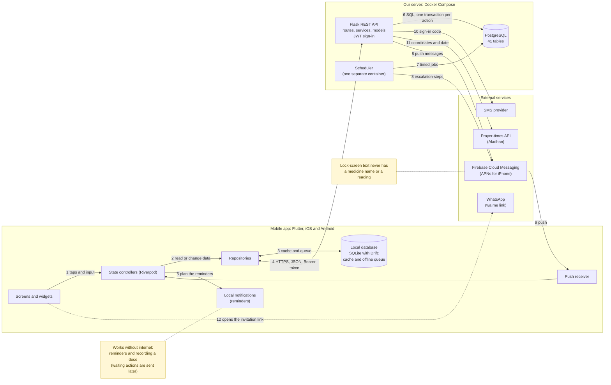
```mermaid
flowchart LR
    subgraph PHONE["Mobile app: Flutter, iOS and Android"]
        UI["Screens and widgets"]
        CTRL["State controllers (Riverpod)"]
        REPO["Repositories"]
        LDB[("Local database<br/>SQLite with Drift:<br/>cache and offline queue")]
        LN["Local notifications<br/>(reminders)"]
        PUSHIN["Push receiver"]
        UI -->|"1 taps and input"| CTRL
        CTRL -->|"2 read or change data"| REPO
        REPO <-->|"3 cache and queue"| LDB
        CTRL -->|"5 plan the reminders"| LN
        PUSHIN --> CTRL
    end

    subgraph SERVER["Our server: Docker Compose"]
        API["Flask REST API<br/>routes, services, models<br/>JWT sign-in"]
        SCH["Scheduler<br/>(one separate container)"]
        DB[("PostgreSQL<br/>41 tables")]
        API -->|"6 SQL, one transaction per action"| DB
        SCH -->|"7 timed jobs"| DB
    end

    subgraph EXT["External services"]
        FCM["Firebase Cloud Messaging<br/>(APNs for iPhone)"]
        SMS["SMS provider"]
        PRAY["Prayer-times API<br/>(Aladhan)"]
        WA["WhatsApp<br/>(wa.me link)"]
    end

    REPO <-->|"4 HTTPS, JSON, Bearer token"| API
    API -->|"10 sign-in code"| SMS
    API -->|"11 coordinates and date"| PRAY
    API -->|"8 push messages"| FCM
    SCH -->|"8 escalation steps"| FCM
    FCM -->|"9 push"| PUSHIN
    UI -.->|"12 opens the invitation link"| WA

    N1["Works without internet:<br/>reminders and recording a dose<br/>(waiting actions are sent later)"]:::note
    N2["Lock-screen text never has<br/>a medicine name or a reading"]:::note
    N1 -.- LN
    N2 -.- FCM
    classDef note fill:#fff7d6,stroke:#c9a400,color:#4a3b00
```

### 2.2 Data flow

| # | From → to | What moves | How |
| --- | --- | --- | --- |
| 1 | Screens → state controllers | What the user taps or types | Dart calls, on every action |
| 2 | State controllers → repositories | A request to read or change data | Dart calls |
| 3 | Repositories ↔ local database | The cached plan and today's tasks, the prayer times, the queue of offline actions, the planned reminders | SQLite (Drift). The app shows data without internet |
| 4 | Repositories ↔ API | Requests and answers about circles, plans, tasks, and records; the sign-in token | HTTPS and JSON with `Authorization: Bearer`. Offline actions wait in the queue and are sent later with their original time and a `client_action_id` |
| 5 | State controllers → local notifications | The reminders of today and the coming days | The phone's notification system. They fire at dose time with no internet and repeat every 10 minutes until the maximum lateness |
| 6 | API → PostgreSQL | Reads and writes of the 41 tables | SQL through SQLAlchemy, one transaction for each action |
| 7 | Scheduler → PostgreSQL | The timed jobs: mark missed tasks, escalation steps, expiries, appointment checks | SQL through the same services, every minute, five minutes, hour, or night, depending on the job |
| 8 | API and scheduler → push service | Push messages for events that involve other people: a missed dose and its escalation, the help button, an assigned task, a low supply | FCM HTTP v1 |
| 9 | Push service → phone | The same messages | FCM for Android and APNs for iPhone |
| 10 | API → SMS provider | The four-digit sign-in code | HTTPS call, when a user asks for a code. The code lasts 5 minutes |
| 11 | API → prayer-times service | The coordinates of the patient's location and the date. The five prayer times come back | HTTPS GET, once for each place and day. We cache the answer |
| 12 | Phone → WhatsApp | The invitation message with the app link | A `wa.me` link opened on the manager's phone. Nothing goes through our server |

We use two paths for alerts. A reminder at the scheduled time is a local notification made by the phone from its cached plan (arrow 5), so it works without internet. Everything that involves another person is a push notification sent by the server (arrows 8 and 9), because only the server knows that a dose was missed and who is next in the escalation order.

### 2.3 Technology of each component

| Component | Technology | What it does |
| --- | --- | --- |
| Mobile app | Flutter (Dart), Riverpod, SQLite through Drift, local notifications | Shows the screens in Arabic (right to left), keeps data on the phone, plans the reminders, and talks to the API |
| API | Python Flask REST API (JSON), SQLAlchemy, JWT | Receives requests, checks the role, applies the business rules, and answers |
| Scheduler | A separate container with one copy | Marks missed tasks, runs the escalation steps, expires requests and invitations, and sends reminders about appointments |
| Database | PostgreSQL | Stores the 41 tables with their keys and constraints |
| Delivery | Docker and Docker Compose, GitHub Actions | The same setup runs on a laptop, on staging, and on production |
| Push | Firebase Cloud Messaging, which reaches iPhones through APNs | Delivers push messages |
| SMS | An SMS provider (we propose Unifonic or Twilio) | Sends the sign-in code |
| Prayer times | A prayer-times service (we propose Aladhan), with an offline calculation as a fallback | Turns "after Asr" into a clock time |
| Invitations | A WhatsApp link opened from the manager's phone | Sends the invitation message |

## 3. Components, Classes, and Database Design

This part describes what we build in each side of the system: the classes and services of the back-end, the database, and the components of the Flutter app.

### 3.1 Back-end: classes and components

#### 3.1.1 Layers

| Layer | What it does |
| --- | --- |
| API layer (Flask blueprints) | Receives requests, checks the sign-in token, validates the input, calls a service, and returns JSON. It has no business rules. |
| Service layer | Holds the business rules. Each action is one database transaction. |
| Model layer (SQLAlchemy classes) | Maps each table to a class and holds the simple behavior of one record. |
| Cross-cutting | `PermissionPolicy` (who may do what, using `CircleMember.can()`) and the `Scheduler` (timed jobs). |

#### 3.1.2 Class diagram

The domain model has 53 boxes in six packages: 50 classes and 3 enumerations. The whole app hangs on the `Circle`: one patient, the members, the care plan, the tasks, the readings, the log, and the "needs your attention" list. A `User` joins a circle as a `CircleMember`, and the role is stored on the membership. A medicine, a measurement plan, and an appointment are `CarePlanItem`s, and they generate the `Task`s. A task can be given to someone through a `TaskAssignment`. Alerts are about an `AlertSubject`: an `Escalation` sends `Notification`s, and an `AttentionItem` waits until someone resolves it.

| Package | Boxes |
| --- | --- |
| Account (4) | `User`, `Device`, `OtpChallenge`, `OtpAttemptLimit` |
| Circles (20) | `Role`, `AppMode`, `InvitableRole`, `Circle`, `Patient`, `PatientLocation`, `MedicalProfile`, `Allergy`, `Doctor`, `EmergencyContact`, `EmergencyCard`, `Consent`, `CareAcknowledgment`, `CircleRequest`, `Invitation`, `CircleMember`, `EscalationOrder`, `EscalationEntry`, `PatientPhoneSettings`, `PatientPhoneStatus` |
| Care plan (12) | `CarePlanItem`, `ScheduledItem`, `Medication`, `MedicationQuantity`, `StockAddition`, `SupplyForecast`, `MedicationChange`, `MeasurementPlan`, `TargetRange`, `Appointment`, `AppointmentOccurrence`, `TimeSlot` |
| Tasks (5) | `Task`, `TaskAssignment`, `TemporaryHandover`, `Visit`, `SymptomReport` |
| Alerts (4) | `AlertSubject`, `Notification`, `Escalation`, `AttentionItem` |
| Records (8) | `Measurement`, `ActivityEntry`, `FamilyQuestion`, `AdherenceReport`, `CareRecordExport`, `VisitSheet`, `PrayerTimes`, `OfflineAction` |

The diagram shows every class with its attributes, its methods, and its relationships. `+` is a public member and `-` a private one, and `[0..1]` or `[0..*]` after a type means "optional" or "a list". The stereotypes mean this: `<<dataType>>` is a small value that belongs to its owner, `<<derived>>` is built when someone asks and is never stored, `<<device>>` lives on the phone only, `<<interface>>` and `<<abstract>>` are as in UML, and `<<enumeration>>` lists fixed values.

```mermaid
classDiagram
    direction TB
    namespace Account {
        class User {
            -id : UUID4
            -phoneNumber : String
            -firstName : String
            -lastName : String
            -displayName : String
            -birthYear : Integer[0..1]
            -city : String[0..1]
            -quietFrom : Time
            -quietUntil : Prayer
            -summaryAfter : Prayer
            +memberships() List~CircleMember~
            +lastUsedMembership() CircleMember[0..1]
            +exportMyData() File
            +deleteAccount() void
        }
        class Device {
            -id : UUID4
            -platform : Platform
            -pushToken : String[0..1]
            -appVersion : String
            -notificationsAllowed : Boolean
            -exactAlarmAllowed : Boolean[0..1]
            -locationAllowed : Boolean[0..1]
            -installationId : String
            +signOut() void
        }
        class OtpChallenge {
            -id : UUID4
            -phoneNumber : String
            -codeHash : String
            -sentAt : DateTime
            -validUntil : DateTime
            -resendAvailableAt : DateTime
            +verify(code : String) Boolean
            +isExpired(now : DateTime) Boolean
            +resend() void
        }
        class OtpAttemptLimit {
            -scope : LimitScope
            -key : String
            -failedAttempts : Integer
            -lockedUntil : DateTime[0..1]
            +attemptsLeft() Integer
            +recordFailure() void
            +isLocked(now : DateTime) Boolean
            +reset() void
        }
    }
    namespace Circles {
        class Role {
            <<enumeration>>
            MANAGER
            PERFORMER
            VIEWER
            PATIENT_SIMPLIFIED
        }
        class AppMode {
            <<enumeration>>
            SIMPLIFIED
            DETAILED
        }
        class InvitableRole {
            <<enumeration>>
            MANAGER
            PERFORMER
            VIEWER
        }
        class Circle {
            -id : UUID4
            -patientMode : AppMode[0..1]
            -status : CircleStatus
            -creationPath : CreationPath
            -createdAt : DateTime
            -archivedAt : DateTime[0..1]
            +invite(name : String, phone : String, role : InvitableRole) Invitation
            +archive(by : CircleMember) void
            +reopen(by : CircleMember) void
            +isReadable(now : DateTime) Boolean
            +detachPatientAccount() void
            +deleteWhenUnmanaged() void
            +exportCareRecord(by : CircleMember) CareRecordExport
            +addPlanItem(by : CircleMember, item : CarePlanItem) void
        }
        class Patient {
            -id : UUID4
            -firstName : String
            -lastName : String
            -birthYear : Integer
            -photoUrl : String[0..1]
            -phoneNumber : String[0..1]
            -afterPrayerOffsetMin : Integer = 20
            +hasPhone() Boolean
            +age() Integer
            +fullName() String
            +updatePrayerLocation(location : PatientLocation) void
            +syncIdentityFrom(user : User) void
        }
        class PatientLocation {
            <<dataType>>
            -city : String
            -latitude : Decimal
            -longitude : Decimal
            -source : LocationSource
            -updatedAt : DateTime
        }
        class MedicalProfile {
            -bloodType : String[0..1]
            -allergies : Allergy[0..*]
            -chronicConditions : String[0..*]
            -doctors : Doctor[0..*]
            +edit(by : CircleMember) void
        }
        class Allergy {
            <<dataType>>
            -name : String
            -severity : Severity[0..1]
            -reportedYear : Integer[0..1]
        }
        class Doctor {
            <<dataType>>
            -name : String
            -specialty : String[0..1]
            -place : String[0..1]
        }
        class EmergencyContact {
            -id : UUID4
            -fullName : String
            -relationToPatient : String
            -phoneNumber : String
            -displayOrder : Integer
        }
        class EmergencyCard {
            <<derived>>
            -generatedAt : DateTime
            +view(by : CircleMember) Document
        }
        class Consent {
            -givenAt : DateTime
            -scope : SharedData[1..*]
            -givenBy : User
        }
        class CareAcknowledgment {
            -declaredAt : DateTime
            -declaredBy : User
        }
        class CircleRequest {
            -id : UUID4
            -patientPhone : String
            -patientFirstName : String
            -patientLastName : String
            -mode : AppMode
            -patientRole : InvitableRole[0..1]
            -status : RequestStatus
            -createdAt : DateTime
            -expiresAt : DateTime
            +approve(patient : User) Circle
            +decline() void
            +cancel() void
            +expireIfDue(now : DateTime) void
        }
        class Invitation {
            -id : UUID4
            -invitedName : String
            -invitedPhone : String
            -role : InvitableRole
            -status : InvitationStatus
            -createdAt : DateTime
            -expiresAt : DateTime
            +isAvailable(now : DateTime) Boolean
            +accept(user : User) CircleMember
            +decline() void
            +cancel() void
            +sendWhatsAppLink() void
        }
        class CircleMember {
            -id : UUID4
            -role : Role
            -relationToPatient : String[0..1]
            -status : MemberStatus
            -joinedAt : DateTime
            -lastUsedAt : DateTime[0..1]
            +can(permission : Permission) Boolean
            +isThePatient() Boolean
            +changeRoleOf(other : CircleMember, role : InvitableRole) void
            +isLastManager() Boolean
            +leave() void
        }
        class EscalationOrder {
            -stepMinutes : Integer = 20
            +arrange(member : CircleMember, position : Integer) void
            +next(after : CircleMember[0..1]) CircleMember[0..1]
            +isEligible(member : CircleMember) Boolean
        }
        class EscalationEntry {
            -position : Integer
        }
        class PatientPhoneSettings {
            -fontSize : FontSize
            -readAloud : Boolean
            +tryAlert() void
        }
        class PatientPhoneStatus {
            -connectedSince : Date
            -lastActivityAt : DateTime[0..1]
            -appStoppedAt : DateTime[0..1]
            +stopApp() void
        }
    }
    namespace CarePlan {
        class CarePlanItem {
            <<abstract>>
            -id : UUID4
            -title : String
            -orderedBy : String[0..1]
            -startsOn : Date
            -endsOn : Date[0..1]
            -status : ItemStatus
            +generateTasks(day : Date) List~Task~
        }
        class ScheduledItem {
            <<abstract>>
            -priority : Priority
            -maxLatenessMin : Integer
            -performerMode : PerformerMode
            -repeatEveryMin : Integer = 10
            +escalates() Boolean
            +latestAt(task : Task) DateTime
        }
        class Medication {
            -scientificName : String[0..1]
            -strength : String[0..1]
            -baseDose : MedicationQuantity
            -mealRelation : MealRelation
            -durationDays : Integer[0..1]
            -instructionIcons : InstructionIcon[0..*]
            -photoUrl : String[0..1]
            -lowStockAt : MedicationQuantity[0..1]
            +changeDose(by : CircleMember, newDose : MedicationQuantity, orderedBy : String, reason : String, from : DateTime) MedicationChange
            +stop(by : CircleMember, orderedBy : String, reason : String, from : DateTime) MedicationChange
            +addStock(by : CircleMember, quantity : MedicationQuantity, addedOn : Date) StockAddition
            +recountStock(by : CircleMember, counted : MedicationQuantity) StockAddition
            +remainingStock() MedicationQuantity[0..1]
            +forecastSupply(at : DateTime) SupplyForecast
            +isLow() Boolean
            +effectiveDose(at : DateTime) MedicationQuantity[0..1]
        }
        class MedicationQuantity {
            <<dataType>>
            -value : Decimal
            -unit : String
        }
        class StockAddition {
            -kind : StockEntryKind
            -quantity : MedicationQuantity
            -addedOn : Date
            -recordedBy : CircleMember
        }
        class SupplyForecast {
            <<dataType>>
            -estimatedRunOutAt : DateTime[0..1]
            -treatmentEndsOn : Date[0..1]
            -coversTreatment : Boolean[0..1]
            -calculatedAt : DateTime
        }
        class MedicationChange {
            -kind : ChangeKind
            -previousDose : MedicationQuantity
            -newDose : MedicationQuantity[0..1]
            -orderedBy : String
            -reason : String[0..1]
            -effectiveFrom : DateTime
            -madeBy : CircleMember
            -madeAt : DateTime
        }
        class MeasurementPlan {
            -type : MeasurementType
            -context : MeasureContext
            -range : TargetRange[0..1]
            +isOutsideRange(m : Measurement) Boolean
            +stopPlan(by : CircleMember, reason : String) void
            +updateRange(by : CircleMember, range : TargetRange) void
        }
        class TargetRange {
            <<dataType>>
            -primaryLower : Decimal
            -primaryUpper : Decimal
            -secondaryLower : Decimal[0..1]
            -secondaryUpper : Decimal[0..1]
            -unit : String
            -orderedBy : String[0..1]
        }
        class Appointment {
            -kind : AppointmentKind
            -seriesStartsAt : DateTime
            -place : String[0..1]
            -repeat : RepeatRule
            -preparation : String[0..1]
            +generateOccurrences(until : Date) List~AppointmentOccurrence~
            +rescheduleSeries(by : CircleMember, startsAt : DateTime) void
            +cancel(by : CircleMember, reason : String) void
        }
        class AppointmentOccurrence {
            -id : UUID4
            -startsAt : DateTime
            -status : AppointmentStatus
            +assignCompanion(by : CircleMember, member : CircleMember) void
            +askCircle() void
            +volunteer(member : CircleMember) void
            +hasCompanion() Boolean
            +reschedule(by : CircleMember, startsAt : DateTime) void
            +cancel(by : CircleMember, reason : String) void
        }
        class TimeSlot {
            <<dataType>>
            -kind : SlotKind
            -prayer : Prayer[0..1]
            -exactTime : Time[0..1]
            -daysOfWeek : DayOfWeek[0..7]
            +resolve(day : Date, times : PrayerTimes, offsetMin : Integer) DateTime
        }
    }
    namespace Tasks {
            class Task {
                -id : UUID4
                -kind : TaskKind
                -title : String
                -dueAt : DateTime
                -prayerPeriod : Prayer[0..1]
                -plannedDose : MedicationQuantity[0..1]
                -status : TaskStatus
                -postponedUntil : DateTime[0..1]
                -latestAt : DateTime[0..1]
                -recordedAt : DateTime[0..1]
                -recordedBy : CircleMember[0..1]
                -basis : RecordBasis[0..1]
                -doseTaken : MedicationQuantity[0..1]
                -outcome : PatientOutcome[0..1]
                -voiceNoteUrl : String[0..1]
                -note : String[0..1]
                -clientActionId : UUID4[0..1]
                -version : Integer
                +complete(by : CircleMember, takenAt : DateTime, actionId : UUID4) RecordResult
                +logFor(by : CircleMember, basis : RecordBasis, at : DateTime) RecordResult
                +editRecord(newTime : DateTime) void
                +postpone(until : DateTime) void
                +couldNot(reason : String) void
                +markMissed() void
                +displayStatus(now : DateTime) DisplayStatus
                +firstRecipients() List~CircleMember~
                +needsAttention() Boolean
            }
            class TaskAssignment {
                -status : AssignmentStatus
                -source : AssignmentSource
                -assignedBy : CircleMember
                -note : String[0..1]
                -remindWhenBoxArrives : Boolean
                -createdAt : DateTime
                -respondBy : DateTime
                -respondedAt : DateTime[0..1]
                -completedAt : DateTime[0..1]
                -declineReason : String[0..1]
                +accept() void
                +decline(reason : String) void
                +complete(at : DateTime) void
                +expireIfDue(now : DateTime) void
                +reassign(to : CircleMember) TaskAssignment
            }
            class TemporaryHandover {
                -periodFrom : DateTime
                -periodTo : DateTime
                -scope : HandoverScope
                -status : HandoverStatus
                +propose() List~TaskAssignment~
                +sendRequests() void
                +statusBoard() List~TaskAssignment~
                +end() void
            }
            class Visit {
                -date : Date
                -status : VisitStatus
                -notes : String[0..1]
                -voiceNoteUrl : String[0..1]
                -reportPhotoUrls : String[0..*]
                -savedAt : DateTime[0..1]
                -savedBy : CircleMember[0..1]
                -companionRightsUntil : DateTime[0..1]
                +save(by : CircleMember) void
                +mayEdit(member : CircleMember, now : DateTime) Boolean
                +addNextAppointment() Appointment
            }
            class SymptomReport {
                -reasons : Symptom[1..*]
                -voiceNoteUrl : String[0..1]
                -reportedAt : DateTime
                +askDoctor() FamilyQuestion
            }
        }
        namespace Alerts {
            class AlertSubject {
                <<interface>>
                +circle() Circle
                +lockScreenText() String
            }
            class Notification {
                -type : NotificationType
                -strength : Strength
                -channel : Channel
                -scheduledAt : DateTime
                -deliveredAt : DateTime[0..1]
                -openedAt : DateTime[0..1]
                -respondedAt : DateTime[0..1]
                -response : ResponseAction[0..1]
                +deliver() void
                +open() void
                +respond(action : ResponseAction) void
            }
            class Escalation {
                -trigger : EscalationTrigger
                -status : EscalationStatus
                -startedAt : DateTime
                -step : Integer
                -respondedBy : CircleMember[0..1]
                -respondedAt : DateTime[0..1]
                +start() void
                +notifyNext() void
                +respond(by : CircleMember) void
                +isExhausted() Boolean
            }
            class AttentionItem {
                -kind : AttentionKind
                -importance : Integer
                -raisedAt : DateTime
                -resolvedAt : DateTime[0..1]
                -resolvedBy : CircleMember[0..1]
                -resolution : Resolution[0..1]
                +resolve(by : CircleMember, how : Resolution) void
                +actions() List~AttentionAction~
            }
        }
        namespace Records {
            class Measurement {
                -id : UUID4
                -type : MeasurementType
                -primaryValue : Decimal
                -secondaryValue : Decimal[0..1]
                -pulse : Integer[0..1]
                -unit : String
                -context : MeasureContext[0..1]
                -measuredAt : DateTime
                -rangeAtRecording : TargetRange[0..1]
                -recordedBy : CircleMember
                -clientActionId : UUID4[0..1]
                +isOutsideRange() Boolean
            }
            class ActivityEntry {
                -type : ActivityType
                -occurredAt : DateTime
                -recordedAt : DateTime
                -actor : CircleMember[0..1]
                -onBehalf : Boolean
                -failed : Boolean
                -details : Json
                -clientActionId : UUID4[0..1]
                +record(type : ActivityType, actor : CircleMember, details : Json) ActivityEntry
            }
            class FamilyQuestion {
                -text : String
                -addedBy : CircleMember
                -addedAt : DateTime
                +addToVisitSheet() void
            }
            class AdherenceReport {
                <<derived>>
                -periodDays : Integer
                -onTimeShare : Decimal
                -onTimeCount : Integer
                -scheduledCount : Integer
                -lateCount : Integer
                -missedCount : Integer
                -outsideRangeCount : Integer
                +calendar(month : Date) List~DayColor~
                +perMedicine() List~DoseCount~
                +compareWithPrevious() AdherenceReport
            }
        class CareRecordExport {
            <<derived>>
            -generatedAt : DateTime
            +exportPdf() File
        }
        class VisitSheet {
                <<derived>>
                -periodDays : Integer = 30
                -generatedAt : DateTime
                -footer : String
                +preview() Document
                +exportPdf() File
                +showOnScreen() void
            }
            class PrayerTimes {
                -latitude : Decimal
                -longitude : Decimal
                -date : Date
                -times : Map~Prayer, Time~
                -source : TimeSource
                +periodOf(t : Time) Prayer
            }
            class OfflineAction {
                <<device>>
                -clientActionId : UUID4
                -kind : ActionKind
                -payload : Json
                -originalTime : DateTime
                -status : SyncStatus
                +send() RecordResult
                +retry() void
            }
        }
    User "0..1" --> "0..*" Device : signs in on
    OtpChallenge "0..*" --> "1" Device : requested from
    Device ..> OtpAttemptLimit : counted by installationId
    OtpChallenge "0..*" --> "2" OtpAttemptLimit : checks device and number
    Circle "1" *-- "1" Patient : cares for
    Circle "1" *-- "1..*" CircleMember : members
    User "1" --> "0..*" CircleMember : joins as
    Patient "0..1" --> "0..1" User : own account
    Patient "1" *-- "1" PatientLocation : prayer location
    Patient "1" *-- "1" MedicalProfile : medical file
    Patient "1" *-- "0..1" PatientPhoneSettings : phone settings
    Patient "1" *-- "0..1" PatientPhoneStatus : phone access
    PatientPhoneStatus "0..1" --> "0..1" Device : installed on
    MedicalProfile "1" *-- "0..*" EmergencyContact : emergency contacts
    EmergencyCard ..> Patient : full name
    EmergencyCard ..> MedicalProfile : health details and contacts
    EmergencyCard ..> Medication : current medicines
    Circle ..> EmergencyCard : shows
    Circle "1" *-- "0..*" Consent : patient consent history
    Circle "1" *-- "0..1" CareAcknowledgment : creator declaration
    Circle "1" *-- "1" EscalationOrder : notification order
    EscalationOrder "1" *-- "0..*" EscalationEntry : positions
    EscalationEntry "0..*" --> "1" CircleMember : ranks
    Circle "1" *-- "0..*" Invitation : invites
    Invitation "0..1" --> "0..1" CircleMember : becomes
    Invitation "0..*" --> "1" CircleMember : invited by
    CircleRequest "0..*" --> "1" User : created by
    CircleRequest "0..1" --> "0..1" Circle : creates when approved
    CircleRequest "0..*" --> "0..1" User : patient approves
    Circle "1" *-- "0..*" CarePlanItem : care plan
    CarePlanItem <|-- ScheduledItem
    ScheduledItem <|-- Medication
    ScheduledItem <|-- MeasurementPlan
    CarePlanItem <|-- Appointment
    ScheduledItem "1" *-- "1..*" TimeSlot : times
    ScheduledItem "0..*" --> "0..1" CircleMember : specific performer
    Medication "1" *-- "0..*" MedicationChange : history
    Medication "1" *-- "0..*" StockAddition : stock additions
    Medication ..> SupplyForecast : calculates
    AppointmentOccurrence "0..*" --> "0..1" CircleMember : companion
    Appointment "1" *-- "0..*" AppointmentOccurrence : occurrences
    AppointmentOccurrence "1" *-- "0..1" Visit : visit
    MedicationChange "0..*" --> "0..1" Visit : made at
    PatientLocation ..> PrayerTimes : coordinates for
    Circle ..> CareRecordExport : exports
    CareRecordExport ..> CarePlanItem : current plan
    CareRecordExport ..> MedicationChange : medication history
    CareRecordExport ..> Measurement : readings
    CareRecordExport ..> Appointment : scheduled appointments
    CareRecordExport ..> AppointmentOccurrence : appointment history
    CareRecordExport ..> Visit : visit records
    CareRecordExport ..> Patient : who
    CareRecordExport ..> MedicalProfile : health details
    Circle "1" *-- "0..*" Task : tasks
    CarePlanItem "0..1" --> "0..*" Task : generates
    AppointmentOccurrence "0..1" --> "0..1" Task : appointment task
    Task "1" *-- "0..*" TaskAssignment : assigned through
    TaskAssignment "0..*" --> "1" CircleMember : assigned to
    Task "0..*" --> "0..1" CircleMember : responsible
    TemporaryHandover "1" o-- "0..*" TaskAssignment : transfer requests
    User "1" --> "0..*" TemporaryHandover : asks to hand over
    TemporaryHandover "0..*" --> "0..*" Circle : covers
    Task "1" o-- "0..1" SymptomReport : reports
    Task ..|> AlertSubject
    Measurement ..|> AlertSubject
    SymptomReport ..|> AlertSubject
    Medication ..|> AlertSubject
    Notification "0..*" --> "0..1" AlertSubject : about
    Notification "0..*" --> "1" User : sent to
    Escalation "0..*" --> "0..1" AlertSubject : about
    Escalation "1" *-- "1..*" Notification : steps
    Escalation "0..*" --> "1" EscalationOrder : follows
    AttentionItem "0..*" --> "0..1" AlertSubject : about
    Circle "1" *-- "0..*" AttentionItem : needs attention
    Circle "1" *-- "0..*" Measurement : measurements
    Measurement "0..*" --> "0..1" MeasurementPlan : follows
    Measurement "0..1" --> "0..1" Task : fulfils
    Circle "1" *-- "0..*" ActivityEntry : log
    Circle "1" *-- "0..*" FamilyQuestion : questions
    FamilyQuestion "0..*" --> "0..1" SymptomReport : from
    AdherenceReport ..> Task
    AdherenceReport ..> Measurement
    VisitSheet ..> AdherenceReport
    VisitSheet ..> MedicalProfile
    VisitSheet ..> FamilyQuestion
    VisitSheet ..> MedicationChange
    VisitSheet ..> Measurement
    TimeSlot ..> PrayerTimes : resolved with
    OfflineAction ..> Task : replays
    OfflineAction ..> Measurement : replays
```

#### 3.1.3 Key classes

This is what each class is for, package by package. The attributes and methods are in the diagram above.

**Account**

| Class | What it is for |
| --- | --- |
| `User` | A person with a phone number who signs in. Holds the first and last name, the display name, the quiet-time setting, and the user's own city (used only for his quiet-time prayers). |
| `Device` | One installation of the app: push token, the notification, exact-alarm, and location permissions, and the installation id. The sign-in lock is kept in `OtpAttemptLimit`, not here. |
| `OtpChallenge` | The four-digit SMS code: its hash, the resend countdown, and a 5-minute life. It checks two limits, the device's and the phone number's. |
| `OtpAttemptLimit` | The count of wrong codes and the 24-hour lock for one key: an installation id (scope `DEVICE`) or a phone number (scope `PHONE_NUMBER`). Every code is checked against both. Asking for a new code does not reset the count. |

**Circles**

| Class | What it is for |
| --- | --- |
| `Role`, `AppMode`, `InvitableRole` (enumerations) | `Role` has four values: `MANAGER`, `PERFORMER`, `VIEWER`, `PATIENT_SIMPLIFIED`. `AppMode` is `SIMPLIFIED` or `DETAILED`. `InvitableRole` is the three roles an invitation can carry. |
| `Circle` | One patient, one circle. Carries the mode, chosen once (empty when the patient has no phone, because there is no patient app to put in a mode). Can be archived and reopened, and can export the care record. |
| `Patient` | What the creator typed about the patient: first and last name, birth year, photo, phone. Holds the "after the prayer" minutes (20 by default). No phone means no account and no membership. |
| `PatientLocation` (value) | The patient's one location: city, latitude, longitude, the source (`GPS` or `MANUAL`), and when it was set. It is used only to get the prayer times. |
| `MedicalProfile` | The medical file: blood type, allergies, chronic diseases, doctors as names, and the emergency contacts. Feeds the visit sheet and the emergency card. |
| `Allergy` (value) | A name, a severity (`MILD`, `MODERATE`, `SEVERE`), and the year it was reported. |
| `Doctor` (value) | A typed name, with a specialty and a place if known. There are no doctor accounts. |
| `EmergencyContact` | A typed name, a relation to the patient, a phone number, and a place in the order. It has no account and no membership, and the app never sends it anything. |
| `EmergencyCard` (derived) | One page built when someone opens it, from the patient's name, the medical file (blood type, allergies, chronic diseases, emergency contacts), and the medicines that are active now. Nothing is stored, so it cannot be out of date. |
| `Consent` | The patient's approval, with its date, what the family will see, and who gave it. A circle can hold more than one, as a history. Only a circle for a patient with a phone has one. |
| `CareAcknowledgment` | The creator's declaration that he manages the care of a patient with no phone, with its date. Only a circle for a patient with no phone has one. |
| `CircleRequest` | The request that waits up to 24 hours for the patient's approval. It holds the patient's first and last name and the role the creator chose for him. |
| `Invitation` | An invitation to a phone number with a role (Manager, Performer, or Viewer). It can be cancelled and expires after 7 days. There is no code. |
| `CircleMember` | A person's place in one circle, with one of the four stored roles. |
| `EscalationOrder` | The order in which members are told about an urgent alert, arranged by the manager. |
| `EscalationEntry` | One member's place in the order. |
| `PatientPhoneSettings` | Font size and read-aloud. Exists only for a Simplified circle whose patient has a phone. |
| `PatientPhoneStatus` | The link with the patient's phone: the device it is installed on, since when it is connected, the last activity, and when a manager stopped the app. Exists only where the settings exist. |

**Care plan**

| Class | What it is for |
| --- | --- |
| `CarePlanItem` (abstract) | The shared part of a medicine, a measurement plan, and an appointment: title, who ordered it (a name), dates, and status. |
| `ScheduledItem` (abstract) | The part only a medicine and a measurement plan share: priority, maximum lateness (set by the manager), who performs it, and the 10-minute repeat. |
| `Medication` | Name, strength, the dose (a `MedicationQuantity`), relation to food, and the low-stock level. The pills left are worked out and never stored. Changing the dose or stopping goes through `MedicationChange`. |
| `MedicationQuantity` (value) | A number with its own unit, for example 0.5 tablet. Used for the dose, the low-stock level, and the stock entries. |
| `StockAddition` | One entry of the stock: a new box (`BOX_ADDED`) or a recount (`RECOUNT`), with a quantity, a date, and who recorded it. |
| `SupplyForecast` (value) | The estimated run-out date, the end of the treatment, and whether the stock covers it. Worked out when asked and never stored. |
| `MedicationChange` | A dose change or a stop: by whose order, why, and from when. Together these records are the "previous medicines" list. |
| `MeasurementPlan` | Sugar or pressure, its context, and the range the doctor set. An empty range is allowed. |
| `TargetRange` (value) | The lower and upper numbers for one reading (sugar) or two (pressure), the unit, and who ordered it. Set by the manager from what the doctor said. |
| `Appointment` | A series: kind, the date of the first visit, place, repeat, and preparation. Each date is an `AppointmentOccurrence`. |
| `AppointmentOccurrence` | One date of an appointment: its status (`SCHEDULED`, `DONE`, `CANCELLED`), its companion, and its visit. |
| `TimeSlot` (value) | A prayer period or a fixed hour, on chosen days. |

**Tasks**

| Class | What it is for |
| --- | --- |
| `Task` | One scheduled dose, measurement, or appointment on one day. It holds what was recorded and by whom. It is the center of the Today view. |
| `TaskAssignment` | Giving the same card to a person. Keeps accepted, declined, expired, and finished requests as history. The receiver has 30 minutes to answer, and an accepted assignment can be finished (`COMPLETED`) without changing the card. |
| `TemporaryHandover` | "I'm busy": a period, the circles it covers, and one transfer request per task. |
| `Visit` | "What did the doctor say?" at one date of an appointment: notes, voice, photos, and the companion's temporary rights. |
| `SymptomReport` | The reasons a patient gives when a medicine bothers them. It can become a question for the doctor. |

**Alerts**

| Class | What it is for |
| --- | --- |
| `AlertSubject` (interface) | What an alert is about: a task, a reading, a side-effect report, or a medicine. |
| `Notification` | One alert to one user, with its strength, and whether it was delivered, opened, or answered. It never changes a task's status. |
| `Escalation` | One run of alerts for an urgent event: who was told, when, and who responded. |
| `AttentionItem` | A line in "needs your attention". It stays until someone completes or reassigns it. |

**Records**

| Class | What it is for |
| --- | --- |
| `Measurement` | A sugar or blood-pressure reading with its original time and the range that applied when it was saved (`rangeAtRecording`). |
| `ActivityEntry` | One line of the activity log: what, who, when, and whether it was done for the patient. |
| `FamilyQuestion` | A question for the doctor. It goes to the visit sheet. |
| `AdherenceReport` (derived) | The calendar, the per-medicine counts, and the care report. Built only from recorded statuses and never stored. |
| `CareRecordExport` (derived) | A PDF of the whole care record: the patient, the medical file, the current plan, the medicine history, the readings, the appointments, and the visits. Made when a manager asks, never stored. |
| `VisitSheet` (derived) | The one page for the doctor. Never stored; built when asked. |
| `PrayerTimes` | The five prayer times for a place (latitude and longitude) and a day, cached, with an offline calculation as the fallback. |
| `OfflineAction` (device) | A record made without internet, with its original time and a client action id. It lives on the phone only. |

#### 3.1.4 Services

The services hold the business rules. An arrow in the diagram means "calls". To keep it readable we leave out `PermissionPolicy`, which every service that reads or changes a circle's data calls first, and the three services that only their own route group calls (`AuthService`, `AccountService`, and `ReportService`).

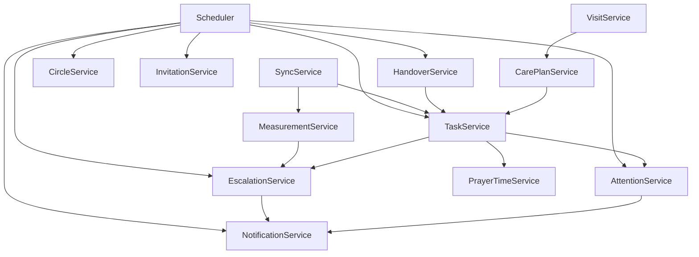
```mermaid
flowchart TB
    Sched["Scheduler"]
    Sync["SyncService"]

    Visit["VisitService"]
    Hand["HandoverService"]
    CircleS["CircleService"]
    Inv["InvitationService"]

    Plan["CarePlanService"]
    Meas["MeasurementService"]

    Task["TaskService"]

    Esc["EscalationService"]
    Att["AttentionService"]
    Prayer["PrayerTimeService"]

    Notif["NotificationService"]

    Sched --> Task
    Sched --> Esc
    Sched --> CircleS
    Sched --> Inv
    Sched --> Hand
    Sched --> Notif
    Sched --> Att
    Sync --> Task
    Sync --> Meas
    Visit --> Plan
    Hand --> Task
    Plan --> Task
    Meas --> Esc
    Task --> Esc
    Task --> Att
    Task --> Prayer
    Esc --> Notif
    Att --> Notif
```

| Service | What it does | Main operations |
| --- | --- | --- |
| `AuthService` | Sends a four-digit code by SMS (valid for 5 minutes), checks it, counts wrong codes on the device and on the phone number, locks sign-in for 24 hours after the third, and issues tokens. | `requestCode`, `verifyCode`, `refresh`, `signOut` |
| `AccountService` | Returns the user's circles with the role in each, keeps the profile and quiet time, exports the user's data, and deletes an account after the user has left every circle. | `me`, `updateProfile`, `setQuietTime`, `exportMyData`, `deleteAccount` |
| `CircleService` | Creates a circle for oneself or a request for someone else, answers requests, changes roles, removes members, archives and reopens, keeps the medical file and the patient's location, and applies the last-manager rule and the one-number-one-circle rule. | `createCircle`, `createRequest`, `answerRequest`, `changeRole`, `leave`, `archive`, `reopen`, `setEscalationOrder`, `setPatientLocation`, `setMedicalProfile`, `stopPatientApp` |
| `InvitationService` | Creates an invitation to a phone number with a role, builds the WhatsApp link, and cancels, accepts, declines, or expires it. | `invite`, `pending`, `accept`, `decline`, `cancel`, `expire` |
| `PermissionPolicy` | One place that decides whether a member's role allows an action. Every service calls it. | `can`, `require` |
| `CarePlanService` | Adds and changes medicines, measurement plans, and appointments, changes a dose or stops a medicine (history kept), counts the stock, and plans the dates and the companion of an appointment. | `addMedication`, `changeDose`, `stopMedication`, `addStock`, `recountStock`, `addMeasurementPlan`, `addAppointment`, `assignCompanion` |
| `TaskService` | Creates the day's tasks from the plan, records a task (the first valid record wins), logs for the patient, postpones, records "could not", marks missed, and handles assignments. | `today`, `record`, `logFor`, `postpone`, `couldNot`, `assign`, `answerAssignment`, `completeAssignment`, `reportSymptoms` |
| `EscalationService` | Starts an escalation, notifies the next person in the order every 20 minutes, and stops when someone responds or nobody is left. | `start`, `notifyNext`, `respond` |
| `AttentionService` | Raises, lists (most important first), and resolves "needs your attention" items. | `raise`, `list`, `resolve`, `remind` |
| `NotificationService` | Stores device tokens, chooses the channel and strength, keeps health details out of the lock-screen text, applies quiet time, and sends the one summary after Isha. | `send`, `open`, `respond`, `registerDevice`, `sendDailySummary` |
| `MeasurementService` | Saves readings with the range that applied, alerts the managers when a reading is outside it, and prepares history and chart data. | `record`, `history`, `chartData` |
| `HandoverService` | Proposes the tasks to hand over, sends the transfer requests, shows who accepted, and ends the handover. | `propose`, `sendRequests`, `statusBoard`, `end` |
| `VisitService` | Saves a visit, applies the companion's temporary rights, and adds the next appointment. | `save`, `addNextAppointment` |
| `ReportService` | Builds the activity feed, the adherence calendar, the care report, the visit sheet, the emergency card, and the care record export. | `activityFeed`, `adherence`, `careReport`, `visitSheet`, `emergencyCard`, `careRecordExport`, `addQuestion` |
| `SyncService` | Replays the actions recorded offline, ignores duplicates, and returns a result for each action. | `applyActions` |
| `PrayerTimeService` | Returns prayer times for coordinates and a day from the cache, refreshes them, and calculates them offline if the outside service is down. | `timesFor`, `refresh`, `calculateOffline` |
| `Scheduler` | Runs the timed jobs: generate tasks every night, mark missed tasks every minute, run the escalation steps every minute, expire assignments, circle requests, and invitations, check appointments, end handovers, and send the daily summary. | `runJobs` |

#### 3.1.5 Roles and permissions

`CircleMember.can(permission)` answers from the role. The table has one row for each of the 16 permissions. The server checks the permission on every request; the app only uses it to hide buttons. In a Detailed circle a patient gets the role the manager chose for him (Manager, Performer, or Viewer) and uses that column.

| Permission | Self-manager | Manager | Performer | Viewer | Patient (Simplified) |
| --- | --- | --- | --- | --- | --- |
| `SEE_PLAN`: see Today, plan, log, and charts | Yes | Yes | Yes | Yes | His one page only |
| `CARRY_OUT_OWN_TASKS`: carry out the tasks assigned to them | Yes | Yes | Yes | No | Yes |
| `LOG_FOR_PATIENT`: log a dose or a measurement for the patient | No (he is the patient) | Yes | Only tasks assigned to them | No | No |
| `EDIT_PLAN`: add or edit medicines, appointments, measurements, and the medical file | Yes | Yes | No | No | No |
| `CHANGE_DOSE`: change a dose or stop a medicine | Yes | Yes | Only as the visit companion | No | No |
| `SET_RANGES_AND_PRIORITY`: set ranges, maximum lateness, and priority | Yes | Yes | No | No | No |
| `ASSIGN_TASKS`: assign or reassign tasks | Yes | Yes | No | No | No |
| `ANSWER_ASSIGNMENT`: accept, decline, or finish a task assigned to them | Yes | Yes | Yes | No | No |
| `MANAGE_MEMBERS`: invite, change roles, remove members | Yes | Yes | No | No | No |
| `ARRANGE_ESCALATION`: arrange the escalation order | Yes | Yes | No | No | No |
| `HAND_OVER_TASKS`: hand over tasks ("I'm busy") | Yes | Yes | Yes | No | No |
| `SHARE_VISIT_SHEET`: share the visit sheet | Yes | Yes | No | No | No |
| `EXPORT_CARE_RECORD`: export the care record as a PDF | Yes | Yes | No | No | No |
| `SET_PATIENT_PHONE`: set the patient's phone (font size, read aloud) | No | Yes | No | No | No |
| `LEAVE_CIRCLE`: leave the circle alone | Yes | Yes | Yes | Yes | No (a manager stops the app on his phone) |
| `ARCHIVE_CIRCLE`: archive the circle | Yes | Yes | No | No | No |

A circle can have several managers with the same rights. A manager can change another member's role but not his own, and nobody can remove or demote the Self-manager. When the last manager leaves, the circle is archived after a warning.

### 3.2 Database: ER diagram (PostgreSQL)

We chose a relational database and describe it with ER diagrams. The database has 41 tables in six areas. Thirty-nine classes of the model have a table of their own, and two more tables (`patient_conditions` and `handover_circles`) are child tables. The other boxes of the model are not tables: the 3 enumerations are text columns with a `CHECK`, 4 boxes are stored as columns of another table (`PatientLocation`, `MedicationQuantity`, `TargetRange`, `ScheduledItem`), `AlertSubject` is stored as four optional links, 5 boxes are worked out when someone asks and are never stored (`EmergencyCard`, `SupplyForecast`, `AdherenceReport`, `CareRecordExport`, `VisitSheet`), and `OfflineAction` lives on the phone only.

In the diagrams `PK` is a primary key, `FK` a foreign key, and `UK` a unique key. A column marked `required` cannot be empty; the others are optional. All ids are UUIDs. The types are PostgreSQL types: `uuid`, `string` (text), `int`, `decimal`, `boolean`, `date`, `time`, `timestamp`, and `json`.

**The main rules of the schema**

| Rule | How we store it |
| --- | --- |
| One patient per circle | `patients.circle_id` is unique |
| One phone number, one active patient circle | `patients.active_phone` is unique, and we empty it when the circle is archived |
| A person is a member of a circle once | `circle_members` is unique on (`circle_id`, `user_id`), and the role is a column of this table |
| Enumerated values (roles, statuses, kinds) | Text columns with a `CHECK` that lists the values |
| Quantities (a dose, a stock count) | Two columns, a `_value` and a `_unit`, so "0.5 tablet" and "5 ml" are never mixed |
| The patient's location | Five columns of `patients` (city, latitude, longitude, source, time) |
| The pills left in a box | Not stored. We work them out from `stock_additions` (new boxes and recounts) and the doses done |
| No duplicate tasks | `tasks` is unique on (`time_slot_id`, `due_at`) and on `occurrence_id`, and `client_action_id` is unique, so a repeated request is ignored |
| One writer wins | `tasks.version` goes up on every change, and an update with an old version is rejected |
| Nothing is deleted | There is no delete for medicines, tasks, readings, or log lines. We stop a medicine and keep its history |

#### How the 41 tables connect

The overview shows the tables and their foreign keys. To keep it readable it leaves out the columns that point to `circle_members` ("who did it", "who is responsible") and to `users`, the `circle_id` column of the smaller tables, and the four optional links of `notifications`, `escalations`, and `attention_items` to the thing an alert is about. `otp_attempt_limits` and `prayer_times` have no foreign key, so they have no line. All of these are in the detailed diagrams below.

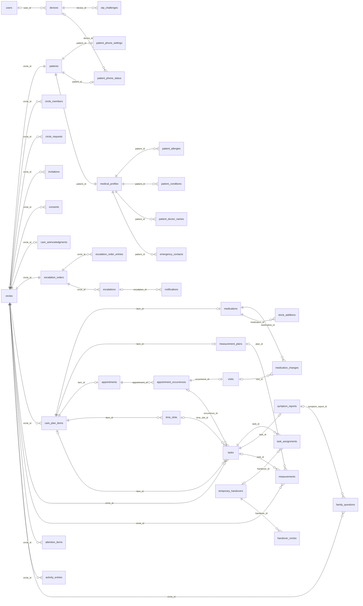
```mermaid
erDiagram
    direction LR
    users |o--o{ devices : user_id
    devices ||--o{ otp_challenges : device_id
    circles ||--|| patients : circle_id
    circles ||--o{ circle_members : circle_id
    circles |o--o{ circle_requests : circle_id
    circles ||--o{ invitations : circle_id
    circles ||--o{ consents : circle_id
    circles ||--o| care_acknowledgments : circle_id
    circles ||--|| escalation_orders : circle_id
    escalation_orders ||--o{ escalation_order_entries : circle_id
    patients ||--o| patient_phone_settings : patient_id
    patients ||--o| patient_phone_status : patient_id
    devices |o--o{ patient_phone_status : device_id
    patients ||--|| medical_profiles : patient_id
    medical_profiles ||--o{ patient_allergies : patient_id
    medical_profiles ||--o{ patient_conditions : patient_id
    medical_profiles ||--o{ patient_doctor_names : patient_id
    medical_profiles ||--o{ emergency_contacts : patient_id
    care_plan_items ||--o| medications : item_id
    care_plan_items ||--o| measurement_plans : item_id
    care_plan_items ||--o| appointments : item_id
    care_plan_items ||--o{ time_slots : item_id
    appointments ||--o{ appointment_occurrences : appointment_id
    appointment_occurrences ||--o| visits : occurrence_id
    medications ||--o{ medication_changes : medication_id
    visits |o--o{ medication_changes : visit_id
    medications ||--o{ stock_additions : medication_id
    tasks ||--o{ task_assignments : task_id
    temporary_handovers |o--o{ task_assignments : handover_id
    temporary_handovers ||--o{ handover_circles : handover_id
    tasks ||--o| symptom_reports : task_id
    escalations |o--o{ notifications : escalation_id
    care_plan_items |o--o{ tasks : item_id
    time_slots |o--o{ tasks : time_slot_id
    appointment_occurrences |o--o{ tasks : occurrence_id
    escalation_orders ||--o{ escalations : circle_id
    measurement_plans |o--o{ measurements : plan_id
    tasks |o--o{ measurements : task_id
    symptom_reports |o--o{ family_questions : symptom_report_id
    circles ||--o{ care_plan_items : circle_id
    circles ||--o{ tasks : circle_id
    circles ||--o{ measurements : circle_id
    circles ||--o{ attention_items : circle_id
    circles ||--o{ activity_entries : circle_id
    circles ||--o{ family_questions : circle_id
```

#### A. People and sign-in

These tables hold the accounts, the installations, and the sign-in steps. The wrong codes are counted in their own table, for the device and for the phone number, so a lock survives signing out and reinstalling.

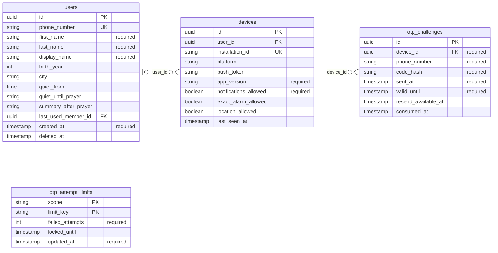
```mermaid
---
config:
  er:
    entityPadding: 5
    minEntityWidth: 60
    minEntityHeight: 30
  flowchart:
    nodeSpacing: 15
    rankSpacing: 25
---
erDiagram
    direction LR
    users {
        uuid id PK
        string phone_number UK
        string first_name "required"
        string last_name "required"
        string display_name "required"
        int birth_year
        string city
        time quiet_from
        string quiet_until_prayer
        string summary_after_prayer
        uuid last_used_member_id FK
        timestamp created_at "required"
        timestamp deleted_at
    }
    devices {
        uuid id PK
        uuid user_id FK
        string installation_id UK
        string platform
        string push_token
        string app_version "required"
        boolean notifications_allowed "required"
        boolean exact_alarm_allowed
        boolean location_allowed
        timestamp last_seen_at
    }
    otp_challenges {
        uuid id PK
        uuid device_id FK "required"
        string phone_number "required"
        string code_hash "required"
        timestamp sent_at "required"
        timestamp valid_until "required"
        timestamp resend_available_at
        timestamp consumed_at
    }
    otp_attempt_limits {
        string scope PK
        string limit_key PK
        int failed_attempts "required"
        timestamp locked_until
        timestamp updated_at "required"
    }
    users |o--o{ devices : user_id
    devices ||--o{ otp_challenges : device_id
```

| Table | Class | What it holds |
| --- | --- | --- |
| `users` | `User` | A person with a phone number. Quiet-time settings live here. |
| `devices` | `Device` | One installation of the app. It holds the push token and the permissions, including the GPS permission. |
| `otp_challenges` | `OtpChallenge` | One four-digit code sent by SMS. |
| `otp_attempt_limits` | `OtpAttemptLimit` | The wrong-code count and the 24-hour lock, one row for each installation id and one for each phone number. |

#### B1. Circles, members, and invitations

Everything hangs on the circle. The role is stored on the membership, so one person can be a manager in one circle and a viewer in another. The patient's location is not a table: it is five columns of `patients` (`PatientLocation` in the model).


```mermaid
---
config:
  er:
    entityPadding: 5
    minEntityWidth: 60
    minEntityHeight: 30
  flowchart:
    nodeSpacing: 15
    rankSpacing: 25
---
erDiagram
    circles {
        uuid id PK
        string patient_mode
        string status "required"
        string creation_path "required"
        uuid created_by_user_id FK "required"
        timestamp created_at "required"
        timestamp archived_at
    }
    patients {
        uuid id PK
        uuid circle_id UK, FK "required"
        string first_name "required"
        string last_name "required"
        int birth_year "required"
        string photo_url
        string phone_number
        string active_phone UK
        uuid user_id FK
        int after_prayer_offset_min "required"
        string city "required"
        decimal latitude "required"
        decimal longitude "required"
        string location_source "required"
        timestamp location_updated_at "required"
    }
    circle_members {
        uuid id PK
        uuid circle_id FK "required"
        uuid user_id FK "required"
        string role "required"
        string relation_to_patient
        string status "required"
        timestamp joined_at "required"
        timestamp last_used_at
        timestamp left_at
    }
    circle_requests {
        uuid id PK
        uuid creator_user_id FK "required"
        string patient_phone "required"
        string patient_first_name "required"
        string patient_last_name "required"
        string mode "required"
        string patient_role
        json patient_details
        string status "required"
        timestamp created_at "required"
        timestamp expires_at "required"
        uuid circle_id FK
    }
    invitations {
        uuid id PK
        uuid circle_id FK "required"
        string invited_name "required"
        string invited_phone "required"
        string role "required"
        string status "required"
        uuid invited_by_member_id FK "required"
        timestamp created_at "required"
        timestamp expires_at "required"
        timestamp responded_at
        uuid member_id FK
    }
    consents {
        uuid id PK
        uuid circle_id FK "required"
        timestamp given_at "required"
        uuid given_by_user_id FK "required"
        string shared_data "required"
    }
    care_acknowledgments {
        uuid circle_id PK, FK
        timestamp declared_at "required"
        uuid declared_by_user_id FK "required"
    }
    circles ||--|| patients : circle_id
    circles ||--o{ circle_members : circle_id
    circles |o--o{ circle_requests : circle_id
    circles ||--o{ invitations : circle_id
    circle_members ||--o{ invitations : invited_by_member_id
    circle_members |o--o{ invitations : member_id
    circles ||--o{ consents : circle_id
    circles ||--o| care_acknowledgments : circle_id
```

| Table | Class | What it holds |
| --- | --- | --- |
| `circles` | `Circle` | The root of everything: one patient, one circle. The mode is fixed at creation. |
| `patients` | `Patient`, `PatientLocation` | What the creator typed about the patient, and his one location. No phone means no account and no membership. |
| `circle_members` | `CircleMember` | A person's place in one circle, with one of the four stored roles. |
| `circle_requests` | `CircleRequest` | The request that waits up to 24 hours for a patient's approval. |
| `invitations` | `Invitation` | An invitation to a phone number with a role. There is no code. |
| `consents` | `Consent` | The patient's approval of what the circle may see. Used when the patient has a phone. |
| `care_acknowledgments` | `CareAcknowledgment` | The creator's declaration for a patient with no phone. Used instead of a consent. |

#### B2. The escalation order, the patient's phone, and the medical file

These tables hang on the patient and the circle members of the first diagram. The order of escalation is arranged by the managers; the phone settings, the phone status, and the medical file belong to the patient. The emergency contacts are part of the medical file.

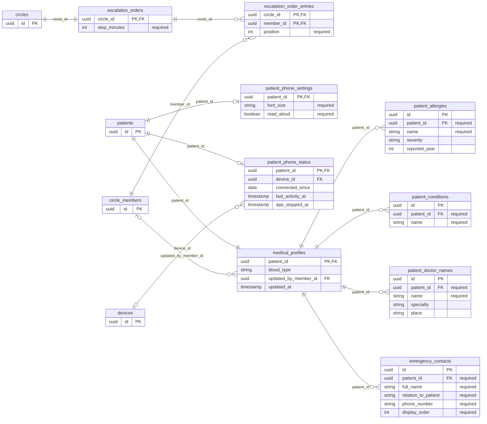
```mermaid
---
config:
  er:
    entityPadding: 5
    minEntityWidth: 60
    minEntityHeight: 30
  flowchart:
    nodeSpacing: 15
    rankSpacing: 25
---
erDiagram
    direction LR
    escalation_orders {
        uuid circle_id PK, FK
        int step_minutes "required"
    }
    escalation_order_entries {
        uuid circle_id PK, FK
        uuid member_id PK, FK
        int position "required"
    }
    patient_phone_settings {
        uuid patient_id PK, FK
        string font_size "required"
        boolean read_aloud "required"
    }
    patient_phone_status {
        uuid patient_id PK, FK
        uuid device_id FK
        date connected_since
        timestamp last_activity_at
        timestamp app_stopped_at
    }
    medical_profiles {
        uuid patient_id PK, FK
        string blood_type
        uuid updated_by_member_id FK
        timestamp updated_at
    }
    patient_allergies {
        uuid id PK
        uuid patient_id FK "required"
        string name "required"
        string severity
        int reported_year
    }
    patient_conditions {
        uuid id PK
        uuid patient_id FK "required"
        string name "required"
    }
    patient_doctor_names {
        uuid id PK
        uuid patient_id FK "required"
        string name "required"
        string specialty
        string place
    }
    emergency_contacts {
        uuid id PK
        uuid patient_id FK "required"
        string full_name "required"
        string relation_to_patient "required"
        string phone_number "required"
        int display_order "required"
    }
    circles {
        uuid id PK
    }
    patients {
        uuid id PK
    }
    circle_members {
        uuid id PK
    }
    devices {
        uuid id PK
    }
    circles ||--|| escalation_orders : circle_id
    escalation_orders ||--o{ escalation_order_entries : circle_id
    circle_members ||--o{ escalation_order_entries : member_id
    patients ||--o| patient_phone_settings : patient_id
    patients ||--o| patient_phone_status : patient_id
    devices |o--o{ patient_phone_status : device_id
    patients ||--|| medical_profiles : patient_id
    circle_members |o--o{ medical_profiles : updated_by_member_id
    medical_profiles ||--o{ patient_allergies : patient_id
    medical_profiles ||--o{ patient_conditions : patient_id
    medical_profiles ||--o{ patient_doctor_names : patient_id
    medical_profiles ||--o{ emergency_contacts : patient_id
```

| Table | Class | What it holds |
| --- | --- | --- |
| `escalation_orders` | `EscalationOrder` | The order in which members are told about an urgent alert. |
| `escalation_order_entries` | `EscalationEntry` | One member's place in the order. Only Manager and Performer members can be listed (the self-manager is a Manager). |
| `patient_phone_settings` | `PatientPhoneSettings` | Font size and read-aloud. Only for a Simplified circle whose patient has a phone. A manager sets it. |
| `patient_phone_status` | `PatientPhoneStatus` | Whether and when the patient's phone is connected, and whether a manager stopped the app on it. |
| `medical_profiles` | `MedicalProfile` | The medical file. It feeds the visit sheet, the emergency card, and the care record export. |
| `patient_allergies` | `Allergy` | Allergies in the medical file. |
| `patient_conditions` | `MedicalProfile` | Chronic conditions in the medical file. |
| `patient_doctor_names` | `Doctor` | Doctors as typed names. There are no doctor accounts. |
| `emergency_contacts` | `EmergencyContact` | A typed name, a relation, and a phone number, in order. The emergency card shows them as plain text. |

#### C. Care plan

A medicine, a measurement plan, and an appointment are all care plan items. Joined-table inheritance keeps the shared columns in one table and the extra columns in one table per kind. An appointment is a series (`appointments`) that has dated occurrences (`appointment_occurrences`); the companion and the visit belong to one occurrence, not to the series. The stock of a medicine is not a column: it is worked out from `stock_additions`.


```mermaid
---
config:
  er:
    entityPadding: 5
    minEntityWidth: 60
    minEntityHeight: 30
  flowchart:
    nodeSpacing: 15
    rankSpacing: 25
---
erDiagram
    direction LR
    care_plan_items {
        uuid id PK
        uuid circle_id FK "required"
        string kind "required"
        string title "required"
        string ordered_by
        date starts_on "required"
        date ends_on
        string status "required"
        string priority
        int max_lateness_min
        string performer_mode
        uuid performer_member_id FK
        int repeat_every_min
        uuid created_by_member_id FK "required"
        timestamp created_at "required"
    }
    medications {
        uuid item_id PK, FK
        string scientific_name
        string strength
        decimal dose_value "required"
        string dose_unit "required"
        string meal_relation
        int duration_days
        string instruction_icons
        string photo_url
        decimal low_stock_value
        string low_stock_unit
    }
    measurement_plans {
        uuid item_id PK, FK
        string type "required"
        string context "required"
        decimal range_primary_lower
        decimal range_primary_upper
        decimal range_secondary_lower
        decimal range_secondary_upper
        string range_unit
        string range_ordered_by
    }
    appointments {
        uuid item_id PK, FK
        string appointment_kind "required"
        timestamp series_starts_at "required"
        string place
        string repeat_rule "required"
        string preparation
    }
    appointment_occurrences {
        uuid id PK
        uuid appointment_id FK "required"
        timestamp starts_at "required"
        string status "required"
        uuid companion_member_id FK
        timestamp asked_circle_at
    }
    time_slots {
        uuid id PK
        uuid item_id FK "required"
        string kind "required"
        string prayer
        time exact_time
        string days_of_week
    }
    medication_changes {
        uuid id PK
        uuid medication_id FK "required"
        string kind "required"
        decimal previous_dose_value "required"
        string previous_dose_unit "required"
        decimal new_dose_value
        string new_dose_unit
        string ordered_by "required"
        string reason
        timestamp effective_from "required"
        uuid made_by_member_id FK "required"
        timestamp made_at "required"
        uuid visit_id FK
    }
    stock_additions {
        uuid id PK
        uuid medication_id FK "required"
        string kind "required"
        decimal quantity_value "required"
        string quantity_unit "required"
        date added_on "required"
        uuid recorded_by_member_id FK "required"
        timestamp created_at "required"
    }
    visits {
        uuid id PK
        uuid occurrence_id UK, FK "required"
        date visit_date "required"
        string status "required"
        string notes
        string voice_note_url
        string report_photo_urls
        timestamp saved_at
        uuid saved_by_member_id FK
        timestamp companion_rights_until
    }
    care_plan_items ||--o| medications : item_id
    care_plan_items ||--o| measurement_plans : item_id
    care_plan_items ||--o| appointments : item_id
    care_plan_items ||--o{ time_slots : item_id
    appointments ||--o{ appointment_occurrences : appointment_id
    appointment_occurrences ||--o| visits : occurrence_id
    medications ||--o{ medication_changes : medication_id
    visits |o--o{ medication_changes : visit_id
    medications ||--o{ stock_additions : medication_id
```

| Table | Class | What it holds |
| --- | --- | --- |
| `care_plan_items` | `CarePlanItem`, `ScheduledItem` | One row for every medicine, measurement plan, and appointment. The columns from priority to repeat_every_min belong to the ScheduledItem layer and are empty for an appointment. |
| `medications` | `Medication`, `MedicationQuantity` | The extra columns of a medicine. It shares its id with care_plan_items. There is no "pills in the box" column. |
| `measurement_plans` | `MeasurementPlan`, `TargetRange` | The extra columns of a measurement plan, with the doctor's range. |
| `appointments` | `Appointment` | The extra columns of an appointment series. |
| `appointment_occurrences` | `AppointmentOccurrence` | One dated visit of a series, with its own status and companion. |
| `time_slots` | `TimeSlot` | One time of day: a prayer period or a fixed hour. |
| `medication_changes` | `MedicationChange` | A dose change or a stop. Together they form the previous medicines list. |
| `stock_additions` | `StockAddition` | A new box, or a count of what is left. Rows are only added, never edited. The remaining stock and the supply forecast are worked out from them. |
| `visits` | `Visit` | What the doctor said at one occurrence. The companion may edit it until it is saved, or for 24 hours. |

#### D. Tasks and handoffs

A task is one thing to do at one time. Assignments keep the full history of who was asked, what they answered, and whether they finished. There is no errand task: a card that cannot be done is given, as the same card, to another member through an assignment.

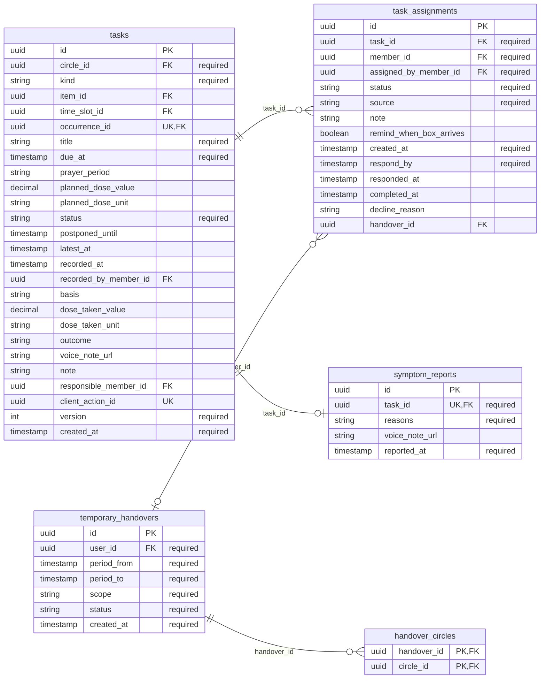
```mermaid
---
config:
  er:
    entityPadding: 5
    minEntityWidth: 60
    minEntityHeight: 30
  flowchart:
    nodeSpacing: 15
    rankSpacing: 25
---
erDiagram
    direction LR
    tasks {
        uuid id PK
        uuid circle_id FK "required"
        string kind "required"
        uuid item_id FK
        uuid time_slot_id FK
        uuid occurrence_id UK, FK
        string title "required"
        timestamp due_at "required"
        string prayer_period
        decimal planned_dose_value
        string planned_dose_unit
        string status "required"
        timestamp postponed_until
        timestamp latest_at
        timestamp recorded_at
        uuid recorded_by_member_id FK
        string basis
        decimal dose_taken_value
        string dose_taken_unit
        string outcome
        string voice_note_url
        string note
        uuid responsible_member_id FK
        uuid client_action_id UK
        int version "required"
        timestamp created_at "required"
    }
    task_assignments {
        uuid id PK
        uuid task_id FK "required"
        uuid member_id FK "required"
        uuid assigned_by_member_id FK "required"
        string status "required"
        string source "required"
        string note
        boolean remind_when_box_arrives
        timestamp created_at "required"
        timestamp respond_by "required"
        timestamp responded_at
        timestamp completed_at
        string decline_reason
        uuid handover_id FK
    }
    temporary_handovers {
        uuid id PK
        uuid user_id FK "required"
        timestamp period_from "required"
        timestamp period_to "required"
        string scope "required"
        string status "required"
        timestamp created_at "required"
    }
    handover_circles {
        uuid handover_id PK, FK
        uuid circle_id PK, FK
    }
    symptom_reports {
        uuid id PK
        uuid task_id UK, FK "required"
        string reasons "required"
        string voice_note_url
        timestamp reported_at "required"
    }
    tasks ||--o{ task_assignments : task_id
    temporary_handovers |o--o{ task_assignments : handover_id
    temporary_handovers ||--o{ handover_circles : handover_id
    tasks ||--o| symptom_reports : task_id
```

| Table | Class | What it holds |
| --- | --- | --- |
| `tasks` | `Task` | One scheduled dose, measurement, or appointment on one day. It holds what was recorded and by whom. |
| `task_assignments` | `TaskAssignment` | Giving the same card to a person. It keeps accepted, declined, expired, and finished requests as history. |
| `temporary_handovers` | `TemporaryHandover` | "I'm busy": a period during which someone hands over tasks. |
| `handover_circles` | `TemporaryHandover` | The circles a handover covers. |
| `symptom_reports` | `SymptomReport` | The reasons a patient gives when a medicine bothers them. |

#### E. Alerts

An alert is always about something: a task, a reading, a side-effect report, or a medicine. Each of the three tables has four optional links for that, and a check that at most one is set.

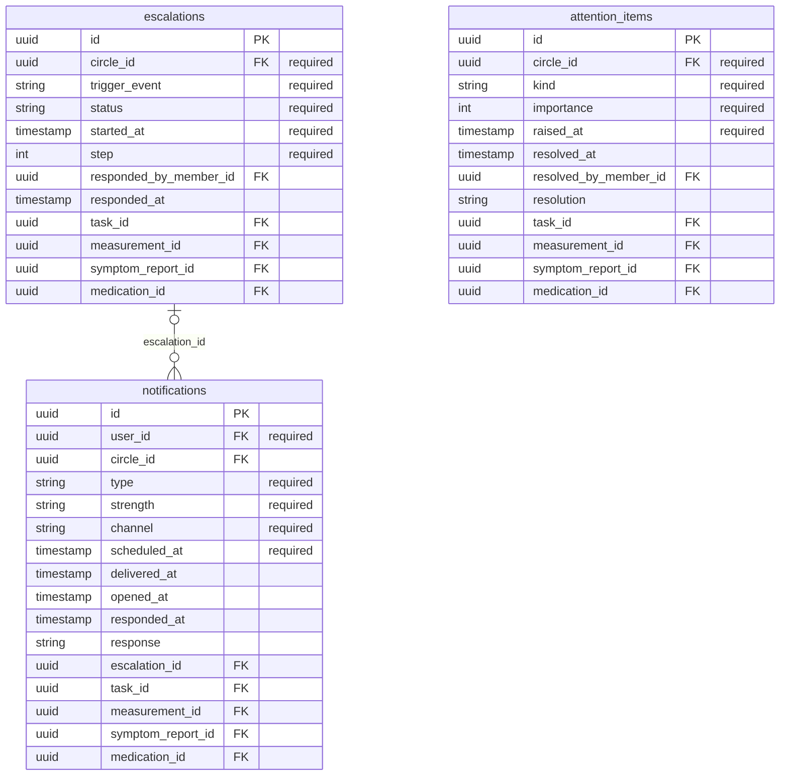
```mermaid
---
config:
  er:
    entityPadding: 5
    minEntityWidth: 60
    minEntityHeight: 30
  flowchart:
    nodeSpacing: 15
    rankSpacing: 25
---
erDiagram
    notifications {
        uuid id PK
        uuid user_id FK "required"
        uuid circle_id FK
        string type "required"
        string strength "required"
        string channel "required"
        timestamp scheduled_at "required"
        timestamp delivered_at
        timestamp opened_at
        timestamp responded_at
        string response
        uuid escalation_id FK
        uuid task_id FK
        uuid measurement_id FK
        uuid symptom_report_id FK
        uuid medication_id FK
    }
    escalations {
        uuid id PK
        uuid circle_id FK "required"
        string trigger_event "required"
        string status "required"
        timestamp started_at "required"
        int step "required"
        uuid responded_by_member_id FK
        timestamp responded_at
        uuid task_id FK
        uuid measurement_id FK
        uuid symptom_report_id FK
        uuid medication_id FK
    }
    attention_items {
        uuid id PK
        uuid circle_id FK "required"
        string kind "required"
        int importance "required"
        timestamp raised_at "required"
        timestamp resolved_at
        uuid resolved_by_member_id FK
        string resolution
        uuid task_id FK
        uuid measurement_id FK
        uuid symptom_report_id FK
        uuid medication_id FK
    }
    escalations |o--o{ notifications : escalation_id
```

| Table | Class | What it holds |
| --- | --- | --- |
| `notifications` | `Notification` | One alert to one user. The columns task_id to medication_id are the AlertSubject: at most one of them is set. |
| `escalations` | `Escalation` | One run of alerts for an urgent event. |
| `attention_items` | `AttentionItem` | A line in needs your attention. It stays until someone completes or reassigns it. |

#### F. Records

These tables hold what was recorded. The adherence report, the visit sheet, the emergency card, and the care record export are never stored: they are worked out from these tables and from the medical file when asked.

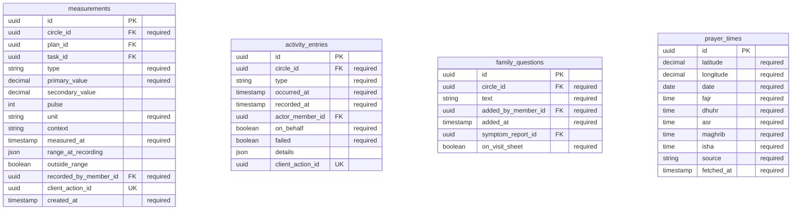
```mermaid
---
config:
  er:
    entityPadding: 5
    minEntityWidth: 60
    minEntityHeight: 30
  flowchart:
    nodeSpacing: 15
    rankSpacing: 25
---
erDiagram
    measurements {
        uuid id PK
        uuid circle_id FK "required"
        uuid plan_id FK
        uuid task_id FK
        string type "required"
        decimal primary_value "required"
        decimal secondary_value
        int pulse
        string unit "required"
        string context
        timestamp measured_at "required"
        json range_at_recording
        boolean outside_range
        uuid recorded_by_member_id FK "required"
        uuid client_action_id UK
        timestamp created_at "required"
    }
    activity_entries {
        uuid id PK
        uuid circle_id FK "required"
        string type "required"
        timestamp occurred_at "required"
        timestamp recorded_at "required"
        uuid actor_member_id FK
        boolean on_behalf "required"
        boolean failed "required"
        json details
        uuid client_action_id UK
    }
    family_questions {
        uuid id PK
        uuid circle_id FK "required"
        string text "required"
        uuid added_by_member_id FK "required"
        timestamp added_at "required"
        uuid symptom_report_id FK
        boolean on_visit_sheet "required"
    }
    prayer_times {
        uuid id PK
        decimal latitude "required"
        decimal longitude "required"
        date date "required"
        time fajr "required"
        time dhuhr "required"
        time asr "required"
        time maghrib "required"
        time isha "required"
        string source "required"
        timestamp fetched_at "required"
    }
```

| Table | Class | What it holds |
| --- | --- | --- |
| `measurements` | `Measurement`, `TargetRange` (copy) | A sugar or blood-pressure reading with its original time and the range that applied when it was saved. |
| `activity_entries` | `ActivityEntry` | One line of the activity log. |
| `family_questions` | `FamilyQuestion` | A question for the doctor. It goes to the visit sheet. |
| `prayer_times` | `PrayerTimes` | The five prayer times for one place and one day, cached. |

### 3.3 Front-end: UI components and interactions (Flutter)

#### 3.3.1 Structure of the app

| Layer | What it contains |
| --- | --- |
| Screens and widgets | The pages and reusable components of Section 3.3.4. They only show data and send the user's actions to controllers. |
| State controllers (Riverpod) | `AuthController`, `CircleController`, `CreationController`, `InvitationController`, `TodayController`, `PlanController`, `AssignmentController`, `AlertsController`, `LogController`, `CircleAdminController`, `LocationController`, `AccountController`, `SimplifiedController`, `SyncController`. They hold what the screen shows and call repositories. |
| Repositories | Decide whether to read from the local database or from the API, and write an action to the offline queue when there is no internet. |
| API client and local database | HTTPS calls to the Flask API, and the SQLite tables `cached_circles`, `cached_plan`, `cached_tasks`, `cached_prayer_times`, `pending_actions` (the `OfflineAction` class), and `local_notifications`. |
| Notification scheduler | Creates local notifications from the cached tasks, so reminders work without internet. |

The app shows one circle at a time. Every screen names the circle and the user's role in it. The app opens the circle used last, in the interface of the user's role there, and the permissions sent by the server decide which buttons are shown.

| Role | Interface |
| --- | --- |
| Self-manager | Detailed Mode, with every text in the first person. Sees the "+" button, and the button "My emergency card" in Settings. |
| Manager | Detailed Mode, with the "+" button. |
| Performer | Detailed Mode without the "+" button. The plan is read only; the tasks assigned to them are theirs. |
| Viewer | Detailed Mode without the "+" button and with nothing to press on a task card. |
| Patient (Simplified) | One page, and a small settings page that holds only the button "My emergency card". |
| Patient with no phone | No interface. The managers receive the reminders. |

#### 3.3.2 How the user gets in

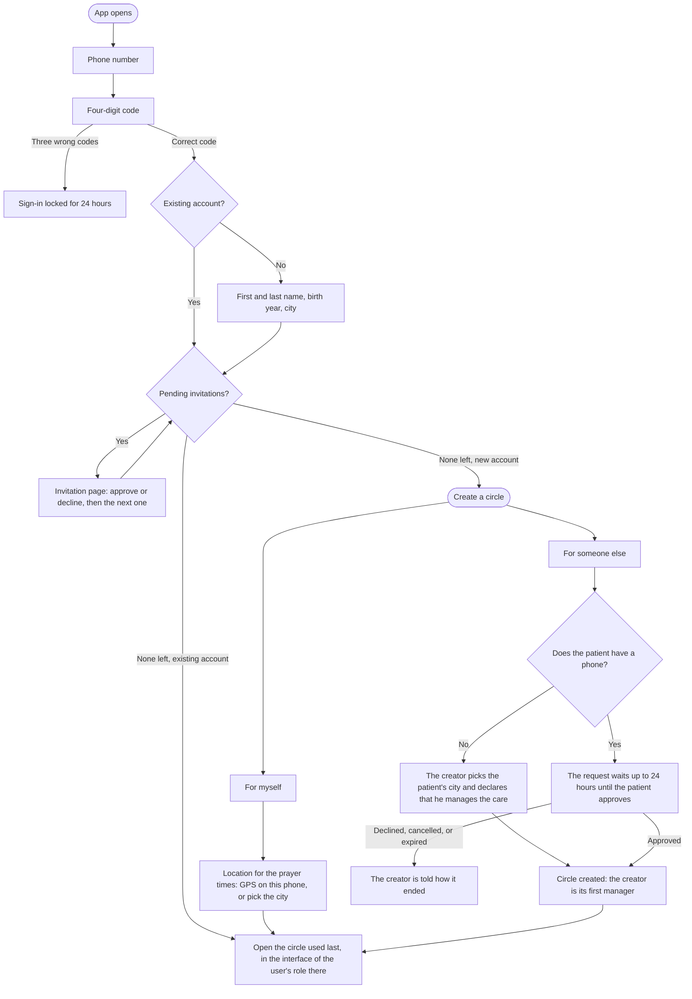
```mermaid
flowchart TD
    Start(["App opens"]) --> Phone["Phone number"]
    Phone --> Code["Four-digit code"]
    Code -->|"Three wrong codes"| Locked["Sign-in locked for 24 hours"]
    Code -->|"Correct code"| Known{"Existing account?"}
    Known -->|"No"| NewData["First and last name, birth year, city"]
    Known -->|"Yes"| Pending
    NewData --> Pending{"Pending invitations?"}
    Pending -->|"Yes"| Inv["Invitation page: approve or decline, then the next one"]
    Inv --> Pending
    Pending -->|"None left, existing account"| Enter["Open the circle used last, in the interface of the user's role there"]
    Pending -->|"None left, new account"| Choice(["Create a circle"])
    Choice --> Self["For myself"]
    Choice --> Other["For someone else"]
    Self --> LocSelf["Location for the prayer times: GPS on this phone, or pick the city"]
    LocSelf --> Enter
    Other --> HasPhone{"Does the patient have a phone?"}
    HasPhone -->|"No"| CityHand["The creator picks the patient's city and declares that he manages the care"]
    CityHand --> Created["Circle created: the creator is its first manager"]
    HasPhone -->|"Yes"| Wait["The request waits up to 24 hours until the patient approves"]
    Wait -->|"Approved"| Created
    Wait -->|"Declined, cancelled, or expired"| Ended["The creator is told how it ended"]
    Created --> Enter
```

#### 3.3.3 Component hierarchy

The hierarchy has three parts: the shells of the app, the pages of the Detailed Mode, and the page of the Simplified Mode.

**The shells**

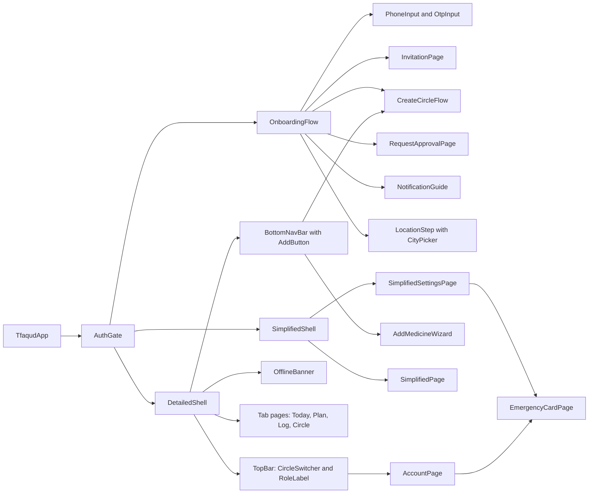
```mermaid
flowchart LR
    Root["TfaqudApp"] --> Gate["AuthGate"]
    Gate --> Onb["OnboardingFlow"]
    Gate --> DShell["DetailedShell"]
    Gate --> SShell["SimplifiedShell"]

    Onb --> PhoneIn["PhoneInput and OtpInput"]
    Onb --> InvPage["InvitationPage"]
    Onb --> CreateFlow["CreateCircleFlow"]
    Onb --> ApproveFlow["RequestApprovalPage"]
    Onb --> NGuide["NotificationGuide"]
    Onb --> LocStep["LocationStep with CityPicker"]

    DShell --> TopBar["TopBar: CircleSwitcher and RoleLabel"]
    DShell --> OfflineBar["OfflineBanner"]
    DShell --> Pages["Tab pages: Today, Plan, Log, Circle"]
    DShell --> BNav["BottomNavBar with AddButton"]
    TopBar --> AccountPage["AccountPage"]
    BNav --> AddMedWizard["AddMedicineWizard"]
    BNav --> CreateFlow

    SShell --> SPage["SimplifiedPage"]
    SShell --> SSet["SimplifiedSettingsPage"]
    SSet --> ECard["EmergencyCardPage"]
    AccountPage --> ECard
```

**The pages of the Detailed Mode**

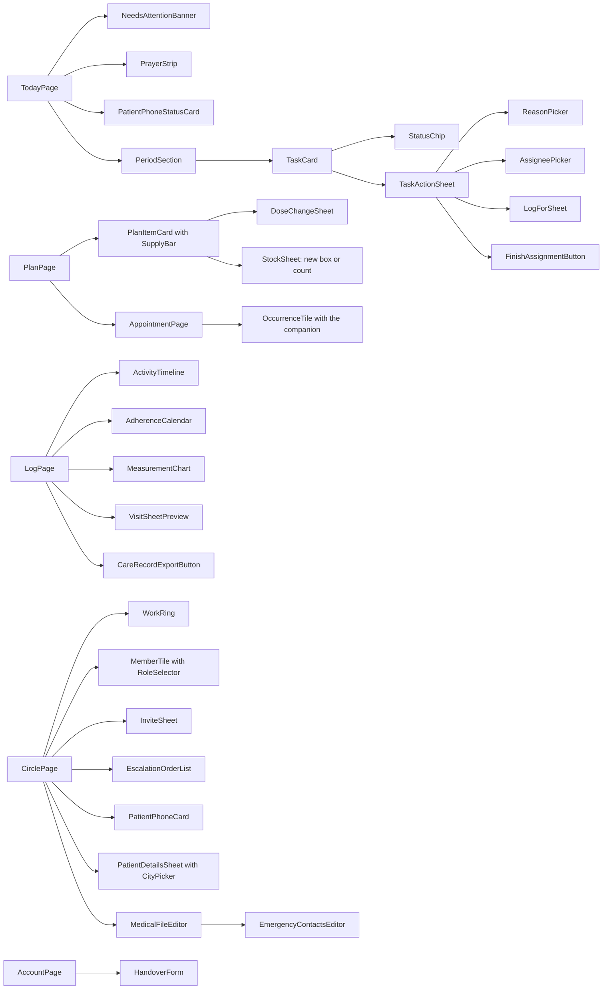
```mermaid
flowchart LR
    TodayPage["TodayPage"] --> Banner["NeedsAttentionBanner"]
    TodayPage --> Strip["PrayerStrip"]
    TodayPage --> PatientCard["PatientPhoneStatusCard"]
    TodayPage --> Section["PeriodSection"]
    Section --> TCard["TaskCard"]
    TCard --> Chip["StatusChip"]
    TCard --> TSheet["TaskActionSheet"]
    TSheet --> Reason["ReasonPicker"]
    TSheet --> Assignee["AssigneePicker"]
    TSheet --> LogFor["LogForSheet"]
    TSheet --> Finish["FinishAssignmentButton"]

    PlanPage["PlanPage"] --> ItemCard["PlanItemCard with SupplyBar"]
    ItemCard --> DoseSheet["DoseChangeSheet"]
    ItemCard --> StockSheet["StockSheet: new box or count"]
    PlanPage --> ApptPage["AppointmentPage"]
    ApptPage --> OccTile["OccurrenceTile with the companion"]

    LogPage["LogPage"] --> ActTimeline["ActivityTimeline"]
    LogPage --> AdhCal["AdherenceCalendar"]
    LogPage --> MChart["MeasurementChart"]
    LogPage --> SheetPreview["VisitSheetPreview"]
    LogPage --> ExportBtn["CareRecordExportButton"]

    CirclePage["CirclePage"] --> WorkRing["WorkRing"]
    CirclePage --> MTile["MemberTile with RoleSelector"]
    CirclePage --> Invite["InviteSheet"]
    CirclePage --> OrderList["EscalationOrderList"]
    CirclePage --> PhoneCard["PatientPhoneCard"]
    CirclePage --> PDetails["PatientDetailsSheet with CityPicker"]
    CirclePage --> MedFile["MedicalFileEditor"]
    MedFile --> ContactsEd["EmergencyContactsEditor"]

    AccountPage["AccountPage"] --> HandForm["HandoverForm"]
```

**The page of the Simplified Mode**

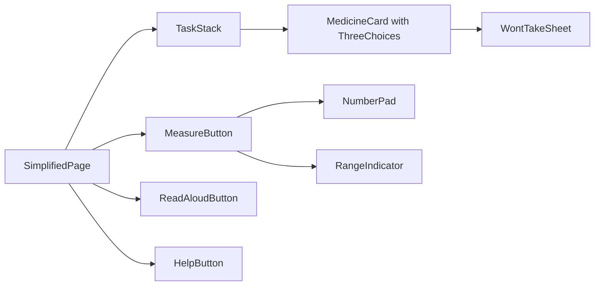
```mermaid
flowchart LR
    SPage["SimplifiedPage"] --> Stack["TaskStack"]
    Stack --> MedCard["MedicineCard with ThreeChoices"]
    MedCard --> WontSheet["WontTakeSheet"]
    SPage --> MeasBtn["MeasureButton"]
    MeasBtn --> NPad["NumberPad"]
    MeasBtn --> RangeBar["RangeIndicator"]
    SPage --> AloudBtn["ReadAloudButton"]
    SPage --> HelpBtn["HelpButton"]
```

#### 3.3.4 Main UI components

| Component | What it does | How the user interacts with it |
| --- | --- | --- |
| `AuthGate` | Chooses the first screen: onboarding, Detailed Mode, or Simplified Mode. | Redirects after sign-in, joining a circle, switching circles, or sign-out. |
| `PhoneInput`, `OtpInput` | Collect the phone number and the four-digit code; fill the code in by itself when the SMS arrives; show the resend countdown, the tries left, and the locked message (device and number). | Submit, resend, edit the number. |
| `InvitationPage` | Shows who invited the user, the role, and what the role allows. Pending invitations come one above another. | Approve or decline, then the next one appears. A cancelled or expired invitation shows "no longer available". |
| `CreateCircleFlow` | The paths for creating a circle: for myself, for someone with a phone, or for someone without. Asks for the patient's details and the mode and, for a patient with no phone, the patient's city (`CityPicker`). | Submit; shows the waiting screen for a request. |
| `RequestApprovalPage` | Tells the patient who asked, the role chosen for them, and what the family will see (medicines, measurements, appointments). | Approve or decline. |
| `LocationStep` and `CityPicker` | Explains that the location is used only for the prayer times, asks for the system's location permission, and reads the position once. | Allow, or pick a city. Saves with `PUT /patients/{id}/location` (source `GPS` or `MANUAL`). The position is never shown to the family and never tracked. |
| `NotificationGuide` | Explains why notifications are needed, opens the system permission, and asks for exact alarms on Android. | Opens the system permission dialog. |
| `CircleSwitcher` and `RoleLabel` | Show the selected circle and the user's role in it, and open the list of the user's circles. | Tap to switch circle, or to start a new patient. |
| `OfflineBanner` | Tells the user there is no internet and how many actions are waiting to sync. | Tap to see waiting actions. |
| `PrayerStrip` | Five prayer markers with "now" marked. Finished periods collapse to a line such as "Fajr and Dhuhr · 4 done". | Tap a period to jump to its tasks. |
| `PeriodSection` | Groups tasks under one prayer period, with an approximate time. | Expand or collapse. |
| `TaskCard` | Shows the task's title, the person responsible, the time, and the status. | Tap opens `TaskActionSheet`. |
| `StatusChip` | Shows later, now, done, done late, could not, postponed, declined, missed, or "will sync". | Display only. |
| `NeedsAttentionBanner` | A red banner with the count and the most important item. Opens a list, most important first. An item stays until someone completes or reassigns it. | Tap opens the sheet with the action for each kind of item (for example "Who brings it?", "Ask the doctor today", "I'll accompany", "Remind a member"). |
| `PatientPhoneStatusCard` | A status line such as "Abdullah · Simplified Mode · 5 of 6 done · last activity 6:32". | Display only. |
| `TaskActionSheet` | The actions for one task: done (the time can be edited), postpone, could not do (with a reason), decline while not yet accepted, hand over, assign, call the person. Actions depend on the user's role. | Each action calls a controller, which sends it to the API or to the offline queue. |
| `LogForSheet` | Asks "how do you know the patient took it?": I gave it myself, he told me he took it, or he didn't take it. The time defaults to now and can be edited. | Save sends `logFor`. |
| `ReasonPicker` | The reason for "could not" (for example, the pills ran out). | Choosing "the pills ran out" opens `AssigneePicker` to give the same card to another member. |
| `AssigneePicker` | Used for "who brings it?", "assign", and "hand over". Lists the members who can act, each with their day ("with you: cardiology appointment 4:30"), a note, and a switch "when the box arrives, remind the patient of the dose". | Select a member, then send the request. The task shows "waiting for acceptance" for 30 minutes. |
| `AssignmentRequestSheet` | Shows "Mohammed assigned you a task", what it is, by when and why. | Accept or decline (with a reason). |
| `FinishAssignmentButton` | Shown to the person who accepted an assignment: "I did my part", with the time ("Sara brought it, 6:10"). | Calls `complete`. The card does not change and is not counted as a dose: the dose still has to be recorded. |
| `PlanItemCard` and `SupplyBar` | Shows a medicine, appointment, or measurement plan with its next time, priority tag, and supply ("lasts 22 days", amber, red). The supply is worked out by the server from the boxes and counts. | Tap opens details. |
| `StockSheet` | Two tabs: "new box" (how much it holds and the date) and "count what is left" (the family counts, and the app starts from the new number). It never shows a stored pill count. | Save calls `stock/boxes` or `stock/recount`. |
| `AppointmentPage` and `OccurrenceTile` | The dates of an appointment series. Each date shows its status and its companion, with "ask the circle", "I'll accompany", reschedule, and cancel for that date only. After the visit, the visit record opens from its date. | A change of the series changes only the dates that have not happened yet. |
| `AddMedicineWizard` | Steps with a progress bar: photo or manual entry, check what was read, when, and who performs it with the priority and the supply. Reading a photo is a Could item, so manual entry always works. | Next, back, save. |
| `DoseChangeSheet` | One sheet with two tabs: change dose, stop. Asks by whose order (a doctor's name), the reason, and from when. Saving keeps the old dose in "previous medicines". | Save calls `changeDose` or `stop`. |
| `NumberPad` | Large number keys like a calculator. Sugar takes one number; pressure takes two and an optional pulse. | Type, delete, save. |
| `RangeIndicator` | Shows the reading against the range the manager set. It only shows inside or outside the range and gives no advice. | Display only. |
| `MeasurementChart` | Plots readings over 7, 30, or 90 days with the range as a band; missing readings appear as gaps. | Tap a point to see its details. |
| `AdherenceCalendar` | Month grid: green (every dose on time), amber (late or incomplete), red (a missed critical dose), with a count per medicine. | Tap a day to see its tasks; open the care report. |
| `ActivityTimeline` | The care record: who did what and when, failed tasks in red, with filters (all, late, changes, a person). | Filter, open an entry. |
| `VisitSheetPreview` | Previews the one-page sheet for the doctor, then shares it as a PDF or shows it on screen. | Share (Manager and Self-manager). |
| `CareRecordExportButton` | Asks the server for the whole care record as one PDF (the patient, the medical file, the plan, the medicine history, the readings, the appointments, and the visits). Shown to managers only. A Could item. | Opens the share sheet. |
| `WorkRing` | A ring chart of each member's share of this week's tasks. It does not count what the patient did. | Display only. |
| `MemberTile`, `RoleSelector`, `InviteSheet` | Show each member with the name, relation, role, and place in the escalation order; change a role; invite by name, phone, and role, and send the WhatsApp link. | Change role, invite, cancel an invitation, remove a member. |
| `EscalationOrderList` | Lets a manager move members up or down. Viewers and Patients cannot be listed. | Drag to arrange. |
| `PatientPhoneCard` | Status line, font size, read-aloud switch, "try the alert", the consent line, and "stop the app on the patient's phone". The "after the prayer" minutes are not here: they belong to the patient and are in `PatientDetailsSheet`. | Save, try the alert, stop the app. |
| `PatientDetailsSheet` | The patient's first and last name, birth year, photo, the "after the prayer" minutes, and his location: for a patient with no phone, or one who refused GPS, a `CityPicker`; for a patient whose phone sends GPS, only "set by GPS on his phone" with the date. | Save calls `PATCH /circles/{id}/patient`, or `PUT /patients/{id}/location` for a city. |
| `MedicalFileEditor` and `EmergencyContactsEditor` | The medical file: blood type, allergies, chronic conditions, doctors as names, and the emergency contacts (a name, a relation, a phone number, and the order). Contacts are text only. | Save calls `PUT /circles/{id}/medical-profile` and `PUT /circles/{id}/emergency-contacts`. |
| `HandoverForm` | Choose the period and the circles, see the tasks in it with a proposed person for each, send the transfer requests, and see who accepted. | "Send transfer requests" creates assignments. |
| `SimplifiedPage` and `TaskStack` | The one page: a stacked list of today's tasks sorted by time left. When nothing is left it says so and shows tomorrow's first task. | Check a card to record it. |
| `MedicineCard` and `ThreeChoices` | The card at the dose time with three choices: take, remind me in 10 minutes, I won't take it. | Take records the time and shows a stamp. |
| `WontTakeSheet` | The list: I took it earlier, it is not with me, it is finished, it bothers me, another reason. | Choosing "it bothers me" opens the symptom reasons; "another reason" records a voice message. |
| `MeasureButton` | Offers sugar or pressure, then the `NumberPad`. | Save stores the reading with its time. |
| `SimplifiedSettingsPage` and `EmergencyCardPage` | A small page with one button, "My emergency card". The card is plain text: name, blood type, allergies, chronic conditions, the medicines now, and the emergency contacts. No call, no share, no location. | Open calls `GET /circles/{id}/emergency-card`. It needs internet. |
| `ReadAloudButton` and `HelpButton` | Read the page aloud; send a high-priority notification to the managers. There is no call, no emergency number, and no voice message. | The patient sees that the request was sent. |
| `SettingsPage` and `AccountPage` | My circles, I'm busy, quiet time, my emergency card (Self-manager only), my data, help and support, sign out. | Save to the server and the local cache. |

#### 3.3.5 Interactions

Every interaction follows the same path. The widget sends the user's action to its controller. The controller asks a repository. The repository reads from the local database or the API, or, when there is no internet and the action is allowed offline, writes it to the queue. The answer comes back to the controller, and the widget draws the new state. The widgets never call the API and never decide a permission: the buttons shown are the ones the server sent in the user's permissions, and the server checks the action again.

| Interaction | Components | Controller | API calls | What the user sees |
| --- | --- | --- | --- | --- |
| Sign in with the SMS code | `PhoneInput`, `OtpInput` | `AuthController` | `POST /auth/code/request`, `POST /auth/code/verify`, `GET /me` | The resend countdown and the tries left. After three wrong codes: "sign-in is locked for 24 hours". Then pending invitations, then the circle used last. |
| Create a circle for myself, or for someone else | `CreateCircleFlow` | `CreationController` | `POST /circles`, `POST /circle-requests` | For a patient with no phone, the creator picks the patient's city. For a patient with a phone, a waiting screen that the creator may leave. A push tells the creator the result. |
| Approve or decline a request about me | `RequestApprovalPage` | `CreationController` | `POST /circle-requests/{id}/approve`, `…/decline` | What the family will see, then the location step (GPS, or the city list), then "approved". Nothing is created before the patient says yes. |
| Answer an invitation | `InvitationPage` | `InvitationController` | `GET /invitations/pending`, `POST /invitations/{id}/accept`, `…/decline` | One invitation above another, with the role and what it allows. |
| Invite a member | `InviteSheet` | `CircleAdminController` | `POST /circles/{id}/invitations` | The WhatsApp message opens ready to send (or the share sheet). The invitation shows as pending for 7 days and can be cancelled. |
| Record a dose | `TaskCard`, `TaskActionSheet` | `TodayController` | `POST /tasks/{id}/record` | The card turns done. If someone recorded it first: "Noura recorded it two minutes ago. We did not record it twice." Offline: the chip "will sync". |
| Log for the patient | `LogForSheet` | `TodayController` | `POST /tasks/{id}/log-for` | The question "how do you know?", the time (editable), then the record, marked as logged by the member. |
| Say a dose could not be done | `ReasonPicker`, `AssigneePicker` | `TodayController`, `AssignmentController` | `POST /tasks/{id}/could-not`, `POST /tasks/{id}/assign` | The reason, and for "the pills ran out", "who brings it?", which gives the same card to another member. The task stays in "needs your attention", and can still be recorded late. |
| Give a task to someone | `AssigneePicker` | `AssignmentController` | `POST /tasks/{id}/assign` | The person's day beside each name and a note. The task shows "waiting for an answer" for 30 minutes. |
| Answer an assigned task | `AssignmentRequestSheet` (opened from the push) | `AssignmentController` | `POST /assignments/{id}/accept`, `…/decline` | Accept, or decline with a reason. The sender is told either way. |
| Finish an assignment | `FinishAssignmentButton` | `AssignmentController` | `POST /assignments/{id}/complete` | "Sara brought it, 6:10" appears in the log. The card does not change, and it is not a dose. |
| Answer a missed-dose alert | The notification and its action buttons, `NeedsAttentionBanner` | `AlertsController` | `POST /notifications/{id}/respond`, `POST /tasks/{id}/log-for` | Only an action stops the escalation; opening the alert does not. |
| Arrange the escalation order | `EscalationOrderList` | `CircleAdminController` | `PUT /circles/{id}/escalation-order` | Members move up or down. Viewers and Patients cannot be added to the list. |
| Record a measurement | `MeasureButton`, `NumberPad`, `RangeIndicator` | `TodayController` | `POST /circles/{id}/measurements` | A large number pad. The result is shown inside or outside the range, with no advice. Works offline. |
| Take a dose in Simplified Mode | `SimplifiedPage`, `MedicineCard`, `ThreeChoices`, `WontTakeSheet` | `TodayController` | `POST /tasks/{id}/record`, `POST /tasks/{id}/symptoms` | Three large choices: take, remind me in 10 minutes, I won't take it. "Remind me" is a local notification, so it needs no internet. |
| Press the help button | `HelpButton` | `AlertsController` | `POST /circles/{id}/help` | "Sent to your manager". It never calls and never goes to an emergency number. |
| Change or stop a medicine | `DoseChangeSheet` | `PlanController` | `POST /medications/{id}/change-dose`, `…/stop` | The doctor's name, the reason, and the date. The old dose moves to "previous medicines". |
| Add a box, or count what is left | `StockSheet` | `PlanController` | `POST /medications/{id}/stock/boxes`, `POST /medications/{id}/stock/recount` | "Lasts 22 days" is worked out again. A wrong count is corrected by counting again. |
| Plan one appointment date | `OccurrenceTile` | `PlanController` | `PATCH /occurrences/{id}`, `POST /occurrences/{id}/cancel`, `…/companion`, `…/ask-circle`, `…/volunteer` | The date changes alone, and the rest of the series stays. "No companion" appears the day before. |
| Set the patient's location | `LocationStep`, `CityPicker`, `PatientDetailsSheet` | `LocationController` | `PUT /patients/{id}/location` | GPS is asked only on the patient's own phone. If refused, or for a patient with no phone, a city is picked from the list. Used only for the prayer times. |
| Edit the medical file and the emergency contacts | `MedicalFileEditor`, `EmergencyContactsEditor` | `CircleAdminController` | `PUT /circles/{id}/medical-profile`, `GET` and `PUT /circles/{id}/emergency-contacts` | Plain text. A contact is never called or sent anything. |
| Open my emergency card | `SimplifiedSettingsPage`, `EmergencyCardPage` | `SimplifiedController` | `GET /circles/{id}/emergency-card` | One page of plain text, built when opened. No call, nothing sent, no location. |
| Export the care record | `CareRecordExportButton` | `LogController` | `GET /circles/{id}/care-record` | A PDF to share (managers only). |
| Switch circle | `CircleSwitcher` | `CircleController` | `GET /me` (the list is already loaded) | The interface changes to the user's role in the other circle. Nothing is mixed between circles. |

Rules for every screen:

- Every screen that loads data has four states: loading, error with a retry button, empty with one clear next step, and normal.
- The app does not show a task as done until the server (or the local queue) has the record. A queued action shows "will sync", never "done".
- A conflict (`409`) is shown in words that say who did what and when.
- All layouts use start and end instead of left and right, and every screen works with the largest font size.

#### 3.3.6 Offline behavior

| Topic | Design |
| --- | --- |
| What we cache | The user's circles, the plan, the next few days of tasks, and the prayer times, so Today and the Simplified page open without internet. |
| What can be done offline | Record a task as done (a dose or another task) and record a measurement. "Remind me in 10 minutes" also works, because it is a local notification. Everything else needs internet. |
| Waiting actions | We save them in `pending_actions` with a `client_action_id` and the original time, and show them with the "will sync" chip. |
| Syncing | We send the waiting actions in order when internet returns. The server accepts each one, ignores duplicates, or says that someone else recorded the task first. The app then updates the cards and tells the user who recorded it and when. |
| Reminders | We schedule them on the phone from the cached tasks, so they fire without internet, and we schedule them again whenever the plan changes. |

## 4. Sequence Diagrams

We chose the three use cases that the rest of the app depends on. The diagrams show how the phone app, the API, the database, the scheduler, and the outside services work together in each one. The route names are the ones of Section 5.

| Use case | Why it is critical | Stories | Main routes |
| --- | --- | --- | --- |
| 4.1 Signing in with the SMS code | Every other action needs a signed-in user, and the sign-in lock protects the patient's data | US-01, US-02 | `POST /auth/code/request`, `POST /auth/code/verify`, `GET /me` |
| 4.2 Recording a dose | The care record must be true, even when two people act at once or the phone has no internet | US-28, US-30, US-35 | `POST /tasks/{id}/record`, `POST /sync/actions` |
| 4.3 A missed dose and its escalation | This is the reason the app exists: somebody must be told when a dose is missed | US-37 | `POST /notifications/{id}/respond`, `POST /tasks/{id}/log-for` |

### 4.1 Signing in with the SMS code

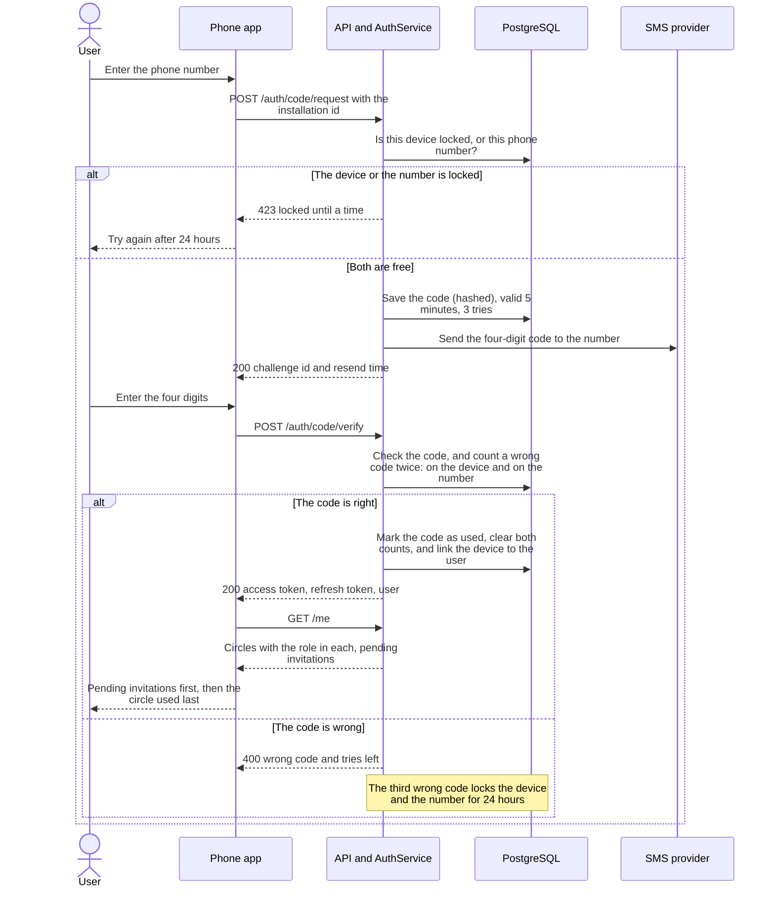
```mermaid
---
config:
  sequence:
    wrap: true
    width: 170
    messageFontSize: 15
---
sequenceDiagram
    actor U as User
    participant App as Phone app
    participant API as API and AuthService
    participant DB as PostgreSQL
    participant SMS as SMS provider

    U->>App: Enter the phone number
    App->>API: POST /auth/code/request with the installation id
    API->>DB: Is this device locked, or this phone number?
    alt The device or the number is locked
        API-->>App: 423 locked until a time
        App-->>U: Try again after 24 hours
    else Both are free
        API->>DB: Save the code (hashed), valid 5 minutes, 3 tries
        API->>SMS: Send the four-digit code to the number
        API-->>App: 200 challenge id and resend time
        U->>App: Enter the four digits
        App->>API: POST /auth/code/verify
        API->>DB: Check the code, and count a wrong code twice: on the device and on the number
        alt The code is right
            API->>DB: Mark the code as used, clear both counts, and link the device to the user
            API-->>App: 200 access token, refresh token, user
            App->>API: GET /me
            API-->>App: Circles with the role in each, pending invitations
            App-->>U: Pending invitations first, then the circle used last
        else The code is wrong
            API-->>App: 400 wrong code and tries left
            Note over API,DB: The third wrong code locks the device and the number for 24 hours
        end
    end
```

- The code has four digits and lasts 5 minutes. We store only its hash.
- We count wrong codes twice, on the device (its installation id) and on the phone number, not on the code. Asking for a new code does not give three more tries, and signing out, reinstalling the app, or using another phone does not clear the lock.
- After a successful sign-in the app calls `GET /me`. If there are pending invitations, they come before anything else.

### 4.2 Recording a dose

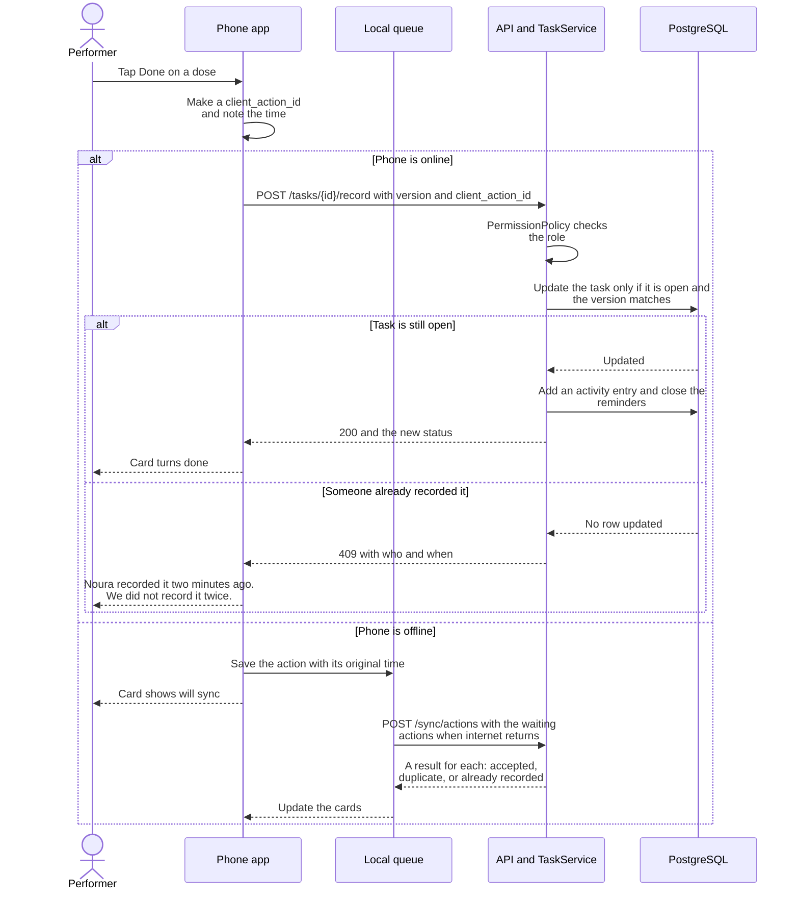
```mermaid
---
config:
  sequence:
    wrap: true
    width: 170
    messageFontSize: 15
---
sequenceDiagram
    actor U as Performer
    participant App as Phone app
    participant LQ as Local queue
    participant API as API and TaskService
    participant DB as PostgreSQL

    U->>App: Tap Done on a dose
    App->>App: Make a client_action_id and note the time
    alt Phone is online
        App->>API: POST /tasks/{id}/record with version and client_action_id
        API->>API: PermissionPolicy checks the role
        API->>DB: Update the task only if it is open and the version matches
        alt Task is still open
            DB-->>API: Updated
            API->>DB: Add an activity entry and close the reminders
            API-->>App: 200 and the new status
            App-->>U: Card turns done
        else Someone already recorded it
            DB-->>API: No row updated
            API-->>App: 409 with who and when
            App-->>U: Noura recorded it two minutes ago. We did not record it twice.
        end
    else Phone is offline
        App->>LQ: Save the action with its original time
        App-->>U: Card shows will sync
        LQ->>API: POST /sync/actions with the waiting actions when internet returns
        API-->>LQ: A result for each: accepted, duplicate, or already recorded
        LQ-->>App: Update the cards
    end
```

- The first valid record wins. A second record is refused, and the person is told who recorded the task and when.
- `client_action_id` makes a replay harmless: the same action sent twice changes nothing.
- An offline record keeps its original time. The server saves it as the time of the dose and adds the time it was received.

### 4.3 A missed dose and its escalation

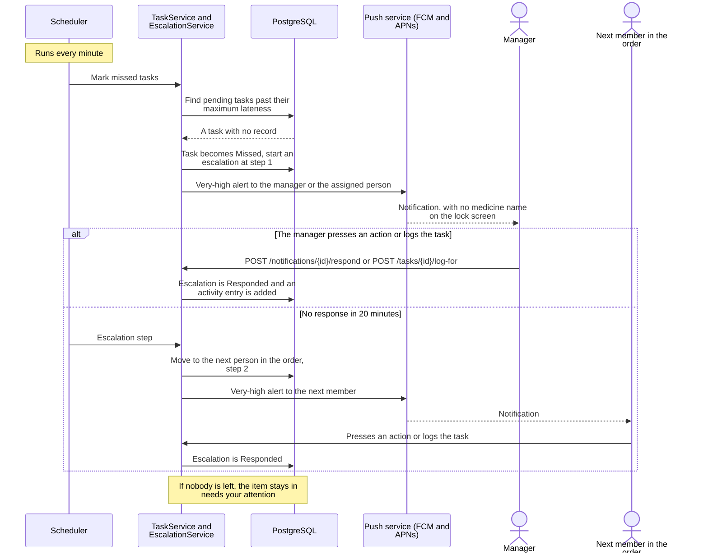
```mermaid
---
config:
  sequence:
    wrap: true
    width: 170
    messageFontSize: 15
---
sequenceDiagram
    participant SCH as Scheduler
    participant API as TaskService and EscalationService
    participant DB as PostgreSQL
    participant PN as Push service (FCM and APNs)
    actor M as Manager
    actor N as Next member in the order

    Note over SCH: Runs every minute
    SCH->>API: Mark missed tasks
    API->>DB: Find pending tasks past their maximum lateness
    DB-->>API: A task with no record
    API->>DB: Task becomes Missed, start an escalation at step 1
    API->>PN: Very-high alert to the manager or the assigned person
    PN-->>M: Notification, with no medicine name on the lock screen
    alt The manager presses an action or logs the task
        M->>API: POST /notifications/{id}/respond or POST /tasks/{id}/log-for
        API->>DB: Escalation is Responded and an activity entry is added
    else No response in 20 minutes
        SCH->>API: Escalation step
        API->>DB: Move to the next person in the order, step 2
        API->>PN: Very-high alert to the next member
        PN-->>N: Notification
        N->>API: Presses an action or logs the task
        API->>DB: Escalation is Responded
    end
    Note over API,DB: If nobody is left, the item stays in needs your attention
```

- Every missed medicine gets this full path. The reminder on the phone repeats every 10 minutes until the maximum lateness, and only then does the scheduler mark the task as missed.
- Answering means acting: opening the notification does not stop the escalation, only an action or a record does.
- Only a Manager (the Self-manager included) or a Performer can be in the order, never a Viewer or a Simplified patient.

## 5. API Specifications

In this part we describe the two kinds of interfaces of our system. Section 5.1 lists the external services that we use and why we chose each one. Section 5.2 defines our own REST API: the conventions, every endpoint with its path, method, input, and output, and the errors.

### 5.1 External APIs

We call three outside services from the server (an SMS provider, Firebase Cloud Messaging, and a prayer-times API). The fourth is a link that the manager's phone opens, not a server call. The details follow the providers' public documentation.

| API | Used for | Why we chose it |
| --- | --- | --- |
| SMS provider (we propose Unifonic with a Saudi sender name; alternative: Twilio) | The four-digit sign-in code, valid for 5 minutes | Sign-in by phone number is a Must. A provider with a registered Saudi sender name reaches Saudi numbers, and both candidates offer a plain "send an SMS" call, so we can change provider without changing our own API. |
| Firebase Cloud Messaging (FCM) HTTP v1, which reaches iPhones through Apple Push Notification service (APNs) | Push notifications for everything that involves other people: a missed dose, the help button, an assigned task, and the rest | One server call reaches Android and, through APNs, iPhone. It is free. It supports the two strengths we need: high priority on Android and the time-sensitive level on iPhone. |
| Prayer-times API (we propose Aladhan, `api.aladhan.com`) | The five prayer times of the patient's location, to turn "after Asr" into a clock time and to show the prayer strip on Today | It is a free JSON service with a calculation method used in Saudi Arabia (`method=4`, Umm Al-Qura University, Makkah). We ask once for each place and day and keep the answer, so the load is small and no name or address of the patient is sent. |
| WhatsApp share link `https://wa.me/<number>?text=<message>` | The invitation message to a new member. The manager's phone opens the link, WhatsApp shows the message ready to send, and the manager presses send. | It costs nothing, needs no WhatsApp Business account or message templates, and the message comes from the manager's own number, which the invited person already knows. |

**How we call each one**

| API | What we send | What we receive | If it is down |
| --- | --- | --- | --- |
| SMS provider | The number in international format, a sender name, and the message text with the code. Unifonic: `POST https://el.cloud.unifonic.com/rest/SMS/messages` (form fields `AppSid`, `SenderID`, `Recipient`, `Body`). Twilio: `POST https://api.twilio.com/2010-04-01/Accounts/{AccountSid}/Messages.json` (`To`, `From`, `Body`). | A message id and a status (sent or failed) | `POST /auth/code/request` answers `503 SMS_UNAVAILABLE` and the app shows "try again". People who are already signed in are not affected. |
| FCM | `POST https://fcm.googleapis.com/v1/projects/{project_id}/messages:send` with the OAuth 2.0 token of a service account and a `message`: the device `token`, a generic `notification`, a `data` payload, and the `android` and `apns` settings | `200` with the id of the message, or an error status when the device token is no longer valid | The server retries a few times. The 20-minute step timer of the escalation keeps running, so the next person is still told. Reminders on the phone are local and do not depend on FCM. |
| Prayer-times API | `GET https://api.aladhan.com/v1/timings/{DD-MM-YYYY}?latitude={lat}&longitude={lng}&method=4`. Only two rounded numbers leave the server: no patient, no circle, and no name. | `{code, status, data}`. `data.timings` holds `Fajr`, `Dhuhr`, `Asr`, `Maghrib`, `Isha`, and others as `HH:MM`. We keep the five prayer times. | We answer from the cache, then from an offline calculation. The `source` field says `CACHED` or `OFFLINE_CALCULATION`. |
| WhatsApp link | Nothing goes to a server. `POST /circles/{id}/invitations` returns the link as `whatsapp_link`, and the app opens it. | Nothing. The invitation stays "pending" until the person signs in and accepts. | If WhatsApp is not installed, the app offers the phone's share sheet with the same text. |

The message we send to FCM for a missed dose has only generic text on the lock screen:

```json
{
  "message": {
    "token": "<device push token>",
    "notification": { "title": "TFAQUD", "body": "A task needs your attention" },
    "data": { "type": "DOSE_MISSED", "circle_id": "<uuid>", "task_id": "<uuid>", "notification_id": "<uuid>" },
    "android": { "priority": "HIGH", "notification": { "channel_id": "urgent" } },
    "apns": {
      "headers": { "apns-priority": "10" },
      "payload": { "aps": { "interruption-level": "time-sensitive" } }
    }
  }
}
```

### 5.2 Internal endpoints

#### 5.2.1 Conventions

| Topic | Rule |
| --- | --- |
| Base path | `{API_BASE}/v1`. Every path below starts after `/v1`. |
| Format | Request and response bodies are JSON in UTF-8 (`Content-Type: application/json`). The one exception is `POST /uploads`, which sends a file as `multipart/form-data`. Field names are the snake_case names of the database columns. |
| Sign-in | `Authorization: Bearer <access token>` on every endpoint except `POST /auth/code/request` and `POST /auth/code/verify`. `POST /auth/refresh` carries the refresh token in the same header. |
| Device | `X-Installation-Id: <installation id>` on every request. |
| Ids | All ids are UUIDs. |
| Times | ISO 8601 with an offset, for example `2026-10-07T16:07:00+03:00`. A date is `YYYY-MM-DD`. |
| Quantities | A dose, a dose taken, a low-stock level, and a stock count are an object `{"value": 0.5, "unit": "tablet"}`. |
| Lists | A list endpoint takes the query parameters `limit` (default 50, most 100) and `cursor`, and returns `{items, next_cursor}`. |
| Roles | The server checks the caller's role in the circle on every request. The names in the "Who may call it" column are the permissions of Section 3.1.5. "Any member" means an active member with any role. A person who is not a member of a circle gets `404`. |
| Repeated actions | An action that can be repeated, such as recording a task, carries a `client_action_id` (a UUID made by the app). A replay with the same id does nothing. A task also has a `version`, and an action that changes a task sends the version the app last saw. |
| Errors | One shape for every error: `{"error": {"code": "...", "message": "...", "details": {}}}`. The app reads `code`. The codes are in Section 5.2.3. |

In the tables, a `?` after a field name means the field is optional, `query:` lists query parameters, and `{id}` is a path parameter.

#### 5.2.2 Endpoints

We have 103 endpoints in 11 groups.

#### Sign-in (Auth)

| Method and path | Who may call it | Input | Output |
| --- | --- | --- | --- |
| `POST /auth/code/request` | Anyone (no token) | `{phone, platform, app_version}` | `200 {challenge_id, valid_until, resend_available_at, attempts_left}` |
| `POST /auth/code/verify` | Anyone (no token) | `{challenge_id, code}` | `200 {access_token, refresh_token, expires_in, is_new_user, user}` |
| `POST /auth/refresh` | Any signed-in user | none (the refresh token is in the `Authorization` header) | `200 {access_token, refresh_token, expires_in}` |
| `POST /auth/sign-out` | Any member except a Patient in Simplified Mode | none | `204` |

#### Account and devices

| Method and path | Who may call it | Input | Output |
| --- | --- | --- | --- |
| `GET /me` | Any signed-in user | none | `200 {user, circles, pending_invitations, pending_requests, last_used_circle_id}` |
| `PATCH /me` | Any signed-in user | `{first_name?, last_name?, display_name?, birth_year?, city?}` | `200 {user}` |
| `PUT /me/quiet-time` | Any signed-in user | `{quiet_from, quiet_until_prayer, summary_after_prayer}` | `200 {quiet_from, quiet_until_prayer, summary_after_prayer}` |
| `GET /me/export` | Any signed-in user | none | `200 {exported_at, user, memberships, records}` (a JSON file) |
| `DELETE /me` | Any signed-in user | none | `204` |
| `POST /devices` | Any signed-in user | `{platform, push_token, app_version, notifications_allowed, exact_alarm_allowed?, location_allowed?}` | `201 {id}` |
| `PATCH /devices/{id}` | Any signed-in user (own device) | `{push_token?, notifications_allowed?, exact_alarm_allowed?, location_allowed?, app_version?}` | `200 {id, notifications_allowed, exact_alarm_allowed}` |

#### Circles and requests

| Method and path | Who may call it | Input | Output |
| --- | --- | --- | --- |
| `POST /circles` | Any signed-in user | `{creation_path, patient_mode?, patient: {first_name, last_name, birth_year, photo_url?, relation?}, location: {city, latitude, longitude, source}, declaration?}` | `201 {circle_id, member_id, role, patient_mode, status}` |
| `POST /circle-requests` | Any signed-in user | `{patient_phone, patient_first_name, patient_last_name, patient_mode, patient_role?, patient_details: {birth_year, photo_url?, relation?}}` | `201 {id, status, expires_at}` |
| `GET /circle-requests/{id}` | The creator, or the patient it is for | none | `200 {id, status, creator_name, patient_first_name, patient_last_name, patient_mode, patient_role, shared_data, expires_at, circle_id?}` |
| `POST /circle-requests/{id}/approve` | The patient it is for | `{location: {city, latitude, longitude, source}}` | `200 {circle_id, member_id, role}` |
| `POST /circle-requests/{id}/decline` | The patient it is for | `{reason?}` | `200 {id, status}` |
| `POST /circle-requests/{id}/cancel` | The creator | none | `200 {id, status}` |
| `GET /circles/{id}` | Any member | none | `200 {id, patient_mode, status, creation_path, patient, my_member, permissions, consent?, care_acknowledgment?, patient_phone?}` |
| `PATCH /circles/{id}/patient` | Self-manager, Manager (`EDIT_PLAN`) | `{first_name?, last_name?, birth_year?, photo_url?, after_prayer_offset_min?}` | `200 {patient}` |
| `PUT /patients/{id}/location` | The patient himself (`GPS` or `MANUAL`); a Manager with `EDIT_PLAN` (`MANUAL` only) | `{city, latitude, longitude, source}` | `200 {source, updated_at}` |
| `POST /circles/{id}/archive` | `ARCHIVE_CIRCLE` | none | `200 {id, status, archived_at}` |
| `POST /circles/{id}/reopen` | `ARCHIVE_CIRCLE` | none | `200 {id, status}` |
| `POST /circles/{id}/leave` | `LEAVE_CIRCLE` | `{appoint_manager_id?, confirm_archive?}` | `200 {left, circle_archived}` |
| `POST /circles/{id}/stop-patient-app` | `SET_PATIENT_PHONE` | none | `200 {member_id, status, app_stopped_at}` |

#### Invitations and members

| Method and path | Who may call it | Input | Output |
| --- | --- | --- | --- |
| `POST /circles/{id}/invitations` | `MANAGE_MEMBERS` | `{invited_name, invited_phone, role, relation_to_patient?}` | `201 {id, status, expires_at, whatsapp_link}` |
| `GET /circles/{id}/invitations` | `MANAGE_MEMBERS` | `query: status?, limit, cursor` | `200 {items: [{id, invited_name, invited_phone, role, status, created_at, expires_at}], next_cursor}` |
| `GET /invitations/pending` | Any signed-in user | none | `200 {items: [{id, circle_id, patient_name, invited_by_name, role, permissions, expires_at}]}` |
| `POST /invitations/{id}/accept` | The invited user | none | `200 {circle_id, member_id, role}` |
| `POST /invitations/{id}/decline` | The invited user | none | `200 {id, status}` |
| `POST /invitations/{id}/cancel` | `MANAGE_MEMBERS` | none | `200 {id, status}` |
| `GET /circles/{id}/members` | Any member | `query: status?` | `200 {items: [{member_id, user_id, display_name, role, relation_to_patient, status, escalation_position, joined_at, last_used_at}]}` |
| `PATCH /members/{id}/role` | `MANAGE_MEMBERS` | `{role}` | `200 {member_id, role}` |
| `DELETE /members/{id}` | `MANAGE_MEMBERS` | none | `204` |

#### Care plan

| Method and path | Who may call it | Input | Output |
| --- | --- | --- | --- |
| `GET /circles/{id}/plan` | `SEE_PLAN` | `query: status?` (`ACTIVE` by default, `STOPPED`, or `ALL`) | `200 {medications, measurement_plans, appointments}` |
| `POST /circles/{id}/medications` | `EDIT_PLAN`, `SET_RANGES_AND_PRIORITY` | `{title, scientific_name?, strength?, dose: {value, unit}, meal_relation?, duration_days?, instruction_icons?, photo_url?, first_box?: {quantity: {value, unit}, added_on}, low_stock_at?: {value, unit}, ordered_by?, starts_on, ends_on?, priority, max_lateness_min, performer_mode, performer_member_id?, repeat_every_min?, time_slots: [{kind, prayer?, exact_time?, days_of_week?}]}` | `201 {id, status, tasks_generated}` |
| `GET /medications/{id}` | `SEE_PLAN` | none | `200 {medication, time_slots, changes, stock, remaining_stock, days_left}` |
| `PATCH /medications/{id}` | `EDIT_PLAN` (`SET_RANGES_AND_PRIORITY` for priority and lateness) | `{title?, strength?, meal_relation?, instruction_icons?, photo_url?, low_stock_at?: {value, unit}, time_slots?, priority?, max_lateness_min?, performer_mode?, performer_member_id?}` | `200 {medication}` |
| `POST /medications/{id}/change-dose` | `CHANGE_DOSE` | `{new_dose, ordered_by, reason?, effective_from, visit_id?}` | `201 {change_id, previous_dose, new_dose, effective_from}` |
| `POST /medications/{id}/stop` | `CHANGE_DOSE` | `{ordered_by, reason?, effective_from}` | `201 {change_id, status}` |
| `POST /medications/{id}/stock/boxes` | `EDIT_PLAN` | `{quantity: {value, unit}, added_on}` | `201 {id, remaining_stock, days_left}` |
| `POST /medications/{id}/stock/recount` | `EDIT_PLAN` | `{counted: {value, unit}}` | `201 {id, remaining_stock, days_left}` |
| `GET /circles/{id}/medication-changes` | `SEE_PLAN` | `query: limit, cursor` | `200 {items: [{id, medication_id, title, kind, previous_dose, new_dose, ordered_by, reason, effective_from, made_by, made_at, visit_id}], next_cursor}` |
| `POST /circles/{id}/measurement-plans` | `EDIT_PLAN`, `SET_RANGES_AND_PRIORITY` | `{type, context, title, range?: {primary_lower, primary_upper, secondary_lower?, secondary_upper?, unit, ordered_by?}, starts_on, ends_on?, priority, max_lateness_min, performer_mode, performer_member_id?, time_slots: [{kind, prayer?, exact_time?, days_of_week?}]}` | `201 {id, status, tasks_generated}` |
| `PATCH /measurement-plans/{id}` | `EDIT_PLAN` (`SET_RANGES_AND_PRIORITY` for range, priority, lateness) | `{title?, context?, range?: {primary_lower, primary_upper, secondary_lower?, secondary_upper?, unit, ordered_by?}, priority?, max_lateness_min?, performer_mode?, performer_member_id?, time_slots?, ends_on?, status?}` | `200 {measurement_plan}` |
| `POST /circles/{id}/appointments` | `EDIT_PLAN` | `{appointment_kind, title, series_starts_at, place?, repeat_rule, preparation?, ordered_by?, companion_member_id?}` | `201 {id, status, occurrences: [{id, starts_at}]}` |
| `PATCH /appointments/{id}` | `EDIT_PLAN` | `{title?, series_starts_at?, place?, repeat_rule?, preparation?, ordered_by?}` | `200 {appointment}` |
| `POST /appointments/{id}/cancel` | `EDIT_PLAN` | `{reason?}` | `200 {id, status, cancelled_occurrences}` |
| `GET /appointments/{id}/occurrences` | `SEE_PLAN` | `query: status?, from?, to?` | `200 {items: [{id, starts_at, status, companion, asked_circle_at, visit_id?}]}` |
| `PATCH /occurrences/{id}` | `EDIT_PLAN` | `{starts_at}` | `200 {id, starts_at, status}` |
| `POST /occurrences/{id}/cancel` | `EDIT_PLAN` | `{reason?}` | `200 {id, status}` |
| `POST /occurrences/{id}/companion` | `ASSIGN_TASKS` | `{member_id}` | `200 {occurrence_id, companion_member_id}` |
| `POST /occurrences/{id}/ask-circle` | `ASSIGN_TASKS` | none | `200 {occurrence_id, asked_circle_at}` |
| `POST /occurrences/{id}/volunteer` | Self-manager, Manager, Performer (`CARRY_OUT_OWN_TASKS`) | none | `200 {occurrence_id, companion_member_id}` |
| `GET /circles/{id}/medical-profile` | `SEE_PLAN` | none | `200 {blood_type, allergies: [{name, severity, reported_year}], conditions: [{name}], doctors: [{name, specialty, place}], updated_at}` |
| `PUT /circles/{id}/medical-profile` | `EDIT_PLAN` | `{blood_type?, allergies, conditions, doctors}` | `200 {blood_type, allergies, conditions, doctors, updated_at}` |
| `GET /circles/{id}/emergency-contacts` | `SEE_PLAN` | none | `200 {items: [{id, full_name, relation_to_patient, phone_number, display_order}]}` |
| `PUT /circles/{id}/emergency-contacts` | `EDIT_PLAN` | `{items: [{full_name, relation_to_patient, phone_number}]}` | `200 {items: [{id, full_name, relation_to_patient, phone_number, display_order}]}` |
| `PUT /circles/{id}/patient-phone` | `SET_PATIENT_PHONE` | `{font_size, read_aloud}` | `200 {font_size, read_aloud, connected_since, last_activity_at, app_stopped_at}` |
| `POST /circles/{id}/patient-phone/try-alert` | `SET_PATIENT_PHONE` | none | `202 {sent_at}` |
| `POST /uploads` | Any member | `multipart/form-data: file, purpose` (`PATIENT_PHOTO`, `MEDICINE_PHOTO`, `VOICE_NOTE`, or `REPORT_PHOTO`) | `201 {url, content_type, size_bytes}` |

#### Today and tasks (including assignments and symptoms)

| Method and path | Who may call it | Input | Output |
| --- | --- | --- | --- |
| `GET /circles/{id}/today` | `SEE_PLAN` (a Patient in Simplified Mode: his own page) | `query: date?` (today by default) | `200 {date, prayer_times, patient_phone_status?, attention, periods}` |
| `GET /tasks/{id}` | `SEE_PLAN` | none | `200 {task, assignment?, allowed_actions}` |
| `POST /tasks/{id}/record` | `CARRY_OUT_OWN_TASKS` | `{client_action_id, version, taken_at?, dose_taken?: {value, unit}, outcome?, note?, voice_note_url?}` | `200 {id, status, display_status, recorded_at, recorded_by, version}` |
| `POST /tasks/{id}/log-for` | `LOG_FOR_PATIENT` | `{client_action_id, version, basis, at?, dose_taken?, note?}` | `200 {id, status, display_status, recorded_at, recorded_by, on_behalf, version}` |
| `POST /tasks/{id}/edit-time` | The member who recorded it, or `LOG_FOR_PATIENT` | `{version, recorded_at}` | `200 {id, recorded_at, display_status, version}` |
| `POST /tasks/{id}/postpone` | `CARRY_OUT_OWN_TASKS` | `{version, postponed_until, outcome?}` | `200 {id, postponed_until, display_status, version}` |
| `POST /tasks/{id}/could-not` | `CARRY_OUT_OWN_TASKS` | `{version, reason?, outcome?, note?, voice_note_url?}` | `200 {id, status, display_status, attention_item_id, version}` |
| `POST /tasks/{id}/symptoms` | `CARRY_OUT_OWN_TASKS` (the patient) | `{reasons, voice_note_url?}` | `201 {id, task_id, reasons, reported_at}` |
| `POST /tasks/{id}/assign` | `ASSIGN_TASKS` | `{member_id, note?, remind_when_box_arrives?}` | `201 {assignment_id, status, respond_by}` |
| `POST /assignments/{id}/accept` | `ANSWER_ASSIGNMENT` (the receiver) | none | `200 {id, status, task_id, responsible_member_id}` |
| `POST /assignments/{id}/complete` | `ANSWER_ASSIGNMENT` (the receiver, after accepting) | `{at?, note?}` | `200 {id, status, completed_at}` |
| `POST /assignments/{id}/decline` | `ANSWER_ASSIGNMENT` (the receiver) | `{reason}` | `200 {id, status, task_id, attention_item_id}` |
| `POST /assignments/{id}/reassign` | `ASSIGN_TASKS`, or the person who accepted (`HAND_OVER_TASKS`) | `{member_id, note?}` | `201 {assignment_id, previous_status, status, respond_by}` |
| `POST /assignments/{id}/cancel` | `ASSIGN_TASKS` (the assigner) | none | `200 {id, status}` |

#### Alerts (attention, notifications, help button, escalation order)

| Method and path | Who may call it | Input | Output |
| --- | --- | --- | --- |
| `GET /circles/{id}/attention` | `SEE_PLAN` | none | `200 {count, items: [{id, kind, importance, raised_at, subject, actions}]}` |
| `POST /attention/{id}/resolve` | Self-manager, Manager | `{resolution, member_id?, note?}` | `200 {id, resolved_at, resolution}` |
| `POST /attention/{id}/remind` | Self-manager, Manager | `{member_id, note?}` | `200 {id, reminded_member_id, reminded_at}` |
| `GET /notifications` | Any signed-in user (own) | `query: circle_id?, limit, cursor` | `200 {items: [{id, type, strength, circle_id, title, scheduled_at, delivered_at, opened_at, responded_at, subject}], next_cursor}` |
| `POST /notifications/{id}/open` | The user it was sent to | none | `200 {id, opened_at}` |
| `POST /notifications/{id}/respond` | The user it was sent to | `{action}` | `200 {id, responded_at, escalation_status?}` |
| `POST /circles/{id}/help` | Patient (Simplified Mode) | `{client_action_id?}` | `201 {escalation_id, status, notified_count}` |
| `PUT /circles/{id}/escalation-order` | `ARRANGE_ESCALATION` | `{member_ids}` (the first is told first) | `200 {step_minutes, entries: [{position, member_id, display_name, role}]}` |

#### Measurements

| Method and path | Who may call it | Input | Output |
| --- | --- | --- | --- |
| `POST /circles/{id}/measurements` | `CARRY_OUT_OWN_TASKS` (own reading, the patient included) or `LOG_FOR_PATIENT` | `{client_action_id, type, primary_value, secondary_value?, pulse?, unit, context?, measured_at, plan_id?, task_id?}` | `201 {id, outside_range, measured_at}` |
| `GET /circles/{id}/measurements` | `SEE_PLAN` | `query: type, days?, limit, cursor` | `200 {items: [{id, type, primary_value, secondary_value, pulse, unit, context, measured_at, outside_range, recorded_by}], next_cursor}` |
| `GET /circles/{id}/measurements/chart` | `SEE_PLAN` | `query: type, days` | `200 {type, days, range, points, missing_days}` |

#### Visits and handover

| Method and path | Who may call it | Input | Output |
| --- | --- | --- | --- |
| `POST /occurrences/{id}/visits` | The companion, or `EDIT_PLAN` | `{visit_date?}` | `201 {id, status, companion_rights_until}` |
| `GET /visits/{id}` | `SEE_PLAN` | none | `200 {id, occurrence_id, appointment_id, visit_date, status, notes, voice_note_url, report_photo_urls, saved_at, saved_by, companion_rights_until, changes}` |
| `GET /circles/{id}/visits` | `SEE_PLAN` | `query: appointment_id?, limit, cursor` | `200 {items: [{id, occurrence_id, appointment_id, title, visit_date, status, saved_at}], next_cursor}` |
| `POST /visits/{id}/save` | The companion while the rights last, or `EDIT_PLAN` | `{notes?, voice_note_url?, report_photo_urls?, next_appointment?: {appointment_kind, starts_at, place?, preparation?}}` | `200 {id, status, saved_at, next_appointment_id?}` |
| `POST /handovers` | Self-manager, Manager, Performer (`HAND_OVER_TASKS`) | `{period_from, period_to, scope, circle_ids?}` | `201 {id, status, proposed_tasks: [{task_id, circle_id, title, due_at, proposed_member_id}]}` |
| `POST /handovers/{id}/requests` | `HAND_OVER_TASKS` (the one who asked) | `{assignments: [{task_id, member_id}], note?}` | `201 {id, status, requests: [{assignment_id, task_id, member_id, status}]}` |
| `GET /handovers/{id}/status` | `HAND_OVER_TASKS` (the one who asked) | none | `200 {id, status, period_from, period_to, requests: [{task_id, title, due_at, member, status}], counts: {accepted, waiting, declined, expired}}` |
| `POST /handovers/{id}/end` | `HAND_OVER_TASKS` (the one who asked) | none | `200 {id, status, cancelled_requests}` |

#### Log and reports

| Method and path | Who may call it | Input | Output |
| --- | --- | --- | --- |
| `GET /circles/{id}/activity` | `SEE_PLAN` | `query: filter?, member_id?, limit, cursor` | `200 {items: [{id, type, occurred_at, recorded_at, actor, on_behalf, failed, details}], next_cursor}` |
| `GET /circles/{id}/adherence` | `SEE_PLAN` | `query: month?, days?` | `200 {from, to, calendar: [{date, color}], per_medicine: [{medication_id, title, done, due}], previous?: {done, due}}` |
| `GET /circles/{id}/care-report` | `SEE_PLAN` | `query: days` | `200 {from, to, totals, per_medicine, measurements, by_member, changes}` |
| `GET /circles/{id}/visit-sheet` | `SHARE_VISIT_SHEET` | `query: days?, format?` (`json` by default, or `pdf`) | `200 {patient, medical_profile, medicines, previous_medicines, measurements, adherence, questions, generated_at}` or a PDF file |
| `GET /circles/{id}/emergency-card` | The patient himself (`isThePatient()`): the Simplified patient or the Self-manager, on his own phone | none | `200 {generated_at, patient: {full_name, age}, blood_type, allergies: [{name, severity}], chronic_conditions, medicines_now: [{title, strength, dose}], emergency_contacts: [{full_name, relation_to_patient, phone_number}]}` |
| `GET /circles/{id}/care-record` | `EXPORT_CARE_RECORD` | `query: format?` (`pdf` by default, or `json`) | `200` a PDF file, or `{patient, medical_profile, plan, medication_history, measurements, appointments, visits, generated_at}` |
| `POST /circles/{id}/questions` | Self-manager, Manager, Performer | `{text, symptom_report_id?}` | `201 {id, on_visit_sheet}` |
| `GET /circles/{id}/questions` | `SEE_PLAN` | `query: limit, cursor` | `200 {items: [{id, text, added_by, added_at, symptom_report_id, on_visit_sheet}], next_cursor}` |

#### Sync and prayer times

| Method and path | Who may call it | Input | Output |
| --- | --- | --- | --- |
| `POST /sync/actions` | Any member (the role is checked for each action) | `{actions: [{client_action_id, kind, circle_id, task_id?, occurred_at, payload}]}` | `200 {results: [{client_action_id, result, id?, recorded_by?, recorded_at?, error?}]}` |
| `GET /circles/{id}/prayer-times` | `SEE_PLAN` (a Simplified patient: his own page) | `query: date?, days?` | `200 {items: [{date, fajr, dhuhr, asr, maghrib, isha, source}]}` |

#### 5.2.3 Errors

Every error uses the one shape of Section 5.2.1. The values of `code` are:

| Code | HTTP status | When it happens |
| --- | --- | --- |
| `VALIDATION_FAILED` | `400` | A field is missing or badly formed, or a rule on the input is broken. `details` names the field. |
| `WRONG_CODE` | `400` | The four-digit code is wrong. `details.attempts_left` says how many tries remain. |
| `INELIGIBLE_MEMBER` | `400` | A Viewer or a Simplified patient is put in the escalation order. |
| `UNAUTHENTICATED` | `401` | The token is missing, wrong, or expired, or the refresh token was revoked. |
| `FORBIDDEN_ROLE` | `403` | The caller's role in the circle does not allow the action. `details.reason` can say that the companion's rights ended or that the Self-manager cannot be changed. |
| `NOT_FOUND` | `404` | The thing does not exist, or the caller is not a member of that circle. |
| `ALREADY_RECORDED` | `409` | The task was already recorded or logged by someone else. `details` holds `recorded_by` and `recorded_at`. |
| `VERSION_CONFLICT` | `409` | The task changed since the app loaded it (for example it was postponed). The app reloads it and asks again. |
| `PHONE_HAS_CIRCLE` | `409` | The patient's number is already the patient of an active circle. |
| `REQUEST_WAITING` | `409` | A request for the same number is already waiting. |
| `ALREADY_MEMBER` | `409` | The invited number is already a member, or already has a pending invitation. |
| `LAST_MANAGER` | `409` | The last manager tries to leave without appointing another manager or confirming the archive. |
| `STILL_IN_CIRCLE` | `409` | The user tries to delete the account while still in a circle. `details` lists the circles. |
| `STATE_CONFLICT` | `409` | The thing is no longer in a state that allows the action: already answered, stopped, saved, resolved, or taken. `details.reason` says which. |
| `CODE_EXPIRED` | `410` | The four-digit code is older than 5 minutes. |
| `NO_LONGER_AVAILABLE` | `410` | A request, invitation, or assignment has expired or was withdrawn, or an archived circle is past its year of reading. `details.kind` says which. |
| `SIGNIN_LOCKED` | `423` | Sign-in is locked for 24 hours after three wrong codes, on the device (its installation id) or on the phone number. `details.locked_until` gives the time and `details.locked_by` is `DEVICE` or `PHONE_NUMBER`. |
| `TOO_MANY_REQUESTS` | `429` | A code is asked for again too soon, or a client sends too many requests. `details.retry_after_s` gives the wait. |
| `SMS_UNAVAILABLE` | `503` | The SMS provider did not accept the message. |
| `INTERNAL_ERROR` | `500` | An unexpected fault. Nothing was changed, because each action is one database transaction. |

The other statuses we use: `200` done, `201` created, `202` accepted for sending (a test alert), `204` done with no body, and `401` when the token is missing, wrong, or expired.

## 6. SCM and QA Plans

TFAQUD records who gave which medicine and tells other people when a dose is missed, so one hidden bug can mean a missed dose that nobody sees. Our plan is small enough for three people in the six weeks of development: every change is read by a teammate, every business rule has a test, and GitHub and the automatic checks enforce most rules, so we do not rely on memory.

### 6.1 Source control management (SCM)

#### 6.1.1 Tools and repository

We use Git for version control and GitHub to store the code, review changes, run the automatic checks, and keep the list of work. We have one repository, `tfaqud`, with these folders:

| Folder | What it holds |
| --- | --- |
| `backend/` | Flask API, scheduler, models, Alembic migrations, `Dockerfile`, back-end tests |
| `app/` | Flutter app (Dart) and the app tests |
| `docs/` | Our stage documents, the API specification, and the manual test scripts |
| `deploy/` | Docker Compose files, `.env.example`, deploy and backup scripts |
| `.github/` | Workflows, pull request template, issue templates |

One repository is simpler for three people: one pull request can change an endpoint, the Flutter code that calls it, and the API specification together, and one tag names a back-end and an app that work together. We never commit secrets (real `.env` files, the JWT secret, database passwords, SMS keys, the Firebase service-account file, the Android keystore) or real patient data. They live in each developer's local `.env` and in GitHub Secrets.

#### 6.1.2 Branching strategy

We use a small Git-flow with two long-lived branches.

| Branch | Made from | Merged into | Rules |
| --- | --- | --- | --- |
| `main` | first commit | not merged | Always deployable and protected. Every merge gets a tag `vX.Y.Z`. Production deploys from tags. |
| `develop` | `main` | `main` | Where finished work meets. Protected. CI stays green. Staging deploys from it. |
| `feature/<issue>-<short-name>` | `develop` | `develop` | One issue. Lives 3 to 4 days at most and is deleted after the merge. |
| `fix/<issue>-<short-name>` | `develop` | `develop` | A bug found in `develop` or on staging. |
| `hotfix/<issue>-<short-name>` | `main` | `main` and `develop` | A blocker found in production only. |

The number is the GitHub issue number, for example `feature/12-record-task` or `hotfix/31-device-lock-reset`.

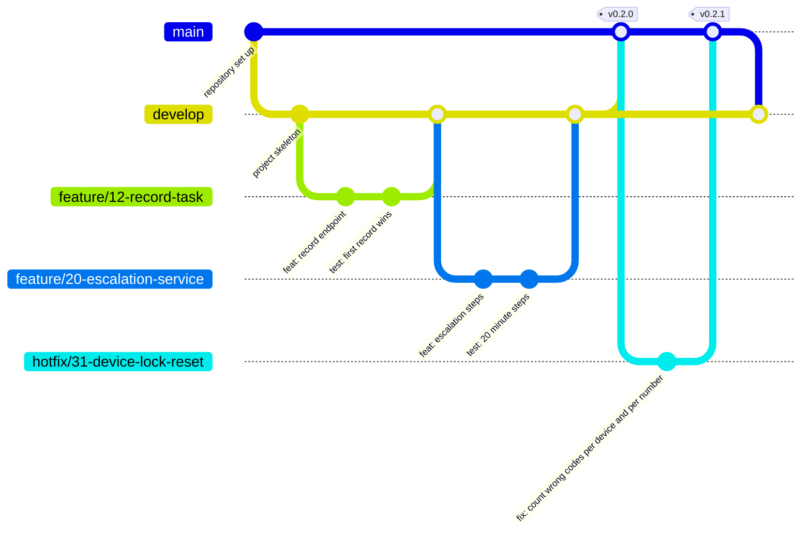
```mermaid
gitGraph
    commit id: "repository set up"
    branch develop
    checkout develop
    commit id: "project skeleton"
    branch "feature/12-record-task"
    checkout "feature/12-record-task"
    commit id: "feat: record endpoint"
    commit id: "test: first record wins"
    checkout develop
    merge "feature/12-record-task"
    branch "feature/20-escalation-service"
    checkout "feature/20-escalation-service"
    commit id: "feat: escalation steps"
    commit id: "test: 20 minute steps"
    checkout develop
    merge "feature/20-escalation-service"
    checkout main
    merge develop tag: "v0.2.0"
    branch "hotfix/31-device-lock-reset"
    checkout "hotfix/31-device-lock-reset"
    commit id: "fix: count wrong codes per device and per number"
    checkout main
    merge "hotfix/31-device-lock-reset" tag: "v0.2.1"
    checkout develop
    merge main
```

How a change travels:

1. We take an issue and create a branch from an up-to-date `develop`.
2. We commit often and push every day.
3. We open a pull request into `develop`. After review and green checks it is merged and the branch is deleted.
4. At the end of a milestone, when the manual test sheet passes, we merge `develop` into `main` and add a tag.
5. A hotfix goes into `main` first, gets a patch tag, and is merged back into `develop`.

#### 6.1.3 Commits

Our commits are small and frequent, with one idea in each. We follow Conventional Commits.

| Prefix | Use |
| --- | --- |
| `feat` | New behavior for a user |
| `fix` | A bug fix |
| `docs` | Documentation or API specification only |
| `test` | Tests only |
| `refactor` | A code change that does not change behavior |
| `chore` | Tooling, dependencies, workflows, configuration |

Examples from our project:

- `feat(tasks): refuse a second record and say who recorded first`
- `fix(auth): count wrong codes per device and per number, not per code`
- `test(escalation): move to the next member after 20 minutes`

The subject line is in English, in the imperative, and under about 72 characters. The body is optional and ends with `Refs #12` when an issue exists. Nobody pushes directly to `main` or `develop`.

#### 6.1.4 Code reviews and pull requests

Every change reaches `develop` through a pull request that follows this template (`.github/pull_request_template.md`):

```
WHAT
One or two sentences: what changes for the user or the system.

WHY
Closes #<issue number>   Story: US-xx

HOW IT WAS TESTED
- [ ] Tests added or updated (name them)
- [ ] Tried on: emulator / Android phone / iPhone (say which)

SCREENSHOTS
Arabic screens, right to left, before and after (for any screen change).

CHECKLIST
- [ ] CI is green and the branch is up to date with develop
- [ ] API specification and docs updated if an endpoint or rule changed
- [ ] No secrets, and no health details in notification text
- [ ] Works in Arabic, right to left
```

Our rules for review:

- At least 1 approval from a teammate who did not write the change, and the CI checks must be green.
- Nobody merges their own pull request.
- We squash-merge a pull request into `develop`, so `develop` has one clean commit for each feature. We merge `develop` into `main` with a merge commit, so each release and its tag stay visible.
- Pull requests are small (under about 400 changed lines). A larger change is split.
- A review is done within 24 hours on a working day.
- In GitHub we protect `main` and `develop`: a pull request is required, 1 approval, green checks, an up-to-date branch, resolved conversations, and no force push or deletion.

The reviewer checks that every new route checks the member's permission on the server and has a test that proves a refusal; that a notification never changes a task's status; that notification text and logs contain no medicine name, reading, one-time code, or full phone number; that screens work right to left with large fonts; that code that depends on time uses an injected clock; that a database change comes with an Alembic migration; and that the change has tests that would fail if the rule were broken.

### 6.2 Quality assurance (QA)

#### 6.2.1 Testing strategy

We have many fast automatic tests at the bottom and a few slow tests on real phones at the top.

| Level | What it checks | Tool | When |
| --- | --- | --- | --- |
| Static checks | Style and simple mistakes in Python and Dart | `ruff`, `black --check`, `flutter analyze`, `dart format` | Every push |
| Unit tests, back-end | Model methods (`Task.displayStatus`, `CircleMember.can`, `Medication.remainingStock`), the sign-in lock, invitation expiry, and the services with a fake clock | `pytest` | Every push |
| Integration tests, back-end | Every route of Section 5 against a real PostgreSQL: success, 400 bad input, 401, 403 role, 404, 409 | `pytest`, Flask test client, PostgreSQL in Docker | Every push |
| API tests | Status codes and JSON fields of the main routes on a real server | Postman collection, `newman` | After every deploy to staging |
| Unit and widget tests, app | Controllers, repositories, reminder times, and the Arabic right-to-left screens | `flutter_test`, `mocktail` | Every push |
| Integration tests, app | The app with a local API: sign in, create a circle, record a dose offline, then sync | `integration_test` on an emulator | Before each tag |
| End-to-end manual tests | Notifications, alarms, offline reminders, and every Must flow on a real iPhone and a real Android phone | Test scripts, one test sheet | End of each period and before each tag |
| Usability test | At least 2 of 3 users finish each Simplified Mode task without help | Task script and notes sheet | Last period |

What we test most:

- **The first valid record wins.** Two connections record the same task at the same moment, and only one record is kept.
- **Time.** Reminders every 10 minutes and escalation steps every 20 minutes cannot be tested by waiting, so the code uses an injected clock and the tests move the clock and call the scheduler directly.
- **Permissions.** One table in the tests, copied from Section 3.1.5, gives 80 cases (16 permissions times 5 roles).
- **Offline.** A record made offline is sent later with its original time, and a repeated `client_action_id` changes nothing.
- **Privacy.** No health details on the lock screen and in logs, and no coordinates in any answer.

We use PostgreSQL in the back-end tests, not SQLite, because the design relies on its unique indexes, `CHECK` constraints, and transactions. The test database is created from the Alembic migrations, so the migrations are tested too. We use `pytest` and `flutter_test` for Python and Dart, and Postman as the task asks.

#### 6.2.2 Definition of done and bugs

A story is done when its code is reviewed and merged, its tests pass in CI, it works on the staging build, and the API specification is updated if needed. A bug gets a GitHub issue with a severity (`blocker`, `major`, or `minor`). Every fixed bug gets a regression test in the same pull request, written first so that it fails before the fix.

### 6.3 Deployment pipeline

We have three environments.

| Environment | Runs on | Database | SMS and push | Updated by |
| --- | --- | --- | --- | --- |
| Local | Developer laptop, Docker Compose (`api`, `scheduler`, `db`) | Local PostgreSQL with fake data | SMS test mode, push messages written to the log | The developer |
| Staging | One small cloud VM, Docker Compose, HTTPS proxy | Own PostgreSQL, demo data only | SMS test mode, a FCM test project | `deploy-staging`, automatically after a merge to `develop` |
| Production | The same image and compose file, own `.env` | Own PostgreSQL with daily backups | Real SMS provider, real FCM and APNs | `deploy-production`, after approval, from a tag on `main` |

The pipeline below runs on GitHub Actions.

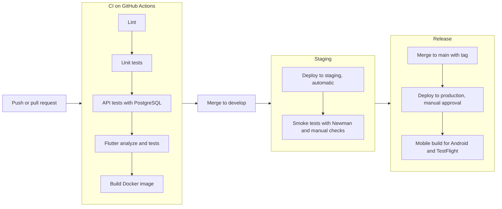
```mermaid
flowchart LR
    PR["Push or pull request"] --> CI
    subgraph CI["CI on GitHub Actions"]
        direction TB
        L["Lint"] --> U["Unit tests"] --> A["API tests with PostgreSQL"] --> F["Flutter analyze and tests"] --> D["Build Docker image"]
    end
    CI --> M1["Merge to develop"]
    M1 --> STG
    subgraph STG["Staging"]
        direction TB
        S["Deploy to staging, automatic"] --> T["Smoke tests with Newman and manual checks"]
    end
    STG --> REL
    subgraph REL["Release"]
        direction TB
        M2["Merge to main with tag"] --> P["Deploy to production, manual approval"] --> B["Mobile build for Android and TestFlight"]
    end
```

1. **Push or pull request.** We push a feature branch and open a pull request into `develop`. CI starts by itself.
2. **CI checks.** Lint (`ruff`, `black`, `flutter analyze`, `dart format`), unit tests, API tests against a PostgreSQL service container, Flutter tests, and the Docker image build. A red check blocks the merge.
3. **Merge to `develop`.** A teammate who did not write the change approves and squash-merges after the checks are green.
4. **Deploy to staging.** It starts by itself after the merge. The workflow pulls the new image, runs the Alembic migration, restarts the containers, and waits for `GET /health`.
5. **Smoke tests and manual checks.** Newman runs our Postman smoke collection against staging (sign in, create a circle, record a task, and the 403 and 409 cases), and we try the feature on a phone with the staging build.
6. **Merge to `main` with a tag.** At the end of a milestone, a pull request from `develop` into `main` needs 1 approval and a passed manual test sheet. Then we create the tag.
7. **Deploy to production.** The tag starts `deploy-production`, which waits for approval by the team lead or the project manager. It backs up the database, runs the migration, restarts the containers, and checks `GET /health`. If the check fails, it puts the previous image back.
8. **Mobile build.** The same tag builds the signed Android app bundle and APK. We build the iPhone app through TestFlight when we have the Apple developer account.

| Workflow | Trigger | Steps |
| --- | --- | --- |
| `backend-ci` | Push and pull request | Set up Python, run `ruff` and `black --check`, start PostgreSQL, run `alembic upgrade head`, run `pytest --cov`, and build the Docker image |
| `app-ci` | Push and pull request | Set up Flutter, run `dart format`, `flutter analyze`, and `flutter test` |
| `deploy-staging` | Push to `develop`, after `backend-ci` passes | Push the image to GitHub Container Registry, pull it on the staging VM, migrate, restart, wait for `GET /health`, and run Newman |
| `deploy-production` | Tag `v*` on `main` | Wait for approval, back up the database, pull the tagged image, migrate, restart, check `GET /health`, and roll back to the previous tag on failure |
| `docs-check` | Every pull request | Check that the Mermaid diagrams in `docs/` render, check Markdown links, and scan for committed secrets with `gitleaks` |

**Database changes.** We change the database only with Alembic migrations in `backend/migrations/`, and a model change and its migration are in the same pull request. CI runs `alembic upgrade head` on an empty database. Before a production migration we back up the database with `pg_dump`. If a release fails, we deploy the previous image tag, and if the migration cannot be undone that way we run its `downgrade` or restore the backup.

**Health and restart.** `GET /health` returns 200 when the API reaches the database and the scheduler is alive. Every container has `restart: unless-stopped`, and the scheduler runs as one copy in its own container.

## 7. Technical Justifications

In this part we give the reasons for our technical choices, so that a reader can see why we made each one and what we left out. We judged every choice by the same questions, which come from our requirements and our constraints.

| Question | Why it matters for TFAQUD |
| --- | --- |
| Do we already know it, or can we learn it in time? | Three students have six weeks of development. Flutter is the one new skill for us. |
| Does it keep the care record true? | A wrong status, a lost record, or a record shown to the wrong person is the worst failure. |
| Does it work without internet? | Reminders and recording a dose must not depend on the network. |
| Does it work in Arabic, right to left, on iPhone and Android? | The app is Arabic only, for two platforms, with one codebase. |
| Is it small enough to build, test, and run for the MVP? | Anything that adds a service to run must earn its place. |
| Can it grow after the MVP without a rewrite? | Device integration, alarms, and photo reading come later. |

### 7.1 Technology choices

| Part | Our choice | Why we chose it | What we did not choose |
| --- | --- | --- | --- |
| Mobile app | **Flutter (Dart)**, one codebase for iOS and Android | One codebase gives both phones, which is the only way three students can cover both in six weeks. Flutter draws its own widgets, so the Arabic right-to-left layout and the large Simplified screens look the same on both phones. | Two native apps (double the work); React Native (nobody on the team knows it); a web app (it cannot plan reliable local reminders on iPhone) |
| App state | **Riverpod** | State is kept outside the widgets, so we can test a controller without a screen. | Bloc (more files for the same result); `setState` alone (hard to test) |
| Phone storage | **SQLite through Drift** | The cached plan, today's tasks, the offline queue, and the planned reminders are related tables that we query. | Hive or Isar (weaker for joins) |
| Reminders on the phone | **Local notifications** planned from the cached plan | They fire at dose time with no internet and no server. | Push for every reminder (fails offline and can arrive late); a background service that polls (drains the battery) |
| API | **Python Flask**, REST, JSON | Two of us already know Flask, so the back-end starts on the first day. Flask is small, so we write the business rules ourselves and see every layer. | Django (larger than needed); FastAPI and Node.js (nobody has used them); Firebase as the whole back-end (the permission rules, the escalation, and the first-record-wins rule must be in our own tested code) |
| Data access | **SQLAlchemy** with **Alembic** migrations | Our model maps to 41 tables, and Alembic makes every database change a reviewed file that is the same on every machine. | Raw SQL everywhere; manual schema changes |
| Sign-in | **Phone number with an SMS code**, then **JWT** access and refresh tokens | The phone number is the identity of the app: invitations, the one-patient rule, and the patient's own account all use it. There is no password to forget, which suits older users. | Email and password; social sign-in; server sessions |
| Database | **PostgreSQL** | Our data is highly connected (members, tasks, assignments, escalations, history). We need foreign keys, `CHECK` constraints, unique indexes, and transactions for "the first record wins". | MongoDB or Firestore (no joins); SQLite on the server (one writer) |
| Timed jobs | **A separate scheduler container**, one copy | Marking missed doses, escalation steps, and expiries must run once and never stop. Each job compares stored times with the clock, so a late or repeated run still gives the right result. | A scheduler inside the API (every worker would start the jobs); Celery with Redis (two more services to run) |
| Push notifications | **Firebase Cloud Messaging**, which reaches iPhone through APNs | One server call reaches both phones, it is free, and it supports high priority on Android and the time-sensitive level on iPhone. | APNs plus a separate Android service (two integrations); SMS for alerts (cost, and medical text on the lock screen) |
| SMS | **An SMS provider** (Unifonic, alternative Twilio) | A provider with a registered Saudi sender name reaches Saudi numbers, and the choice can change without touching our API. | Our own SMS gateway; WhatsApp codes (they need approved templates) |
| Prayer times | **Aladhan API** (method 4, Umm Al-Qura), cached for each place and day, with an offline calculation as a fallback | Doses are set "after Asr", so Today and the plan need the times. A free JSON service is enough, and the fallback means an outage does not stop a reminder. | A fixed table (wrong for other cities and years) |
| The patient's location | **GPS on the patient's own phone**, or a **city picked from a fixed list** | The prayer times must be right for where the patient lives. We read the position once, use it only for the prayer times, and never show, track, or send it. | Typed city names; always-on tracking; location from the IP address |
| Invitations | **A WhatsApp link** (`wa.me`) opened on the manager's phone | It costs nothing, needs no business account, and the message comes from a person the invited member already knows. | The WhatsApp Business API; SMS invitations |
| Delivery | **Docker and Docker Compose**, **GitHub Actions** | The same images run on a laptop, on staging, and on production. Compose is enough for three containers. | Kubernetes (far too large for the MVP) |
| Source control | **Git on GitHub, one repository**, a small Git-flow | One pull request can change an endpoint, the app that calls it, and the specification together. | Two repositories; no `develop` branch (staging would have nothing to deploy from) |
| Testing | **pytest**, **flutter_test**, **Postman** and Newman, with PostgreSQL in the tests | `pytest` and `flutter_test` do for Python and Dart what Jest does for JavaScript, and our rules rely on PostgreSQL constraints. | SQLite in tests (it behaves differently from production) |

### 7.2 Design decisions

| Decision | Why we made it |
| --- | --- |
| **The care circle is the root.** One circle has one patient, and every record belongs to one circle. | The product is "a family looks after one person". One owner for every record turns the permission check into one question: what is this person's role in this circle? |
| **The role is stored on the membership, not on the person.** | The same person can be a manager in one circle and a viewer in another. |
| **Four stored roles, sixteen permissions, checked on the server for every request.** | The phone can be changed or copied, so hiding a button is not security. |
| **The mode (Simplified or Detailed) is chosen once, when the circle is created.** | Switching would change what a patient sees and who is told, and it would need more cases to design and test. |
| **The first valid record wins.** | Two family members may record the same dose. A `version` on the task and a `client_action_id` on the action keep one record, tell the second person who recorded it, and make a repeated request harmless. |
| **A reminder is never a confirmation.** | Only a record changes a task, so the log shows what really happened and not what the app guessed. |
| **Two kinds of alert: local for reminders, push for people.** | The reminder at dose time must work offline, so the phone makes it. A missed dose involves other people, and only the server knows that it was missed and who is next. |
| **Escalation runs on the scheduler, in an order the manager sets, 20 minutes apart.** | A missed dose is the reason the app exists, so it must reach someone even if the first person does not answer. The manager knows the family and chooses the order. |
| **Offline, the phone can record only a task and a measurement.** | These are the actions that happen at the bedside without internet. Other changes affect other people and need the server to decide. |
| **People join only by invitation to a phone number, and a circle for someone else needs that person's approval.** | There are no codes to share or guess, and nobody is added to a circle, or made the subject of one, without knowing. |
| **A plan change never edits the past, and nothing is deleted.** | A task done last week must still show the dose that was ordered last week. |
| **The stock is worked out, not stored.** | A stored "pills in the box" number drifts every time a dose is missed or counted twice. We store the boxes and the counts and work out what is left. |
| **There is no medical advice and no emergency service.** | The app is a care record. A reading outside the range the manager typed raises an alert and nothing else, and the help button only asks the managers. |
| **One location, with one purpose.** | The prayer times are the only thing that needs a place. Keeping one location in the patient's row and never returning it keeps the app from becoming a tracking tool. |
| **A relational schema with 41 tables.** | The database can refuse an impossible state, even if a code bug asks for one. |
| **REST with action routes** (for example `POST /tasks/{id}/record`). | Actions such as "record" and "assign" have rules, so each named route maps to one service method, one permission, and one test. |

### 7.3 Process decisions (SCM and QA)

| Decision | Why we made it |
| --- | --- |
| A small Git-flow with `main`, `develop`, and short `feature/` branches | `develop` is what staging runs and `main` is what production runs. Short branches keep conflicts small. |
| Every change by pull request, with one review and green checks | A hidden bug can mean a missed dose that nobody sees. A second reader and automatic checks catch most mistakes. |
| One test for every business rule | The rules are the promise of the app, and a failing test shows at once which promise broke. |
| An injected clock in the code and a fake clock in the tests | We cannot test reminders every 10 minutes by waiting. |
| A real iPhone and a real Android phone for notifications | An emulator does not show Focus modes, battery limits, or the exact-alarm permission, and these decide whether a reminder arrives. |
| The same Docker image for staging and production, with migrations as the only way to change the database | What we tested is what we deploy, and every database change can be read, repeated, and undone. |
