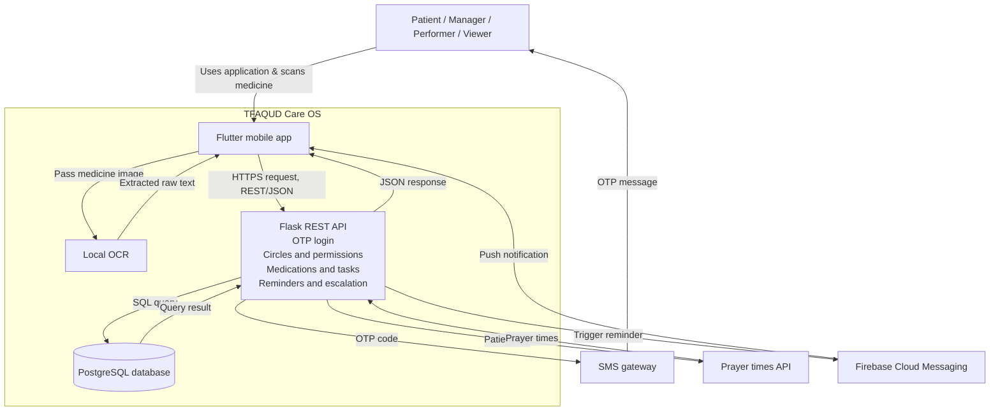
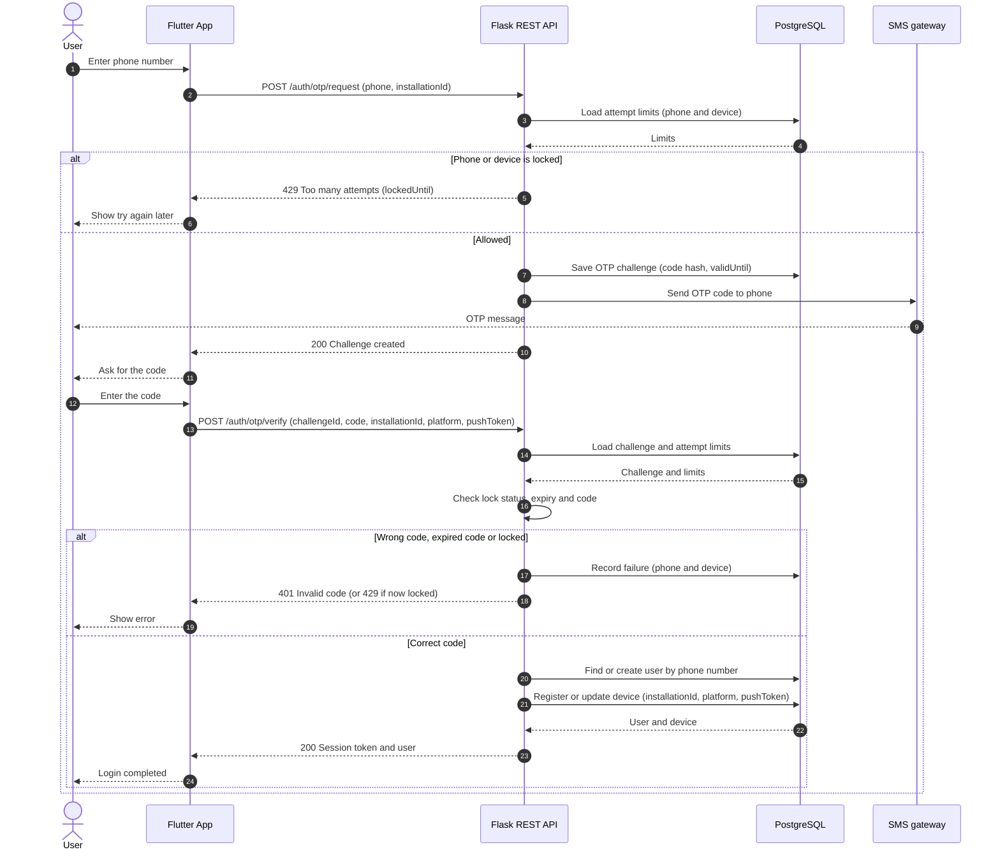
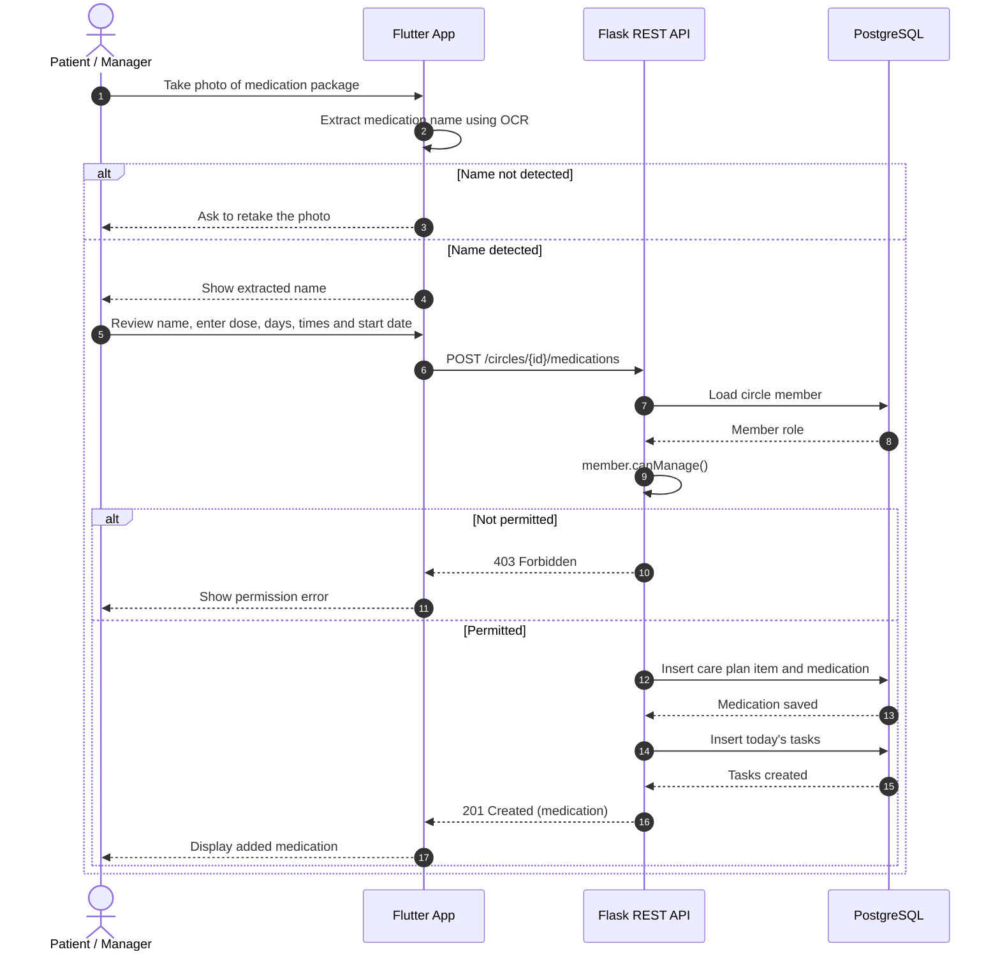

# Stage 3: Technical Documentation

## Table of Contents

1. [User Stories and Mockups](#1-user-stories-and-mockups)
2. [System Architecture](#2-system-architecture)
3. [Components, Classes, and Database Design](#3-components-classes-and-database-design)
4. [High-Level Sequence Diagrams](#4-high-level-sequence-diagrams)
5. [API Specifications](#5-api-specifications)
6. [SCM and QA Plans](#6-scm-and-qa-plans)
7. [Technical Justifications](#7-technical-justifications)

## 1. User Stories and Mockups

### 1.1 Prioritized User Stories

The TFAQUD MVP serves five user types. A **self-managing patient** manages their own care and has manager permissions in their care circle. A **simplified-mode patient** follows care tasks through a simplified interface. A **care manager** manages another patient’s care circle and care plan. A **care assistant** carries out tasks assigned to them. A **viewer** can view care information but cannot modify it.

The stories are prioritized using MoSCoW: **Must Have** items are essential to the MVP’s core care workflow; **Should Have** items are important but not essential to that workflow; and **Could Have** items are desirable additions that may be implemented if time allows.

#### Must Have

| ID | User Story |
|---|---|
| US-01 | As a **self-managing patient**, I want to create a care circle for myself, so that I can manage my care and invite others to participate. |
| US-02 | As a **care manager**, I want to create a care circle for a patient and select the patient’s app mode, so that I can set up the circle to suit the patient’s needs. |
| US-03 | As a **patient with a phone**, I want to approve or decline a request to create a care circle for me, so that I can control whether my care information is shared. |
| US-04 | As a **care manager or self-managing patient**, I want to invite people to a care circle and assign each person a role, so that they can participate with clearly defined responsibilities and permissions. |
| US-05 | As an **invitee**, I want to review the role offered to me and accept or decline the invitation, so that I can decide whether to join the care circle. |
| US-06 | As a **care manager or self-managing patient**, I want to add medications and specify their doses, duration, and schedules, so that medication tasks can be organized in the care plan. |
| US-07 | As a **care manager or self-managing patient**, I want to add required measurements and specify their types, schedules, and target ranges, so that readings can be tracked as part of the care plan. |
| US-08 | As a **care manager or self-managing patient**, I want to add a patient’s appointments and their details, so that visits and related tasks can be organized. |
| US-09 | As a **care manager or self-managing patient**, I want to assign a person responsible for each care task, so that responsibility for completing the task is clear. |
| US-10 | As a **care assistant**, I want to review tasks assigned to me and accept or decline them, so that I can indicate which tasks I can undertake. |
| US-11 | As an **authorized care-circle member**, I want to view care tasks and record completed tasks, so that the patient’s care record reflects what was actually done. |
| US-12 | As a **patient using Simplified Mode**, I want to view my daily tasks and record my responses to medication and measurement tasks, so that I can participate in my care easily. |
| US-13 | As a **person responsible for a care task**, I want to receive a reminder when the task is due, so that I can remember to complete it. |
| US-14 | As a **care manager or self-managing patient**, I want to follow up on missed tasks and escalate notifications according to the configured recipient order, so that uncompleted tasks receive appropriate follow-up. |
| US-15 | As a **viewer**, I want to view the care plan, completed tasks, and recorded measurements, so that I can follow the patient’s care. |

#### Should Have

| ID | User Story |
|---|---|
| US-16 | As a **care manager or self-managing patient**, I want to track medication supplies and estimate when they will run out, so that I can arrange a refill before the supply is depleted. |
| US-17 | As a **care manager or self-managing patient**, I want to change a medication dose or discontinue a medication while retaining its previous dose and the date and reason for the change, so that the medication history remains accurate. |
| US-18 | As a **care manager**, I want to add and update the patient’s medical-profile information and emergency contacts, so that current information is available to care-circle members. |
| US-19 | As a **patient**, I want to view my emergency card, including my medical information, current medications, and emergency contacts, so that I can access essential information when needed. |
| US-20 | As a **care manager or self-managing patient**, I want to export the patient’s complete care record, including current and previous medications and all recorded measurements without a date-range limit, so that I can keep and share a complete copy when needed. |

#### Could Have

| ID | User Story |
|---|---|
| US-21 | As the **care assistant accompanying a patient to an appointment**, I want to record visit notes and attach an image of the medical report, so that visit information is retained in the care record. |
| US-22 | As a **patient using Simplified Mode**, I want to record a measurement outside its scheduled time, so that I can add a reading taken when needed. |
| US-23 | As a **care-circle member with assigned tasks**, I want to temporarily hand over my tasks to another member when I am unavailable, so that care follow-up can continue during my absence. |
| US-24 | As a **user**, I want to access help and support, so that I can seek assistance when I encounter a problem using the application. |

### 1.2 Main Screen Mockups

[View the main screen mockups in Figma](https://www.figma.com/design/Ojd0XVQSuC39YoJoiRyhou/Tafaqud-Care-OS?node-id=0-1&t=EkiVLBVRuXTGD5P6-1)

## 2. System Architecture

## 3. Components, Classes, and Database Design

### 3.1 Front-End Components and Interactions

[Describe the main UI components, their responsibilities,
and how they interact.]

### 3.2 Back-End Classes

[Define the key back-end classes, including their attributes
and methods.]

### 3.3 Entity Relationship Diagram

## 4. High-Level Sequence Diagrams

### 4.1 User Login

The user signs in with a one-time code sent by SMS. The API checks the attempt limits for the phone and the device, sends the code, verifies it, then registers the device and returns a session token.

### 4.2 Add Medication

The patient or manager photographs the medication package and the app reads the name on the device (OCR). After the user completes the details, the API checks that the circle member is allowed to manage the care plan, then saves the medication and today's tasks in one transaction.

## 5. API Specifications

### 5.1 External APIs

[List the external APIs used by the MVP, their purposes,
and the reasons for choosing them.
If none are used, state that explicitly.]

### 5.2 Internal API Endpoints

[For each endpoint, specify:
- URL path.
- HTTP method.
- Input format: JSON, query parameters, or other applicable format.
- Output format, including the response structure.]

## 6. SCM and QA Plans

### 6.1 Source Control Management

[Specify:
- Version control tool.
- Branching strategy.
- Commit practices.
- Pull request process.
- Code review and merge process.]

### 6.2 Quality Assurance

[Specify:
- Testing types and what they cover.
- Testing tools.
- Manual testing of critical user flows, where applicable.]

### 6.3 Deployment Pipeline

[Describe the planned deployment pipeline for staging
and production environments.]

## 7. Technical Justifications

[Explain the reasons for the selected technologies and designs.
Connect each decision to functional requirements,
non-functional requirements, constraints,
or expert recommendations.
Include source links where a justification relies on a reference.]
