# Stage 3: Technical Documentation

**Project:** TFAQUD | تفقُّد
**Team:** Alanoud Aloraydi (Team Lead), Lama Alzahrani, Leen Algraawi
**Date:** October 2026

This document presents the technical documentation of the TFAQUD MVP in the seven parts required by Stage 3. All diagrams are written in Mermaid.

## Contents

1. [User Stories and Mockups](#1-user-stories-and-mockups)
2. [System Architecture](#2-system-architecture)
3. [Components, Classes, and Database Design](#3-components-classes-and-database-design)
4. [Sequence Diagrams](#4-sequence-diagrams)
5. [API Specifications](#5-api-specifications)
6. [SCM and QA Plans](#6-scm-and-qa-plans)
7. [Technical Justifications](#7-technical-justifications)

---

## 1. User Stories and Mockups

### 1.1 User roles

TFAQUD distinguishes five user roles. The role is stored on a person's membership in a circle, so one person may hold different roles in different circles.

| Role | Description |
| --- | --- |
| Self-manager (القادر) | A patient who manages his own care. He uses Detailed Mode with the rights of a Manager over his own circle. |
| Patient (المريض) | A patient who follows the plan on his own phone in Simplified Mode (one page with large buttons), or a patient who has no phone and no account. |
| Manager (المدير) | A family member who manages the plan, the members, and the alerts. |
| Performer (المنفّذ) | A family member or helper who carries out the tasks assigned to them. |
| Viewer (المطّلع) | A relative with read-only access. |

### 1.2 Prioritization

The user stories are prioritized with the MoSCoW method.

| Priority | Meaning |
| --- | --- |
| Must have | Required for the main flow: a circle, a care plan, today's tasks, reminders, and the escalation of a missed dose. |
| Should have | Important, but the main flow works without it. |
| Could have | Desirable. It is implemented only if time remains. |
| Won't have | Excluded from this release (Section 1.4). |

### 1.3 User stories

"Manager" in a story includes the Self-manager.

| ID | User story | Priority |
| --- | --- | --- |
| US-01 | As a user, I want to sign in with my phone number and a four-digit code, so that I do not need a password. | Must |
| US-02 | As a family member, I want to create a care circle for a patient, with the patient's approval when he has a phone, so that no one is added to a circle without his knowledge. | Must |
| US-03 | As a patient with a phone, I want the app to determine my location by GPS, and as the creator of a circle for a patient without a phone, I want to select his city, so that the prayer times are correct for his place of residence. | Must |
| US-04 | As a Manager, I want to invite a person by name, phone number, and role through a WhatsApp message, so that I can build the circle without codes. | Must |
| US-05 | As a Manager, I want to add a medicine with its dose, its schedule (a prayer period or a fixed time), and its performer, so that reminders are generated for the right person at the right time. | Must |
| US-06 | As a member, I want to see today's tasks grouped by prayer period and to record a task as done, so that the family knows what has been completed and no task is recorded twice. | Must |
| US-07 | As a Manager, I want to assign a task to a member who must accept or decline within 30 minutes, and to see declined or unanswered tasks in a "needs your attention" list, so that every task has a responsible person. | Must |
| US-08 | As a patient, I want a reminder at dose time that works without internet and repeats every 10 minutes, so that I do not forget my medicine. | Must |
| US-09 | As a Manager, I want to be alerted when a dose is missed, and the next member in the order I set to be alerted if I do not respond within 20 minutes, so that a missed dose does not go unnoticed. | Must |
| US-10 | As a member, I want an activity log of what was done, by whom, and when, so that the family can verify what happened. | Must |
| US-11 | As a patient, I want one page with the next medicine and three choices (take it, remind me in 10 minutes, I will not take it with a reason), so that I can act with one tap. | Should |
| US-12 | As a member with a weak connection, I want to record a dose or a reading without internet and have it sent later with its original time, so that no record is lost. | Should |
| US-13 | As a Manager, I want the app to estimate the pills left from the boxes added and the doses recorded, and to warn me when the supply is low, so that the medicine does not run out. | Should |
| US-14 | As a Manager, I want an adherence calendar and measurement charts, so that I can follow the patient's progress over time. | Should |
| US-15 | As a Manager, I want to fill in a medicine's details from a photo of its box, so that data entry is shorter. | Could |
| US-16 | As the companion at a visit, I want a one-page visit sheet that I can show on the screen or share as a PDF, so that the doctor receives the relevant information quickly. | Could |

### 1.4 Won't have

The following are excluded from this release.

- Emergency services: a call to 997 and sharing the patient's location with the family.
- Medical advice: diagnoses and suggested doses or ranges.
- Doctor accounts and calls inside the app.
- Changing the mode of a circle after its creation.
- A web or desktop version, and languages other than Arabic.

### 1.5 Mockups

Figma link: **PASTE THE FIGMA LINK HERE**

## 2. System Architecture

The system consists of a Flutter mobile application, a Flask back-end with a separate scheduler, a PostgreSQL database, and four external services. The diagram shows the components; the numbers on the arrows refer to the data flows in Section 2.3.

### 2.1 High-level diagram

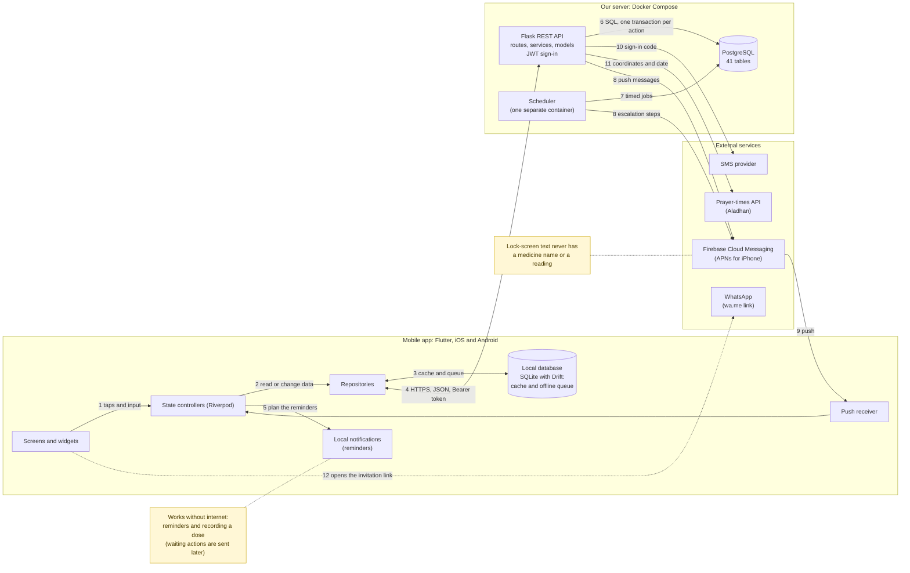
```mermaid
flowchart LR
    subgraph PHONE["Mobile app: Flutter, iOS and Android"]
        UI["Screens and widgets"]
        CTRL["State controllers (Riverpod)"]
        REPO["Repositories"]
        LDB[("Local database<br/>SQLite with Drift:<br/>cache and offline queue")]
        LN["Local notifications<br/>(reminders)"]
        PUSHIN["Push receiver"]
        UI -->|"1 taps and input"| CTRL
        CTRL -->|"2 read or change data"| REPO
        REPO <-->|"3 cache and queue"| LDB
        CTRL -->|"5 plan the reminders"| LN
        PUSHIN --> CTRL
    end

    subgraph SERVER["Our server: Docker Compose"]
        API["Flask REST API<br/>routes, services, models<br/>JWT sign-in"]
        SCH["Scheduler<br/>(one separate container)"]
        DB[("PostgreSQL<br/>41 tables")]
        API -->|"6 SQL, one transaction per action"| DB
        SCH -->|"7 timed jobs"| DB
    end

    subgraph EXT["External services"]
        FCM["Firebase Cloud Messaging<br/>(APNs for iPhone)"]
        SMS["SMS provider"]
        PRAY["Prayer-times API<br/>(Aladhan)"]
        WA["WhatsApp<br/>(wa.me link)"]
    end

    REPO <-->|"4 HTTPS, JSON, Bearer token"| API
    API -->|"10 sign-in code"| SMS
    API -->|"11 coordinates and date"| PRAY
    API -->|"8 push messages"| FCM
    SCH -->|"8 escalation steps"| FCM
    FCM -->|"9 push"| PUSHIN
    UI -.->|"12 opens the invitation link"| WA

    N1["Works without internet:<br/>reminders and recording a dose<br/>(waiting actions are sent later)"]:::note
    N2["Lock-screen text never has<br/>a medicine name or a reading"]:::note
    N1 -.- LN
    N2 -.- FCM
    classDef note fill:#fff7d6,stroke:#c9a400,color:#4a3b00
```

### 2.2 Components

| Component | Technology | Responsibility |
| --- | --- | --- |
| Mobile application (front-end) | Flutter (Dart), Riverpod, SQLite through Drift, local notifications | Displays the Arabic (right-to-left) interface, caches data on the phone, plans reminders, and communicates with the API. |
| API (back-end) | Python Flask REST API, SQLAlchemy, JWT | Receives requests, checks the caller's role, applies the business rules, and returns JSON. |
| Scheduler | A separate container, one instance | Marks missed tasks, runs the escalation steps, expires requests and invitations, and sends appointment reminders. |
| Database | PostgreSQL | Stores the 41 tables with their keys and constraints. |
| Push service (external) | Firebase Cloud Messaging; APNs for iPhone | Delivers push notifications. |
| SMS provider (external) | Unifonic or Twilio | Sends the sign-in code. |
| Prayer-times service (external) | Aladhan, with an offline calculation as a fallback | Converts a prayer period such as "after Asr" into a clock time. |
| WhatsApp (external) | `wa.me` link | Carries the invitation message from the manager's phone. |

### 2.3 Data flows

| # | From → to | Data | Mechanism |
| --- | --- | --- | --- |
| 1 | Screens → state controllers | The user's input | Dart calls |
| 2 | State controllers → repositories | Requests to read or change data | Dart calls |
| 3 | Repositories ↔ local database | Cached plan and tasks, prayer times, queue of offline actions | SQLite (Drift) |
| 4 | Repositories ↔ API | Requests and responses about circles, plans, tasks, and records; the sign-in token | HTTPS, JSON, `Authorization: Bearer` |
| 5 | State controllers → local notifications | Reminders for today and the coming days | Phone notification system; works without internet |
| 6 | API → PostgreSQL | Reads and writes | SQL through SQLAlchemy, one transaction per action |
| 7 | Scheduler → PostgreSQL | Timed jobs: missed tasks, escalation steps, expiries | SQL through the same services |
| 8 | API and scheduler → push service | Alerts that involve other people: a missed dose, the help button, an assigned task | FCM HTTP v1 |
| 9 | Push service → phone | The same alerts | FCM (Android) and APNs (iPhone) |
| 10 | API → SMS provider | The four-digit sign-in code | HTTPS request |
| 11 | API → prayer-times service | Coordinates and date; the five prayer times are returned | HTTPS GET, cached for each place and day |
| 12 | Phone → WhatsApp | The invitation message with the application link | `wa.me` link opened on the manager's phone |

Reminders at the scheduled time are local notifications created by the phone from its cached plan (flow 5), so they do not depend on the network. Alerts that involve other people are push notifications sent by the server (flows 8 and 9), because only the server knows that a dose was missed and who is next in the escalation order.

## 3. Components, Classes, and Database Design

### 3.1 Back-end

#### 3.1.1 Layers

| Layer | Responsibility |
| --- | --- |
| API layer (Flask blueprints) | Receives requests, checks the sign-in token, validates the input, calls a service, and returns JSON. It contains no business rules. |
| Service layer | Applies the business rules. Each action is one database transaction. |
| Model layer (SQLAlchemy) | Maps each table to a class and holds the behavior of a single record. |
| Cross-cutting | `PermissionPolicy` decides what a role may do. The `Scheduler` runs the timed jobs. |

#### 3.1.2 Class diagram

The domain model has 53 boxes in six packages (Account, Circles, Care plan, Tasks, Alerts, and Records): 50 classes and 3 enumerations. The `Circle` is the root: it has one patient, its members, its care plan, its tasks, its readings, and its log. A `User` joins a circle as a `CircleMember`, and the role is stored on the membership. Medicines, measurement plans, and appointments are `CarePlanItem`s that generate `Task`s. Alerts refer to an `AlertSubject`: an `Escalation` sends `Notification`s, and an `AttentionItem` stays open until a member resolves it.

The diagram shows every class with its attributes, methods, and relationships. In the notation, `+` is public, `-` is private, and `[0..1]` or `[0..*]` after a type marks an optional value or a list. The stereotype `<<dataType>>` marks a small value owned by another class, `<<derived>>` a class that is built on request and never stored, and `<<device>>` a class that exists on the phone only.

```mermaid
classDiagram
    direction TB
    namespace Account {
        class User {
            -id : UUID4
            -phoneNumber : String
            -firstName : String
            -lastName : String
            -displayName : String
            -birthYear : Integer[0..1]
            -city : String[0..1]
            -quietFrom : Time
            -quietUntil : Prayer
            -summaryAfter : Prayer
            +memberships() List~CircleMember~
            +lastUsedMembership() CircleMember[0..1]
            +exportMyData() File
            +deleteAccount() void
        }
        class Device {
            -id : UUID4
            -platform : Platform
            -pushToken : String[0..1]
            -appVersion : String
            -notificationsAllowed : Boolean
            -exactAlarmAllowed : Boolean[0..1]
            -locationAllowed : Boolean[0..1]
            -installationId : String
            +signOut() void
        }
        class OtpChallenge {
            -id : UUID4
            -phoneNumber : String
            -codeHash : String
            -sentAt : DateTime
            -validUntil : DateTime
            -resendAvailableAt : DateTime
            +verify(code : String) Boolean
            +isExpired(now : DateTime) Boolean
            +resend() void
        }
        class OtpAttemptLimit {
            -scope : LimitScope
            -key : String
            -failedAttempts : Integer
            -lockedUntil : DateTime[0..1]
            +attemptsLeft() Integer
            +recordFailure() void
            +isLocked(now : DateTime) Boolean
            +reset() void
        }
    }
    namespace Circles {
        class Role {
            <<enumeration>>
            MANAGER
            PERFORMER
            VIEWER
            PATIENT_SIMPLIFIED
        }
        class AppMode {
            <<enumeration>>
            SIMPLIFIED
            DETAILED
        }
        class InvitableRole {
            <<enumeration>>
            MANAGER
            PERFORMER
            VIEWER
        }
        class Circle {
            -id : UUID4
            -patientMode : AppMode[0..1]
            -status : CircleStatus
            -creationPath : CreationPath
            -createdAt : DateTime
            -archivedAt : DateTime[0..1]
            +invite(name : String, phone : String, role : InvitableRole) Invitation
            +archive(by : CircleMember) void
            +reopen(by : CircleMember) void
            +isReadable(now : DateTime) Boolean
            +detachPatientAccount() void
            +deleteWhenUnmanaged() void
            +exportCareRecord(by : CircleMember) CareRecordExport
            +addPlanItem(by : CircleMember, item : CarePlanItem) void
        }
        class Patient {
            -id : UUID4
            -firstName : String
            -lastName : String
            -birthYear : Integer
            -photoUrl : String[0..1]
            -phoneNumber : String[0..1]
            -afterPrayerOffsetMin : Integer = 20
            +hasPhone() Boolean
            +age() Integer
            +fullName() String
            +updatePrayerLocation(location : PatientLocation) void
            +syncIdentityFrom(user : User) void
        }
        class PatientLocation {
            <<dataType>>
            -city : String
            -latitude : Decimal
            -longitude : Decimal
            -source : LocationSource
            -updatedAt : DateTime
        }
        class MedicalProfile {
            -bloodType : String[0..1]
            -allergies : Allergy[0..*]
            -chronicConditions : String[0..*]
            -doctors : Doctor[0..*]
            +edit(by : CircleMember) void
        }
        class Allergy {
            <<dataType>>
            -name : String
            -severity : Severity[0..1]
            -reportedYear : Integer[0..1]
        }
        class Doctor {
            <<dataType>>
            -name : String
            -specialty : String[0..1]
            -place : String[0..1]
        }
        class EmergencyContact {
            -id : UUID4
            -fullName : String
            -relationToPatient : String
            -phoneNumber : String
            -displayOrder : Integer
        }
        class EmergencyCard {
            <<derived>>
            -generatedAt : DateTime
            +view(by : CircleMember) Document
        }
        class Consent {
            -givenAt : DateTime
            -scope : SharedData[1..*]
            -givenBy : User
        }
        class CareAcknowledgment {
            -declaredAt : DateTime
            -declaredBy : User
        }
        class CircleRequest {
            -id : UUID4
            -patientPhone : String
            -patientFirstName : String
            -patientLastName : String
            -mode : AppMode
            -patientRole : InvitableRole[0..1]
            -status : RequestStatus
            -createdAt : DateTime
            -expiresAt : DateTime
            +approve(patient : User) Circle
            +decline() void
            +cancel() void
            +expireIfDue(now : DateTime) void
        }
        class Invitation {
            -id : UUID4
            -invitedName : String
            -invitedPhone : String
            -role : InvitableRole
            -status : InvitationStatus
            -createdAt : DateTime
            -expiresAt : DateTime
            +isAvailable(now : DateTime) Boolean
            +accept(user : User) CircleMember
            +decline() void
            +cancel() void
            +sendWhatsAppLink() void
        }
        class CircleMember {
            -id : UUID4
            -role : Role
            -relationToPatient : String[0..1]
            -status : MemberStatus
            -joinedAt : DateTime
            -lastUsedAt : DateTime[0..1]
            +can(permission : Permission) Boolean
            +isThePatient() Boolean
            +changeRoleOf(other : CircleMember, role : InvitableRole) void
            +isLastManager() Boolean
            +leave() void
        }
        class EscalationOrder {
            -stepMinutes : Integer = 20
            +arrange(member : CircleMember, position : Integer) void
            +next(after : CircleMember[0..1]) CircleMember[0..1]
            +isEligible(member : CircleMember) Boolean
        }
        class EscalationEntry {
            -position : Integer
        }
        class PatientPhoneSettings {
            -fontSize : FontSize
            -readAloud : Boolean
            +tryAlert() void
        }
        class PatientPhoneStatus {
            -connectedSince : Date
            -lastActivityAt : DateTime[0..1]
            -appStoppedAt : DateTime[0..1]
            +stopApp() void
        }
    }
    namespace CarePlan {
        class CarePlanItem {
            <<abstract>>
            -id : UUID4
            -title : String
            -orderedBy : String[0..1]
            -startsOn : Date
            -endsOn : Date[0..1]
            -status : ItemStatus
            +generateTasks(day : Date) List~Task~
        }
        class ScheduledItem {
            <<abstract>>
            -priority : Priority
            -maxLatenessMin : Integer
            -performerMode : PerformerMode
            -repeatEveryMin : Integer = 10
            +escalates() Boolean
            +latestAt(task : Task) DateTime
        }
        class Medication {
            -scientificName : String[0..1]
            -strength : String[0..1]
            -baseDose : MedicationQuantity
            -mealRelation : MealRelation
            -durationDays : Integer[0..1]
            -instructionIcons : InstructionIcon[0..*]
            -photoUrl : String[0..1]
            -lowStockAt : MedicationQuantity[0..1]
            +changeDose(by : CircleMember, newDose : MedicationQuantity, orderedBy : String, reason : String, from : DateTime) MedicationChange
            +stop(by : CircleMember, orderedBy : String, reason : String, from : DateTime) MedicationChange
            +addStock(by : CircleMember, quantity : MedicationQuantity, addedOn : Date) StockAddition
            +recountStock(by : CircleMember, counted : MedicationQuantity) StockAddition
            +remainingStock() MedicationQuantity[0..1]
            +forecastSupply(at : DateTime) SupplyForecast
            +isLow() Boolean
            +effectiveDose(at : DateTime) MedicationQuantity[0..1]
        }
        class MedicationQuantity {
            <<dataType>>
            -value : Decimal
            -unit : String
        }
        class StockAddition {
            -kind : StockEntryKind
            -quantity : MedicationQuantity
            -addedOn : Date
            -recordedBy : CircleMember
        }
        class SupplyForecast {
            <<dataType>>
            -estimatedRunOutAt : DateTime[0..1]
            -treatmentEndsOn : Date[0..1]
            -coversTreatment : Boolean[0..1]
            -calculatedAt : DateTime
        }
        class MedicationChange {
            -kind : ChangeKind
            -previousDose : MedicationQuantity
            -newDose : MedicationQuantity[0..1]
            -orderedBy : String
            -reason : String[0..1]
            -effectiveFrom : DateTime
            -madeBy : CircleMember
            -madeAt : DateTime
        }
        class MeasurementPlan {
            -type : MeasurementType
            -context : MeasureContext
            -range : TargetRange[0..1]
            +isOutsideRange(m : Measurement) Boolean
            +stopPlan(by : CircleMember, reason : String) void
            +updateRange(by : CircleMember, range : TargetRange) void
        }
        class TargetRange {
            <<dataType>>
            -primaryLower : Decimal
            -primaryUpper : Decimal
            -secondaryLower : Decimal[0..1]
            -secondaryUpper : Decimal[0..1]
            -unit : String
            -orderedBy : String[0..1]
        }
        class Appointment {
            -kind : AppointmentKind
            -seriesStartsAt : DateTime
            -place : String[0..1]
            -repeat : RepeatRule
            -preparation : String[0..1]
            +generateOccurrences(until : Date) List~AppointmentOccurrence~
            +rescheduleSeries(by : CircleMember, startsAt : DateTime) void
            +cancel(by : CircleMember, reason : String) void
        }
        class AppointmentOccurrence {
            -id : UUID4
            -startsAt : DateTime
            -status : AppointmentStatus
            +assignCompanion(by : CircleMember, member : CircleMember) void
            +askCircle() void
            +volunteer(member : CircleMember) void
            +hasCompanion() Boolean
            +reschedule(by : CircleMember, startsAt : DateTime) void
            +cancel(by : CircleMember, reason : String) void
        }
        class TimeSlot {
            <<dataType>>
            -kind : SlotKind
            -prayer : Prayer[0..1]
            -exactTime : Time[0..1]
            -daysOfWeek : DayOfWeek[0..7]
            +resolve(day : Date, times : PrayerTimes, offsetMin : Integer) DateTime
        }
    }
    namespace Tasks {
            class Task {
                -id : UUID4
                -kind : TaskKind
                -title : String
                -dueAt : DateTime
                -prayerPeriod : Prayer[0..1]
                -plannedDose : MedicationQuantity[0..1]
                -status : TaskStatus
                -postponedUntil : DateTime[0..1]
                -latestAt : DateTime[0..1]
                -recordedAt : DateTime[0..1]
                -recordedBy : CircleMember[0..1]
                -basis : RecordBasis[0..1]
                -doseTaken : MedicationQuantity[0..1]
                -outcome : PatientOutcome[0..1]
                -voiceNoteUrl : String[0..1]
                -note : String[0..1]
                -clientActionId : UUID4[0..1]
                -version : Integer
                +complete(by : CircleMember, takenAt : DateTime, actionId : UUID4) RecordResult
                +logFor(by : CircleMember, basis : RecordBasis, at : DateTime) RecordResult
                +editRecord(newTime : DateTime) void
                +postpone(until : DateTime) void
                +couldNot(reason : String) void
                +markMissed() void
                +displayStatus(now : DateTime) DisplayStatus
                +firstRecipients() List~CircleMember~
                +needsAttention() Boolean
            }
            class TaskAssignment {
                -status : AssignmentStatus
                -source : AssignmentSource
                -assignedBy : CircleMember
                -note : String[0..1]
                -remindWhenBoxArrives : Boolean
                -createdAt : DateTime
                -respondBy : DateTime
                -respondedAt : DateTime[0..1]
                -completedAt : DateTime[0..1]
                -declineReason : String[0..1]
                +accept() void
                +decline(reason : String) void
                +complete(at : DateTime) void
                +expireIfDue(now : DateTime) void
                +reassign(to : CircleMember) TaskAssignment
            }
            class TemporaryHandover {
                -periodFrom : DateTime
                -periodTo : DateTime
                -scope : HandoverScope
                -status : HandoverStatus
                +propose() List~TaskAssignment~
                +sendRequests() void
                +statusBoard() List~TaskAssignment~
                +end() void
            }
            class Visit {
                -date : Date
                -status : VisitStatus
                -notes : String[0..1]
                -voiceNoteUrl : String[0..1]
                -reportPhotoUrls : String[0..*]
                -savedAt : DateTime[0..1]
                -savedBy : CircleMember[0..1]
                -companionRightsUntil : DateTime[0..1]
                +save(by : CircleMember) void
                +mayEdit(member : CircleMember, now : DateTime) Boolean
                +addNextAppointment() Appointment
            }
            class SymptomReport {
                -reasons : Symptom[1..*]
                -voiceNoteUrl : String[0..1]
                -reportedAt : DateTime
                +askDoctor() FamilyQuestion
            }
        }
        namespace Alerts {
            class AlertSubject {
                <<interface>>
                +circle() Circle
                +lockScreenText() String
            }
            class Notification {
                -type : NotificationType
                -strength : Strength
                -channel : Channel
                -scheduledAt : DateTime
                -deliveredAt : DateTime[0..1]
                -openedAt : DateTime[0..1]
                -respondedAt : DateTime[0..1]
                -response : ResponseAction[0..1]
                +deliver() void
                +open() void
                +respond(action : ResponseAction) void
            }
            class Escalation {
                -trigger : EscalationTrigger
                -status : EscalationStatus
                -startedAt : DateTime
                -step : Integer
                -respondedBy : CircleMember[0..1]
                -respondedAt : DateTime[0..1]
                +start() void
                +notifyNext() void
                +respond(by : CircleMember) void
                +isExhausted() Boolean
            }
            class AttentionItem {
                -kind : AttentionKind
                -importance : Integer
                -raisedAt : DateTime
                -resolvedAt : DateTime[0..1]
                -resolvedBy : CircleMember[0..1]
                -resolution : Resolution[0..1]
                +resolve(by : CircleMember, how : Resolution) void
                +actions() List~AttentionAction~
            }
        }
        namespace Records {
            class Measurement {
                -id : UUID4
                -type : MeasurementType
                -primaryValue : Decimal
                -secondaryValue : Decimal[0..1]
                -pulse : Integer[0..1]
                -unit : String
                -context : MeasureContext[0..1]
                -measuredAt : DateTime
                -rangeAtRecording : TargetRange[0..1]
                -recordedBy : CircleMember
                -clientActionId : UUID4[0..1]
                +isOutsideRange() Boolean
            }
            class ActivityEntry {
                -type : ActivityType
                -occurredAt : DateTime
                -recordedAt : DateTime
                -actor : CircleMember[0..1]
                -onBehalf : Boolean
                -failed : Boolean
                -details : Json
                -clientActionId : UUID4[0..1]
                +record(type : ActivityType, actor : CircleMember, details : Json) ActivityEntry
            }
            class FamilyQuestion {
                -text : String
                -addedBy : CircleMember
                -addedAt : DateTime
                +addToVisitSheet() void
            }
            class AdherenceReport {
                <<derived>>
                -periodDays : Integer
                -onTimeShare : Decimal
                -onTimeCount : Integer
                -scheduledCount : Integer
                -lateCount : Integer
                -missedCount : Integer
                -outsideRangeCount : Integer
                +calendar(month : Date) List~DayColor~
                +perMedicine() List~DoseCount~
                +compareWithPrevious() AdherenceReport
            }
        class CareRecordExport {
            <<derived>>
            -generatedAt : DateTime
            +exportPdf() File
        }
        class VisitSheet {
                <<derived>>
                -periodDays : Integer = 30
                -generatedAt : DateTime
                -footer : String
                +preview() Document
                +exportPdf() File
                +showOnScreen() void
            }
            class PrayerTimes {
                -latitude : Decimal
                -longitude : Decimal
                -date : Date
                -times : Map~Prayer, Time~
                -source : TimeSource
                +periodOf(t : Time) Prayer
            }
            class OfflineAction {
                <<device>>
                -clientActionId : UUID4
                -kind : ActionKind
                -payload : Json
                -originalTime : DateTime
                -status : SyncStatus
                +send() RecordResult
                +retry() void
            }
        }
    User "0..1" --> "0..*" Device : signs in on
    OtpChallenge "0..*" --> "1" Device : requested from
    Device ..> OtpAttemptLimit : counted by installationId
    OtpChallenge "0..*" --> "2" OtpAttemptLimit : checks device and number
    Circle "1" *-- "1" Patient : cares for
    Circle "1" *-- "1..*" CircleMember : members
    User "1" --> "0..*" CircleMember : joins as
    Patient "0..1" --> "0..1" User : own account
    Patient "1" *-- "1" PatientLocation : prayer location
    Patient "1" *-- "1" MedicalProfile : medical file
    Patient "1" *-- "0..1" PatientPhoneSettings : phone settings
    Patient "1" *-- "0..1" PatientPhoneStatus : phone access
    PatientPhoneStatus "0..1" --> "0..1" Device : installed on
    MedicalProfile "1" *-- "0..*" EmergencyContact : emergency contacts
    EmergencyCard ..> Patient : full name
    EmergencyCard ..> MedicalProfile : health details and contacts
    EmergencyCard ..> Medication : current medicines
    Circle ..> EmergencyCard : shows
    Circle "1" *-- "0..*" Consent : patient consent history
    Circle "1" *-- "0..1" CareAcknowledgment : creator declaration
    Circle "1" *-- "1" EscalationOrder : notification order
    EscalationOrder "1" *-- "0..*" EscalationEntry : positions
    EscalationEntry "0..*" --> "1" CircleMember : ranks
    Circle "1" *-- "0..*" Invitation : invites
    Invitation "0..1" --> "0..1" CircleMember : becomes
    Invitation "0..*" --> "1" CircleMember : invited by
    CircleRequest "0..*" --> "1" User : created by
    CircleRequest "0..1" --> "0..1" Circle : creates when approved
    CircleRequest "0..*" --> "0..1" User : patient approves
    Circle "1" *-- "0..*" CarePlanItem : care plan
    CarePlanItem <|-- ScheduledItem
    ScheduledItem <|-- Medication
    ScheduledItem <|-- MeasurementPlan
    CarePlanItem <|-- Appointment
    ScheduledItem "1" *-- "1..*" TimeSlot : times
    ScheduledItem "0..*" --> "0..1" CircleMember : specific performer
    Medication "1" *-- "0..*" MedicationChange : history
    Medication "1" *-- "0..*" StockAddition : stock additions
    Medication ..> SupplyForecast : calculates
    AppointmentOccurrence "0..*" --> "0..1" CircleMember : companion
    Appointment "1" *-- "0..*" AppointmentOccurrence : occurrences
    AppointmentOccurrence "1" *-- "0..1" Visit : visit
    MedicationChange "0..*" --> "0..1" Visit : made at
    PatientLocation ..> PrayerTimes : coordinates for
    Circle ..> CareRecordExport : exports
    CareRecordExport ..> CarePlanItem : current plan
    CareRecordExport ..> MedicationChange : medication history
    CareRecordExport ..> Measurement : readings
    CareRecordExport ..> Appointment : scheduled appointments
    CareRecordExport ..> AppointmentOccurrence : appointment history
    CareRecordExport ..> Visit : visit records
    CareRecordExport ..> Patient : who
    CareRecordExport ..> MedicalProfile : health details
    Circle "1" *-- "0..*" Task : tasks
    CarePlanItem "0..1" --> "0..*" Task : generates
    AppointmentOccurrence "0..1" --> "0..1" Task : appointment task
    Task "1" *-- "0..*" TaskAssignment : assigned through
    TaskAssignment "0..*" --> "1" CircleMember : assigned to
    Task "0..*" --> "0..1" CircleMember : responsible
    TemporaryHandover "1" o-- "0..*" TaskAssignment : transfer requests
    User "1" --> "0..*" TemporaryHandover : asks to hand over
    TemporaryHandover "0..*" --> "0..*" Circle : covers
    Task "1" o-- "0..1" SymptomReport : reports
    Task ..|> AlertSubject
    Measurement ..|> AlertSubject
    SymptomReport ..|> AlertSubject
    Medication ..|> AlertSubject
    Notification "0..*" --> "0..1" AlertSubject : about
    Notification "0..*" --> "1" User : sent to
    Escalation "0..*" --> "0..1" AlertSubject : about
    Escalation "1" *-- "1..*" Notification : steps
    Escalation "0..*" --> "1" EscalationOrder : follows
    AttentionItem "0..*" --> "0..1" AlertSubject : about
    Circle "1" *-- "0..*" AttentionItem : needs attention
    Circle "1" *-- "0..*" Measurement : measurements
    Measurement "0..*" --> "0..1" MeasurementPlan : follows
    Measurement "0..1" --> "0..1" Task : fulfils
    Circle "1" *-- "0..*" ActivityEntry : log
    Circle "1" *-- "0..*" FamilyQuestion : questions
    FamilyQuestion "0..*" --> "0..1" SymptomReport : from
    AdherenceReport ..> Task
    AdherenceReport ..> Measurement
    VisitSheet ..> AdherenceReport
    VisitSheet ..> MedicalProfile
    VisitSheet ..> FamilyQuestion
    VisitSheet ..> MedicationChange
    VisitSheet ..> Measurement
    TimeSlot ..> PrayerTimes : resolved with
    OfflineAction ..> Task : replays
    OfflineAction ..> Measurement : replays
```

#### 3.1.3 Key classes

The table lists the main classes and their responsibilities. The complete list of attributes and methods is in the diagram above.

| Class | Responsibility |
| --- | --- |
| `User` | A person with a phone number who signs in. Holds the first and last name, the display name, the quiet-time setting, and the user's own city (used only for his quiet-time prayers). |
| `OtpAttemptLimit` | The count of wrong codes and the 24-hour lock for one key: an installation id (scope `DEVICE`) or a phone number (scope `PHONE_NUMBER`). Every code is checked against both. Asking for a new code does not reset the count. |
| `Circle` | One patient, one circle. Carries the mode, chosen once (empty when the patient has no phone, because there is no patient app to put in a mode). Can be archived and reopened, and can export the care record. |
| `Patient` | What the creator typed about the patient: first and last name, birth year, photo, phone. Holds the "after the prayer" minutes (20 by default). No phone means no account and no membership. |
| `CircleMember` | A person's place in one circle, with one of the four stored roles. |
| `CircleRequest` | The request that waits up to 24 hours for the patient's approval. It holds the patient's first and last name and the role the creator chose for him. |
| `Invitation` | An invitation to a phone number with a role (Manager, Performer, or Viewer). It can be cancelled and expires after 7 days. There is no code. |
| `EscalationOrder` | The order in which members are told about an urgent alert, arranged by the manager. |
| `CarePlanItem` (abstract) | The shared part of a medicine, a measurement plan, and an appointment: title, who ordered it (a name), dates, and status. |
| `ScheduledItem` (abstract) | The part only a medicine and a measurement plan share: priority, maximum lateness (set by the manager), who performs it, and the 10-minute repeat. |
| `Medication` | Name, strength, the dose (a `MedicationQuantity`), relation to food, and the low-stock level. The pills left are worked out and never stored. Changing the dose or stopping goes through `MedicationChange`. |
| `MeasurementPlan` | Sugar or pressure, its context, and the range the doctor set. An empty range is allowed. |
| `Appointment` | A series: kind, the date of the first visit, place, repeat, and preparation. Each date is an `AppointmentOccurrence`. |
| `AppointmentOccurrence` | One date of an appointment: its status (`SCHEDULED`, `DONE`, `CANCELLED`), its companion, and its visit. |
| `TimeSlot` (value) | A prayer period or a fixed hour, on chosen days. |
| `Task` | One scheduled dose, measurement, or appointment on one day. It holds what was recorded and by whom. It is the center of the Today view. |
| `TaskAssignment` | Giving the same card to a person. Keeps accepted, declined, expired, and finished requests as history. The receiver has 30 minutes to answer, and an accepted assignment can be finished (`COMPLETED`) without changing the card. |
| `Notification` | One alert to one user, with its strength, and whether it was delivered, opened, or answered. It never changes a task's status. |
| `Escalation` | One run of alerts for an urgent event: who was told, when, and who responded. |
| `AttentionItem` | A line in "needs your attention". It stays until someone completes or reassigns it. |
| `Measurement` | A sugar or blood-pressure reading with its original time and the range that applied when it was saved (`rangeAtRecording`). |
| `ActivityEntry` | One line of the activity log: what, who, when, and whether it was done for the patient. |
| `PrayerTimes` | The five prayer times for a place (latitude and longitude) and a day, cached, with an offline calculation as the fallback. |
| `OfflineAction` (device) | A record made without internet, with its original time and a client action id. It lives on the phone only. |

#### 3.1.4 Services

| Service | Responsibility | Main operations |
| --- | --- | --- |
| `AuthService` | Sends and verifies the SMS code, counts wrong codes per device and per phone number, locks sign-in for 24 hours after the third, and issues tokens. | `requestCode`, `verifyCode`, `refresh` |
| `AccountService` | Returns the user's circles with the role in each, and manages the profile, quiet time, data export, and account deletion. | `me`, `updateProfile`, `exportMyData`, `deleteAccount` |
| `CircleService` | Creates circles and circle requests, changes roles, removes members, archives circles, and keeps the medical file and the patient's location. | `createCircle`, `createRequest`, `answerRequest`, `changeRole`, `setPatientLocation` |
| `InvitationService` | Creates, accepts, declines, cancels, and expires invitations, and builds the WhatsApp link. | `invite`, `pending`, `accept`, `decline` |
| `PermissionPolicy` | Decides whether the role of a member allows an action. | `can`, `require` |
| `CarePlanService` | Adds and changes medicines, measurement plans, and appointments, and keeps the history of dose changes and the stock. | `addMedication`, `changeDose`, `addMeasurementPlan`, `addAppointment` |
| `TaskService` | Generates the day's tasks, records a task (the first valid record wins), and handles postponement, "could not", and assignments. | `today`, `record`, `logFor`, `couldNot`, `assign`, `answerAssignment` |
| `EscalationService` | Starts an escalation and notifies the next member in the order every 20 minutes until someone responds. | `start`, `notifyNext`, `respond` |
| `AttentionService` | Raises, lists, and resolves "needs your attention" items. | `raise`, `list`, `resolve` |
| `NotificationService` | Chooses the channel and strength of a notification, keeps health details out of the lock-screen text, and applies quiet time. | `send`, `respond` |
| `MeasurementService` | Saves readings with the applicable range and alerts the managers when a reading is outside it. | `record`, `history` |
| `ReportService` | Builds the activity feed, the adherence calendar, the visit sheet, and the care record export. | `activityFeed`, `adherence`, `visitSheet` |
| `SyncService` | Replays the actions recorded offline and ignores duplicates. | `applyActions` |
| `PrayerTimeService` | Returns the prayer times for a location and a day from the cache, the external service, or an offline calculation. | `timesFor`, `refresh` |
| `Scheduler` | Runs the timed jobs: task generation, missed tasks, escalation steps, and expiries. | `runJobs` |

### 3.2 Database

The relational schema has 41 tables in PostgreSQL. It is described by ER diagrams: one overview of the tables and their relationships, followed by seven diagrams that show the columns of each area. In the diagrams, `PK` is a primary key, `FK` a foreign key, and `UK` a unique key; a column marked `required` cannot be empty. All identifiers are UUIDs. Enumerated values are text columns with a `CHECK` constraint. A quantity (a dose or a stock count) is stored as a `_value` and a `_unit` column. The pills left in a box are not stored; they are calculated from `stock_additions` and the recorded doses.

#### Overview of the tables and their relationships

The overview omits the columns that refer to `circle_members` and `users`, the `circle_id` column of the smaller tables, and the optional subject links of the alert tables. `otp_attempt_limits` and `prayer_times` have no foreign key and therefore no line. All omitted columns appear in the detailed diagrams.

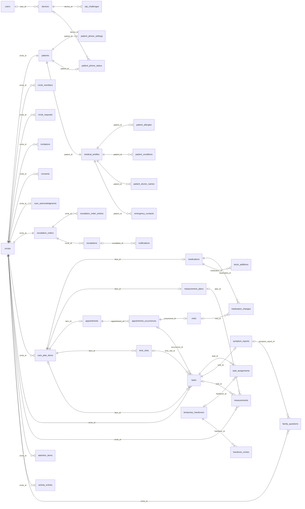
```mermaid
erDiagram
    direction LR
    users |o--o{ devices : user_id
    devices ||--o{ otp_challenges : device_id
    circles ||--|| patients : circle_id
    circles ||--o{ circle_members : circle_id
    circles |o--o{ circle_requests : circle_id
    circles ||--o{ invitations : circle_id
    circles ||--o{ consents : circle_id
    circles ||--o| care_acknowledgments : circle_id
    circles ||--|| escalation_orders : circle_id
    escalation_orders ||--o{ escalation_order_entries : circle_id
    patients ||--o| patient_phone_settings : patient_id
    patients ||--o| patient_phone_status : patient_id
    devices |o--o{ patient_phone_status : device_id
    patients ||--|| medical_profiles : patient_id
    medical_profiles ||--o{ patient_allergies : patient_id
    medical_profiles ||--o{ patient_conditions : patient_id
    medical_profiles ||--o{ patient_doctor_names : patient_id
    medical_profiles ||--o{ emergency_contacts : patient_id
    care_plan_items ||--o| medications : item_id
    care_plan_items ||--o| measurement_plans : item_id
    care_plan_items ||--o| appointments : item_id
    care_plan_items ||--o{ time_slots : item_id
    appointments ||--o{ appointment_occurrences : appointment_id
    appointment_occurrences ||--o| visits : occurrence_id
    medications ||--o{ medication_changes : medication_id
    visits |o--o{ medication_changes : visit_id
    medications ||--o{ stock_additions : medication_id
    tasks ||--o{ task_assignments : task_id
    temporary_handovers |o--o{ task_assignments : handover_id
    temporary_handovers ||--o{ handover_circles : handover_id
    tasks ||--o| symptom_reports : task_id
    escalations |o--o{ notifications : escalation_id
    care_plan_items |o--o{ tasks : item_id
    time_slots |o--o{ tasks : time_slot_id
    appointment_occurrences |o--o{ tasks : occurrence_id
    escalation_orders ||--o{ escalations : circle_id
    measurement_plans |o--o{ measurements : plan_id
    tasks |o--o{ measurements : task_id
    symptom_reports |o--o{ family_questions : symptom_report_id
    circles ||--o{ care_plan_items : circle_id
    circles ||--o{ tasks : circle_id
    circles ||--o{ measurements : circle_id
    circles ||--o{ attention_items : circle_id
    circles ||--o{ activity_entries : circle_id
    circles ||--o{ family_questions : circle_id
```

#### A. People and sign-in

Accounts, installations, sign-in codes, and the counter of wrong codes.

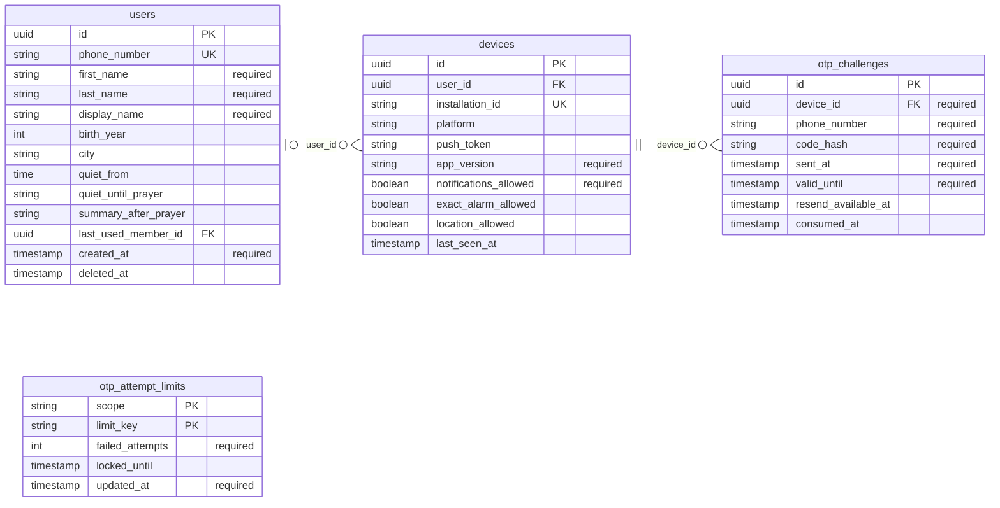
```mermaid
---
config:
  er:
    entityPadding: 5
    minEntityWidth: 60
    minEntityHeight: 30
  flowchart:
    nodeSpacing: 15
    rankSpacing: 25
---
erDiagram
    direction LR
    users {
        uuid id PK
        string phone_number UK
        string first_name "required"
        string last_name "required"
        string display_name "required"
        int birth_year
        string city
        time quiet_from
        string quiet_until_prayer
        string summary_after_prayer
        uuid last_used_member_id FK
        timestamp created_at "required"
        timestamp deleted_at
    }
    devices {
        uuid id PK
        uuid user_id FK
        string installation_id UK
        string platform
        string push_token
        string app_version "required"
        boolean notifications_allowed "required"
        boolean exact_alarm_allowed
        boolean location_allowed
        timestamp last_seen_at
    }
    otp_challenges {
        uuid id PK
        uuid device_id FK "required"
        string phone_number "required"
        string code_hash "required"
        timestamp sent_at "required"
        timestamp valid_until "required"
        timestamp resend_available_at
        timestamp consumed_at
    }
    otp_attempt_limits {
        string scope PK
        string limit_key PK
        int failed_attempts "required"
        timestamp locked_until
        timestamp updated_at "required"
    }
    users |o--o{ devices : user_id
    devices ||--o{ otp_challenges : device_id
```

#### B1. Circles, members, and invitations

The circle, its patient, its members, and the ways of joining. The role is a column of the membership.


```mermaid
---
config:
  er:
    entityPadding: 5
    minEntityWidth: 60
    minEntityHeight: 30
  flowchart:
    nodeSpacing: 15
    rankSpacing: 25
---
erDiagram
    circles {
        uuid id PK
        string patient_mode
        string status "required"
        string creation_path "required"
        uuid created_by_user_id FK "required"
        timestamp created_at "required"
        timestamp archived_at
    }
    patients {
        uuid id PK
        uuid circle_id UK, FK "required"
        string first_name "required"
        string last_name "required"
        int birth_year "required"
        string photo_url
        string phone_number
        string active_phone UK
        uuid user_id FK
        int after_prayer_offset_min "required"
        string city "required"
        decimal latitude "required"
        decimal longitude "required"
        string location_source "required"
        timestamp location_updated_at "required"
    }
    circle_members {
        uuid id PK
        uuid circle_id FK "required"
        uuid user_id FK "required"
        string role "required"
        string relation_to_patient
        string status "required"
        timestamp joined_at "required"
        timestamp last_used_at
        timestamp left_at
    }
    circle_requests {
        uuid id PK
        uuid creator_user_id FK "required"
        string patient_phone "required"
        string patient_first_name "required"
        string patient_last_name "required"
        string mode "required"
        string patient_role
        json patient_details
        string status "required"
        timestamp created_at "required"
        timestamp expires_at "required"
        uuid circle_id FK
    }
    invitations {
        uuid id PK
        uuid circle_id FK "required"
        string invited_name "required"
        string invited_phone "required"
        string role "required"
        string status "required"
        uuid invited_by_member_id FK "required"
        timestamp created_at "required"
        timestamp expires_at "required"
        timestamp responded_at
        uuid member_id FK
    }
    consents {
        uuid id PK
        uuid circle_id FK "required"
        timestamp given_at "required"
        uuid given_by_user_id FK "required"
        string shared_data "required"
    }
    care_acknowledgments {
        uuid circle_id PK, FK
        timestamp declared_at "required"
        uuid declared_by_user_id FK "required"
    }
    circles ||--|| patients : circle_id
    circles ||--o{ circle_members : circle_id
    circles |o--o{ circle_requests : circle_id
    circles ||--o{ invitations : circle_id
    circle_members ||--o{ invitations : invited_by_member_id
    circle_members |o--o{ invitations : member_id
    circles ||--o{ consents : circle_id
    circles ||--o| care_acknowledgments : circle_id
```

#### B2. The escalation order, the patient's phone, and the medical file

The escalation order, the settings of the patient's phone, and the medical file.

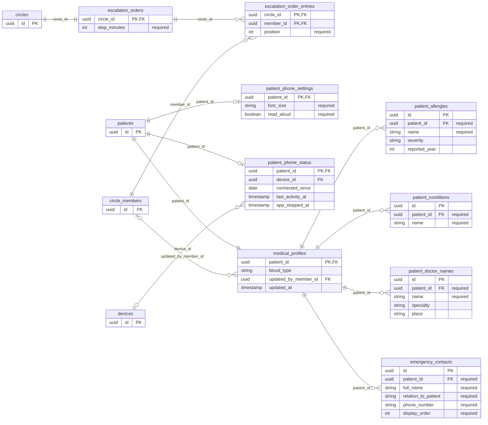
```mermaid
---
config:
  er:
    entityPadding: 5
    minEntityWidth: 60
    minEntityHeight: 30
  flowchart:
    nodeSpacing: 15
    rankSpacing: 25
---
erDiagram
    direction LR
    escalation_orders {
        uuid circle_id PK, FK
        int step_minutes "required"
    }
    escalation_order_entries {
        uuid circle_id PK, FK
        uuid member_id PK, FK
        int position "required"
    }
    patient_phone_settings {
        uuid patient_id PK, FK
        string font_size "required"
        boolean read_aloud "required"
    }
    patient_phone_status {
        uuid patient_id PK, FK
        uuid device_id FK
        date connected_since
        timestamp last_activity_at
        timestamp app_stopped_at
    }
    medical_profiles {
        uuid patient_id PK, FK
        string blood_type
        uuid updated_by_member_id FK
        timestamp updated_at
    }
    patient_allergies {
        uuid id PK
        uuid patient_id FK "required"
        string name "required"
        string severity
        int reported_year
    }
    patient_conditions {
        uuid id PK
        uuid patient_id FK "required"
        string name "required"
    }
    patient_doctor_names {
        uuid id PK
        uuid patient_id FK "required"
        string name "required"
        string specialty
        string place
    }
    emergency_contacts {
        uuid id PK
        uuid patient_id FK "required"
        string full_name "required"
        string relation_to_patient "required"
        string phone_number "required"
        int display_order "required"
    }
    circles {
        uuid id PK
    }
    patients {
        uuid id PK
    }
    circle_members {
        uuid id PK
    }
    devices {
        uuid id PK
    }
    circles ||--|| escalation_orders : circle_id
    escalation_orders ||--o{ escalation_order_entries : circle_id
    circle_members ||--o{ escalation_order_entries : member_id
    patients ||--o| patient_phone_settings : patient_id
    patients ||--o| patient_phone_status : patient_id
    devices |o--o{ patient_phone_status : device_id
    patients ||--|| medical_profiles : patient_id
    circle_members |o--o{ medical_profiles : updated_by_member_id
    medical_profiles ||--o{ patient_allergies : patient_id
    medical_profiles ||--o{ patient_conditions : patient_id
    medical_profiles ||--o{ patient_doctor_names : patient_id
    medical_profiles ||--o{ emergency_contacts : patient_id
```

#### C. Care plan

Medicines, measurement plans, and appointments share one parent table (`care_plan_items`).

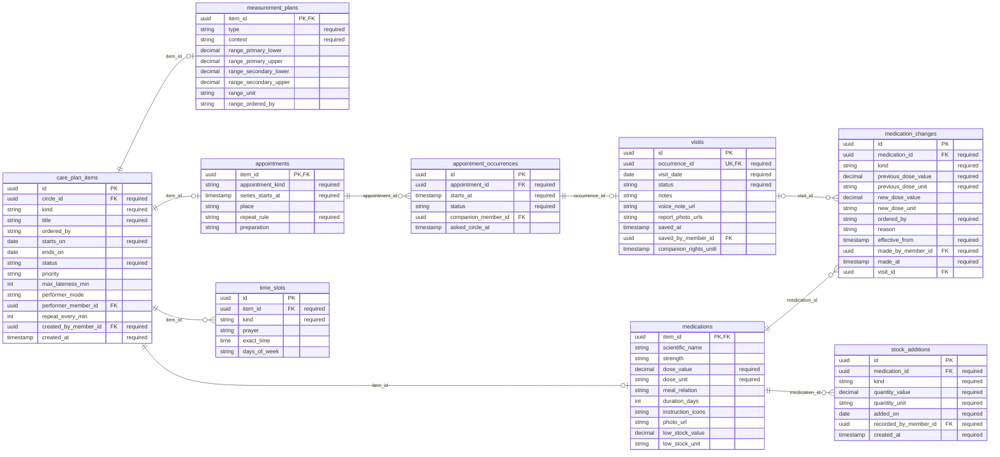
```mermaid
---
config:
  er:
    entityPadding: 5
    minEntityWidth: 60
    minEntityHeight: 30
  flowchart:
    nodeSpacing: 15
    rankSpacing: 25
---
erDiagram
    direction LR
    care_plan_items {
        uuid id PK
        uuid circle_id FK "required"
        string kind "required"
        string title "required"
        string ordered_by
        date starts_on "required"
        date ends_on
        string status "required"
        string priority
        int max_lateness_min
        string performer_mode
        uuid performer_member_id FK
        int repeat_every_min
        uuid created_by_member_id FK "required"
        timestamp created_at "required"
    }
    medications {
        uuid item_id PK, FK
        string scientific_name
        string strength
        decimal dose_value "required"
        string dose_unit "required"
        string meal_relation
        int duration_days
        string instruction_icons
        string photo_url
        decimal low_stock_value
        string low_stock_unit
    }
    measurement_plans {
        uuid item_id PK, FK
        string type "required"
        string context "required"
        decimal range_primary_lower
        decimal range_primary_upper
        decimal range_secondary_lower
        decimal range_secondary_upper
        string range_unit
        string range_ordered_by
    }
    appointments {
        uuid item_id PK, FK
        string appointment_kind "required"
        timestamp series_starts_at "required"
        string place
        string repeat_rule "required"
        string preparation
    }
    appointment_occurrences {
        uuid id PK
        uuid appointment_id FK "required"
        timestamp starts_at "required"
        string status "required"
        uuid companion_member_id FK
        timestamp asked_circle_at
    }
    time_slots {
        uuid id PK
        uuid item_id FK "required"
        string kind "required"
        string prayer
        time exact_time
        string days_of_week
    }
    medication_changes {
        uuid id PK
        uuid medication_id FK "required"
        string kind "required"
        decimal previous_dose_value "required"
        string previous_dose_unit "required"
        decimal new_dose_value
        string new_dose_unit
        string ordered_by "required"
        string reason
        timestamp effective_from "required"
        uuid made_by_member_id FK "required"
        timestamp made_at "required"
        uuid visit_id FK
    }
    stock_additions {
        uuid id PK
        uuid medication_id FK "required"
        string kind "required"
        decimal quantity_value "required"
        string quantity_unit "required"
        date added_on "required"
        uuid recorded_by_member_id FK "required"
        timestamp created_at "required"
    }
    visits {
        uuid id PK
        uuid occurrence_id UK, FK "required"
        date visit_date "required"
        string status "required"
        string notes
        string voice_note_url
        string report_photo_urls
        timestamp saved_at
        uuid saved_by_member_id FK
        timestamp companion_rights_until
    }
    care_plan_items ||--o| medications : item_id
    care_plan_items ||--o| measurement_plans : item_id
    care_plan_items ||--o| appointments : item_id
    care_plan_items ||--o{ time_slots : item_id
    appointments ||--o{ appointment_occurrences : appointment_id
    appointment_occurrences ||--o| visits : occurrence_id
    medications ||--o{ medication_changes : medication_id
    visits |o--o{ medication_changes : visit_id
    medications ||--o{ stock_additions : medication_id
```

#### D. Tasks and handoffs

Tasks, their assignments, temporary handovers, and symptom reports.

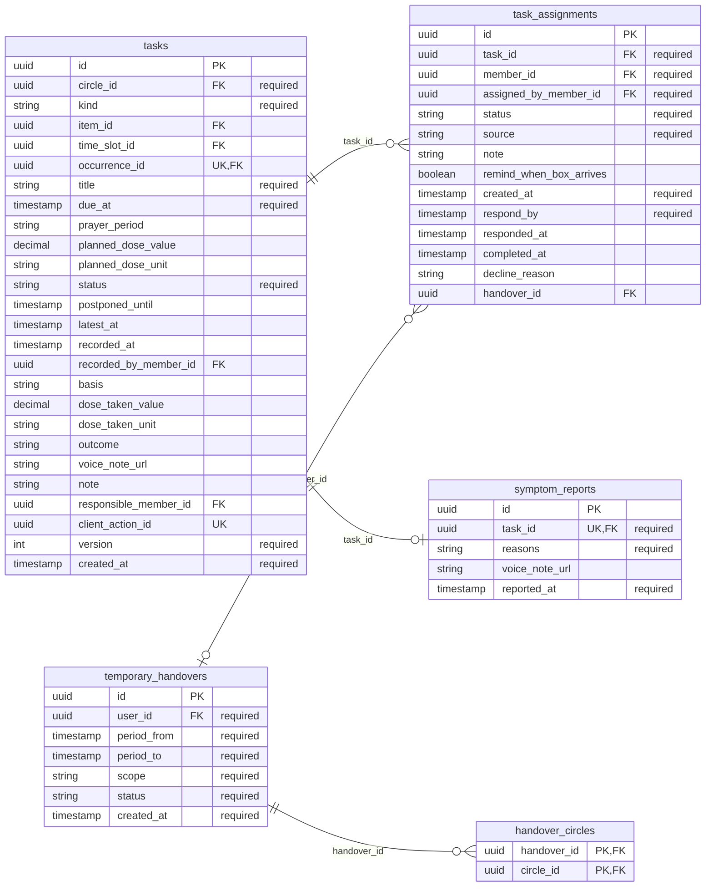
```mermaid
---
config:
  er:
    entityPadding: 5
    minEntityWidth: 60
    minEntityHeight: 30
  flowchart:
    nodeSpacing: 15
    rankSpacing: 25
---
erDiagram
    direction LR
    tasks {
        uuid id PK
        uuid circle_id FK "required"
        string kind "required"
        uuid item_id FK
        uuid time_slot_id FK
        uuid occurrence_id UK, FK
        string title "required"
        timestamp due_at "required"
        string prayer_period
        decimal planned_dose_value
        string planned_dose_unit
        string status "required"
        timestamp postponed_until
        timestamp latest_at
        timestamp recorded_at
        uuid recorded_by_member_id FK
        string basis
        decimal dose_taken_value
        string dose_taken_unit
        string outcome
        string voice_note_url
        string note
        uuid responsible_member_id FK
        uuid client_action_id UK
        int version "required"
        timestamp created_at "required"
    }
    task_assignments {
        uuid id PK
        uuid task_id FK "required"
        uuid member_id FK "required"
        uuid assigned_by_member_id FK "required"
        string status "required"
        string source "required"
        string note
        boolean remind_when_box_arrives
        timestamp created_at "required"
        timestamp respond_by "required"
        timestamp responded_at
        timestamp completed_at
        string decline_reason
        uuid handover_id FK
    }
    temporary_handovers {
        uuid id PK
        uuid user_id FK "required"
        timestamp period_from "required"
        timestamp period_to "required"
        string scope "required"
        string status "required"
        timestamp created_at "required"
    }
    handover_circles {
        uuid handover_id PK, FK
        uuid circle_id PK, FK
    }
    symptom_reports {
        uuid id PK
        uuid task_id UK, FK "required"
        string reasons "required"
        string voice_note_url
        timestamp reported_at "required"
    }
    tasks ||--o{ task_assignments : task_id
    temporary_handovers |o--o{ task_assignments : handover_id
    temporary_handovers ||--o{ handover_circles : handover_id
    tasks ||--o| symptom_reports : task_id
```

#### E. Alerts

Notifications, escalations, and attention items. Each refers to at most one subject: a task, a reading, a symptom report, or a medicine.

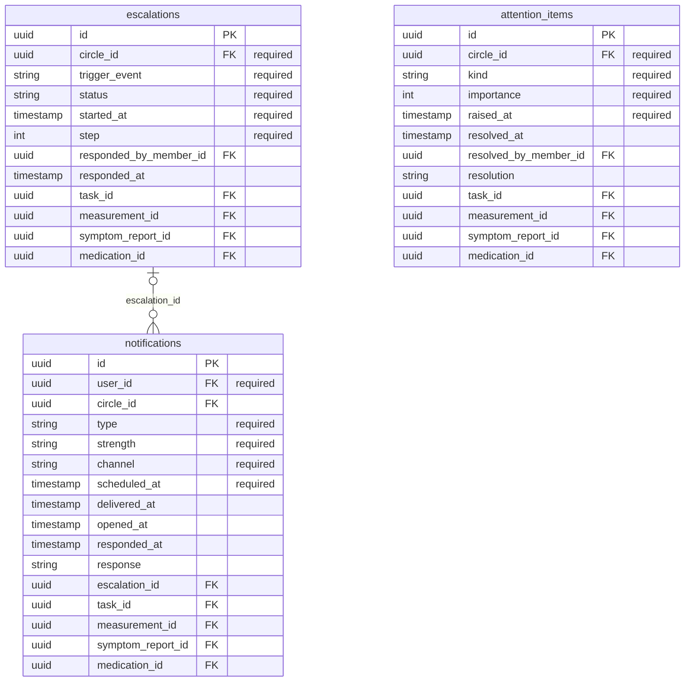
```mermaid
---
config:
  er:
    entityPadding: 5
    minEntityWidth: 60
    minEntityHeight: 30
  flowchart:
    nodeSpacing: 15
    rankSpacing: 25
---
erDiagram
    notifications {
        uuid id PK
        uuid user_id FK "required"
        uuid circle_id FK
        string type "required"
        string strength "required"
        string channel "required"
        timestamp scheduled_at "required"
        timestamp delivered_at
        timestamp opened_at
        timestamp responded_at
        string response
        uuid escalation_id FK
        uuid task_id FK
        uuid measurement_id FK
        uuid symptom_report_id FK
        uuid medication_id FK
    }
    escalations {
        uuid id PK
        uuid circle_id FK "required"
        string trigger_event "required"
        string status "required"
        timestamp started_at "required"
        int step "required"
        uuid responded_by_member_id FK
        timestamp responded_at
        uuid task_id FK
        uuid measurement_id FK
        uuid symptom_report_id FK
        uuid medication_id FK
    }
    attention_items {
        uuid id PK
        uuid circle_id FK "required"
        string kind "required"
        int importance "required"
        timestamp raised_at "required"
        timestamp resolved_at
        uuid resolved_by_member_id FK
        string resolution
        uuid task_id FK
        uuid measurement_id FK
        uuid symptom_report_id FK
        uuid medication_id FK
    }
    escalations |o--o{ notifications : escalation_id
```

#### F. Records

Readings, the activity log, the family's questions, and the cache of prayer times.

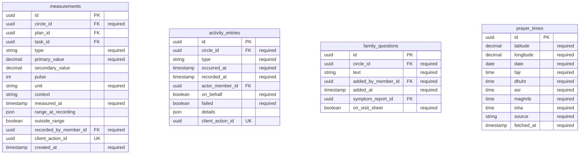
```mermaid
---
config:
  er:
    entityPadding: 5
    minEntityWidth: 60
    minEntityHeight: 30
  flowchart:
    nodeSpacing: 15
    rankSpacing: 25
---
erDiagram
    measurements {
        uuid id PK
        uuid circle_id FK "required"
        uuid plan_id FK
        uuid task_id FK
        string type "required"
        decimal primary_value "required"
        decimal secondary_value
        int pulse
        string unit "required"
        string context
        timestamp measured_at "required"
        json range_at_recording
        boolean outside_range
        uuid recorded_by_member_id FK "required"
        uuid client_action_id UK
        timestamp created_at "required"
    }
    activity_entries {
        uuid id PK
        uuid circle_id FK "required"
        string type "required"
        timestamp occurred_at "required"
        timestamp recorded_at "required"
        uuid actor_member_id FK
        boolean on_behalf "required"
        boolean failed "required"
        json details
        uuid client_action_id UK
    }
    family_questions {
        uuid id PK
        uuid circle_id FK "required"
        string text "required"
        uuid added_by_member_id FK "required"
        timestamp added_at "required"
        uuid symptom_report_id FK
        boolean on_visit_sheet "required"
    }
    prayer_times {
        uuid id PK
        decimal latitude "required"
        decimal longitude "required"
        date date "required"
        time fajr "required"
        time dhuhr "required"
        time asr "required"
        time maghrib "required"
        time isha "required"
        string source "required"
        timestamp fetched_at "required"
    }
```

### 3.3 Front-end (Flutter)

#### 3.3.1 Structure

| Layer | Content |
| --- | --- |
| Screens and widgets | Pages and reusable components. They display data and pass the user's actions to controllers. |
| State controllers (Riverpod) | `AuthController`, `CircleController`, `TodayController`, `PlanController`, `AssignmentController`, `AlertsController`, `SimplifiedController`, `SyncController`, and others. They hold the state of a screen and call repositories. |
| Repositories | Read from the local database or the API, and write an action to the offline queue when there is no internet. |
| Local storage and API client | SQLite tables for the cache (`cached_circles`, `cached_plan`, `cached_tasks`, `cached_prayer_times`) and the queue (`pending_actions`), and the HTTPS client for the Flask API. |
| Notification scheduler | Creates local notifications from the cached tasks. |

The application displays one circle at a time and opens the circle used last, in the interface of the user's role in it. The Self-manager, Manager, Performer, and Viewer use Detailed Mode (four tabs: Today, Plan, Log, and Circle). The "+" button is shown to the Self-manager and the Manager only. The Patient uses Simplified Mode, a single page.

#### 3.3.2 Component hierarchy

The diagrams show how the components are nested. The first shows the application shell and the onboarding flow, the second the four pages of Detailed Mode, and the third the single page of Simplified Mode.

**Application shell and onboarding**

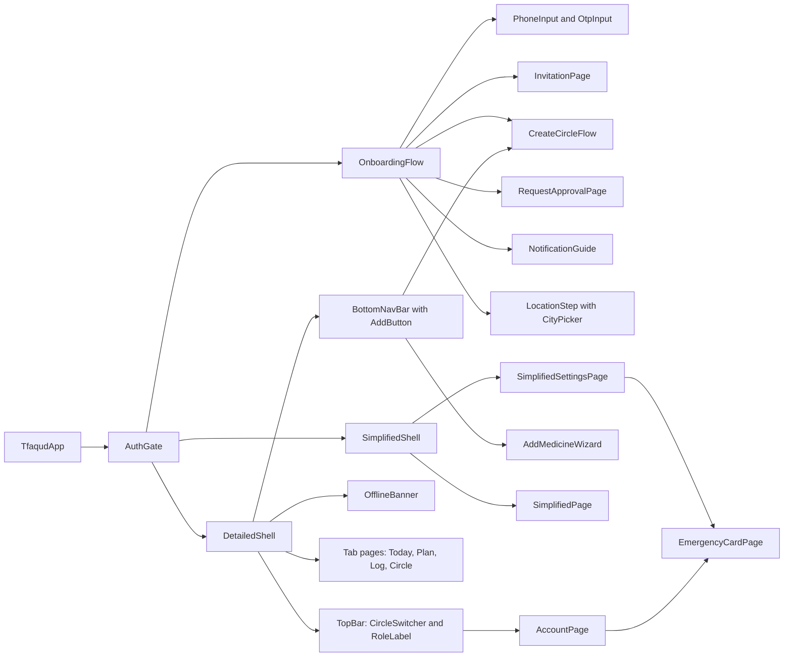
```mermaid
flowchart LR
    Root["TfaqudApp"] --> Gate["AuthGate"]
    Gate --> Onb["OnboardingFlow"]
    Gate --> DShell["DetailedShell"]
    Gate --> SShell["SimplifiedShell"]

    Onb --> PhoneIn["PhoneInput and OtpInput"]
    Onb --> InvPage["InvitationPage"]
    Onb --> CreateFlow["CreateCircleFlow"]
    Onb --> ApproveFlow["RequestApprovalPage"]
    Onb --> NGuide["NotificationGuide"]
    Onb --> LocStep["LocationStep with CityPicker"]

    DShell --> TopBar["TopBar: CircleSwitcher and RoleLabel"]
    DShell --> OfflineBar["OfflineBanner"]
    DShell --> Pages["Tab pages: Today, Plan, Log, Circle"]
    DShell --> BNav["BottomNavBar with AddButton"]
    TopBar --> AccountPage["AccountPage"]
    BNav --> AddMedWizard["AddMedicineWizard"]
    BNav --> CreateFlow

    SShell --> SPage["SimplifiedPage"]
    SShell --> SSet["SimplifiedSettingsPage"]
    SSet --> ECard["EmergencyCardPage"]
    AccountPage --> ECard
```

**Pages of Detailed Mode**

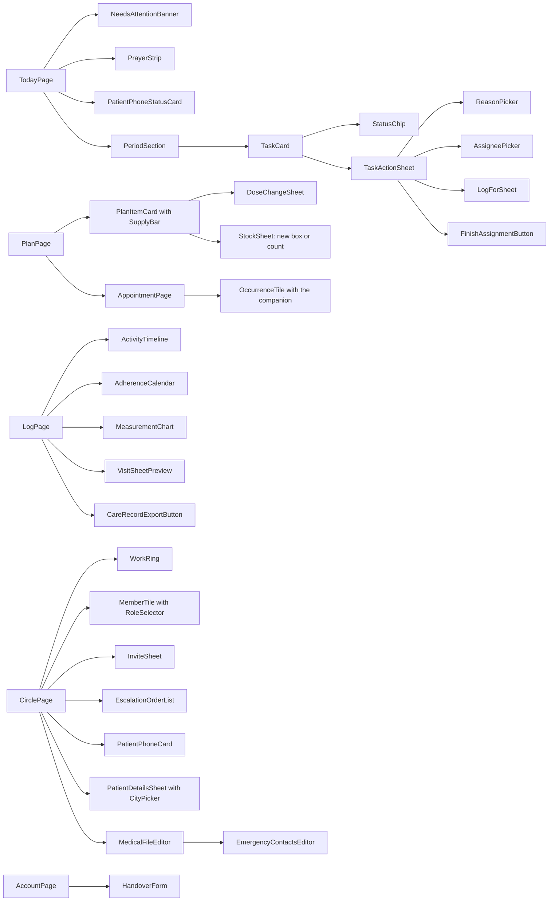
```mermaid
flowchart LR
    TodayPage["TodayPage"] --> Banner["NeedsAttentionBanner"]
    TodayPage --> Strip["PrayerStrip"]
    TodayPage --> PatientCard["PatientPhoneStatusCard"]
    TodayPage --> Section["PeriodSection"]
    Section --> TCard["TaskCard"]
    TCard --> Chip["StatusChip"]
    TCard --> TSheet["TaskActionSheet"]
    TSheet --> Reason["ReasonPicker"]
    TSheet --> Assignee["AssigneePicker"]
    TSheet --> LogFor["LogForSheet"]
    TSheet --> Finish["FinishAssignmentButton"]

    PlanPage["PlanPage"] --> ItemCard["PlanItemCard with SupplyBar"]
    ItemCard --> DoseSheet["DoseChangeSheet"]
    ItemCard --> StockSheet["StockSheet: new box or count"]
    PlanPage --> ApptPage["AppointmentPage"]
    ApptPage --> OccTile["OccurrenceTile with the companion"]

    LogPage["LogPage"] --> ActTimeline["ActivityTimeline"]
    LogPage --> AdhCal["AdherenceCalendar"]
    LogPage --> MChart["MeasurementChart"]
    LogPage --> SheetPreview["VisitSheetPreview"]
    LogPage --> ExportBtn["CareRecordExportButton"]

    CirclePage["CirclePage"] --> WorkRing["WorkRing"]
    CirclePage --> MTile["MemberTile with RoleSelector"]
    CirclePage --> Invite["InviteSheet"]
    CirclePage --> OrderList["EscalationOrderList"]
    CirclePage --> PhoneCard["PatientPhoneCard"]
    CirclePage --> PDetails["PatientDetailsSheet with CityPicker"]
    CirclePage --> MedFile["MedicalFileEditor"]
    MedFile --> ContactsEd["EmergencyContactsEditor"]

    AccountPage["AccountPage"] --> HandForm["HandoverForm"]
```

**Page of Simplified Mode**

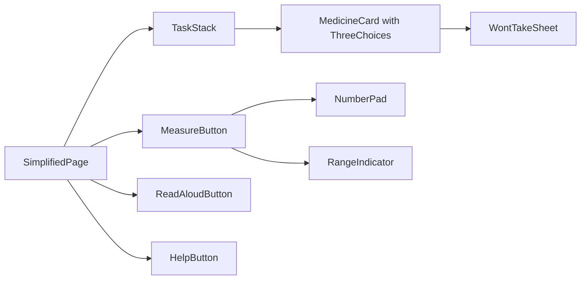
```mermaid
flowchart LR
    SPage["SimplifiedPage"] --> Stack["TaskStack"]
    Stack --> MedCard["MedicineCard with ThreeChoices"]
    MedCard --> WontSheet["WontTakeSheet"]
    SPage --> MeasBtn["MeasureButton"]
    MeasBtn --> NPad["NumberPad"]
    MeasBtn --> RangeBar["RangeIndicator"]
    SPage --> AloudBtn["ReadAloudButton"]
    SPage --> HelpBtn["HelpButton"]
```

#### 3.3.3 Main UI components

The table lists the main components of the interface, the function of each, and how the user interacts with it.

| Component | Function | Interaction |
| --- | --- | --- |
| `AuthGate` | Chooses the first screen: onboarding, Detailed Mode, or Simplified Mode. | Redirects after sign-in, joining a circle, switching circles, or sign-out. |
| `PhoneInput`, `OtpInput` | Collect the phone number and the four-digit code; fill in the code automatically when the SMS arrives; show the resend countdown, the tries left, and the locked message (device and number). | Submit, resend, edit the number. |
| `InvitationPage` | Shows who invited the user, the role, and what the role allows. Pending invitations are shown one after another. | Approve or decline; the next invitation then appears. A cancelled or expired invitation shows "no longer available". |
| `CreateCircleFlow` | The paths for creating a circle: for myself, for someone with a phone, or for someone without. Asks for the patient's details and the mode and, for a patient with no phone, the patient's city (`CityPicker`). | Submit; shows the waiting screen for a request. |
| `LocationStep` and `CityPicker` | Explains that the location is used only for the prayer times, asks for the system's location permission, and reads the position once. | Allow, or pick a city. Saves with `PUT /patients/{id}/location` (source `GPS` or `MANUAL`). The position is never shown to the family and never tracked. |
| `CircleSwitcher` and `RoleLabel` | Show the selected circle and the user's role in it, and open the list of the user's circles. | Tap to switch circle, or to start a new patient. |
| `OfflineBanner` | Tells the user there is no internet and how many actions are waiting to sync. | Tap to see waiting actions. |
| `PrayerStrip` | Five prayer markers with "now" marked. Finished periods collapse to a line such as "Fajr and Dhuhr · 4 done". | Tap a period to jump to its tasks. |
| `TaskCard` | Shows the task's title, the person responsible, the time, and the status. | Tap opens `TaskActionSheet`. |
| `TaskActionSheet` | The actions for one task: done (the time can be edited), postpone, could not do (with a reason), decline while not yet accepted, hand over, assign, call the person. Actions depend on the user's role. | Each action calls a controller, which sends it to the API or to the offline queue. |
| `NeedsAttentionBanner` | A red banner with the count and the most important item. Opens a list, most important first. An item stays until someone completes or reassigns it. | Tap opens the sheet with the action for each kind of item (for example "Who brings it?", "Ask the doctor today", "I'll accompany", "Remind a member"). |
| `AssigneePicker` | Used for "who brings it?", "assign", and "hand over". Lists the members who can act, each with their day ("with you: cardiology appointment 4:30"), a note, and a switch "when the box arrives, remind the patient of the dose". | Select a member, then send the request. The task shows "waiting for acceptance" for 30 minutes. |
| `AssignmentRequestSheet` | Opened from the push notification. Shows who assigned the task, what it is, and by when. | Accept, or decline with a reason. |
| `PlanItemCard` and `SupplyBar` | Shows a medicine, appointment, or measurement plan with its next time, priority tag, and supply ("lasts 22 days", amber, red). The supply is worked out by the server from the boxes and counts. | Tap opens details. |
| `AddMedicineWizard` | Steps with a progress bar: photo or manual entry, check what was read, when, and who performs it with the priority and the supply. Reading a photo is a Could item, so manual entry always works. | Next, back, save. |
| `ActivityTimeline` | The care record: who did what and when, failed tasks in red, with filters (all, late, changes, a person). | Filter, open an entry. |
| `SimplifiedPage` and `TaskStack` | The one page: a stacked list of today's tasks sorted by time left. When nothing is left it says so and shows tomorrow's first task. | Check a card to record it. |
| `MedicineCard` and `ThreeChoices` | The card at the dose time with three choices: take, remind me in 10 minutes, I won't take it. | Take records the time and shows a stamp. |
| `WontTakeSheet` | The reasons under "I won't take it": taken earlier, not with me, finished, it bothers me, or another reason. | Select a reason; the choice is recorded with the task. |
| `ReadAloudButton` and `HelpButton` | Read the page aloud; send a high-priority notification to the managers. There is no call, no emergency number, and no voice message. | The patient sees that the request was sent. |

#### 3.3.4 Interactions

Every interaction follows one path. A widget passes the user's action to its controller. The controller calls a repository. The repository reads from the local database or from the API or, when there is no internet and the action is allowed offline, writes the action to the queue. The widgets never call the API and never decide a permission: they display the actions that the server returned for the user's role, and the server checks each action again.

| Interaction | Components | API calls | Behavior |
| --- | --- | --- | --- |
| Sign in with the SMS code | `PhoneInput`, `OtpInput` | `POST /auth/code/request`, `POST /auth/code/verify`, `GET /me` | The screen shows the resend countdown and the tries left. After three wrong codes, sign-in is locked for 24 hours. After a successful sign-in, pending invitations are shown first, then the circle used last. |
| Create a circle | `CreateCircleFlow`, `CityPicker` | `POST /circles`, `POST /circle-requests` | A circle for oneself, or for a patient without a phone, is created at once; in the second case the creator selects the patient's city. A circle for a patient with a phone creates a request that waits for the patient's approval. The creator may leave the waiting screen and receives a push notification with the result. |
| Record a task | `TaskCard`, `TaskActionSheet` | `POST /tasks/{id}/record` | The card changes to done. If another member recorded the task first, a message states who recorded it and when, and no second record is made. Offline, the action is queued and the card shows "will sync". |
| Assign a task | `AssigneePicker` | `POST /tasks/{id}/assign` | The picker shows each member's day and a note field. The task shows "waiting for an answer" for 30 minutes. |
| Answer an assigned task | `AssignmentRequestSheet` | `POST /assignments/{id}/accept`, `POST /assignments/{id}/decline` | The receiver accepts, or declines with a reason. The sender is notified in both cases. |
| Respond to a missed-dose alert | Notification actions, `NeedsAttentionBanner` | `POST /notifications/{id}/respond`, `POST /tasks/{id}/log-for` | Only an action stops the escalation. Opening the notification does not. |
| Take a dose in Simplified Mode | `SimplifiedPage`, `MedicineCard`, `ThreeChoices`, `WontTakeSheet` | `POST /tasks/{id}/record` | The patient chooses one of three large buttons: take, remind me in 10 minutes, or I will not take it (with a reason). "Remind me" creates a local notification and works without internet. |
| Set the patient's location | `LocationStep`, `CityPicker`, `PatientDetailsSheet` | `PUT /patients/{id}/location` | GPS is requested only on the patient's own phone. If it is refused, or the patient has no phone, a city is selected from a list. The location is used only for the prayer times. |

**Offline behavior.** The application caches the user's circles, the plan, the tasks of the coming days, and the prayer times, so that the Today page and the Simplified page open without internet. Two actions can be performed offline: recording a task and recording a measurement. They are saved in the queue with a `client_action_id` and their original time, and they are sent when the connection returns. The server accepts each action, ignores a duplicate, or reports that another member recorded the task first. Reminders are local notifications planned from the cached tasks and are unaffected by the network.

## 4. Sequence Diagrams

Three use cases are critical for the system: signing in, recording a dose, and the escalation of a missed dose. The route names used in the diagrams are specified in Section 5.

### 4.1 Signing in with the SMS code

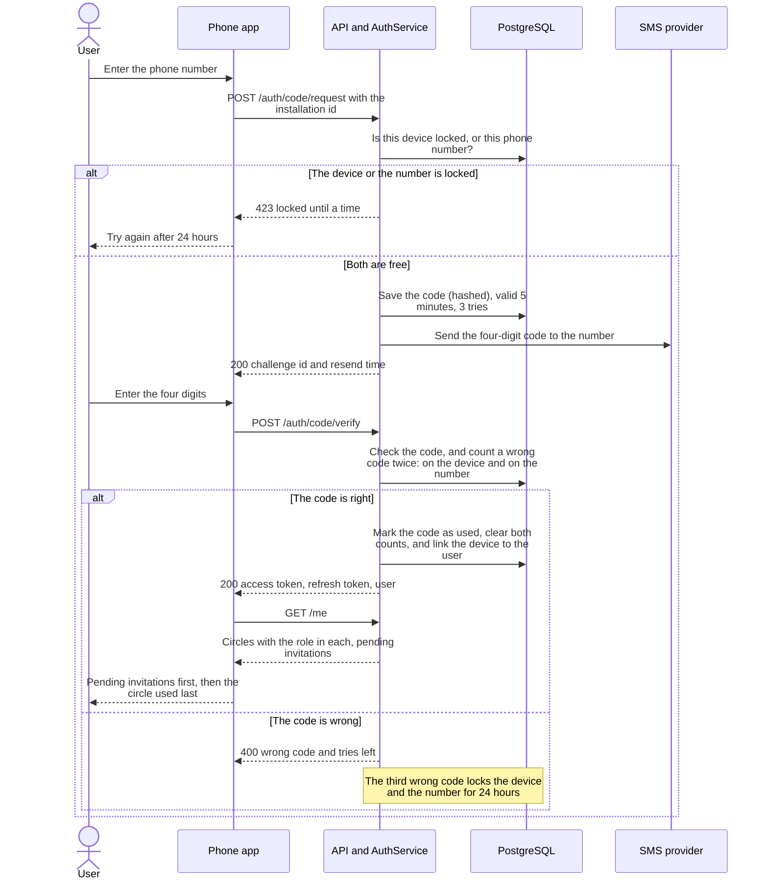
```mermaid
---
config:
  sequence:
    wrap: true
    width: 170
    messageFontSize: 15
---
sequenceDiagram
    actor U as User
    participant App as Phone app
    participant API as API and AuthService
    participant DB as PostgreSQL
    participant SMS as SMS provider

    U->>App: Enter the phone number
    App->>API: POST /auth/code/request with the installation id
    API->>DB: Is this device locked, or this phone number?
    alt The device or the number is locked
        API-->>App: 423 locked until a time
        App-->>U: Try again after 24 hours
    else Both are free
        API->>DB: Save the code (hashed), valid 5 minutes, 3 tries
        API->>SMS: Send the four-digit code to the number
        API-->>App: 200 challenge id and resend time
        U->>App: Enter the four digits
        App->>API: POST /auth/code/verify
        API->>DB: Check the code, and count a wrong code twice: on the device and on the number
        alt The code is right
            API->>DB: Mark the code as used, clear both counts, and link the device to the user
            API-->>App: 200 access token, refresh token, user
            App->>API: GET /me
            API-->>App: Circles with the role in each, pending invitations
            App-->>U: Pending invitations first, then the circle used last
        else The code is wrong
            API-->>App: 400 wrong code and tries left
            Note over API,DB: The third wrong code locks the device and the number for 24 hours
        end
    end
```

The code has four digits and is valid for 5 minutes; only its hash is stored. Wrong codes are counted per device and per phone number, and the third wrong code locks both for 24 hours.

### 4.2 Recording a dose

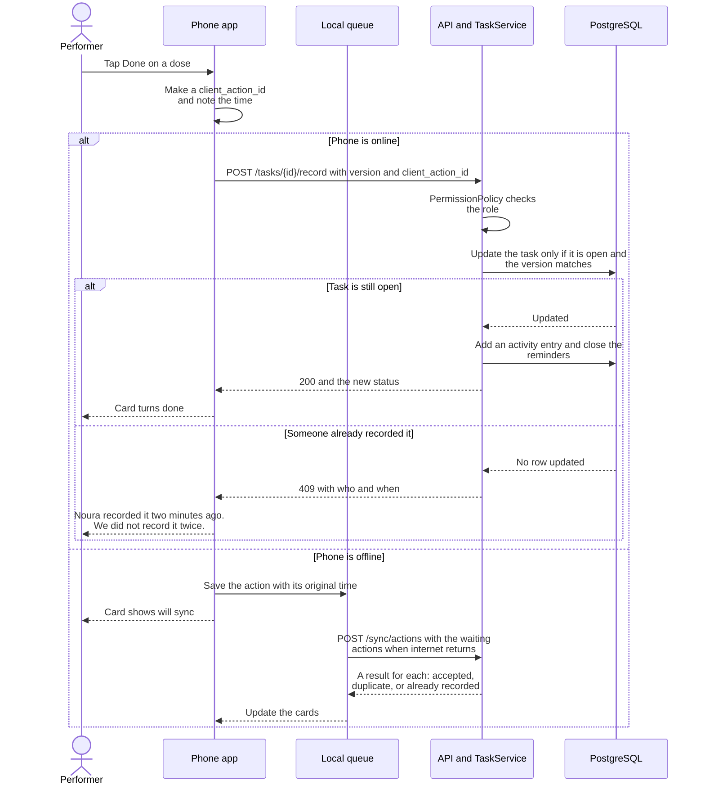
```mermaid
---
config:
  sequence:
    wrap: true
    width: 170
    messageFontSize: 15
---
sequenceDiagram
    actor U as Performer
    participant App as Phone app
    participant LQ as Local queue
    participant API as API and TaskService
    participant DB as PostgreSQL

    U->>App: Tap Done on a dose
    App->>App: Make a client_action_id and note the time
    alt Phone is online
        App->>API: POST /tasks/{id}/record with version and client_action_id
        API->>API: PermissionPolicy checks the role
        API->>DB: Update the task only if it is open and the version matches
        alt Task is still open
            DB-->>API: Updated
            API->>DB: Add an activity entry and close the reminders
            API-->>App: 200 and the new status
            App-->>U: Card turns done
        else Someone already recorded it
            DB-->>API: No row updated
            API-->>App: 409 with who and when
            App-->>U: Noura recorded it two minutes ago. We did not record it twice.
        end
    else Phone is offline
        App->>LQ: Save the action with its original time
        App-->>U: Card shows will sync
        LQ->>API: POST /sync/actions with the waiting actions when internet returns
        API-->>LQ: A result for each: accepted, duplicate, or already recorded
        LQ-->>App: Update the cards
    end
```

The first valid record wins: a second record is refused, and the response states who recorded the task and when. A `client_action_id` makes a repeated request harmless, and an offline record keeps its original time.

### 4.3 A missed dose and its escalation

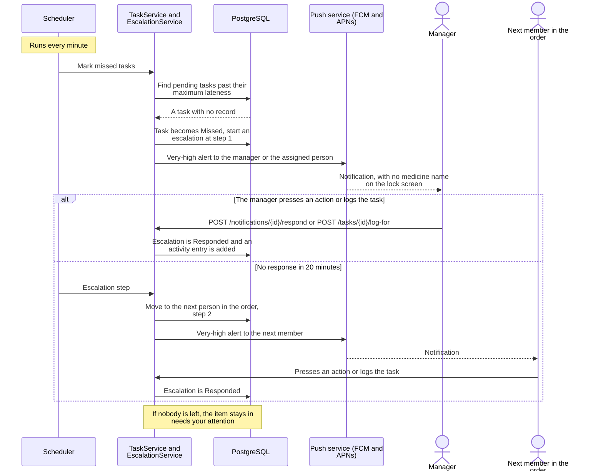
```mermaid
---
config:
  sequence:
    wrap: true
    width: 170
    messageFontSize: 15
---
sequenceDiagram
    participant SCH as Scheduler
    participant API as TaskService and EscalationService
    participant DB as PostgreSQL
    participant PN as Push service (FCM and APNs)
    actor M as Manager
    actor N as Next member in the order

    Note over SCH: Runs every minute
    SCH->>API: Mark missed tasks
    API->>DB: Find pending tasks past their maximum lateness
    DB-->>API: A task with no record
    API->>DB: Task becomes Missed, start an escalation at step 1
    API->>PN: Very-high alert to the manager or the assigned person
    PN-->>M: Notification, with no medicine name on the lock screen
    alt The manager presses an action or logs the task
        M->>API: POST /notifications/{id}/respond or POST /tasks/{id}/log-for
        API->>DB: Escalation is Responded and an activity entry is added
    else No response in 20 minutes
        SCH->>API: Escalation step
        API->>DB: Move to the next person in the order, step 2
        API->>PN: Very-high alert to the next member
        PN-->>N: Notification
        N->>API: Presses an action or logs the task
        API->>DB: Escalation is Responded
    end
    Note over API,DB: If nobody is left, the item stays in needs your attention
```

The scheduler marks a task as missed when its maximum lateness has passed, and it notifies the next member in the order every 20 minutes. Only an action (a response or a record) stops the escalation; opening the notification does not.

## 5. API Specifications

Section 5.1 lists the external APIs used by the system and the reason for each choice. Section 5.2 specifies the internal REST API.

### 5.1 External APIs

| API | Purpose | Reason for the choice |
| --- | --- | --- |
| SMS provider (Unifonic; alternative: Twilio) | Sends the four-digit sign-in code. | Sign-in by phone number is a Must requirement. A provider with a registered Saudi sender name reaches Saudi numbers, and both candidates offer a simple "send an SMS" call, so the provider can be replaced without changing the internal API. |
| Firebase Cloud Messaging, HTTP v1 (reaches iPhone through APNs) | Sends the push notifications that involve other people: a missed dose, the help button, and an assigned task. | One server call reaches Android and iPhone. The service is free and supports high priority on Android and the time-sensitive level on iPhone. |
| Aladhan prayer-times API (`api.aladhan.com`) | Returns the five prayer times for the patient's location, which convert "after Asr" into a clock time. | It is a free JSON service that supports the calculation method used in Saudi Arabia (Umm Al-Qura). Only rounded coordinates and a date are sent, and the answer is cached for each place and day. |
| WhatsApp link (`https://wa.me/<number>?text=<message>`) | Carries the invitation message from the manager's phone. | The link is free, needs no business account or message templates, and the message comes from the manager's own number, which the invited person already knows. |

The first three are called from the server. The WhatsApp link is opened on the manager's phone.

### 5.2 Internal endpoints

#### 5.2.1 Conventions

| Topic | Rule |
| --- | --- |
| Base path | `/v1` |
| Format | JSON in UTF-8, with the snake_case names of the database columns. |
| Authentication | `Authorization: Bearer <access token>` on every endpoint except `POST /auth/code/request` and `POST /auth/code/verify`. |
| Authorization | The server checks the caller's role in the circle on every request. A caller who is not a member of the circle receives `404`. |
| Identifiers and times | Identifiers are UUIDs. Times are ISO 8601 with an offset, and dates are `YYYY-MM-DD`. |
| Repeated actions | An action that may be repeated carries a `client_action_id`. An action that changes a task carries the `version` of the task last seen by the application. |
| Errors | `{"error": {"code": "...", "message": "...", "details": {}}}` |

In the tables, a `?` after a field name marks an optional field, `query:` lists query parameters, and `{id}` is a path parameter.

#### 5.2.2 Endpoints

The tables list the key endpoints by area.

**Authentication and account**

| Method and path | Input | Output |
| --- | --- | --- |
| `POST /auth/code/request` | `{phone, platform, app_version}` | `200 {challenge_id, valid_until, resend_available_at, attempts_left}` |
| `POST /auth/code/verify` | `{challenge_id, code}` | `200 {access_token, refresh_token, expires_in, is_new_user, user}` |
| `POST /auth/refresh` | none (the refresh token is in the `Authorization` header) | `200 {access_token, refresh_token, expires_in}` |
| `GET /me` | none | `200 {user, circles, pending_invitations, pending_requests, last_used_circle_id}` |

**Circles, members, and invitations**

| Method and path | Input | Output |
| --- | --- | --- |
| `POST /circles` | `{creation_path, patient_mode?, patient: {first_name, last_name, birth_year, photo_url?, relation?}, location: {city, latitude, longitude, source}, declaration?}` | `201 {circle_id, member_id, role, patient_mode, status}` |
| `POST /circle-requests` | `{patient_phone, patient_first_name, patient_last_name, patient_mode, patient_role?, patient_details: {birth_year, photo_url?, relation?}}` | `201 {id, status, expires_at}` |
| `POST /circle-requests/{id}/approve` | `{location: {city, latitude, longitude, source}}` | `200 {circle_id, member_id, role}` |
| `POST /circle-requests/{id}/decline` | `{reason?}` | `200 {id, status}` |
| `GET /circles/{id}` | none | `200 {id, patient_mode, status, creation_path, patient, my_member, permissions, consent?, care_acknowledgment?, patient_phone?}` |
| `PUT /patients/{id}/location` | `{city, latitude, longitude, source}` | `200 {source, updated_at}` |
| `POST /circles/{id}/invitations` | `{invited_name, invited_phone, role, relation_to_patient?}` | `201 {id, status, expires_at, whatsapp_link}` |
| `GET /invitations/pending` | none | `200 {items: [{id, circle_id, patient_name, invited_by_name, role, permissions, expires_at}]}` |
| `POST /invitations/{id}/accept` | none | `200 {circle_id, member_id, role}` |
| `GET /circles/{id}/members` | `query: status?` | `200 {items: [{member_id, user_id, display_name, role, relation_to_patient, status, escalation_position, joined_at, last_used_at}]}` |
| `PATCH /members/{id}/role` | `{role}` | `200 {member_id, role}` |

**Care plan**

| Method and path | Input | Output |
| --- | --- | --- |
| `GET /circles/{id}/plan` | `query: status?` (`ACTIVE` by default, `STOPPED`, or `ALL`) | `200 {medications, measurement_plans, appointments}` |
| `POST /circles/{id}/medications` | `{title, scientific_name?, strength?, dose: {value, unit}, meal_relation?, duration_days?, instruction_icons?, photo_url?, first_box?: {quantity: {value, unit}, added_on}, low_stock_at?: {value, unit}, ordered_by?, starts_on, ends_on?, priority, max_lateness_min, performer_mode, performer_member_id?, repeat_every_min?, time_slots: [{kind, prayer?, exact_time?, days_of_week?}]}` | `201 {id, status, tasks_generated}` |
| `POST /medications/{id}/change-dose` | `{new_dose, ordered_by, reason?, effective_from, visit_id?}` | `201 {change_id, previous_dose, new_dose, effective_from}` |
| `POST /circles/{id}/measurement-plans` | `{type, context, title, range?: {primary_lower, primary_upper, secondary_lower?, secondary_upper?, unit, ordered_by?}, starts_on, ends_on?, priority, max_lateness_min, performer_mode, performer_member_id?, time_slots: [{kind, prayer?, exact_time?, days_of_week?}]}` | `201 {id, status, tasks_generated}` |
| `POST /circles/{id}/appointments` | `{appointment_kind, title, series_starts_at, place?, repeat_rule, preparation?, ordered_by?, companion_member_id?}` | `201 {id, status, occurrences: [{id, starts_at}]}` |

**Tasks**

| Method and path | Input | Output |
| --- | --- | --- |
| `GET /circles/{id}/today` | `query: date?` (today by default) | `200 {date, prayer_times, patient_phone_status?, attention, periods}` |
| `POST /tasks/{id}/record` | `{client_action_id, version, taken_at?, dose_taken?: {value, unit}, outcome?, note?, voice_note_url?}` | `200 {id, status, display_status, recorded_at, recorded_by, version}` |
| `POST /tasks/{id}/log-for` | `{client_action_id, version, basis, at?, dose_taken?, note?}` | `200 {id, status, display_status, recorded_at, recorded_by, on_behalf, version}` |
| `POST /tasks/{id}/could-not` | `{version, reason?, outcome?, note?, voice_note_url?}` | `200 {id, status, display_status, attention_item_id, version}` |
| `POST /tasks/{id}/assign` | `{member_id, note?, remind_when_box_arrives?}` | `201 {assignment_id, status, respond_by}` |
| `POST /assignments/{id}/accept` | none | `200 {id, status, task_id, responsible_member_id}` |
| `POST /assignments/{id}/decline` | `{reason}` | `200 {id, status, task_id, attention_item_id}` |

**Alerts**

| Method and path | Input | Output |
| --- | --- | --- |
| `GET /circles/{id}/attention` | none | `200 {count, items: [{id, kind, importance, raised_at, subject, actions}]}` |
| `POST /notifications/{id}/respond` | `{action}` | `200 {id, responded_at, escalation_status?}` |
| `POST /circles/{id}/help` | `{client_action_id?}` | `201 {escalation_id, status, notified_count}` |
| `PUT /circles/{id}/escalation-order` | `{member_ids}` (the first is told first) | `200 {step_minutes, entries: [{position, member_id, display_name, role}]}` |

**Measurements, log, synchronization, and prayer times**

| Method and path | Input | Output |
| --- | --- | --- |
| `POST /circles/{id}/measurements` | `{client_action_id, type, primary_value, secondary_value?, pulse?, unit, context?, measured_at, plan_id?, task_id?}` | `201 {id, outside_range, measured_at}` |
| `GET /circles/{id}/measurements` | `query: type, days?, limit, cursor` | `200 {items: [{id, type, primary_value, secondary_value, pulse, unit, context, measured_at, outside_range, recorded_by}], next_cursor}` |
| `GET /circles/{id}/activity` | `query: filter?, member_id?, limit, cursor` | `200 {items: [{id, type, occurred_at, recorded_at, actor, on_behalf, failed, details}], next_cursor}` |
| `POST /sync/actions` | `{actions: [{client_action_id, kind, circle_id, task_id?, occurred_at, payload}]}` | `200 {results: [{client_action_id, result, id?, recorded_by?, recorded_at?, error?}]}` |
| `GET /circles/{id}/prayer-times` | `query: date?, days?` | `200 {items: [{date, fajr, dhuhr, asr, maghrib, isha, source}]}` |

#### 5.2.3 Errors

| HTTP status | Code | Meaning |
| --- | --- | --- |
| `400` | `VALIDATION_FAILED`, `WRONG_CODE` | A field is missing or invalid; the four-digit code is wrong (`details.attempts_left`). |
| `401` | `UNAUTHENTICATED` | The token is missing, invalid, or expired. |
| `403` | `FORBIDDEN_ROLE` | The role of the caller does not allow the action. |
| `404` | `NOT_FOUND` | The resource does not exist, or the caller is not a member of the circle. |
| `409` | `ALREADY_RECORDED`, `VERSION_CONFLICT`, `STATE_CONFLICT` | Another member recorded the task first (`details.recorded_by`, `details.recorded_at`); the task changed since it was loaded; or the resource is no longer in a state that allows the action. |
| `410` | `CODE_EXPIRED`, `NO_LONGER_AVAILABLE` | The code is older than 5 minutes; or a request, invitation, or assignment has expired. |
| `423` | `SIGNIN_LOCKED` | Sign-in is locked for 24 hours after three wrong codes (`details.locked_until`). |
| `429` | `TOO_MANY_REQUESTS` | A code was requested again too soon. |
| `503` | `SMS_UNAVAILABLE` | The SMS provider did not accept the message. |

Successful requests return `200` or, when a resource is created, `201`.

## 6. SCM and QA Plans

### 6.1 Source control management

#### 6.1.1 Tools and repository

Git is used for version control and GitHub hosts the code, the pull requests, and the automatic checks. The project has one repository, `tfaqud`, with four main folders: `backend/` (Flask API, scheduler, migrations, and tests), `app/` (Flutter application), `docs/` (documentation), and `deploy/` (Docker Compose files). Secrets and real patient data are never committed. Secrets are kept in local `.env` files and in GitHub Secrets.

#### 6.1.2 Branching strategy

The team uses a small Git-flow with two long-lived branches.

| Branch | Created from | Merged into | Purpose |
| --- | --- | --- | --- |
| `main` | First commit | None | Always deployable and protected. Each merge receives a version tag `vX.Y.Z`. Production is deployed from tags. |
| `develop` | `main` | `main` | Integration of finished work. Protected. Staging is deployed from it. |
| `feature/<issue>-<name>` | `develop` | `develop` | One issue. The branch is short-lived and is deleted after the merge. |
| `hotfix/<issue>-<name>` | `main` | `main` and `develop` | A blocking defect found in production. |

The diagram shows a feature branch, a release, and a hotfix.

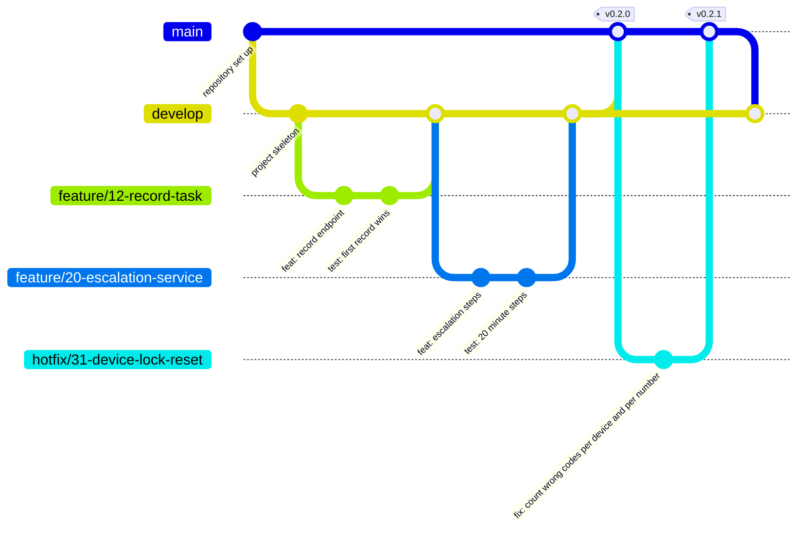
```mermaid
gitGraph
    commit id: "repository set up"
    branch develop
    checkout develop
    commit id: "project skeleton"
    branch "feature/12-record-task"
    checkout "feature/12-record-task"
    commit id: "feat: record endpoint"
    commit id: "test: first record wins"
    checkout develop
    merge "feature/12-record-task"
    branch "feature/20-escalation-service"
    checkout "feature/20-escalation-service"
    commit id: "feat: escalation steps"
    commit id: "test: 20 minute steps"
    checkout develop
    merge "feature/20-escalation-service"
    checkout main
    merge develop tag: "v0.2.0"
    branch "hotfix/31-device-lock-reset"
    checkout "hotfix/31-device-lock-reset"
    commit id: "fix: count wrong codes per device and per number"
    checkout main
    merge "hotfix/31-device-lock-reset" tag: "v0.2.1"
    checkout develop
    merge main
```

#### 6.1.3 Commits

Commits are small, and each contains one change. Messages follow the Conventional Commits format with the prefixes `feat`, `fix`, `docs`, `test`, `refactor`, and `chore`, for example `feat(tasks): refuse a second record and say who recorded first`. The subject is written in the imperative, is under about 72 characters, and refers to the issue (`Refs #12`). Nobody pushes directly to `main` or `develop`.

#### 6.1.4 Code reviews and pull requests

- Every change reaches `develop` through a pull request that states what changed, why (the issue and the user story), and how it was tested.
- A pull request requires at least one approval from a teammate who did not write the change, and all automatic checks must pass. Nobody merges their own pull request.
- Pull requests are merged into `develop` by squash. `develop` is merged into `main` with a merge commit, and the tag is added.
- `main` and `develop` are protected: no direct push and no force push.
- The reviewer checks that every new route verifies the member's permission on the server and has a test of the refusal; that notification text and logs contain no health details; that a database change comes with an Alembic migration; and that the tests would fail if the rule were broken.

### 6.2 Quality assurance

#### 6.2.1 Testing strategy

The strategy uses many fast automatic tests and a few manual tests on real phones.

| Level | Scope | Tools |
| --- | --- | --- |
| Static checks | Style and simple errors in Python and Dart. | `ruff`, `black`, `flutter analyze`, `dart format` |
| Unit tests (back-end) | Model methods, services, the sign-in lock, and invitation expiry, using a fake clock. | `pytest` |
| Integration tests (back-end) | Every route against a real PostgreSQL database: success, invalid input, `401`, `403`, `404`, and `409`. | `pytest`, Flask test client, PostgreSQL in Docker |
| API tests | Status codes and JSON fields of the main routes on the staging server. | Postman collection, Newman |
| Unit and widget tests (application) | Controllers, repositories, reminder times, and the right-to-left Arabic screens. | `flutter_test`, `mocktail` |
| Integration tests (application) | Sign in, create a circle, and record a dose offline then synchronize. | `integration_test` on an emulator |
| Manual tests | Notifications, offline reminders, and the Must flows on a real iPhone and a real Android phone. | Test sheet |

The tests concentrate on five rules: the first valid record wins; time-dependent behavior (reminders every 10 minutes and escalation every 20 minutes) is tested with an injected clock; every permission is tested for every role; an offline record is synchronized once with its original time; and no health details appear in notification text or logs. PostgreSQL is used in the tests instead of SQLite because the design relies on its unique indexes, `CHECK` constraints, and transactions. Every fixed defect receives a regression test in the same pull request.

### 6.3 Deployment pipeline

The pipeline runs on GitHub Actions and uses the same Docker image in both environments. The diagram shows the path from a pull request to staging and production.

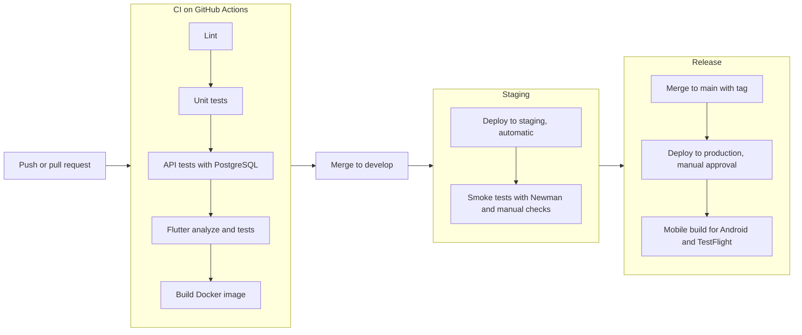
```mermaid
flowchart LR
    PR["Push or pull request"] --> CI
    subgraph CI["CI on GitHub Actions"]
        direction TB
        L["Lint"] --> U["Unit tests"] --> A["API tests with PostgreSQL"] --> F["Flutter analyze and tests"] --> D["Build Docker image"]
    end
    CI --> M1["Merge to develop"]
    M1 --> STG
    subgraph STG["Staging"]
        direction TB
        S["Deploy to staging, automatic"] --> T["Smoke tests with Newman and manual checks"]
    end
    STG --> REL
    subgraph REL["Release"]
        direction TB
        M2["Merge to main with tag"] --> P["Deploy to production, manual approval"] --> B["Mobile build for Android and TestFlight"]
    end
```

| Environment | Updated by | Database and services |
| --- | --- | --- |
| Staging | Automatically after a merge to `develop`. | Own PostgreSQL with demo data; SMS in test mode; a Firebase test project. |
| Production | After manual approval, from a tag `v*` on `main`. | Own PostgreSQL with daily backups; real SMS provider, FCM, and APNs. |

**Staging.** A push or pull request starts the continuous integration: lint, unit tests, API tests against a PostgreSQL service container, Flutter tests, and the Docker image build. After the merge to `develop`, the workflow pulls the new image, runs the Alembic migration, restarts the containers, and waits for `GET /health`. Newman then runs the smoke tests, and the team checks the feature on a phone with the staging build.

**Production.** At the end of a milestone, `develop` is merged into `main` and a tag is added. The tag starts the production workflow, which waits for approval, backs up the database, runs the migration, restarts the containers, and checks `GET /health`. If the check fails, the previous image is restored. The same tag builds the signed Android application; the iPhone application is distributed through TestFlight.

Database changes are made only through Alembic migrations that are reviewed in the same pull request as the model change.

## 7. Technical Justifications

Each choice was evaluated against the constraints of the project: a team of three students, six weeks of development, an Arabic right-to-left interface on iOS and Android, reminders that work without internet, and a care record that must remain accurate.

### 7.1 Technology choices

| Part | Choice | Justification |
| --- | --- | --- |
| Mobile application | Flutter (Dart) | One codebase serves iOS and Android, which is the only way for three students to cover both platforms in six weeks. Flutter draws its own widgets, so the right-to-left layout and the large Simplified Mode screens are identical on both platforms. Two native applications would double the work, and nobody on the team knows React Native. |
| Application state and storage | Riverpod; SQLite through Drift | Keeping state outside the widgets allows controllers to be tested without a screen. SQLite stores the cached plan, the offline queue, and the planned reminders as related tables. |
| Reminders | Local notifications | They fire at dose time without internet and without a server. Push notifications fail offline and may arrive late. |
| Back-end | Python Flask (REST), SQLAlchemy, Alembic | Two team members already know Flask. It is small enough for the business rules to be written and tested explicitly, and Alembic makes every schema change a reviewed file. Firebase as a complete back-end was rejected because the permission rules, the escalation, and the first-valid-record rule must be in tested code owned by the team. |
| Authentication | Phone number with an SMS code; JWT | The phone number is the identity used by invitations, by the one-patient rule, and by the patient's own account. There is no password to forget, which suits older users. |
| Database | PostgreSQL | The data is highly connected (members, tasks, assignments, escalations), and the design needs foreign keys, `CHECK` constraints, unique indexes, and transactions for the first-valid-record rule. Document stores do not provide these. |
| Timed jobs | One separate scheduler container | Marking missed doses and running escalation steps must happen exactly once. A scheduler inside the API would start the jobs in every worker, and Celery with Redis would add two services to operate. |
| Push notifications | Firebase Cloud Messaging (APNs for iPhone) | One integration reaches both platforms, the service is free, and it supports the high-priority levels the escalation requires. |
| SMS | Unifonic (alternative: Twilio) | A provider with a registered Saudi sender name reaches Saudi numbers, and it can be replaced without changing the API. |
| Prayer times and location | Aladhan API, cached, with an offline calculation as a fallback; GPS on the patient's phone, or a city selected from a list | Doses are scheduled "after Asr", so the times must be correct for the patient's place. The fallback prevents an outage from stopping a reminder. The location is read once, used only for the prayer times, and never shown or tracked. |
| Invitations | WhatsApp link (`wa.me`) | It is free, needs no business account, and the message comes from a person the invitee knows. |
| Delivery | Docker Compose; GitHub Actions | The same image runs on a laptop, on staging, and on production. Compose is sufficient for three containers, and Kubernetes would be far too large for an MVP. |
| Source control and testing | Git on GitHub (one repository, small Git-flow); `pytest`, `flutter_test`, Postman | One pull request can change an endpoint, the application that calls it, and the specification together. The tests run against PostgreSQL because the rules depend on its constraints. |

### 7.2 Design decisions

| Decision | Justification |
| --- | --- |
| The care circle is the root of the model: one circle, one patient, and every record belongs to one circle. | The product is a family caring for one person. A single owner for every record reduces each permission check to one question: what is this person's role in this circle? |
| The role is stored on the membership, not on the person. | The same person can be a Manager in one circle and a Viewer in another. |
| Permissions are checked on the server for every request. | The phone can be altered, so hiding a button is not a security measure. |
| The mode (Simplified or Detailed) is chosen once, at creation. | Changing it later would change what the patient sees and who is alerted, and would multiply the cases to design and test. |
| The first valid record wins. | Two members may record the same dose. A `version` on the task and a `client_action_id` on the action keep one record, tell the second person who recorded first, and make a repeated request harmless. |
| A reminder is never a confirmation. | Only a record changes a task, so the log shows what happened and not what the application assumed. |
| Reminders are local; alerts to other people are push notifications. | A reminder must work offline, so the phone creates it. Only the server knows that a dose was missed and who is next in the escalation order. |
| The escalation runs on the scheduler, in the order set by the manager, every 20 minutes. | A missed dose must reach someone even if the first person does not respond, and the manager knows the family. |
| Offline, the phone records only a task and a measurement. | These are the actions that occur at the bedside without internet. Other changes affect other people and require the server to decide. |
| The stock is calculated and not stored. | A stored count drifts whenever a dose is missed or counted twice. The boxes added and the doses recorded are stored, and the remaining pills are derived from them. |
| Nothing is deleted, and a plan change never edits the past. | A task completed last week must still show the dose that was ordered last week. |
| The relational schema has 41 tables with keys and constraints. | The database refuses an impossible state even when the code requests one. |
